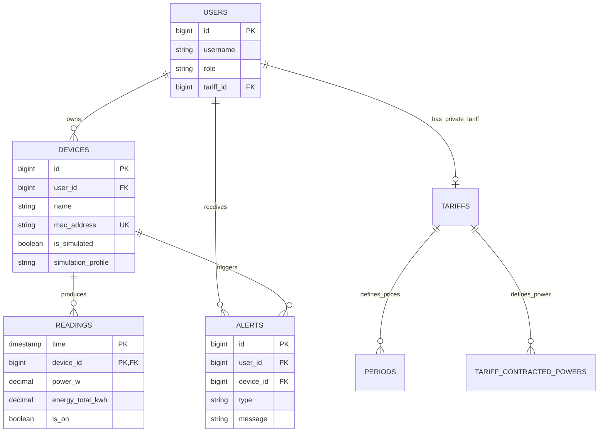

# Anexo D. TimescaleDB, estructura de tablas y consultas analiticas

## 1. Papel de TimescaleDB en el proyecto

Wattimizer guarda lecturas electricas continuas. Ese tipo de dato encaja con una base de datos de series temporales porque cada medicion esta asociada a un instante y a un dispositivo.

El proyecto usa PostgreSQL con TimescaleDB mediante la imagen:

```yaml
timescale/timescaledb-ha:pg17
```

La tabla temporal principal es:

```text
readings
```

Hibernate crea la tabla como una tabla PostgreSQL normal y despues el script `01-hypertable.sql` la convierte en hypertable:

```sql
SELECT create_hypertable('readings', 'time');
```

Archivo:

```text
backend/src/main/resources/db/dev-seed/01-hypertable.sql
```

---

## 2. Scripts de base de datos

| Script | Funcion |
| --- | --- |
| `backend/src/main/resources/db/dev-seed/00-extensions.sql` | Activa extensiones como `timescaledb` y `pgcrypto` |
| `backend/src/main/resources/db/dev-seed/01-hypertable.sql` | Convierte `readings` en hypertable por columna `time` |
| `backend/src/main/resources/db/dev-seed/03-seed-users-dev.sql` | Crea usuarios de desarrollo |
| `backend/src/main/resources/db/dev-seed/04-seed-device-shelly.sql` | Siembra dispositivo Shelly de prueba |
| `backend/src/main/resources/db/dev-seed/05-seed-device-simulation.sql` | Siembra datos o dispositivos relacionados con simulacion |
| `backend/src/main/resources/db/tariffs-td-schema.sql` | Restricciones del modelo tarifario TD |
| `backend/src/main/resources/db/seed-tariff-calendar-slots.sql` | Slots de calendario tarifario |
| `backend/src/main/resources/db/prod/99-resync-sequences.sql` | Resincroniza secuencias tras semillas |

El script de hypertable indica una condicion importante: debe ejecutarse antes de que lleguen datos MQTT. Si la tabla ya tiene filas, TimescaleDB necesita:

```sql
SELECT create_hypertable('readings', 'time', migrate_data => true);
```

---

## 3. Modelo relacional principal

### 3.1. `users`

Entidad:

```text
backend/src/main/java/com/joselumartos/jwtauthbackenddemo/entities/UserEntity.java
```

| Columna | Tipo aproximado | Descripcion |
| --- | --- | --- |
| `id` | `bigint` | PK heredada de `BaseEntity` |
| `username` | `varchar`, unico, no nulo | Email de usuario |
| `password` | `varchar`, no nulo | Contrasena cifrada |
| `role` | `varchar`, no nulo | `ROLE_USER` o `ROLE_ADMIN` |
| `active` | `boolean`, no nulo | Usuario habilitado |
| `tariff_id` | FK nullable | Tarifa privada o asignada |

### 3.2. `devices`

Entidad:

```text
backend/src/main/java/com/joselumartos/jwtauthbackenddemo/entities/Device.java
```

| Columna | Tipo aproximado | Descripcion |
| --- | --- | --- |
| `id` | `bigint` | PK |
| `user_id` | FK nullable a `users` | Propietario; puede quedar `NULL` en filas sembradas o tecnicas, aunque el alta funcional recomendada usa `claim` para asignarlo |
| `name` | `varchar`, no nulo | Nombre visible |
| `mac_address` | `varchar`, unico, no nulo | Identificador fisico o simulado |
| `is_on` | `boolean` | Estado del rele |
| `is_simulated` | `boolean`, no nulo, default `false` | Distingue simulador de hardware |
| `simulation_profile` | `varchar` | Perfil de consumo si es simulado |

### 3.3. `readings`

Entidad:

```text
backend/src/main/java/com/joselumartos/jwtauthbackenddemo/entities/Reading.java
```

La clave primaria es compuesta:

```text
(time, device_id)
```

| Columna | Tipo aproximado | Descripcion |
| --- | --- | --- |
| `time` | `timestamp` / `Instant` | Momento de la lectura |
| `device_id` | FK a `devices` | Dispositivo que produjo la lectura |
| `power_w` | `numeric(10,2)` | Potencia activa instantanea |
| `energy_total_kwh` | `numeric(14,4)` | Energia acumulada en kWh |
| `is_on` | `boolean` | Estado del rele si el payload lo aporta |

La clase de clave compuesta es:

```text
backend/src/main/java/com/joselumartos/jwtauthbackenddemo/entities/ReadingId.java
```

TimescaleDB particiona esta tabla por la columna `time`.

### 3.4. `alerts`

Entidad:

```text
backend/src/main/java/com/joselumartos/jwtauthbackenddemo/entities/Alert.java
```

| Columna | Tipo aproximado | Descripcion |
| --- | --- | --- |
| `id` | `bigint` | PK |
| `user_id` | FK a `users`, no nulo | Usuario destinatario |
| `device_id` | FK a `devices`, no nulo | Dispositivo que genero la alerta |
| `type` | `varchar`, no nulo | Tipo, por ejemplo `OVERPOWER` |
| `message` | `varchar`, no nulo | Texto explicativo |
| `created_at` | `timestamp` | Auditoria heredada |

### 3.5. Tarifas

Entidades:

```text
Tariff.java
Period.java
TariffContractedPower.java
TariffCalendarSlot.java
```

Tablas principales:

| Tabla | Uso |
| --- | --- |
| `tariffs` | Plantillas y contratos privados |
| `periods` | Precio por kWh de cada periodo |
| `tariff_contracted_powers` | Potencia contratada por periodo |
| `tariff_calendar_slots` | Calendario para resolver que periodo aplica |

La separacion entre `periods` y `tariff_calendar_slots` es importante: el precio esta en la tarifa, pero la decision de si en un instante aplica `P1`, `P2` o `P6` se resuelve por calendario.

---

## 4. Diagrama relacional simplificado



---

## 5. Repositorio de lecturas

Archivo:

```text
backend/src/main/java/com/joselumartos/jwtauthbackenddemo/repositories/ReadingRepository.java
```

Metodos:

```java
Optional<Reading> findFirstByDeviceMacAddressOrderByTimeDesc(String macAddress);
```

Devuelve la ultima lectura de un dispositivo. Se usa en:

- `GET /api/v1/readings/latest/{macAddress}`
- simulacion, para integrar energia acumulada desde la lectura anterior.

```java
Optional<Reading> findByTimeAndDeviceMacAddress(Instant time, String macAddress);
```

Busca por clave logica usada en la API.

```java
@Query("SELECT r FROM Reading r WHERE r.device.macAddress = :macAddress " +
       "AND r.time >= :start AND r.time <= :end ORDER BY r.time ASC")
List<Reading> findReadingsInInterval(
    @Param("macAddress") String macAddress,
    @Param("start") Instant start,
    @Param("end") Instant end
);
```

Esta es la consulta analitica base del proyecto. Aunque la tabla sea hypertable, el codigo actual usa JPQL y deja que PostgreSQL/TimescaleDB optimice internamente el acceso por tiempo.

```java
@Query("DELETE FROM Reading r WHERE r.time = :time AND r.device.macAddress = :macAddress")
Long deleteByTimeAndDeviceMacAddress(...);
```

Elimina una lectura concreta.

```java
@Query("DELETE FROM Reading r WHERE r.device.macAddress = :macAddress")
int deleteAllByDeviceMacAddress(...);
```

Se usa en borrado de dispositivos para evitar conflictos de FK.

---

## 6. Consultas analiticas de consumo

Servicio:

```text
backend/src/main/java/com/joselumartos/jwtauthbackenddemo/services/ConsumptionService.java
```

Controlador:

```text
backend/src/main/java/com/joselumartos/jwtauthbackenddemo/controllers/ConsumptionController.java
```

### 6.1. Coste por periodo: `calculateCostInPeriod`

Endpoint:

```http
GET /api/v1/analytics/cost?macAddress=<mac>&start=<instant>&end=<instant>
```

Respuesta:

```json
{
  "macAddress": "9070694d3590",
  "totalCostEur": 1.42,
  "start": "2026-08-02T00:00:00Z",
  "end": "2026-08-02T22:00:00Z"
}
```

Algoritmo:

1. Recupera lecturas con `findReadingsInInterval`.
2. Recorre pares consecutivos.
3. Calcula delta:

```text
deltaKwh = lecturaActual.energyTotalKwh - lecturaAnterior.energyTotalKwh
```

4. Ignora deltas nulos, cero o negativos.
5. Resuelve periodo tarifario para el instante.
6. Busca precio `priceKwh`.
7. Acumula:

```text
coste = deltaKwh * priceKwh
```

Este planteamiento aprovecha que Shelly envia energia acumulada como odometro. No se calcula energia integrando potencia, sino usando el incremento real de energia acumulada.

### 6.2. Consumo fantasma: `calculateGhostCost`

Endpoint:

```http
GET /api/v1/analytics/ghost-consumption?macAddress=<mac>&start=<instant>&end=<instant>
```

Respuesta:

```json
{
  "macAddress": "9070694d3590",
  "ghostCostEur": 0.18,
  "start": "2026-08-02T00:00:00Z",
  "end": "2026-08-02T22:00:00Z"
}
```

La ventana fantasma es:

```text
00:00 <= hora local < 06:00
```

El calculo usa la zona horaria del contrato. Esto es importante para Canarias, Peninsula o Baleares, porque un mismo `Instant` UTC puede caer en una hora local distinta.

### 6.3. Coste instantaneo

`ConsumptionService` incluye un metodo de coste instantaneo:

```java
calculateInstantaneousCost(String macAddress, BigDecimal powerW, long durationSeconds)
```

Actualmente no se expone por REST. Sirve como logica preparada para estimar el coste de una potencia durante una duracion concreta:

```text
(powerW / 1000) * (durationSeconds / 3600) * priceKwh
```

---

## 7. Resolucion de calendario tarifario

Servicio:

```text
backend/src/main/java/com/joselumartos/jwtauthbackenddemo/services/CalendarResolverService.java
```

Repositorio:

```text
backend/src/main/java/com/joselumartos/jwtauthbackenddemo/repositories/TariffCalendarSlotRepository.java
```

La tabla `tariff_calendar_slots` permite resolver el periodo aplicable sin codificar todas las reglas en Java.

Factores usados:

- `access_tariff_code`: por ejemplo `2.0TD`, `3.0TD`, `6.1TD`.
- `geographic_zone`: Peninsula, Canarias, Baleares, Ceuta o Melilla.
- mes.
- tipo de dia.
- hora local.

El resultado es un `period_code` como `P1`, `P2`, `P3`, etc. Ese codigo se cruza con `periods` para obtener el precio o con `tariff_contracted_powers` para revisar sobrepotencia.

---

## 8. Alertas sobre lecturas

Servicio:

```text
backend/src/main/java/com/joselumartos/jwtauthbackenddemo/services/AlertService.java
```

Flujo:

1. Llega una lectura real o simulada.
2. Se calcula la potencia en kW:

```text
powerKw = powerW / 1000
```

3. Se resuelve el periodo aplicable.
4. Se obtiene la potencia contratada de ese periodo.
5. Si `powerKw > contractedPowerKw`, se crea alerta `OVERPOWER`.
6. Se emite la alerta al frontend por WebSocket.

Esta logica conecta tres modulos: telemetria, tarifas y notificaciones.

---

## 9. Uso real de TimescaleDB y limites actuales

Lo que si esta implementado:

- Extension TimescaleDB.
- Hypertable `readings` particionada por `time`.
- Consultas por rango temporal sobre lecturas.
- Calculos de coste y consumo fantasma a partir de series temporales.
- Datos simulados y reales en la misma estructura.

Lo que no esta implementado en el codigo actual:

- `time_bucket`.
- Consultas SQL nativas especificas de TimescaleDB.
- Continuous aggregates.
- Politicas de compresion.
- Politicas de retencion.
- Indices manuales adicionales sobre `readings`.

Esto no invalida el uso de TimescaleDB. Simplemente significa que el proyecto esta en una primera fase donde se aprovecha la hypertable como base de almacenamiento temporal, pero todavia no se han anadido optimizaciones avanzadas.

---

## 10. Consultas SQL utiles para administracion

Verificar hypertables:

```sql
SELECT hypertable_name, num_chunks
FROM timescaledb_information.hypertables;
```

Consultar ultimas lecturas de un dispositivo:

```sql
SELECT r.time, d.mac_address, r.power_w, r.energy_total_kwh, r.is_on
FROM readings r
JOIN devices d ON d.id = r.device_id
WHERE d.mac_address = '9070694d3590'
ORDER BY r.time DESC
LIMIT 20;
```

Resumen diario simple:

```sql
SELECT
  date_trunc('day', r.time) AS day,
  d.mac_address,
  min(r.energy_total_kwh) AS first_kwh,
  max(r.energy_total_kwh) AS last_kwh,
  max(r.energy_total_kwh) - min(r.energy_total_kwh) AS consumed_kwh
FROM readings r
JOIN devices d ON d.id = r.device_id
GROUP BY date_trunc('day', r.time), d.mac_address
ORDER BY day DESC;
```

Detectar lecturas sin estado de rele:

```sql
SELECT r.time, d.mac_address, r.power_w, r.energy_total_kwh
FROM readings r
JOIN devices d ON d.id = r.device_id
WHERE r.is_on IS NULL
ORDER BY r.time DESC;
```

Estas consultas son de administracion y diagnostico. La aplicacion Java no las ejecuta directamente.

---

## 11. Mejoras futuras recomendadas

| Mejora | Motivo |
| --- | --- |
| Indice compuesto por `device_id, time DESC` | Acelerar ultima lectura e intervalos por dispositivo |
| Continuous aggregate por hora/dia | Reducir coste de informes historicos |
| Politica de compresion | Bajar almacenamiento de lecturas antiguas |
| Politica de retencion | Controlar crecimiento de datos si la app escala |
| Consultas con `time_bucket` | Generar series listas para graficas historicas |
| Repositorio con ID compuesto correcto | `ReadingRepository` extiende `JpaRepository<Reading, Long>`, aunque la entidad usa `@IdClass`; conviene alinearlo con `ReadingId` |

---

## 12. Resumen

El modelo de datos de Wattimizer combina entidades clasicas de negocio con una hypertable para telemetria. La decision central es guardar lecturas acumuladas por dispositivo y tiempo, y calcular el consumo economico a partir de deltas positivos de energia.

TimescaleDB aporta una base adecuada para crecer hacia historicos mas grandes. En la version actual se usa de forma prudente: primero como almacenamiento temporal particionado, y queda preparado para anadir agregados, compresion y retencion cuando el volumen de lecturas lo justifique.
