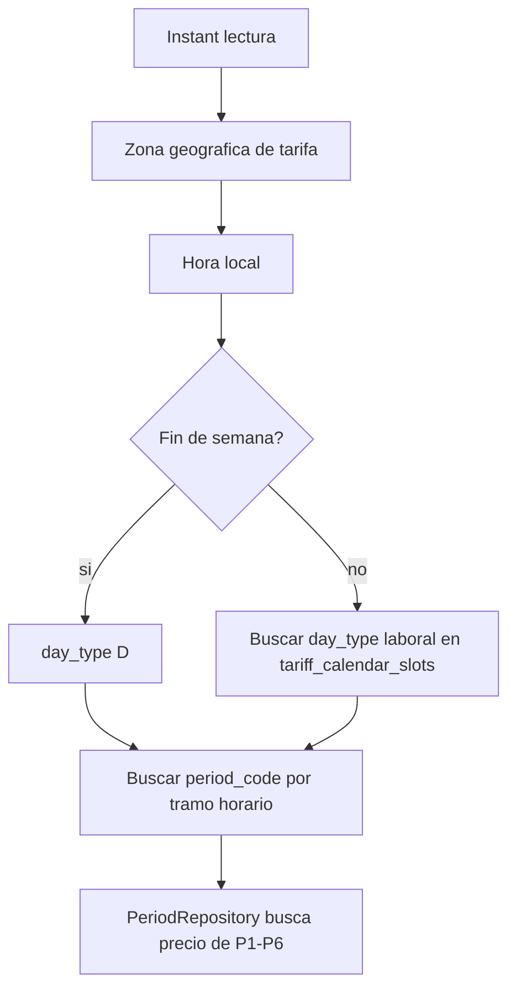

# Anexo D. TimescaleDB, estructura de tablas y consultas analiticas

## 1. Papel de TimescaleDB en el proyecto

Wattimizer usa PostgreSQL como base relacional y TimescaleDB para almacenar lecturas temporales. La tabla mas importante para telemetria es `readings`, convertida en hypertable por la columna `time`.

La decision tiene sentido porque las lecturas IoT crecen por tiempo: cada dispositivo genera muestras sucesivas de potencia y energia. TimescaleDB permite particionar internamente esos datos en chunks y preparar el sistema para consultas temporales mas grandes.

## 2. Scripts SQL relevantes

| Script | Funcion |
| --- | --- |
| `backend/src/main/resources/db/dev-seed/00-extensions.sql` | Activa `timescaledb` y `pgcrypto` |
| `backend/src/main/resources/db/dev-seed/01-hypertable.sql` | Convierte `readings` en hypertable |
| `backend/src/main/resources/db/tariffs-td-schema.sql` | Ajusta constraints e indices del modelo tarifario |
| `backend/src/main/resources/db/seed-tariff-calendar-slots.sql` | Carga el calendario regulatorio por peaje, zona, mes y tipo de dia |
| `backend/src/main/resources/db/prod/99-resync-sequences.sql` | Resincroniza secuencias tras seeds manuales |

El orden de ejecucion esperado es:

```text
00-extensions.sql
01-hypertable.sql
tariffs-td-schema.sql
seed-tariff-calendar-slots.sql
seeds de usuarios/dispositivos
99-resync-sequences.sql si se han insertado ids manuales
```

## 3. Hypertable `readings`

**Entidad:** `backend/src/main/java/com/joselumartos/jwtauthbackenddemo/entities/Reading.java`
**Clave compuesta:** `backend/src/main/java/com/joselumartos/jwtauthbackenddemo/entities/ReadingId.java`

### 3.1. Columnas

| Columna | Tipo conceptual | Restriccion | Uso |
| --- | --- | --- | --- |
| `time` | `Instant` | Parte de PK | Instante de la lectura y dimension temporal de TimescaleDB |
| `device_id` | FK a `devices` | Parte de PK | Dispositivo que produce la lectura |
| `power_w` | Decimal | Nullable segun entidad | Potencia activa instantanea |
| `energy_total_kwh` | Decimal | Nullable segun entidad | Energia acumulada del contador |
| `is_on` | Boolean | Nullable segun entidad | Estado del enchufe |

### 3.2. Conversion a hypertable

**Archivo:** `backend/src/main/resources/db/dev-seed/01-hypertable.sql`

```sql
SELECT create_hypertable('readings', 'time');
```

El comentario del script indica que debe ejecutarse cuando la tabla esta vacia. Si ya hubiera datos, seria necesario usar `migrate_data => true`.

### 3.3. Por que no se usa un id artificial

La lectura se identifica por `(time, device_id)`. Para series temporales es una decision razonable: el tiempo y el dispositivo ya definen el dato. Asi se evita introducir una clave tecnica que no aporta informacion al dominio.

## 4. Tabla `devices`

**Entidad:** `backend/src/main/java/com/joselumartos/jwtauthbackenddemo/entities/Device.java`

| Columna | Uso |
| --- | --- |
| `id` | Clave primaria |
| `name` | Nombre visible para el usuario |
| `mac_address` | Identificador unico del enchufe |
| `is_on` | Estado actual |
| `is_simulated` | Diferencia hardware real de simuladores |
| `simulation_profile` | Perfil usado por el job de simulacion |
| `user_id` | Propietario del dispositivo |

La MAC es el identificador natural del dispositivo IoT. En los simuladores se genera con prefijo `SIM`, para que se distinga facilmente de una MAC real.

## 5. Tablas de usuarios y autenticacion

| Tabla/Entidad | Funcion |
| --- | --- |
| `users` / `UserEntity` | Usuario principal, email, password y tarifa vinculada |
| `role` / `Role` | Roles como `ROLE_USER` o `ROLE_ADMIN` |
| `federated_identities` / `FederatedIdentity` | Vincula usuarios con Google o GitHub |

La tabla `users` tiene una FK opcional a `tariffs`. Esa tarifa puede ser una copia privada del usuario, no necesariamente una plantilla del catalogo.

## 6. Modelo tarifario TD

El modelo tarifario se adapto para reflejar mejor las tarifas electricas espanolas por periodos.

### 6.1. `tariffs`

**Entidad:** `backend/src/main/java/com/joselumartos/jwtauthbackenddemo/entities/Tariff.java`

| Columna | Uso |
| --- | --- |
| `id` | Clave primaria |
| `name` | Nombre comercial o descriptivo |
| `market` | Mercado de la tarifa |
| `access_tariff_code` | Peaje: `2.0TD`, `3.0TD`, `6.1TD`, `6.2TD` |
| `geographic_zone` | Zona: Peninsula, Canarias, Baleares, Ceuta o Melilla |
| `energy_company` | Comercializadora |

`tariffs-td-schema.sql` incluye checks para peajes y zonas.

### 6.2. `periods`

**Entidad:** `backend/src/main/java/com/joselumartos/jwtauthbackenddemo/entities/Period.java`

| Columna | Uso |
| --- | --- |
| `id` | Clave primaria |
| `tariff_id` | Tarifa propietaria |
| `period_code` | P1-P6 |
| `price_kwh` | Precio de energia del periodo |

Los horarios no estan en `periods`. Estan en `tariff_calendar_slots`, porque dependen de mes, tipo de dia, zona geografica y peaje.

### 6.3. `tariff_contracted_powers`

**Entidad:** `backend/src/main/java/com/joselumartos/jwtauthbackenddemo/entities/TariffContractedPower.java`

| Columna | Uso |
| --- | --- |
| `id` | Clave primaria |
| `tariff_id` | Tarifa propietaria |
| `period_code` | P1-P6 |
| `contracted_power_kw` | Potencia contratada del periodo |

Esta tabla se usa para las alertas de maximetro. No se compara contra una unica potencia global; se compara contra el limite del periodo aplicable.

### 6.4. `tariff_calendar_slots`

**Entidad:** `backend/src/main/java/com/joselumartos/jwtauthbackenddemo/entities/TariffCalendarSlot.java`

| Columna | Uso |
| --- | --- |
| `access_tariff_code` | Peaje al que aplica el tramo |
| `geographic_zone` | Zona geografica |
| `month_number` | Mes |
| `season_code` | Temporada regulatoria |
| `day_type` | Tipo de dia: A, B, B1, C o D |
| `start_time` | Inicio del tramo |
| `end_time` | Fin del tramo |
| `period_code` | Periodo P1-P6 resultante |

El indice unico `ux_tariff_calendar_slots_lookup` evita duplicar tramos equivalentes.

## 7. Tabla `alerts`

**Entidad:** `backend/src/main/java/com/joselumartos/jwtauthbackenddemo/entities/Alert.java`

| Columna | Uso |
| --- | --- |
| `id` | Clave primaria |
| `user_id` | Usuario que recibe la alerta |
| `device_id` | Dispositivo causante |
| `type` | Tipo, actualmente `OVERPOWER` |
| `message` | Texto visible |
| `created_at` | Auditoria temporal |

Las alertas se crean en backend durante el procesamiento de telemetria. El usuario las consulta despues desde Angular.

## 8. Repositorios y consultas reales

### 8.1. `ReadingRepository`

**Archivo:** `backend/src/main/java/com/joselumartos/jwtauthbackenddemo/repositories/ReadingRepository.java`

| Metodo | Tipo | Uso |
| --- | --- | --- |
| `findByTimeAndDeviceMacAddress` | Derived query | Buscar una lectura por instante y MAC |
| `findFirstByDeviceMacAddressOrderByTimeDesc` | Derived query | Ultima lectura de un dispositivo |
| `findReadingsInInterval` | JPQL | Lecturas ordenadas entre `start` y `end` |
| `deleteByTimeAndDeviceMacAddress` | JPQL `DELETE` | Borrado tecnico de una lectura |
| `deleteAllByDeviceMacAddress` | JPQL `DELETE` | Limpieza al borrar dispositivo |

Consulta principal:

```sql
SELECT r
FROM Reading r
WHERE r.device.macAddress = :macAddress
  AND r.time >= :start
  AND r.time <= :end
ORDER BY r.time ASC
```

Aunque se ejecuta como JPQL, conceptualmente equivale a consultar la serie temporal de un dispositivo en una ventana.

### 8.2. `TariffCalendarSlotRepository`

**Archivo:** `backend/src/main/java/com/joselumartos/jwtauthbackenddemo/repositories/TariffCalendarSlotRepository.java`

Se usa para resolver que periodo P1-P6 corresponde a una fecha.

Filtros principales:

- `accessTariffCode`
- `geographicZone`
- `monthNumber`
- `dayType`
- `localTime`

Tambien permite obtener el tipo de dia laborable de un mes y zona.

### 8.3. `PeriodRepository`

Busca el precio contractual por tarifa y codigo de periodo:

```text
findByTariffIdAndPeriodCode(tariffId, periodCode)
```

### 8.4. `TariffContractedPowerRepository`

Busca la potencia contratada por tarifa y periodo. Es la consulta clave para decidir si una lectura genera alerta.

### 8.5. `AlertRepository`

Permite:

- Listar alertas por `username`.
- Borrar alertas por usuario.
- Borrar alertas de un dispositivo al eliminarlo.

## 9. Analitica implementada

### 9.1. Historial reciente

Endpoint:

```http
GET /api/v1/readings/device/{macAddress}/recent?seconds=120
```

Flujo:


No hay bucketing SQL. El frontend conserva los ultimos puntos para la grafica.

### 9.2. Coste energetico de un periodo

Endpoint:

```http
GET /api/v1/analytics/cost?macAddress=...&start=...&end=...
```

Servicio:

```text
ConsumptionService.calculateCostInPeriod(macAddress, start, end)
```

Algoritmo:

1. Lee las lecturas ordenadas del intervalo.
2. Recorre pares consecutivos.
3. Calcula `deltaKwh = current.energyTotalKwh - previous.energyTotalKwh`.
4. Descarta deltas negativos o no validos.
5. Resuelve el periodo tarifario de `current.time`.
6. Multiplica `deltaKwh * priceKwh`.
7. Suma y redondea a dos decimales.

La idea tecnica es usar el odometro acumulado, no la potencia instantanea. Asi el coste no depende tanto de si una lectura llega cada 5, 10 o 30 segundos.

### 9.3. Consumo fantasma

Endpoint:

```http
GET /api/v1/analytics/ghost-consumption?macAddress=...&start=...&end=...
```

Servicio:

```text
ConsumptionService.calculateGhostCost(macAddress, start, end)
```

Es el mismo calculo de coste, pero solo se suman tramos cuya lectura actual cae entre:

```text
00:00 y 05:59
```

La hora se interpreta en la zona de la tarifa:

- `Atlantic/Canary` para Canarias.
- `Europe/Madrid` para el resto.

### 9.4. Resolucion de periodo P1-P6

**Servicio:** `CalendarResolverService`



Si no hay calendario cargado, el servicio devuelve `Optional.empty()`. Los servicios llamantes degradan a coste `0` en vez de romper la aplicacion.

### 9.5. Alertas por potencia contratada

Servicio:

```text
AlertService.checkPowerThreshold(reading)
```

Proceso:

1. Obtiene tarifa del usuario.
2. Resuelve periodo aplicable.
3. Busca potencia contratada de ese periodo.
4. Convierte `powerW` a kW.
5. Si `powerKw > contractedPowerKw`, crea alerta.

Esta logica esta conectada a la ingesta, no a una tarea batch. Por eso la alerta aparece justo al procesar una lectura.

## 10. Uso actual de TimescaleDB

El proyecto usa TimescaleDB para convertir `readings` en hypertable, pero las consultas analiticas actuales se hacen con JPQL/JPA. No se han implementado todavia:

- `time_bucket`.
- Agregados continuos.
- Compresion de chunks.
- Politicas de retencion.
- Indices especificos adicionales para `readings`.

Esto no es un fallo para el MVP. Para el volumen de una demo o un proyecto DAW, las consultas por intervalo son suficientes. Lo importante es que el modelo ya esta preparado para crecer.

## 11. Mejoras tecnicas futuras

| Mejora | Beneficio |
| --- | --- |
| Indice `(device_id, time DESC)` en `readings` | Acelerar ultima lectura e historicos por dispositivo |
| `time_bucket('5 minutes', time)` | Reducir puntos al mostrar historicos largos |
| Agregados continuos diarios | Calcular coste mensual sin recorrer todas las lecturas |
| Politicas de retencion | Evitar crecimiento indefinido |
| Compresion TimescaleDB | Ahorrar espacio en lecturas antiguas |
| Materializar coste diario | Mejorar dashboard si hay muchos dispositivos |

## 12. Relacion con los anexos REST y MQTT

- La tabla `readings` se alimenta desde los flujos descritos en [Anexo C](anexo-c-telemetria-mqtt.md).
- Las consultas de coste y ghost consumption se exponen por los endpoints descritos en [Anexo A](anexo-a-backend-rest.md).
- El frontend consume esos datos segun el flujo descrito en [Anexo B](anexo-b-frontend-angular.md).
