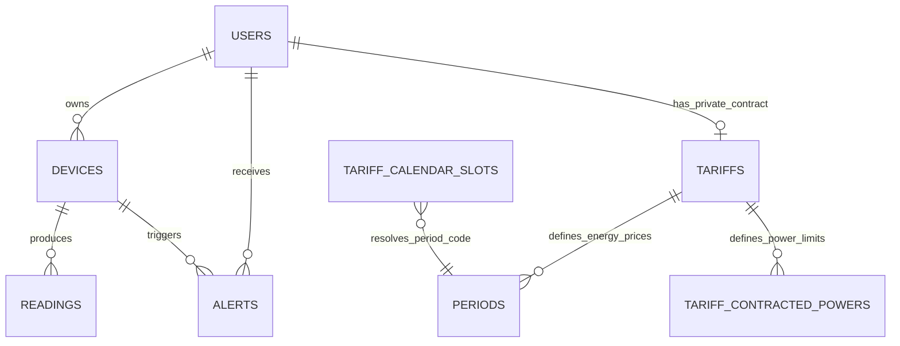
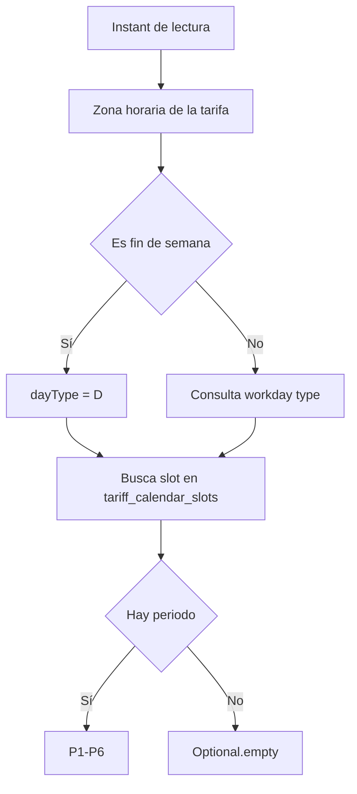

# Anexo D - TimescaleDB, estructura de tablas y consultas analíticas

## 1. Papel de la base de datos

Wattimizer usa PostgreSQL como base relacional y TimescaleDB para optimizar la tabla de lecturas. La elección encaja con el proyecto porque la mayoría de datos son relacionales, pero la telemetría eléctrica crece como serie temporal.

Hibernate crea el esquema principal con `spring.jpa.hibernate.ddl-auto=update`. Después se ejecutan scripts SQL manuales para activar extensiones, convertir `readings` en hypertable y añadir restricciones tarifarias.

## 2. Extensiones

Script: `backend/src/main/resources/db/dev-seed/00-extensions.sql`

```sql
CREATE EXTENSION IF NOT EXISTS timescaledb;
CREATE EXTENSION IF NOT EXISTS pgcrypto;
```

- `timescaledb`: necesaria para `create_hypertable`.
- `pgcrypto`: usada por scripts de seed para generar hashes bcrypt de usuarios de desarrollo.

## 3. Modelo relacional principal



| Tabla | Propósito |
| --- | --- |
| `users` | Usuarios de la plataforma, rol y tarifa asociada. |
| `devices` | Medidores físicos o simulados. |
| `readings` | Serie temporal de potencia y energía. |
| `alerts` | Alertas por exceso de potencia. |
| `tariffs` | Catálogo maestro y copias privadas de contrato. |
| `periods` | Precios de energía por periodo P1-P6. |
| `tariff_contracted_powers` | Potencias contratadas por periodo. |
| `tariff_calendar_slots` | Calendario que resuelve el periodo según fecha y hora. |
| `federated_identities` | Relación entre usuarios y proveedores OAuth2. |

## 4. Tabla `devices`

Campos principales:

| Columna | Tipo lógico | Descripción |
| --- | --- | --- |
| `id` | Long | Identificador interno. |
| `user_id` | FK nullable | Usuario propietario. Puede ser `NULL` en dispositivos todavía no vinculados a una cuenta. |
| `name` | Texto | Nombre visible del dispositivo. |
| `mac_address` | Texto único | MAC real o identificador `SIM#########`. |
| `is_on` | Boolean | Estado lógico del equipo. |
| `is_simulated` | Boolean | Marca dispositivos generados por software. |
| `simulation_profile` | Enum string | Perfil de consumo si es simulado. |

La MAC es única para evitar duplicar medidores. Los dispositivos simulados usan prefijo `SIM`, de modo que no compiten con MAC Shelly reales.

## 5. Hypertable `readings`

Entidad Java: `Reading`
Clave compuesta: `(time, device_id)`

| Columna | Descripción |
| --- | --- |
| `time` | Instante de la lectura. Es la dimensión temporal de TimescaleDB. |
| `device_id` | FK al dispositivo. Forma parte de la clave. |
| `power_w` | Potencia instantánea en vatios. |
| `energy_total_kwh` | Energía acumulada del medidor en kWh. |
| `is_on` | Estado del relé cuando el payload lo informa. |

Conversión a hypertable:

```sql
SELECT create_hypertable('readings', 'time');
```

El script indica que la tabla debe estar vacía al convertirla. Si ya existieran lecturas, TimescaleDB permite usar `migrate_data => true`, pero esa opción está comentada y no forma parte del procedimiento principal.

## 6. Tablas de tarifas

### 6.1. `tariffs`

Representa tanto tarifas maestras como contratos privados clonados. Sus campos principales son:

- `name`
- `market`
- `access_tariff_code`
- `geographic_zone`
- `energy_company`

Restricciones del script `tariffs-td-schema.sql` limitan peajes a valores como `2.0TD`, `3.0TD`, `6.1TD` y `6.2TD`, y zonas a las zonas geográficas españolas contempladas por el modelo.

### 6.2. `periods`

Cada fila contiene el precio de energía por periodo:

| Columna | Descripción |
| --- | --- |
| `tariff_id` | Tarifa a la que pertenece. |
| `period_code` | P1-P6. |
| `price_kwh` | Precio en euros por kWh. |

El índice único por `tariff_id` y `period_code` evita definir dos precios para el mismo periodo de una tarifa.

### 6.3. `tariff_contracted_powers`

Guarda la potencia contratada por periodo:

| Columna | Descripción |
| --- | --- |
| `tariff_id` | Tarifa asociada. |
| `period_code` | Periodo P1-P6. |
| `contracted_power_kw` | Potencia máxima contratada en kW. |

`AlertService` consulta estos datos para decidir si una lectura supera el umbral del contrato.

### 6.4. `tariff_calendar_slots`

Es una tabla global de calendario regulatorio. Permite responder a la pregunta: "para este peaje, zona, mes, tipo de día y hora, ¿qué periodo se aplica?".

Campos relevantes:

- `access_tariff_code`
- `geographic_zone`
- `month_number`
- `season_code`
- `day_type`
- `start_time`
- `end_time`
- `period_code`

El seed actual cubre `2.0TD` y `3.0TD` para `PENINSULA` e `ISLAS_BALEARES`. El modelo admite más zonas, pero sin seed correspondiente el cálculo puede degradar a coste cero si no encuentra slot.

## 7. Orden de scripts SQL

| Orden | Script | Función |
| --- | --- | --- |
| 1 | `00-extensions.sql` | Activa TimescaleDB y pgcrypto. |
| 2 | `01-hypertable.sql` | Convierte `readings` en hypertable. |
| 3 | `tariffs-td-schema.sql` | Añade constraints e índices de tarifas. |
| 4 | `seed-tariff-calendar-slots.sql` | Inserta calendario CNMC 3/2020. |
| 5 | `03-seed-users-dev.sql` | Crea usuarios de desarrollo. |
| 6 | `04-seed-device-shelly.sql` | Inserta dispositivo Shelly de ejemplo. |
| 7 | `05-seed-device-simulation.sql` | Inserta nueve simuladores. |
| 8 | `prod/99-resync-sequences.sql` | Reajusta secuencias tras seeds. |

Los scripts son idempotentes en las partes críticas mediante `IF NOT EXISTS`, bloques `DO $$` u `ON CONFLICT`.

## 8. Consultas de lecturas

Repositorio: `ReadingRepository`

### 8.1. Lecturas por intervalo

```java
@Query("""
    SELECT r FROM Reading r
    WHERE r.device.macAddress = :macAddress
      AND r.time >= :start
      AND r.time <= :end
    ORDER BY r.time ASC
""")
List<Reading> findReadingsInInterval(
    String macAddress,
    Instant start,
    Instant end
);
```

Esta consulta alimenta los cálculos de coste. Ordenar ascendentemente es obligatorio porque el coste se obtiene comparando cada lectura con la anterior para calcular el delta de kWh.

### 8.2. Última lectura

```java
Reading findFirstByDeviceMacAddressOrderByTimeDesc(String macAddress);
```

Se usa para consultar el estado más reciente de un medidor.

### 8.3. Lecturas recientes del dashboard

El endpoint reciente usa una ventana `[now - seconds, now]` y devuelve las lecturas ordenadas. El frontend recorta a 20 puntos para la gráfica.

### 8.4. Limpieza por dispositivo

```java
void deleteAllByDeviceMacAddress(String macAddress);
```

Se llama antes de borrar un dispositivo para evitar dejar lecturas sin padre.

## 9. Resolución del periodo tarifario

Servicio: `CalendarResolverService`

Flujo:



Zonas:

- `CANARIAS`: `Atlantic/Canary`.
- Resto: `Europe/Madrid`.

Si no se encuentra calendario, el servicio devuelve vacío. Los cálculos de coste lo tratan como modo degradado y no rompen la API.

## 10. Cálculo de coste total

Endpoint:

```http
GET /api/v1/analytics/cost?macAddress={mac}&start={instant}&end={instant}
```

Servicio: `ConsumptionService.calculateCostInPeriod`.

Pasos:

1. Busca el dispositivo por MAC.
2. Comprueba que tiene usuario y tarifa.
3. Obtiene lecturas del intervalo ordenadas por tiempo.
4. Recorre lecturas consecutivas.
5. Calcula delta positivo de `energyTotalKwh`.
6. Resuelve el periodo tarifario de la lectura actual.
7. Multiplica delta kWh por `priceKwh`.
8. Suma y redondea a dos decimales.

Pseudocódigo:

```text
coste = 0
para cada par lectura_anterior, lectura_actual:
    delta = lectura_actual.energyTotalKwh - lectura_anterior.energyTotalKwh
    si delta > 0:
        periodo = resolverPeriodo(lectura_actual.time, tarifa)
        coste += delta * precio(periodo)
redondear coste a 2 decimales
```

Ignorar deltas negativos es necesario porque algunos medidores pueden reiniciar su contador acumulado.

## 11. Cálculo de consumo fantasma

Endpoint:

```http
GET /api/v1/analytics/ghost-consumption?macAddress={mac}&start={instant}&end={instant}
```

La lógica es parecida al coste total, pero solo suma el delta cuando la lectura actual cae dentro de la ventana **00:00-05:59** en la zona local del contrato. No parte un tramo si empieza fuera y acaba dentro, así que es un indicador práctico de consumo nocturno, no una integración exacta por segundos ni un equivalente directo del periodo regulatorio P6.

## 12. Alertas por maxímetro

`AlertService.checkPowerThreshold` compara:

```text
powerW / 1000
```

contra la potencia contratada del periodo que corresponda en ese instante. Si se supera, crea una alerta tipo `OVERPOWER` y la publica por WebSocket.

La alerta depende de que el dispositivo tenga usuario y tarifa. Si no hay tarifa, no se puede saber cuál es el límite contratado, por lo que no se genera alerta.

## 13. Consultas analíticas específicas

Aunque el código usa JPQL desde repositorios, estas consultas SQL representan lo que se busca en base de datos.

### 13.1. Lecturas de un dispositivo en intervalo

```sql
SELECT
    r.time,
    d.mac_address,
    r.power_w,
    r.energy_total_kwh,
    r.is_on
FROM readings r
JOIN devices d ON d.id = r.device_id
WHERE d.mac_address = :macAddress
  AND r.time >= :start
  AND r.time <= :end
ORDER BY r.time ASC;
```

### 13.2. Última lectura por dispositivo

```sql
SELECT
    r.time,
    r.power_w,
    r.energy_total_kwh,
    r.is_on
FROM readings r
JOIN devices d ON d.id = r.device_id
WHERE d.mac_address = :macAddress
ORDER BY r.time DESC
LIMIT 1;
```

### 13.3. Lecturas recientes para la gráfica

```sql
SELECT
    r.time,
    r.power_w
FROM readings r
JOIN devices d ON d.id = r.device_id
WHERE d.mac_address = :macAddress
  AND r.time >= NOW() - (:seconds || ' seconds')::interval
ORDER BY r.time ASC;
```

### 13.4. Periodo tarifario aplicable

```sql
SELECT period_code
FROM tariff_calendar_slots
WHERE access_tariff_code = :accessTariffCode
  AND geographic_zone = :geographicZone
    AND month_number = :month
  AND day_type = :dayType
  AND (
        (start_time <> end_time AND start_time <= :localTime AND end_time > :localTime)
        OR (start_time = end_time AND day_type = 'D')
        OR (end_time = :endOfDay AND :localTime >= start_time)
      )
LIMIT 1;
```

El repositorio contempla dos casos especiales: los días tipo `D`, que pueden representarse con `start_time = end_time`, y los slots de cierre de día, porque JPQL recibe `:endOfDay` como parámetro tipado.

## 14. Decisiones de diseño

- **Hypertable solo en `readings`:** es la tabla que crece por tiempo; el resto no necesita particionado temporal.
- **Clave `(time, device_id)`:** permite varias lecturas en el mismo instante siempre que sean de dispositivos distintos.
- **Energía acumulada en kWh:** facilita calcular coste por diferencia entre lecturas.
- **Calendario tarifario separado de `periods`:** evita duplicar horarios dentro de cada tarifa.
- **Coste cero en modo degradado:** mantiene la API estable si faltan tarifa, lecturas o calendario.
- **Seeds de simulación:** permiten probar analítica y dashboard sin hardware.

## 15. Mejoras pendientes

- Añadir políticas TimescaleDB de compresión y retención.
- Crear índices específicos para consultas frecuentes por `device_id` y `time` si el volumen crece.
- Ampliar el seed de calendario a Canarias, Ceuta y Melilla.
- Mover consultas de `ReadingService.listByUsername` a SQL filtrado por usuario para evitar filtrar en memoria.
- Publicar una vista materializada o continuous aggregate para informes diarios si se necesitan históricos largos.
