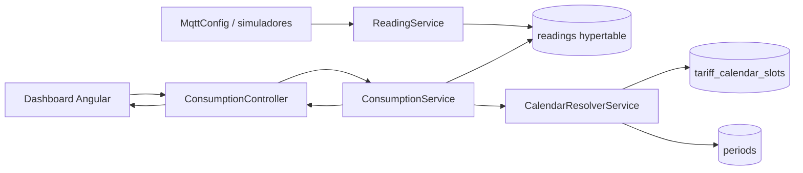

# Anexo D - TimescaleDB, modelo relacional y consultas analiticas

## 1. Papel de TimescaleDB

Wattimizer usa PostgreSQL como base relacional y TimescaleDB para optimizar la tabla de lecturas electricas. La aplicacion no separa ambas bases: TimescaleDB es PostgreSQL con extension de series temporales, por lo que JPA puede tratar `readings` como una tabla normal mientras la base la particiona internamente por tiempo.

El contenedor de base de datos esta definido en `docker-compose.yml`:

```yaml
timescaledb:
  image: timescale/timescaledb-ha:pg17
  container_name: db_iot
```

## 2. Creacion de extensiones e hypertable

El script `backend/src/main/resources/db/dev-seed/00-extensions.sql` crea las extensiones necesarias. Despues, `01-hypertable.sql` convierte la tabla `readings`:

```sql
SELECT create_hypertable('readings', 'time');
```

La tabla debe existir antes, por eso el flujo real es:

1. Arrancar backend para que Hibernate cree tablas con `ddl-auto=update`.
2. Ejecutar `00-extensions.sql`.
3. Ejecutar `01-hypertable.sql` antes de que entren datos.
4. Si ya entraron lecturas, usar la variante con `migrate_data => true`.

```sql
SELECT create_hypertable('readings', 'time', migrate_data => true);
```

Esta separacion existe porque Hibernate crea estructura relacional, pero no sabe convertir una tabla en hypertable TimescaleDB.

## 3. Modelo relacional

### 3.1. `users`

Entidad: `UserEntity`  
Tabla: `users`

| Campo | Funcion |
|---|---|
| `id` | PK heredada de `BaseEntity`. |
| `username` | Identificador unico del usuario. |
| `password` | Hash de contrasena. |
| `role` | `ROLE_USER` o `ROLE_ADMIN`. |
| `active` | Estado de cuenta. |
| `tariff_id` | FK opcional a la tarifa activa. |

### 3.2. `devices`

Entidad: `Device`

| Campo | Funcion |
|---|---|
| `id` | PK. |
| `user_id` | FK opcional al usuario propietario. |
| `name` | Nombre visible del equipo. |
| `mac_address` | Identificador unico fisico o simulado. |
| `is_on` | Estado del rele o simulador. |
| `is_simulated` | Marca si el equipo es generado por software. |
| `simulation_profile` | Perfil de consumo si es simulado. |

Los dispositivos auto-creados desde `events/rpc` pueden quedar sin usuario hasta que se reclamen. Los simuladores siempre se crean asociados al usuario autenticado.

### 3.3. `readings`

Entidad: `Reading`  
Hypertable TimescaleDB por columna `time`.

| Campo | Tipo conceptual | Funcion |
|---|---|---|
| `time` | `Instant` | Parte de PK y eje temporal de la hypertable. |
| `device_id` | FK a `devices` | Parte de PK. |
| `power_w` | Decimal | Potencia instantanea en vatios. |
| `energy_total_kwh` | Decimal | Odometro energetico acumulado en kWh. |
| `is_on` | Boolean | Estado del dispositivo en la lectura. |

La clave compuesta evita duplicar lecturas del mismo dispositivo en el mismo instante.

### 3.4. Tarifas

Tablas:

- `tariffs`
- `periods`
- `tariff_contracted_powers`
- `tariff_calendar_slots`

`tariffs` almacena la informacion general del contrato:

| Campo | Funcion |
|---|---|
| `name` | Nombre de la tarifa. |
| `market` | Mercado libre o regulado. |
| `access_tariff_code` | Peaje: `2.0TD`, `3.0TD`, `6.1TD`, `6.2TD`. |
| `geographic_zone` | Zona: `PENINSULA`, `CANARIAS`, `ISLAS_BALEARES`, `CEUTA`, `MELILLA`. |
| `energy_company` | Comercializadora. |

`periods` almacena precios:

| Campo | Funcion |
|---|---|
| `tariff_id` | FK a tarifa. |
| `period_code` | `P1` a `P6`. |
| `price_kwh` | Precio energetico en euros/kWh. |

`tariff_contracted_powers` almacena potencias:

| Campo | Funcion |
|---|---|
| `tariff_id` | FK a tarifa. |
| `period_code` | Periodo al que aplica. |
| `contracted_power_kw` | Potencia contratada en kW. |

`tariff_calendar_slots` no pertenece a ningun usuario. Es una tabla de dimension regulatoria:

| Campo | Funcion |
|---|---|
| `access_tariff_code` | Distingue tablas horarias por peaje. |
| `geographic_zone` | Zona geografica. |
| `month_number` | Mes 1-12. |
| `season_code` | Temporada regulatoria. |
| `day_type` | Tipo de dia: `A`, `B`, `B1`, `C` o `D`. |
| `period_code` | Periodo resultante. |
| `start_time`, `end_time` | Tramo horario local. |

### 3.5. `alerts`

Entidad: `Alert`

| Campo | Funcion |
|---|---|
| `user_id` | Usuario que recibe la alerta. |
| `device_id` | Dispositivo que la provoca. |
| `type` | Actualmente `OVERPOWER`. |
| `message` | Texto explicativo. |

## 4. Constraints e indices

`backend/src/main/resources/db/tariffs-td-schema.sql` anade validaciones que Hibernate no expresa por si solo:

```sql
CHECK (access_tariff_code IN ('2.0TD', '3.0TD', '6.1TD', '6.2TD'))
CHECK (geographic_zone IN ('PENINSULA', 'CANARIAS', 'ISLAS_BALEARES', 'CEUTA', 'MELILLA'))
CHECK (period_code IN ('P1', 'P2', 'P3', 'P4', 'P5', 'P6'))
CHECK (contracted_power_kw > 0)
```

Indices relevantes:

```sql
CREATE UNIQUE INDEX IF NOT EXISTS ux_periods_tariff_period_code
  ON periods (tariff_id, period_code);

CREATE UNIQUE INDEX IF NOT EXISTS ux_tariff_calendar_slots_lookup
  ON tariff_calendar_slots (
    access_tariff_code, geographic_zone, month_number, day_type, start_time, end_time
  );

CREATE INDEX IF NOT EXISTS ix_tariff_calendar_slots_period_code
  ON tariff_calendar_slots (
    access_tariff_code, geographic_zone, month_number, day_type, period_code
  );
```

Estas restricciones protegen la coherencia del modelo tarifario incluso si en el futuro se escriben datos por otro canal distinto a la API.

## 5. Consultas reales en repositorios

### 5.1. Lecturas por intervalo

**Archivo:** `ReadingRepository.java`

```java
@Query("SELECT r FROM Reading r WHERE r.device.macAddress = :macAddress " +
       "AND r.time >= :start AND r.time <= :end ORDER BY r.time ASC")
List<Reading> findReadingsInInterval(
        @Param("macAddress") String macAddress,
        @Param("start") Instant start,
        @Param("end") Instant end);
```

Esta consulta es la base de:

- historial reciente del dashboard;
- calculo de coste;
- calculo de consumo fantasma.

Aunque se escribe en JPQL, al ejecutarse sobre la hypertable TimescaleDB se beneficia del particionado temporal por `time`.

### 5.2. Ultima lectura por dispositivo

```java
Optional<Reading> findFirstByDeviceMacAddressOrderByTimeDesc(String macAddress);
```

Se usa para obtener el ultimo odometro energetico y continuar la simulacion sin reiniciar el acumulado.

### 5.3. Lectura por clave compuesta

```java
Optional<Reading> findByTimeAndDeviceMacAddress(Instant time, String macAddress);
```

Permite consultar o borrar una lectura concreta por instante y MAC.

### 5.4. Resolucion de periodo regulatorio

**Archivo:** `TariffCalendarSlotRepository.java`

```java
@Query("""
        SELECT cs.periodCode FROM TariffCalendarSlot cs
        WHERE cs.accessTariffCode = :accessTariffCode
          AND cs.geographicZone   = :zone
          AND cs.monthNumber      = :month
          AND cs.dayType          = :dayType
          AND (
                (cs.startTime <> cs.endTime AND cs.startTime <= :localTime AND cs.endTime > :localTime)
                OR
                (cs.startTime = cs.endTime AND cs.dayType = 'D')
                OR (cs.endTime = :endOfDay AND :localTime >= cs.startTime)
              )
        """)
Optional<String> findPeriodCode(...);
```

Esta consulta traduce un instante ya convertido a hora local en un periodo P1-P6. Es una pieza central porque el precio no depende solo de la hora, sino tambien del peaje, zona, mes y tipo de dia.

## 6. Analitica de costes

**Archivo:** `ConsumptionService.java`

### 6.1. Coste en periodo

Metodo:

```java
public BigDecimal calculateCostInPeriod(String macAddress, Instant start, Instant end)
```

Algoritmo:

1. Obtiene lecturas ordenadas con `findReadingsInInterval`.
2. Si hay menos de dos lecturas, devuelve `0`.
3. Busca el dispositivo y su tarifa activa.
4. Recorre pares consecutivos de lecturas.
5. Calcula delta de energia:

```text
delta_kWh = lectura_actual.energyTotalKwh - lectura_anterior.energyTotalKwh
```

6. Ignora deltas nulos o negativos, porque pueden indicar reinicio de odometro o dato incompleto.
7. Resuelve el periodo aplicable en el instante de la lectura actual.
8. Multiplica `delta_kWh * priceKwh`.
9. Devuelve el total con dos decimales.

### 6.2. Consumo fantasma

Metodo:

```java
public BigDecimal calculateGhostCost(String macAddress, Instant start, Instant end)
```

Usa el mismo calculo, pero solo incluye lecturas cuyo instante cae entre 00:00 y 05:59 en la zona horaria del contrato.

Esta decision es importante porque Canarias usa `Atlantic/Canary` y el resto de zonas usa `Europe/Madrid`. No se puede comparar la hora directamente en UTC sin desviar la ventana nocturna.

### 6.3. Coste instantaneo

Metodo:

```java
public BigDecimal calculateInstantaneousCost(String macAddress, double powerW, int durationSeconds)
```

Formula:

```text
energia_kWh = (powerW / 1000) * (durationSeconds / 3600)
coste = energia_kWh * precio_periodo_actual
```

Devuelve seis decimales porque es una estimacion pequena por intervalo de muestreo.

## 7. Resolucion de calendario

**Archivo:** `CalendarResolverService.java`

Proceso:

1. Convierte `Instant` a `ZonedDateTime` segun zona:
   - `CANARIAS` -> `Atlantic/Canary`
   - resto -> `Europe/Madrid`
2. Extrae mes y hora local.
3. Si es sabado o domingo, usa `dayType = D`.
4. Si es laborable, consulta `findWorkdayType`.
5. Consulta `findPeriodCode`.
6. Busca el `Period` contractual por `tariff_id` y `period_code`.

Si la tabla `tariff_calendar_slots` esta vacia, devuelve `Optional.empty()`. Los servicios llamantes responden con coste 0 o no generan alerta. Es una degradacion controlada para que la aplicacion no caiga por falta de seed.

## 8. Analitica de maximetro

**Archivo:** `AlertService.java`

Aunque la alerta no es una consulta agregada, si es analitica sobre telemetria:

```text
potencia_actual_kW = powerW / 1000
si potencia_actual_kW > contractedPowerKw(periodo_actual)
  -> crear alerta OVERPOWER
```

La potencia contratada se busca por tarifa y periodo:

```java
tariffContractedPowerRepository.findByTariffIdAndPeriodCode(tariff.getId(), periodCode)
```

Esto permite que el limite cambie segun P1, P2, ..., P6, en lugar de usar una potencia unica para todo el dia.

## 9. Consultas TimescaleDB recomendadas para administracion

El codigo Java actual no usa funciones nativas de TimescaleDB como `time_bucket` o continuous aggregates. Aun asi, para administracion o informes futuros, las siguientes consultas son coherentes con el modelo real.

### 9.1. Verificar hypertable

```sql
SELECT hypertable_name, num_chunks
FROM timescaledb_information.hypertables
WHERE hypertable_name = 'readings';
```

### 9.2. Ultimas lecturas por dispositivo

```sql
SELECT d.mac_address, r.time, r.power_w, r.energy_total_kwh, r.is_on
FROM readings r
JOIN devices d ON d.id = r.device_id
ORDER BY r.time DESC
LIMIT 20;
```

### 9.3. Consumo por hora con `time_bucket`

```sql
SELECT
  time_bucket('1 hour', r.time) AS hora,
  d.mac_address,
  MAX(r.energy_total_kwh) - MIN(r.energy_total_kwh) AS kwh_estimado
FROM readings r
JOIN devices d ON d.id = r.device_id
WHERE r.time >= NOW() - INTERVAL '24 hours'
GROUP BY hora, d.mac_address
ORDER BY hora ASC;
```

Esta consulta seria util para evolucionar el dashboard hacia historicos horarios sin mover todo el calculo a memoria Java.

### 9.4. Picos de potencia

```sql
SELECT d.mac_address, MAX(r.power_w) AS pico_w
FROM readings r
JOIN devices d ON d.id = r.device_id
WHERE r.time >= NOW() - INTERVAL '7 days'
GROUP BY d.mac_address
ORDER BY pico_w DESC;
```

## 10. Flujo de datos analitico



## 11. Conclusiones tecnicas

- `readings` es la unica tabla convertida en hypertable.
- La particion temporal queda en base de datos, pero las reglas economicas estan en servicios Java.
- El calendario regulatorio esta normalizado para no duplicar horarios dentro de cada tarifa.
- El modelo soporta tanto datos reales como simulados porque ambos comparten `devices` y `readings`.
- La evolucion natural seria mover agregaciones historicas pesadas a SQL TimescaleDB y dejar en Java la logica contractual especifica.
