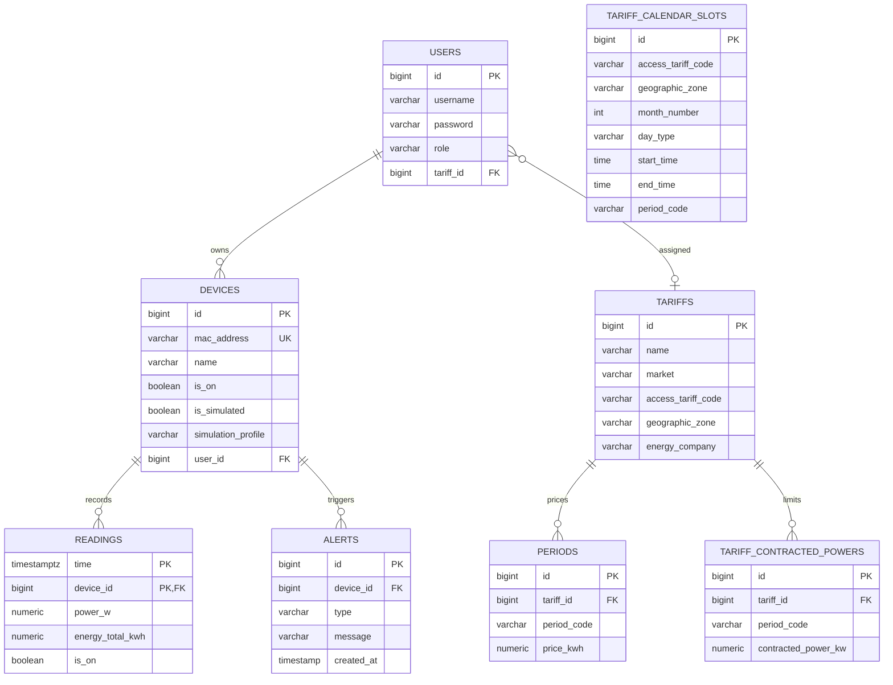
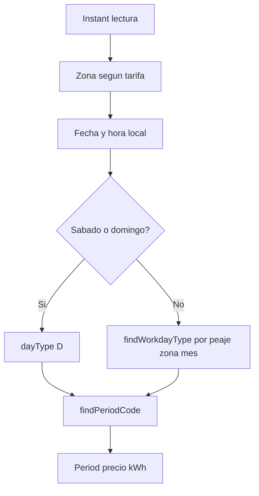

# Anexo D. TimescaleDB y analitica energetica

## 1. Papel de TimescaleDB en el proyecto

Wattimizer guarda lecturas electricas frecuentes. Una tabla normal podria servir
al principio, pero el historico de telemetria crece por tiempo: cada dispositivo
anade nuevas muestras continuamente. Por eso la tabla `readings` se convierte en
hypertable de TimescaleDB usando la columna `time`.

El proyecto usa TimescaleDB de forma conservadora:

- Si usa hypertable para particionado temporal.
- No usa todavia `time_bucket`.
- No define agregados continuos.
- No define politicas de compresion ni retencion.

Esto deja una base correcta para series temporales sin complicar el MVP.

## 2. Scripts SQL versionados

Los scripts estan en `backend/src/main/resources/db`.

| Script | Funcion |
| --- | --- |
| `dev-seed/00-extensions.sql` | Activa extensiones `timescaledb` y `pgcrypto`. |
| `dev-seed/01-hypertable.sql` | Convierte `readings` en hypertable. |
| `tariffs-td-schema.sql` | Ajusta tablas tarifarias, constraints e indices. |
| `seed-tariff-calendar-slots.sql` | Inserta calendario TD para 2.0TD y 3.0TD. |
| `dev-seed/03-seed-users-dev.sql` | Crea usuarios de desarrollo. |
| `dev-seed/04-seed-device-shelly.sql` | Crea Shelly fisico de ejemplo. |
| `dev-seed/05-seed-device-simulation.sql` | Crea dispositivos simulados. |
| `prod/99-resync-sequences.sql` | Resincroniza secuencias tras inserts manuales. |

Orden recomendado en desarrollo:

```text
Hibernate crea tablas
-> extensiones
-> hypertable readings
-> esquema tarifario
-> calendario TD
-> semillas de usuarios y dispositivos
```

## 3. Extension y hypertable

`00-extensions.sql`:

```sql
-- TimescaleDB se activa porque readings se consulta por tiempo.
CREATE EXTENSION IF NOT EXISTS timescaledb;

-- pgcrypto se usa para generar hashes bcrypt en semillas de usuarios.
CREATE EXTENSION IF NOT EXISTS pgcrypto;
```

`01-hypertable.sql`:

```sql
-- La dimension temporal es time porque cada Reading representa una muestra.
SELECT create_hypertable('readings', 'time');

-- Si la tabla ya tuviera datos, se podria migrar con:
-- SELECT create_hypertable('readings', 'time', migrate_data => true);
```

La clave compuesta de `readings` incluye `time` y `device_id`, lo que permite
varias lecturas con el mismo instante si pertenecen a dispositivos diferentes.

## 4. Modelo relacional



## 5. Tabla `readings`

Entidad: `entities/Reading.java`  
Repositorio: `repositories/ReadingRepository.java`

Campos principales:

| Columna | Tipo logico | Uso |
| --- | --- | --- |
| `time` | `Instant` / `TIMESTAMPTZ` | Instante de la muestra y dimension TimescaleDB. |
| `device_id` | FK a `devices` | Dispositivo que genero la lectura. |
| `power_w` | `BigDecimal` | Potencia activa instantanea. |
| `energy_total_kwh` | `BigDecimal` | Energia acumulada del contador. |
| `is_on` | `Boolean` | Estado del interruptor. |

La entidad usa `@IdClass(ReadingId.class)`. El repositorio declara
`JpaRepository<Reading, Long>`, aunque la clave real es compuesta. El codigo usa
metodos derivados y JPQL por `time` y `macAddress`, por lo que en la practica no
depende de buscar por ID simple.

## 6. Repositorios y consultas reales

### 6.1. `ReadingRepository`

Consulta base para historico y analitica:

```java
@Query("SELECT r FROM Reading r WHERE r.device.macAddress = :macAddress " +
       "AND r.time >= :start AND r.time <= :end ORDER BY r.time ASC")
List<Reading> findReadingsInInterval(String macAddress, Instant start, Instant end);
```

Esta consulta se usa en:

- `ReadingService.listRecentByMacAddress`
- `ConsumptionService.calculateCostInPeriod`
- `ConsumptionService.calculateGhostCost`

Borrados:

```java
@Query("DELETE FROM Reading r WHERE r.time = :time AND r.device.macAddress = :macAddress")
Long deleteByTimeAndDeviceMacAddress(Instant time, String macAddress);

@Query("DELETE FROM Reading r WHERE r.device.macAddress = :macAddress")
int deleteAllByDeviceMacAddress(String macAddress);
```

El borrado por MAC se usa antes de eliminar dispositivos para no dejar lecturas
huerfanas.

### 6.2. `TariffCalendarSlotRepository`

Resuelve que periodo P1-P6 aplica en un instante concreto. La consulta contempla:

- Intervalos normales `[startTime, endTime)`.
- Dias completos cuando `startTime = endTime`.
- Tramo final `22:00-23:59`.

Tambien incluye `findWorkdayType`, que obtiene el tipo de dia laboral segun peaje,
zona y mes.

### 6.3. Otros repositorios relevantes

| Repositorio | Consulta o metodo clave |
| --- | --- |
| `DeviceRepository` | `findByMacAddress`, `findByUserUsername`, `findBySimulatedTrue`. |
| `PeriodRepository` | `findByTariffIdAndPeriodCode`. |
| `TariffContractedPowerRepository` | `findByTariffIdAndPeriodCode`. |
| `TariffRepository` | `findAllCatalog`, que excluye clones privados asignados a usuarios. |
| `AlertRepository` | `findByUserUsername`, `deleteByDeviceId`. |

## 7. Estructura tarifaria TD

`tariffs-td-schema.sql` adapta el modelo a tarifas con periodos. Las tablas
principales son:

### 7.1. `tariffs`

Campos reguladores:

- `access_tariff_code`: peaje, por ejemplo `2.0TD` o `3.0TD`.
- `geographic_zone`: zona geografica, por ejemplo `PENINSULA` o `ISLAS_BALEARES`.
- `energy_company`: compania electrica.

### 7.2. `periods`

Guarda precio por kWh para cada periodo:

```sql
CREATE UNIQUE INDEX IF NOT EXISTS ux_periods_tariff_period_code
  ON periods (tariff_id, period_code);
```

Ese indice evita duplicar dos precios P1 para la misma tarifa.

### 7.3. `tariff_contracted_powers`

Guarda potencia contratada por periodo:

```sql
CHECK (contracted_power_kw > 0)
```

Esta tabla se usa en alertas de maximetro, no en el calculo de energia consumida.

### 7.4. `tariff_calendar_slots`

Guarda el calendario normativo:

```sql
CREATE UNIQUE INDEX ux_tariff_calendar_slots_lookup
  ON tariff_calendar_slots (
    access_tariff_code,
    geographic_zone,
    month_number,
    day_type,
    start_time,
    end_time
  );
```

La tabla no apunta por FK a una tarifa concreta. Es un calendario global por peaje
y zona. Luego `CalendarResolverService` lo cruza con la tarifa del usuario.

## 8. Semilla del calendario tarifario

`seed-tariff-calendar-slots.sql` inserta calendario para:

- `2.0TD`
- `3.0TD`
- `PENINSULA`
- `ISLAS_BALEARES`

Contiene 336 filas y usa `ON CONFLICT DO NOTHING` para poder ejecutarse mas de una
vez sin duplicar slots.

Limitaciones actuales:

- El codigo admite `CANARIAS`, `CEUTA` y `MELILLA`, pero la semilla principal no
  las cubre.
- Los constraints admiten `6.1TD` y `6.2TD`, pero no hay slots seed para esos peajes.

## 9. Analitica de coste total

Controlador: `ConsumptionController`  
Servicio: `ConsumptionService`

Endpoint:

```text
GET /api/v1/analytics/cost?macAddress={mac}&start={iso}&end={iso}
```

Respuesta:

```json
{
  "macAddress": "9070694d3590",
  "totalCostEur": 1.24,
  "start": "2026-07-07T00:00:00Z",
  "end": "2026-07-07T22:00:00Z"
}
```

Algoritmo:

1. Cargar lecturas ordenadas por tiempo.
2. Exigir al menos dos lecturas.
3. Obtener dispositivo, usuario y tarifa.
4. Para cada par `previous/current`, calcular:

```text
deltaKwh = current.energyTotalKwh - previous.energyTotalKwh
```

5. Si `deltaKwh` es positivo, resolver periodo tarifario con la hora de `current`.
6. Multiplicar `deltaKwh * priceKwh`.
7. Sumar y redondear a 2 decimales.

Se usa el odometro acumulado porque es mas fiable que integrar solo potencia
instantanea. Si una lectura puntual llega tarde o con pequena variacion, el delta
del contador sigue representando energia consumida entre muestras.

## 10. Analitica de consumo fantasma

Endpoint:

```text
GET /api/v1/analytics/ghost-consumption?macAddress={mac}&start={iso}&end={iso}
```

El algoritmo es igual al coste total, pero solo suma los pasos cuya hora local cae
entre `00:00` y `05:59`.

Punto importante: consumo fantasma no significa necesariamente periodo valle
regulatorio. Es una decision funcional del proyecto para detectar gasto nocturno
posiblemente innecesario.

La zona horaria sale de la tarifa:

- `CANARIAS` usa `Atlantic/Canary`.
- El resto usa `Europe/Madrid`.

## 11. Resolucion del periodo tarifario

Servicio: `CalendarResolverService`

Flujo:



Si no encuentra calendario o periodo, devuelve `Optional.empty()`. En ese caso el
coste es cero y no se genera alerta de potencia para esa lectura.

## 12. Consultas TimescaleDB no implementadas todavia

El repositorio no contiene consultas nativas como:

```sql
SELECT time_bucket('5 minutes', time), avg(power_w)
FROM readings
GROUP BY 1;
```

Tampoco hay agregados continuos. La analitica se hace en Java con JPQL y objetos
`Reading`. Esto simplifica el desarrollo y permite reutilizar la logica de tarifas
por zona, aunque a futuro seria interesante mover agregaciones de historicos
largos a SQL/TimescaleDB.

## 13. Relacion entre TimescaleDB y Angular

El frontend no consulta TimescaleDB directamente. El flujo es:

```mermaid
flowchart LR
    A[Angular Dashboard] --> B[GET /api/v1/readings/device/{mac}/recent]
    B --> C[ReadingController]
    C --> D[ReadingService]
    D --> E[ReadingRepository.findReadingsInInterval]
    E --> F[(Hypertable readings)]
```

Para tiempo real, Angular recibe STOMP, pero esas lecturas tambien se persisten
antes en `readings`. Asi se mantiene coherencia entre lo que se pinta en vivo y lo
que luego se consulta como historico.

## 14. Mejoras futuras

- Sustituir consultas largas por agregaciones con `time_bucket`.
- Crear continuous aggregates para dashboard diario/semanal.
- Definir politica de compresion para chunks antiguos.
- Definir politica de retencion si no se quiere guardar telemetria indefinida.
- Corregir el tipo generico de `ReadingRepository` a `ReadingId`.
- Anadir indices especificos para consultas por `device_id` y rango temporal si
  el plan de ejecucion lo requiere.
