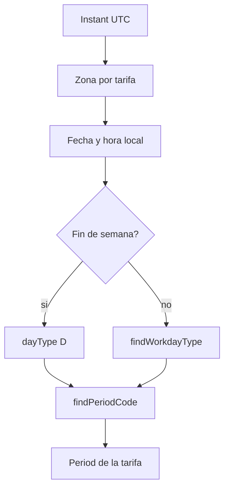
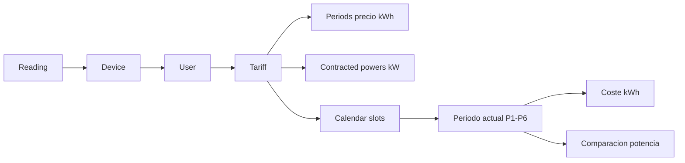

# Anexo D. TimescaleDB, hypertables y analítica energética

Este anexo documenta la estructura de datos real usada por Wattimizer para guardar lecturas IoT y calcular costes. La base combina PostgreSQL, Hibernate/JPA y scripts SQL manuales para funciones que JPA no cubre, especialmente la hypertable de TimescaleDB.

## D.1. Papel de TimescaleDB en el proyecto

Las lecturas energéticas son datos temporales: llegan cada pocos segundos, siempre asociadas a un instante y a un dispositivo. Por eso `readings` se convierte en hypertable de TimescaleDB. El resto de tablas son relacionales normales porque representan usuarios, dispositivos, tarifas, calendarios y alertas.

| Tipo de dato | Tabla | Tecnología |
|---|---|---|
| Serie temporal de telemetría | `readings` | TimescaleDB hypertable |
| Usuarios y dispositivos | `users`, `devices` | PostgreSQL + JPA |
| Tarifas y periodos | `tariffs`, `periods`, `tariff_contracted_powers` | PostgreSQL + JPA + constraints SQL |
| Calendario regulatorio | `tariff_calendar_slots` | PostgreSQL + JPA + seed SQL |
| Alertas | `alerts` | PostgreSQL + JPA |

## D.2. Scripts SQL

Los scripts están en `backend/src/main/resources/db`.

| Script | Función |
|---|---|
| `dev-seed/00-extensions.sql` | Crea extensiones `timescaledb` y `pgcrypto`. |
| `dev-seed/01-hypertable.sql` | Convierte `readings` en hypertable por columna `time`. |
| `tariffs-td-schema.sql` | Añade columnas, checks e índices para el modelo TD español. |
| `seed-tariff-calendar-slots.sql` | Inserta 336 filas de calendario para 2.0TD y 3.0TD en Península e Islas Baleares. |
| `prod/99-resync-sequences.sql` | Resincroniza secuencias después de cargar datos iniciales. |

`application.properties` mantiene `spring.jpa.hibernate.ddl-auto=update`. Eso significa que Hibernate crea o actualiza tablas básicas, y los scripts SQL añaden lo que Hibernate no expresa bien: hypertable, índices únicos y restricciones de dominio.

## D.3. Hypertable `readings`

### D.3.1. Conversión

`db/dev-seed/01-hypertable.sql` contiene:

```sql
SELECT create_hypertable('readings', 'time');
```

El script indica que debe ejecutarse cuando la tabla está vacía, después de crear la extensión y antes de que lleguen mensajes MQTT. Si ya hubiera datos, TimescaleDB permite usar `migrate_data => true`, pero el script principal no lo activa.

### D.3.2. Entidad JPA

**Archivo:** `entities/Reading.java`

| Columna | Campo JPA | Tipo | Notas |
|---|---|---|---|
| `time` | `time` | `Instant` | Parte de la clave compuesta. |
| `device_id` | `device` | FK a `devices` | Parte de la clave compuesta mediante `ReadingId`. |
| `power_w` | `powerW` | `BigDecimal(10,2)` | Potencia instantánea. |
| `energy_total_kwh` | `energyTotalKwh` | `BigDecimal(14,4)` | Odómetro acumulado de energía. |
| `is_on` | `isOn` | `Boolean` | Estado del relé. |

La clave compuesta `(time, device_id)` encaja con series temporales porque una misma fecha puede repetirse entre dispositivos distintos, pero no debería repetirse para el mismo dispositivo.

## D.4. Tablas relacionales principales

### D.4.1. `users`

**Entidad:** `UserEntity`

| Campo | Uso |
|---|---|
| `id` | Identificador interno heredado de `BaseEntity`. |
| `username` | Email/login, único. |
| `password` | Hash de contraseña. |
| `role` | `ROLE_USER` o `ROLE_ADMIN`. |
| `active` | Estado de cuenta. |
| `tariff_id` | Tarifa privada o plantilla clonada asignada al usuario. |

### D.4.2. `devices`

**Entidad:** `Device`

| Campo | Uso |
|---|---|
| `id` | Identificador interno. |
| `user_id` | Propietario. |
| `name` | Nombre visible en UI. |
| `mac_address` | Identificador único del hardware o simulador. |
| `is_on` | Estado lógico del relé. |
| `is_simulated` | Diferencia hardware real de simulador. |
| `simulation_profile` | Perfil usado si el dispositivo es simulado. |

La MAC es única. Para simuladores se genera una MAC sintética con prefijo `SIM`, evitando colisiones con dispositivos físicos.

### D.4.3. `tariffs`

**Entidad:** `Tariff`

| Campo | Uso |
|---|---|
| `id` | Identificador de tarifa. |
| `name` | Nombre de plantilla o contrato privado. |
| `market` | Mercado libre o regulado. |
| `access_tariff_code` | Peaje: `2.0TD`, `3.0TD`, `6.1TD`, `6.2TD`. |
| `geographic_zone` | Zona: Península, Canarias, Baleares, Ceuta o Melilla. |
| `energy_company` | Comercializadora. |

Relaciones:

- `tariffs` 1:N `periods`
- `tariffs` 1:N `tariff_contracted_powers`

### D.4.4. `periods`

**Entidad:** `Period`

| Campo | Uso |
|---|---|
| `tariff_id` | Tarifa propietaria. |
| `period_code` | P1-P6. |
| `price_kwh` | Precio de energía en euros/kWh. |

El índice único `ux_periods_tariff_period_code` evita duplicar el mismo periodo dentro de una tarifa.

### D.4.5. `tariff_contracted_powers`

**Entidad:** `TariffContractedPower`

| Campo | Uso |
|---|---|
| `tariff_id` | Tarifa propietaria. |
| `period_code` | P1-P6. |
| `contracted_power_kw` | Potencia contratada en kW. |

Esta tabla se usa para alertas de maxímetro. Si la lectura en kW supera la potencia contratada del periodo aplicable, se crea alerta.

### D.4.6. `tariff_calendar_slots`

**Entidad:** `TariffCalendarSlot`

| Campo | Uso |
|---|---|
| `access_tariff_code` | Peaje al que aplica el tramo. |
| `geographic_zone` | Zona geográfica. |
| `month_number` | Mes 1-12. |
| `season_code` | `HIGH`, `MID_HIGH`, `MID`, `LOW`. |
| `day_type` | `A`, `B`, `B1`, `C`, `D`. |
| `period_code` | Periodo P1-P6 resuelto. |
| `start_time` | Inicio de tramo horario. |
| `end_time` | Fin de tramo horario. |

El seed incluye 336 filas: 84 por combinación de peaje y zona para `2.0TD`/`3.0TD` en `PENINSULA` e `ISLAS_BALEARES`.

### D.4.7. `alerts`

**Entidad:** `Alert`

| Campo | Uso |
|---|---|
| `user_id` | Usuario destinatario. |
| `device_id` | Dispositivo que genera la alerta. |
| `type` | Tipo, por ejemplo `OVERPOWER`. |
| `message` | Descripción legible. |

## D.5. Constraints e índices del modelo tarifario

`tariffs-td-schema.sql` añade restricciones para proteger la coherencia incluso si se insertan datos fuera de la aplicación.

| Restricción o índice | Intención |
|---|---|
| `chk_tariffs_access_tariff_code` | Solo admite peajes `2.0TD`, `3.0TD`, `6.1TD`, `6.2TD`. |
| `chk_tariffs_geographic_zone` | Solo admite zonas soportadas. |
| `chk_periods_period_code` | Limita periodos a P1-P6. |
| `ux_periods_tariff_period_code` | Evita repetir periodo dentro de una tarifa. |
| `chk_tariff_contracted_powers_period_code` | Limita potencias a P1-P6. |
| `chk_tariff_contracted_powers_positive` | Impide potencias contratadas no positivas. |
| `ux_tariff_calendar_slots_lookup` | Evita duplicar un tramo de calendario. |
| `ix_tariff_calendar_slots_period_code` | Acelera búsquedas por peaje, zona, mes, tipo de día y periodo. |

La validación se repite en servicios Java (`TariffService`) y en SQL. No es duplicación accidental: la validación Java da mensajes de negocio al usuario, mientras que SQL protege la base ante cargas manuales o errores externos.

## D.6. Repositorios y consultas

### D.6.1. `ReadingRepository`

**Archivo:** `repositories/ReadingRepository.java`

```java
@Query("SELECT r FROM Reading r WHERE r.device.macAddress = :macAddress " +
       "AND r.time >= :start AND r.time <= :end ORDER BY r.time ASC")
List<Reading> findReadingsInInterval(String macAddress, Instant start, Instant end);
```

| Método | Propósito |
|---|---|
| `findFirstByDeviceMacAddressOrderByTimeDesc` | Obtener última lectura para dashboard o simulación. |
| `findByTimeAndDeviceMacAddress` | Buscar lectura exacta por clave funcional. |
| `findReadingsInInterval` | Base para coste, consumo fantasma e histórico. |
| `deleteByTimeAndDeviceMacAddress` | Borrado puntual de lectura. |
| `deleteAllByDeviceMacAddress` | Limpieza al borrar dispositivo. |

Actualmente las consultas no usan SQL nativo de TimescaleDB como `time_bucket`. TimescaleDB se aprovecha sobre todo en almacenamiento temporal y particionado de `readings`.

### D.6.2. `TariffCalendarSlotRepository`

La consulta `findPeriodCode` resuelve el periodo P1-P6 según peaje, zona, mes, tipo de día y hora local:

```java
SELECT cs.periodCode FROM TariffCalendarSlot cs
WHERE cs.accessTariffCode = :accessTariffCode
  AND cs.geographicZone   = :zone
  AND cs.monthNumber      = :month
  AND cs.dayType          = :dayType
  AND (
        (cs.startTime <> cs.endTime AND cs.startTime <= :localTime AND cs.endTime > :localTime)
        OR
        (cs.startTime = cs.endTime AND cs.dayType = 'D')
        OR (cs.endTime = :endOfDay AND :localTime >= cs.startTime)
      )
```

La condición final con `endOfDay` cubre el tramo que termina en `23:59`, porque PostgreSQL `TIME` no representa `24:00`.

`findWorkdayType` obtiene el tipo de día laborable (`A`, `B`, `B1`, `C`) para peaje, zona y mes. Los fines de semana se resuelven directamente como tipo `D`.

## D.7. Resolución de periodos

**Servicio:** `CalendarResolverService`

Flujo lógico:



La zona horaria depende de `geographicZone`. Península y Baleares usan `Europe/Madrid`; Canarias debe resolverse como `Atlantic/Canary`. Esta distinción evita calcular consumo fantasma con una hora local equivocada.

## D.8. Consultas analíticas implementadas

La analítica se implementa en `ConsumptionService`, no en una vista SQL materializada.

### D.8.1. Coste acumulado por intervalo

**Endpoint:** `GET /api/v1/analytics/cost`  
**Método:** `ConsumptionService.calculateCostInPeriod(macAddress, start, end)`

Pasos:

1. Recupera lecturas ordenadas con `findReadingsInInterval`.
2. Si hay menos de dos lecturas, devuelve cero.
3. Obtiene dispositivo, usuario y tarifa.
4. Recorre lecturas consecutivas.
5. Calcula delta positivo de `energyTotalKwh`.
6. Resuelve el periodo aplicable para el instante de la lectura actual.
7. Multiplica delta kWh por `priceKwh`.
8. Devuelve total con escala de 2 decimales.

```text
totalCostEur = suma(delta_kWh_positivo * precio_kWh_periodo)
```

Se ignoran deltas nulos o negativos porque pueden indicar reinicio del hardware, lectura incompleta o datos inválidos.

### D.8.2. Consumo fantasma

**Endpoint:** `GET /api/v1/analytics/ghost-consumption`  
**Método:** `ConsumptionService.calculateGhostCost(macAddress, start, end)`

Usa el mismo cálculo que el coste acumulado, pero filtra por ventana local:

```text
00:00 <= hora_local < 06:00
```

No se identifica consumo fantasma con el periodo valle regulatorio. La ventana fantasma es una decisión funcional de negocio: medir gasto de madrugada, cuando normalmente la empresa debería estar cerrada o con muy baja actividad.

### D.8.3. Coste instantáneo

**Método:** `ConsumptionService.calculateInstantaneousCost(macAddress, powerW, durationSeconds)`

Se usa para estimar coste de una potencia concreta durante una duración:

```text
kWh = (powerW / 1000) * (durationSeconds / 3600)
coste = kWh * priceKwh_periodo_actual
```

Devuelve cero si:

- `powerW <= 0`
- `durationSeconds <= 0`
- no existe dispositivo
- el dispositivo no tiene usuario o tarifa
- no se puede resolver el periodo de calendario

## D.9. Relación entre lecturas, tarifas y alertas



Una lectura por sí sola solo dice potencia y energía. Para darle valor económico se necesita:

- el dispositivo para saber el usuario,
- el usuario para saber la tarifa,
- la tarifa para saber precios y potencias,
- el calendario para decidir qué periodo aplica en ese instante.

## D.10. Borrado y mantenimiento de datos

El commit reciente `d77851b` introdujo limpieza al borrar dispositivos. `DeviceService.deleteById` elimina antes:

1. Lecturas del dispositivo mediante `ReadingRepository.deleteAllByDeviceMacAddress`.
2. Alertas del dispositivo mediante `AlertRepository.deleteByDeviceId`.
3. La entidad `Device`.

Esta decisión evita errores por claves foráneas y también impide dejar datos huérfanos que ya no se podrían consultar desde la interfaz.

## D.11. Datos seed de calendario

`seed-tariff-calendar-slots.sql` documenta la fuente normativa como Circular CNMC 3/2020. Cubre:

| Peajes | Zonas |
|---|---|
| `2.0TD` | `PENINSULA`, `ISLAS_BALEARES` |
| `3.0TD` | `PENINSULA`, `ISLAS_BALEARES` |

Para `2.0TD`, los periodos principales son P1, P2 y P3. Para `3.0TD`, se usan P1-P6. Los tipos de temporada se mapean así:

| Temporada | Tipo día |
|---|---|
| `HIGH` | `A` |
| `MID_HIGH` | `B` |
| `MID` | `B1` |
| `LOW` | `C` |
| Fines de semana/festivos | `D` |

El propio repositorio deja claro que la cobertura completa de zonas y peajes puede ampliarse. Por eso una mejora futura razonable es completar Canarias, Ceuta, Melilla y peajes de alta tensión con datos normativos completos.

## D.12. Pruebas relacionadas

| Test | Cobertura |
|---|---|
| `ConsumptionServiceTest` | Coste fantasma dentro/fuera de ventana local. |
| `TariffServiceTest` | Validación de periodos, precios y potencias para 2.0TD, 3.0TD y 6.1TD. |
| `UserTariffServiceTest` | Clonado de tarifas y no mutación de plantillas. |
| `DeviceServiceTest` | Limpieza de lecturas/alertas al borrar dispositivo. |

No hay todavía tests de integración con una base TimescaleDB real. Las pruebas actuales validan lógica Java con mocks; para validar hypertable, constraints y scripts SQL haría falta Testcontainers o un entorno de integración.

## D.13. Límites actuales de la analítica

- No existen consultas con `time_bucket`, compresión ni continuous aggregates.
- No hay materialización de costes diarios o mensuales.
- Los endpoints calculan costes bajo demanda leyendo lecturas del intervalo.
- El calendario seed cubre solo parte de combinaciones posibles de peaje y zona.
- `readings` es la única hypertable; el resto son tablas PostgreSQL estándar.

Estas limitaciones son coherentes con un MVP: primero se garantiza ingesta, persistencia y cálculo correcto; después se podrían optimizar agregaciones históricas si crece el volumen de datos.
