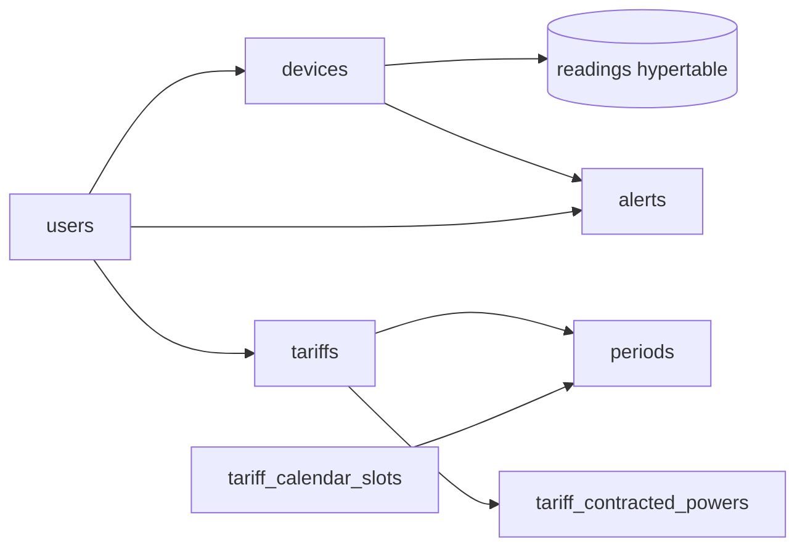

# Anexo D. TimescaleDB y consultas analíticas

## 1. Papel de TimescaleDB en Wattimizer

Wattimizer guarda lecturas de consumo eléctrico que llegan de forma continua. Esos datos tienen naturaleza temporal: cada lectura tiene un instante, un dispositivo y medidas asociadas. Por ese motivo la tabla `readings` se convierte en hypertable de TimescaleDB.

El resto del modelo se mantiene como tablas PostgreSQL normales, porque usuarios, dispositivos, tarifas y alertas no necesitan particionado temporal.

## 2. Estrategia de creación de esquema

El proyecto combina dos mecanismos:

1. **Hibernate `ddl-auto=update`** crea y ajusta tablas JPA.
2. **Scripts SQL manuales** añaden extensión TimescaleDB, hypertable, constraints, índices y seeds regulatorios.

Scripts relevantes:

| Script | Ruta | Función |
| --- | --- | --- |
| `00-extensions.sql` | `backend/src/main/resources/db/dev-seed/00-extensions.sql` | Activa extensiones como TimescaleDB y `pgcrypto`. |
| `01-hypertable.sql` | `backend/src/main/resources/db/dev-seed/01-hypertable.sql` | Convierte `readings` en hypertable. |
| `03-seed-users-dev.sql` | `backend/src/main/resources/db/dev-seed/03-seed-users-dev.sql` | Crea usuarios de desarrollo. |
| `04-seed-device-shelly.sql` | `backend/src/main/resources/db/dev-seed/04-seed-device-shelly.sql` | Inserta Shelly físico de demo. |
| `05-seed-device-simulation.sql` | `backend/src/main/resources/db/dev-seed/05-seed-device-simulation.sql` | Inserta dispositivos simulados. |
| `tariffs-td-schema.sql` | `backend/src/main/resources/db/tariffs-td-schema.sql` | Añade constraints e índices para tarifas TD. |
| `seed-tariff-calendar-slots.sql` | `backend/src/main/resources/db/seed-tariff-calendar-slots.sql` | Carga calendario regulatorio. |
| `99-resync-sequences.sql` | `backend/src/main/resources/db/prod/99-resync-sequences.sql` | Reajusta secuencias tras seeds en producción. |

## 3. Hypertable `readings`

Entidad Java: `backend/src/main/java/com/joselumartos/jwtauthbackenddemo/entities/Reading.java`

```java
@Entity
@Table(name = "readings")
@IdClass(ReadingId.class)
public class Reading {
    @Id
    @Column(nullable = false, updatable = false)
    private Instant time;

    @Id
    @ManyToOne(fetch = FetchType.LAZY)
    @JoinColumn(name = "device_id", nullable = false)
    private Device device;

    @Column(name = "power_w", precision = 10, scale = 2)
    private BigDecimal powerW;

    @Column(name = "energy_total_kwh", precision = 14, scale = 4)
    private BigDecimal energyTotalKwh;

    @Column(name = "is_on")
    private Boolean isOn;
}
```

Columnas:

| Columna | Tipo conceptual | Descripción |
| --- | --- | --- |
| `time` | `Instant` | Instante UTC de la lectura. Es la dimensión temporal de TimescaleDB. |
| `device_id` | FK a `devices` | Dispositivo emisor. Forma parte de la clave compuesta. |
| `power_w` | Decimal | Potencia activa instantánea en vatios. |
| `energy_total_kwh` | Decimal | Odómetro acumulado de energía. |
| `is_on` | Boolean | Estado del enchufe. |

Conversión a hypertable:

```sql
SELECT create_hypertable('readings', 'time');
```

El script indica que debe ejecutarse con la tabla vacía. Si ya hubiera datos, TimescaleDB requeriría `migrate_data => true`.

## 4. Modelo relacional de soporte

| Tabla | Entidad | Intención |
| --- | --- | --- |
| `users` | `UserEntity` | Usuario, contraseña, rol y tarifa activa. |
| `devices` | `Device` | Enchufe físico o simulado, MAC única y propietario opcional. |
| `tariffs` | `Tariff` | Contrato eléctrico base o privado. |
| `periods` | `Period` | Precio €/kWh por periodo P1-P6. |
| `tariff_contracted_powers` | `TariffContractedPower` | Potencia contratada por periodo. |
| `tariff_calendar_slots` | `TariffCalendarSlot` | Calendario horario regulatorio. |
| `alerts` | `Alert` | Alertas generadas para usuario y dispositivo. |
| `federated_identities` | `FederatedIdentity` | Identidad externa OAuth2. |

Relación simplificada:



## 5. Constraints e índices de tarifas TD

Archivo: `backend/src/main/resources/db/tariffs-td-schema.sql`

Validaciones principales:

- `access_tariff_code` limitado a `2.0TD`, `3.0TD`, `6.1TD`, `6.2TD`.
- `geographic_zone` limitado a `PENINSULA`, `CANARIAS`, `ISLAS_BALEARES`, `CEUTA`, `MELILLA`.
- `period_code` limitado a `P1`-`P6`.
- `contracted_power_kw > 0`.
- `month_number BETWEEN 1 AND 12`.
- `day_type` limitado a `A`, `B`, `B1`, `C`, `D`.

Índices:

```sql
CREATE UNIQUE INDEX IF NOT EXISTS ux_periods_tariff_period_code
  ON periods (tariff_id, period_code);

CREATE INDEX IF NOT EXISTS ix_tariff_contracted_powers_tariff_id
  ON tariff_contracted_powers (tariff_id);

CREATE UNIQUE INDEX IF NOT EXISTS ux_tariff_calendar_slots_lookup
  ON tariff_calendar_slots (
    access_tariff_code, geographic_zone, month_number, day_type, start_time, end_time
  );

CREATE INDEX IF NOT EXISTS ix_tariff_calendar_slots_period_code
  ON tariff_calendar_slots (
    access_tariff_code, geographic_zone, month_number, day_type, period_code
  );
```

Estos índices favorecen la resolución de periodo aplicable: peaje + zona + mes + tipo de día + hora local.

## 6. Seed regulatorio de calendario

Archivo: `backend/src/main/resources/db/seed-tariff-calendar-slots.sql`

Cobertura declarada por el propio script:

- Zonas: `PENINSULA`, `ISLAS_BALEARES`.
- Peajes: `2.0TD`, `3.0TD`.
- Total: 336 filas.

El seed codifica tramos horarios según Circular CNMC 3/2020. Ejemplo para `2.0TD` Península:

```sql
('2.0TD','PENINSULA',1,'HIGH','A','P3','00:00','08:00'),
('2.0TD','PENINSULA',1,'HIGH','A','P2','08:00','09:00'),
('2.0TD','PENINSULA',1,'HIGH','A','P1','09:00','14:00'),
('2.0TD','PENINSULA',1,'HIGH','A','P2','14:00','18:00'),
('2.0TD','PENINSULA',1,'HIGH','A','P1','18:00','22:00'),
('2.0TD','PENINSULA',1,'HIGH','A','P2','22:00','23:59')
```

El script usa `23:59` porque PostgreSQL `TIME` no admite `24:00`. La propia documentación del SQL advierte este límite.

## 7. Repositorios con consultas analíticas

### 7.1. `ReadingRepository`

Archivo: `backend/src/main/java/com/joselumartos/jwtauthbackenddemo/repositories/ReadingRepository.java`

Métodos:

```java
Optional<Reading> findFirstByDeviceMacAddressOrderByTimeDesc(String macAddress);

Optional<Reading> findByTimeAndDeviceMacAddress(Instant time, String macAddress);

@Query("""
  SELECT r FROM Reading r
  WHERE r.device.macAddress = :macAddress
  AND r.time >= :start AND r.time <= :end
  ORDER BY r.time ASC
""")
List<Reading> findReadingsInInterval(String macAddress, Instant start, Instant end);

@Query("DELETE FROM Reading r WHERE r.time = :time AND r.device.macAddress = :macAddress")
Long deleteByTimeAndDeviceMacAddress(Instant time, String macAddress);

@Query("DELETE FROM Reading r WHERE r.device.macAddress = :macAddress")
int deleteAllByDeviceMacAddress(String macAddress);
```

`findReadingsInInterval` es la consulta central para analítica. Ordena por tiempo ascendente porque el coste se calcula comparando cada lectura con la anterior.

### 7.2. `TariffCalendarSlotRepository`

Archivo: `backend/src/main/java/com/joselumartos/jwtauthbackenddemo/repositories/TariffCalendarSlotRepository.java`

Responsabilidades:

- Resolver periodo P1-P6 a partir de peaje, zona, mes, tipo de día y hora local.
- Resolver tipo de día laborable por temporada.

Esta separación evita meter reglas horarias directamente en `ConsumptionService`. La lógica de negocio pregunta "qué periodo aplica" y el repositorio responde usando datos regulatorios.

## 8. Cálculo de coste energético

Archivo: `backend/src/main/java/com/joselumartos/jwtauthbackenddemo/services/ConsumptionService.java`

Método principal:

```java
public BigDecimal calculateCostInPeriod(String macAddress, Instant start, Instant end)
```

Flujo:

1. Obtiene lecturas del intervalo con `findReadingsInInterval`.
2. Si hay menos de dos lecturas, devuelve `0`.
3. Busca dispositivo y tarifa asociada al usuario.
4. Recorre lecturas desde la segunda.
5. Calcula delta positivo de `energyTotalKwh`.
6. Resuelve periodo aplicable con `CalendarResolverService`.
7. Multiplica `deltaKwh * priceKwh`.
8. Redondea a 2 decimales.

Helper clave:

```java
private Optional<BigDecimal> calculatePositiveDelta(Reading previous, Reading current) {
    if (current.getEnergyTotalKwh() == null || previous.getEnergyTotalKwh() == null) {
        return Optional.empty();
    }
    BigDecimal delta = current.getEnergyTotalKwh().subtract(previous.getEnergyTotalKwh());
    return delta.compareTo(BigDecimal.ZERO) > 0 ? Optional.of(delta) : Optional.empty();
}
```

La aplicación descarta deltas nulos o negativos porque pueden indicar lectura incompleta o reinicio del contador del dispositivo.

## 9. Cálculo de consumo fantasma

Método:

```java
public BigDecimal calculateGhostCost(String macAddress, Instant start, Instant end)
```

La diferencia frente al coste normal es el filtro horario:

```java
private boolean isGhostWindow(Tariff tariff, Instant instant) {
    ZoneId zoneId = calendarResolverService.resolveZoneIdForTariff(tariff);
    int hour = instant.atZone(zoneId).getHour();
    return hour >= 0 && hour < 6;
}
```

No se interpreta "fantasma" como periodo valle regulatorio. El código lo define como consumo entre 00:00 y 05:59 en la zona local del contrato. Esto es correcto para detectar aparatos encendidos de madrugada.

## 10. Resolución de periodo tarifario

Servicio: `CalendarResolverService`

Entrada conceptual:

```text
Tariff(accessTariffCode, geographicZone) + Instant
```

Proceso:

1. Convierte `Instant` a hora local:
   - `Europe/Madrid` para Península, Baleares, Ceuta y Melilla.
   - `Atlantic/Canary` para Canarias.
2. Determina mes y tipo de día.
3. Consulta `tariff_calendar_slots`.
4. Obtiene `periodCode`.
5. Busca `Period` de la tarifa con ese código.

Ese `Period` aporta `priceKwh`, usado para coste y alertas.

## 11. Alertas de maxímetro

Servicio: `AlertService.checkPowerThreshold`

La lectura MQTT o simulada llega con `powerW`. El servicio:

1. Convierte W a kW (`powerW / 1000`).
2. Resuelve periodo aplicable.
3. Busca potencia contratada del periodo.
4. Si la potencia medida supera la contratada, crea alerta `OVERPOWER`.
5. Emite alerta por STOMP a `/topic/alerts/{username}`.

Esto usa las mismas tablas tarifarias que el cálculo económico, lo cual evita tener reglas duplicadas para coste y potencia.

## 12. Consultas útiles para inspección manual

Comprobar hypertable:

```sql
SELECT hypertable_name, num_chunks
FROM timescaledb_information.hypertables;
```

Últimas lecturas de un dispositivo:

```sql
SELECT r.time, d.mac_address, r.power_w, r.energy_total_kwh, r.is_on
FROM readings r
JOIN devices d ON d.id = r.device_id
WHERE d.mac_address = '9070694d3590'
ORDER BY r.time DESC
LIMIT 20;
```

Consumo acumulado bruto en un intervalo:

```sql
SELECT
  MAX(r.energy_total_kwh) - MIN(r.energy_total_kwh) AS delta_kwh
FROM readings r
JOIN devices d ON d.id = r.device_id
WHERE d.mac_address = '9070694d3590'
  AND r.time BETWEEN '2026-08-01T00:00:00Z' AND '2026-08-01T23:59:59Z';
```

Slots de calendario disponibles:

```sql
SELECT access_tariff_code, geographic_zone, COUNT(*) AS slots
FROM tariff_calendar_slots
GROUP BY access_tariff_code, geographic_zone
ORDER BY access_tariff_code, geographic_zone;
```

## 13. Limitaciones y riesgos

- Solo `readings` es hypertable; no hay agregados continuos de TimescaleDB.
- `ReadingService.listByUsername()` usa `findAll()` y filtra en memoria; para grandes volúmenes convendría moverlo a query por usuario.
- El calendario seed cubre `PENINSULA` e `ISLAS_BALEARES` para `2.0TD` y `3.0TD`; otras zonas/códigos están permitidos por constraints, pero no completamente sembrados.
- El último tramo horario usa `23:59`, lo que deja una nota técnica sobre el minuto final del día.
- La conversión a hypertable requiere ejecutar scripts en orden después de que Hibernate cree tablas.

## 14. Mejoras futuras de analítica

- Crear continuous aggregates por hora y día.
- Añadir retención o compresión de chunks antiguos.
- Reescribir consultas de usuario para evitar filtrado en memoria.
- Añadir endpoint histórico con agrupación por intervalo (`time_bucket`).
- Completar calendario regulatorio para todas las zonas y peajes soportados por constraints.
