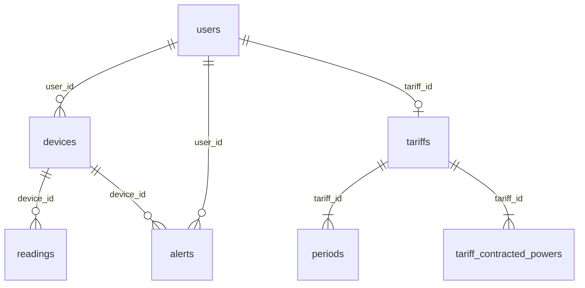
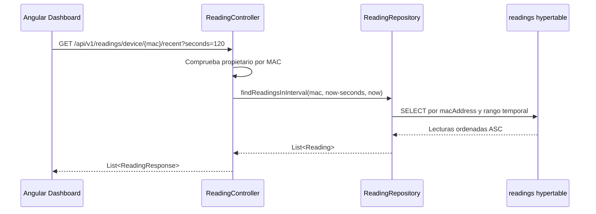

# Anexo D. TimescaleDB: hypertables y consultas analíticas

Este anexo documenta la estructura de datos relacionada con telemetría, tarifas y analítica. La base usa PostgreSQL 17 con extensión TimescaleDB mediante la imagen `timescale/timescaledb-ha:pg17`.

## D.1. Idea general

El proyecto usa TimescaleDB de forma concreta: la tabla `readings` se convierte en hypertable particionada por tiempo. El resto de tablas son relacionales normales gestionadas por Hibernate y reforzadas con scripts SQL.

La consecuencia práctica es clara:

- TimescaleDB organiza mejor el almacenamiento temporal de lecturas.
- Las analíticas actuales no usan todavía funciones como `time_bucket`.
- El cálculo de coste y consumo fantasma se hace en Java leyendo filas crudas.

## D.2. Creación de extensiones e hypertable

El orden esperado de scripts es:

| Orden | Archivo | Función |
| --- | --- | --- |
| 1 | `backend/src/main/resources/db/dev-seed/00-extensions.sql` | Activa extensiones necesarias. |
| 2 | `backend/src/main/resources/db/dev-seed/01-hypertable.sql` | Convierte `readings` en hypertable. |
| 3 | `backend/src/main/resources/db/tariffs-td-schema.sql` | Añade constraints e índices de tarifas TD. |
| 4 | `backend/src/main/resources/db/seed-tariff-calendar-slots.sql` | Inserta calendario horario regulatorio. |

`01-hypertable.sql` contiene:

```sql
SELECT create_hypertable('readings', 'time');
```

El propio script avisa de que debe ejecutarse con la tabla vacía. Si ya hay lecturas, la alternativa documentada es:

```sql
SELECT create_hypertable('readings', 'time', migrate_data => true);
```

## D.3. Tabla `readings`

**Entidad:** `entities/Reading.java`
**Clave compuesta:** `entities/ReadingId.java`

| Columna | Tipo lógico | Descripción |
| --- | --- | --- |
| `time` | `Instant` / `timestamptz` | Marca temporal de lectura y columna de partición. |
| `device_id` | FK a `devices.id` | Dispositivo que generó la lectura. |
| `power_w` | `BigDecimal(10,2)` | Potencia instantánea en vatios. |
| `energy_total_kwh` | `BigDecimal(14,4)` | Energía acumulada en kWh. |
| `is_on` | `Boolean` | Estado del enchufe. |

La PK compuesta `(time, device_id)` evita duplicar una lectura del mismo dispositivo en el mismo instante. También obliga a incluir `time` en la clave, algo compatible con las restricciones de TimescaleDB.

## D.4. Modelo relacional alrededor de la telemetría



### D.4.1. `devices`

| Columna | Descripción |
| --- | --- |
| `id` | PK. |
| `user_id` | FK nullable a `users`. Puede ser `null` si el dispositivo se crea automáticamente desde MQTT. |
| `name` | Nombre visible. |
| `mac_address` | MAC única del dispositivo. |
| `is_on` | Estado actual. |
| `is_simulated` | Indica si genera lecturas por simulador. |
| `simulation_profile` | Perfil de consumo simulado. |

### D.4.2. `users`

| Columna | Descripción |
| --- | --- |
| `id` | PK. |
| `username` | Email/login, único. |
| `password` | Hash BCrypt. |
| `role` | `ROLE_USER` o `ROLE_ADMIN`. |
| `active` | Cuenta habilitada. |
| `tariff_id` | FK opcional a la tarifa privada del usuario. |

### D.4.3. `tariffs`, `periods` y `tariff_contracted_powers`

`tariffs` representa un contrato o plantilla. Los precios no están como columnas fijas, sino en tablas hijas:

| Tabla | Propósito |
| --- | --- |
| `tariffs` | Datos generales: nombre, mercado, compañía, peaje y zona. |
| `periods` | Precio €/kWh por periodo `P1` a `P6`. |
| `tariff_contracted_powers` | Potencia contratada en kW por periodo. |

Este diseño evita añadir columnas como `price_p1`, `price_p2`, etc. También permite trabajar con tarifas 2.0TD, 3.0TD y futuras variantes con más periodos.

### D.4.4. `tariff_calendar_slots`

`tariff_calendar_slots` es una dimensión regulatoria global. No pertenece a un usuario concreto.

| Columna | Descripción |
| --- | --- |
| `access_tariff_code` | Peaje: `2.0TD`, `3.0TD`, `6.1TD`, `6.2TD`. |
| `geographic_zone` | Zona: `PENINSULA`, `CANARIAS`, `ISLAS_BALEARES`, `CEUTA`, `MELILLA`. |
| `month_number` | Mes del año. |
| `season_code` | Temporada regulatoria. |
| `day_type` | Tipo de día: `A`, `B`, `B1`, `C`, `D`. |
| `period_code` | Periodo `P1` a `P6`. |
| `start_time`, `end_time` | Intervalo horario. |

El seed actual cubre `2.0TD` y `3.0TD` para `PENINSULA` e `ISLAS_BALEARES`.

## D.5. Índices y constraints SQL

`tariffs-td-schema.sql` añade:

| Objeto | Columnas | Intención |
| --- | --- | --- |
| `chk_tariffs_access_tariff_code` | `access_tariff_code` | Limitar peajes válidos. |
| `chk_tariffs_geographic_zone` | `geographic_zone` | Limitar zonas válidas. |
| `chk_periods_period_code` | `period_code` | Limitar periodos P1-P6. |
| `ux_periods_tariff_period_code` | `(tariff_id, period_code)` | Evitar duplicar precio por periodo en una tarifa. |
| `chk_tariff_contracted_powers_positive` | `contracted_power_kw` | Evitar potencias negativas o cero. |
| `ix_tariff_contracted_powers_tariff_id` | `tariff_id` | Acelerar búsqueda de potencias por tarifa. |
| `ux_tariff_calendar_slots_lookup` | peaje, zona, mes, tipo de día, inicio y fin | Evitar duplicar franjas horarias. |
| `ix_tariff_calendar_slots_period_code` | peaje, zona, mes, tipo de día, periodo | Acelerar resolución por periodo. |

No hay en el código actual un índice explícito `(device_id, time DESC)` sobre `readings`. Sería recomendable para consultas recientes por dispositivo.

## D.6. Repositorios de lectura y analítica

### D.6.1. `ReadingRepository`

**Archivo:** `repositories/ReadingRepository.java`

| Método | Consulta | Uso |
| --- | --- | --- |
| `findFirstByDeviceMacAddressOrderByTimeDesc` | Derivada por Spring Data | Última lectura de una MAC. |
| `findByTimeAndDeviceMacAddress` | Derivada por Spring Data | Búsqueda por clave lógica. |
| `findReadingsInInterval` | JPQL | Lecturas de una MAC entre `start` y `end`, ordenadas ascendente. |
| `deleteByTimeAndDeviceMacAddress` | JPQL `DELETE` | Borrado puntual. |
| `deleteAllByDeviceMacAddress` | JPQL `DELETE` | Limpieza al borrar dispositivo. |

Consulta JPQL principal:

```java
@Query("SELECT r FROM Reading r WHERE r.device.macAddress = :macAddress " +
       "AND r.time >= :start AND r.time <= :end ORDER BY r.time ASC")
List<Reading> findReadingsInInterval(...);
```

No hay `nativeQuery`, `time_bucket`, `avg`, `min`, `max` ni `count` aplicados a `readings`.

### D.6.2. `TariffCalendarSlotRepository`

Resuelve un instante local a un periodo tarifario:

```java
SELECT cs.periodCode FROM TariffCalendarSlot cs
WHERE cs.accessTariffCode = :accessTariffCode
  AND cs.geographicZone = :zone
  AND cs.monthNumber = :month
  AND cs.dayType = :dayType
  AND (
        (cs.startTime <> cs.endTime AND cs.startTime <= :localTime AND cs.endTime > :localTime)
        OR
        (cs.startTime = cs.endTime AND cs.dayType = 'D')
        OR (cs.endTime = :endOfDay AND :localTime >= cs.startTime)
      )
```

Esta consulta contiene lógica para cubrir días tipo `D` y franjas que llegan al final del día, ya que PostgreSQL `TIME` no trabaja con `24:00` como una hora normal.

## D.7. Analíticas implementadas

### D.7.1. Coste energético

**Servicio:** `services/ConsumptionService.java`
**Endpoint:** `GET /api/v1/analytics/cost`

Algoritmo:

1. Carga todas las lecturas del dispositivo entre `start` y `end`.
2. Recorre las lecturas por parejas.
3. Calcula el delta de `energy_total_kwh`.
4. Resuelve el periodo tarifario de la lectura.
5. Busca el precio `price_kwh`.
6. Suma `delta_kwh * price_kwh`.

Pseudocódigo:

```text
total = 0
para cada par lectura_anterior, lectura_actual:
    delta = lectura_actual.energyTotalKwh - lectura_anterior.energyTotalKwh
    periodo = resolverPeriodo(lectura_actual.time, tarifa)
    precio = buscarPrecio(periodo)
    total += delta * precio
```

La decisión de usar el odómetro acumulado (`energy_total_kwh`) es correcta porque evita estimar energía solo desde potencia instantánea. Aun así, si el dispositivo reinicia su contador, el servicio debe ignorar o controlar deltas negativos.

### D.7.2. Consumo fantasma

**Servicio:** `ConsumptionService.calculateGhostCost`
**Endpoint:** `GET /api/v1/analytics/ghost-consumption`

Usa el mismo enfoque que el coste total, pero solo considera lecturas dentro de la franja nocturna `00:00` a `05:59` en hora local. La intención es detectar consumo fuera de horario productivo.

### D.7.3. Coste instantáneo

`calculateInstantaneousCost` calcula coste aproximado con:

```text
(powerW / 1000) * (seconds / 3600) * price_kwh
```

Esta fórmula sirve para estimar el coste de una ventana corta, aunque la analítica principal usa deltas de energía acumulada.

### D.7.4. Alertas de maxímetro

**Servicio:** `AlertService.checkPowerThreshold`

Flujo:

1. Convierte `power_w` a kW.
2. Resuelve el periodo actual con calendario TD.
3. Obtiene `contracted_power_kw`.
4. Si la potencia actual es mayor, crea alerta `OVERPOWER`.

Esta consulta no es una agregación histórica, sino una decisión instantánea sobre la lectura entrante.

## D.8. Flujo de datos desde la hypertable al frontend



Después de esa carga inicial, el dashboard se actualiza por WebSocket. Así no necesita repetir la consulta cada pocos segundos.

## D.9. Consultas TimescaleDB recomendables para evolución

Estas consultas no están implementadas todavía, pero encajan con el modelo actual:

### D.9.1. Potencia media por minuto

```sql
SELECT
  time_bucket('1 minute', r.time) AS bucket,
  AVG(r.power_w) AS avg_power_w
FROM readings r
JOIN devices d ON d.id = r.device_id
WHERE d.mac_address = :macAddress
  AND r.time BETWEEN :start AND :end
GROUP BY bucket
ORDER BY bucket;
```

Serviría para pintar gráficos históricos sin enviar miles de puntos al navegador.

### D.9.2. Última lectura por dispositivo

```sql
SELECT DISTINCT ON (d.mac_address)
  d.mac_address,
  r.time,
  r.power_w,
  r.energy_total_kwh,
  r.is_on
FROM readings r
JOIN devices d ON d.id = r.device_id
WHERE d.user_id = :userId
ORDER BY d.mac_address, r.time DESC;
```

Podría sustituir parte del filtrado en memoria de `ReadingService.listByUsername()`.

### D.9.3. Índice recomendado

```sql
CREATE INDEX IF NOT EXISTS ix_readings_device_time_desc
  ON readings (device_id, time DESC);
```

Este índice favorecería las consultas más frecuentes: últimas lecturas y rangos recientes por dispositivo.

## D.10. Límites técnicos actuales

| Área | Límite |
| --- | --- |
| Hypertable | Solo se particiona por `time`, sin dimensión por dispositivo. |
| Agregaciones | No hay `time_bucket` ni continuous aggregates. |
| Retención | No hay políticas de borrado automático de lecturas antiguas. |
| Compresión | No hay compresión TimescaleDB configurada. |
| Repositorio | `ReadingRepository` está tipado como `JpaRepository<Reading, Long>` aunque la clave real es compuesta. |
| Escalabilidad | `ReadingService.listByUsername()` usa `findAll()` y filtra en memoria. |
| Migraciones | No hay Flyway/Liquibase; se combina `ddl-auto=update` con scripts manuales. |

## D.11. Conclusión técnica

TimescaleDB ya aporta una base adecuada para almacenar telemetría como serie temporal, pero el proyecto todavía usa la tabla `readings` casi como una tabla PostgreSQL convencional. Para el MVP es suficiente porque el volumen de datos es limitado y permite centrarse en la lógica de negocio. Para una versión con más dispositivos, lo natural sería mover agregaciones al motor de base de datos, añadir índices específicos y crear vistas agregadas para el dashboard.
