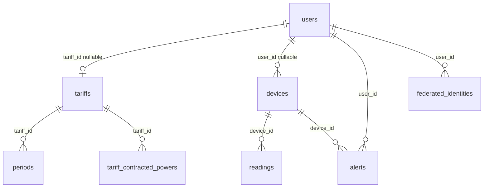

# Anexo D. TimescaleDB, modelo relacional y consultas analiticas

## 1. Vision general

Wattimizer usa PostgreSQL con TimescaleDB para almacenar informacion relacional y lecturas de telemetria. El esquema base se crea con Hibernate (`spring.jpa.hibernate.ddl-auto=update`) y se completa con scripts SQL versionados en `backend/src/main/resources/db`.

La decision de diseno es mixta:

- JPA crea entidades, relaciones y columnas principales.
- SQL manual crea extension TimescaleDB, hypertable, constraints regulatorios e indices que Hibernate no expresa bien.

Esto encaja con el proyecto porque se mantiene la comodidad de JPA para el codigo Java, pero se aprovecha TimescaleDB donde realmente aporta valor: la tabla temporal `readings`.

## 2. Entidades y tablas principales



| Tabla | Origen | Clave primaria | Relaciones |
|---|---|---|---|
| `users` | `UserEntity` | `id` heredado de `BaseEntity` | `tariff_id` nullable hacia `tariffs` |
| `devices` | `Device` | `id` heredado | `user_id` nullable hacia `users` |
| `readings` | `Reading` | compuesta `(time, device_id)` | `device_id` hacia `devices` |
| `alerts` | `Alert` | `id` heredado | `user_id` y `device_id` |
| `tariffs` | `Tariff` | `id` heredado | padre de periodos y potencias |
| `periods` | `Period` | `id` heredado | `tariff_id` hacia `tariffs` |
| `tariff_contracted_powers` | `TariffContractedPower` | `id` heredado | `tariff_id` hacia `tariffs` |
| `tariff_calendar_slots` | `TariffCalendarSlot` | `id` heredado | tabla global sin FK a `tariffs` |
| `federated_identities` | `FederatedIdentity` | `id` heredado | `user_id` hacia `users` |

## 3. Campos relevantes por tabla

### 3.1. `users`

Campos principales:

- `username`: unico y obligatorio.
- `password`: obligatorio.
- `role`: enum como texto (`ROLE_USER`, `ROLE_ADMIN`).
- `active`: indica si la cuenta esta habilitada.
- `tariff_id`: contrato privado actual del usuario, nullable.

`UserEntity` implementa `UserDetails`, por lo que Spring Security puede usarlo directamente como usuario autenticable.

### 3.2. `devices`

Campos:

- `name`: nombre visible.
- `mac_address`: unico y obligatorio.
- `is_on`: estado logico del enchufe.
- `is_simulated`: indica si el dispositivo lo genera el backend.
- `simulation_profile`: perfil usado por simuladores.
- `user_id`: propietario; puede ser nulo para dispositivos no reclamados.

El campo `is_simulated` incluye `columnDefinition = "boolean default false"` para que Hibernate pueda anadirlo sobre filas existentes sin romper datos previos.

### 3.3. `readings`

Entidad:

```java
@Table(name = "readings")
@IdClass(ReadingId.class)
public class Reading {
    @Id
    private Instant time;

    @Id
    @ManyToOne(fetch = FetchType.LAZY)
    @JoinColumn(name = "device_id", nullable = false)
    private Device device;

    @Column(name = "power_w", precision = 10, scale = 2)
    private BigDecimal powerW;

    @Column(name = "energy_total_kwh", precision = 14, scale = 4)
    private BigDecimal energyTotalKwh;

    @Column(name = "is_on")
    private Boolean isOn;
}
```

La clave compuesta evita dos lecturas iguales para el mismo dispositivo en el mismo instante. La columna `time` se usa tambien como dimension temporal de TimescaleDB.

### 3.4. `tariffs`, `periods` y `tariff_contracted_powers`

`Tariff` guarda los datos generales:

- `name`
- `market`
- `access_tariff_code`
- `geographic_zone`
- `energy_company`

`periods` guarda precio de energia por periodo:

- `period_code`
- `price_kwh`

`tariff_contracted_powers` guarda potencia contratada:

- `period_code`
- `contracted_power_kw`

La separacion entre precio y potencia evita mezclar dos conceptos electricos distintos. El coste usa `price_kwh`; las alertas de maximetro usan `contracted_power_kw`.

### 3.5. `tariff_calendar_slots`

Tabla global de calendario regulatorio:

- `access_tariff_code`
- `geographic_zone`
- `month_number`
- `season_code`
- `day_type`
- `period_code`
- `start_time`
- `end_time`

No apunta por FK a una tarifa concreta porque representa reglas generales del mercado electrico. Despues cada contrato se enlaza por `access_tariff_code` y `geographic_zone`.

## 4. Hypertable de TimescaleDB

Script: `backend/src/main/resources/db/dev-seed/01-hypertable.sql`

```sql
SELECT create_hypertable('readings', 'time');
```

| Aspecto | Valor |
|---|---|
| Hypertable | `readings` |
| Columna temporal | `time` |
| Requisito | La tabla debe existir y estar vacia |
| Extension previa | `CREATE EXTENSION IF NOT EXISTS timescaledb` |
| Chunks | Gestionados automaticamente por TimescaleDB |
| Retencion | No configurada en el repositorio |
| Compresion | No configurada en el repositorio |

Orden correcto:

1. Arranca el backend para que Hibernate cree `readings`.
2. Ejecuta `00-extensions.sql`.
3. Ejecuta `01-hypertable.sql` antes de recibir datos.

Si la tabla ya tuviera filas, el propio script documenta la alternativa:

```sql
SELECT create_hypertable('readings', 'time', migrate_data => true);
```

## 5. Constraints e indices SQL

Script: `backend/src/main/resources/db/tariffs-td-schema.sql`

### 5.1. `tariffs`

```sql
CHECK (access_tariff_code IN ('2.0TD', '3.0TD', '6.1TD', '6.2TD'))
CHECK (geographic_zone IN ('PENINSULA', 'CANARIAS', 'ISLAS_BALEARES', 'CEUTA', 'MELILLA'))
```

Tambien elimina columnas antiguas si existieran:

- `type`
- `contracted_power_kw`

### 5.2. `periods`

```sql
CHECK (period_code IN ('P1', 'P2', 'P3', 'P4', 'P5', 'P6'))
CREATE UNIQUE INDEX ux_periods_tariff_period_code
  ON periods (tariff_id, period_code);
```

### 5.3. `tariff_contracted_powers`

```sql
CHECK (period_code IN ('P1', 'P2', 'P3', 'P4', 'P5', 'P6'))
CHECK (contracted_power_kw > 0)
CREATE INDEX ix_tariff_contracted_powers_tariff_id
  ON tariff_contracted_powers (tariff_id);
```

### 5.4. `tariff_calendar_slots`

Constraints:

- peaje permitido;
- zona geografica permitida;
- mes entre 1 y 12;
- temporada `HIGH`, `MID_HIGH`, `MID`, `LOW`;
- tipo de dia `A`, `B`, `B1`, `C`, `D`;
- periodo `P1` a `P6`.

Indices:

```sql
CREATE UNIQUE INDEX ux_tariff_calendar_slots_lookup
  ON tariff_calendar_slots (
    access_tariff_code, geographic_zone, month_number, day_type, start_time, end_time
  );

CREATE INDEX ix_tariff_calendar_slots_period_code
  ON tariff_calendar_slots (
    access_tariff_code, geographic_zone, month_number, day_type, period_code
  );
```

## 6. Consultas reales en repositorios

### 6.1. `ReadingRepository`

Archivo: `backend/src/main/java/.../repositories/ReadingRepository.java`

| Metodo | Tipo | Uso |
|---|---|---|
| `findFirstByDeviceMacAddressOrderByTimeDesc` | Derived query | Obtener ultima lectura por MAC. |
| `findByTimeAndDeviceMacAddress` | Derived query | Buscar lectura por clave compuesta funcional. |
| `findReadingsInInterval` | JPQL | Recuperar lecturas entre `start` y `end`. |
| `deleteByTimeAndDeviceMacAddress` | JPQL `DELETE` | Borrar una lectura concreta. |
| `deleteAllByDeviceMacAddress` | JPQL `DELETE` | Limpiar lecturas antes de borrar dispositivo. |

Consulta de intervalo:

```java
@Query("SELECT r FROM Reading r WHERE r.device.macAddress = :macAddress " +
       "AND r.time >= :start AND r.time <= :end ORDER BY r.time ASC")
List<Reading> findReadingsInInterval(...)
```

No se usa `time_bucket` en el codigo actual. Las lecturas se traen ordenadas y el calculo se hace en Java.

### 6.2. `TariffCalendarSlotRepository`

Este repositorio resuelve el periodo aplicable segun:

- peaje;
- zona geografica;
- mes;
- tipo de dia;
- hora local.

Es una pieza necesaria para que `ConsumptionService` sepa si una lectura cae en P1, P2, P3, etc.

## 7. Analitica de consumo

Clase: `ConsumptionService`

### 7.1. Coste por intervalo

Metodo:

```java
calculateCostInPeriod(String macAddress, Instant start, Instant end)
```

Algoritmo:

1. Carga lecturas del intervalo ordenadas por tiempo.
2. Si hay menos de dos lecturas, devuelve cero.
3. Busca el dispositivo y su tarifa.
4. Recorre pares consecutivos.
5. Calcula delta positivo de `energyTotalKwh`.
6. Resuelve el periodo tarifario para el instante actual.
7. Multiplica delta por `priceKwh`.
8. Devuelve el total con escala 2.

La funcion privada `calculatePositiveDelta` descarta deltas nulos, negativos o con valores nulos. Esto evita errores cuando un Shelly reinicia su odometro.

### 7.2. Consumo fantasma

Metodo:

```java
calculateGhostCost(String macAddress, Instant start, Instant end)
```

Usa la misma base de calculo, pero solo incluye lecturas cuya hora local esta entre 00:00 y 05:59:

```java
int hour = instant.atZone(zoneId).getHour();
return hour >= 0 && hour < 6;
```

La zona horaria se resuelve con `CalendarResolverService`. Esto evita interpretar mal lecturas de Canarias como si estuvieran en horario peninsular.

### 7.3. Coste instantaneo

Metodo:

```java
calculateInstantaneousCost(String macAddress, double powerW, int durationSeconds)
```

Formula:

```text
energia_kWh = (powerW / 1000) * (durationSeconds / 3600)
coste = energia_kWh * priceKwh
```

Devuelve seis decimales. Este metodo resulta util para estimaciones rapidas sobre ventanas pequenas.

## 8. Alertas analiticas

`AlertService.checkPowerThreshold(reading)` se invoca tras cada lectura MQTT o simulada.

Flujo:

1. Obtiene usuario y tarifa desde el dispositivo de la lectura.
2. Resuelve periodo con `CalendarResolverService`.
3. Busca potencia contratada para ese periodo.
4. Convierte `power_w` a kW.
5. Si supera el limite, guarda alerta.

Tabla implicada:

| Campo | Uso |
|---|---|
| `alerts.type` | Tipo de incidencia, por ejemplo `OVERPOWER`. |
| `alerts.message` | Texto mostrado al usuario. |
| `alerts.user_id` | Propietario de la alerta. |
| `alerts.device_id` | Dispositivo que origino la alerta. |

## 9. Seeds y scripts de produccion

### 9.1. Extensiones

`00-extensions.sql`:

```sql
CREATE EXTENSION IF NOT EXISTS timescaledb;
CREATE EXTENSION IF NOT EXISTS pgcrypto;
```

`pgcrypto` se usa en seeds de desarrollo para generar hashes bcrypt.

### 9.2. Calendario tarifario

`seed-tariff-calendar-slots.sql` carga filas del calendario TD. Segun la documentacion de despliegue, cubre combinaciones de `2.0TD` y `3.0TD` para `PENINSULA` e `ISLAS_BALEARES`.

El seed usa `ON CONFLICT DO NOTHING`, por lo que se puede relanzar sin duplicar filas.

### 9.3. Seeds de desarrollo

| Script | Contenido |
|---|---|
| `03-seed-users-dev.sql` | Usuarios `admin@wattimizer.dev` y `user@wattimizer.dev`. |
| `04-seed-device-shelly.sql` | Shelly real con MAC `9070694d3590`. |
| `05-seed-device-simulation.sql` | Dispositivos simulados `SIM000000001` a `SIM000000009`. |

### 9.4. Resincronizacion de secuencias

`prod/99-resync-sequences.sql` ajusta secuencias a `MAX(id)` tras cargar datos manuales. No incluye `readings` porque esa tabla no usa secuencia: su PK es compuesta.

## 10. Orden operativo recomendado

Para una base limpia:

```text
1. Arrancar backend para crear tablas con Hibernate.
2. Ejecutar 00-extensions.sql.
3. Ejecutar 01-hypertable.sql antes de recibir telemetria.
4. Ejecutar tariffs-td-schema.sql.
5. Ejecutar seed-tariff-calendar-slots.sql.
6. Ejecutar seeds de desarrollo solo en entorno local.
7. Ejecutar prod/99-resync-sequences.sql en produccion.
```

## 11. Limitaciones tecnicas

| Tema | Estado actual | Impacto |
|---|---|---|
| `time_bucket` | No se usa en repositorios. | Para intervalos largos se cargan muchas lecturas en Java. |
| Retencion | No hay politica TimescaleDB. | La tabla `readings` puede crecer indefinidamente. |
| Compresion | No configurada. | Se pierde optimizacion de almacenamiento historico. |
| PK generica repositorio | `ReadingRepository extends JpaRepository<Reading, Long>`. | La entidad usa PK compuesta; seria mas correcto usar `ReadingId`. |
| Calendario incompleto | Seeds centrados en 2.0TD/3.0TD para Peninsula/Baleares. | Otras zonas pueden no resolver periodo si no se cargan datos. |
| Borrado en BD | No hay `ON DELETE CASCADE`. | El servicio debe borrar lecturas y alertas antes del dispositivo. |

## 12. Consultas SQL utiles para verificacion

Comprobar hypertable:

```sql
SELECT hypertable_name, num_chunks
FROM timescaledb_information.hypertables;
```

Ver ultimas lecturas de un dispositivo:

```sql
SELECT r.time, d.mac_address, r.power_w, r.energy_total_kwh, r.is_on
FROM readings r
JOIN devices d ON d.id = r.device_id
WHERE d.mac_address = '9070694d3590'
ORDER BY r.time DESC
LIMIT 20;
```

Comprobar calendario cargado:

```sql
SELECT access_tariff_code, geographic_zone, COUNT(*) AS slots
FROM tariff_calendar_slots
GROUP BY access_tariff_code, geographic_zone
ORDER BY access_tariff_code, geographic_zone;
```

Detectar dispositivos simulados:

```sql
SELECT id, name, mac_address, simulation_profile, is_on
FROM devices
WHERE is_simulated = true
ORDER BY id;
```

Estas consultas no aparecen como repositorios del backend; son utiles para administracion y defensa tecnica del proyecto.
