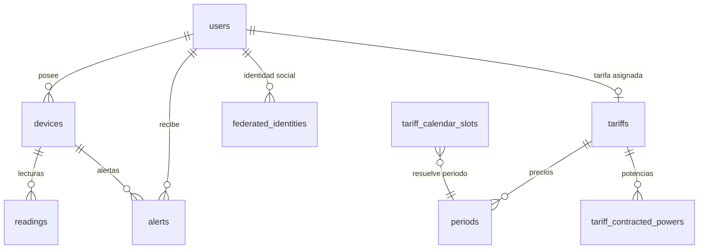
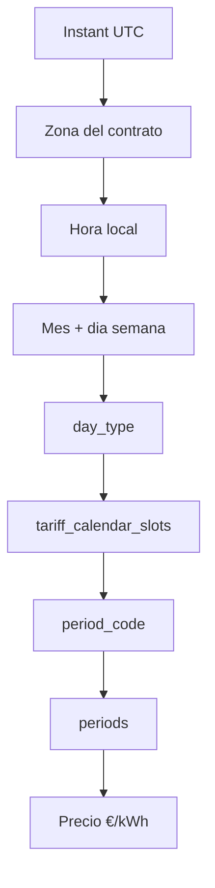

# Anexo D. TimescaleDB, modelo de datos y consultas analíticas

## 1. Visión general

Wattimizer usa PostgreSQL como base relacional y TimescaleDB para almacenar la telemetría eléctrica como serie temporal. La tabla clave es `readings`, convertida en hypertable por la columna `time`.

El esquema se crea de forma mixta:

- Hibernate crea y actualiza tablas mediante `spring.jpa.hibernate.ddl-auto=update`.
- Los scripts de `backend/src/main/resources/db/` añaden extensiones, hypertable, constraints, índices y datos semilla.

Esta decisión es pragmática: JPA gestiona bien entidades y relaciones, pero TimescaleDB y algunas restricciones SQL necesitan scripts explícitos.

## 2. Scripts SQL

| Archivo | Función |
| --- | --- |
| `db/dev-seed/00-extensions.sql` | Activa `timescaledb` y `pgcrypto`. |
| `db/dev-seed/01-hypertable.sql` | Convierte `readings` en hypertable. |
| `db/tariffs-td-schema.sql` | Añade columnas, constraints e índices de tarifas TD. |
| `db/seed-tariff-calendar-slots.sql` | Inserta calendario regulatorio por zona, mes, día y hora. |
| `db/dev-seed/03-seed-users-dev.sql` | Usuarios de desarrollo. |
| `db/dev-seed/04-seed-device-shelly.sql` | Dispositivo Shelly físico de desarrollo. |
| `db/dev-seed/05-seed-device-simulation.sql` | Dispositivos simulados. |
| `db/prod/99-resync-sequences.sql` | Resincroniza secuencias tras cargar seeds. |

Orden recomendado:

```text
00-extensions.sql
01-hypertable.sql
tariffs-td-schema.sql
seed-tariff-calendar-slots.sql
03-seed-users-dev.sql
04-seed-device-shelly.sql
05-seed-device-simulation.sql
99-resync-sequences.sql
```

Los seeds de desarrollo no son obligatorios en producción, pero sirven para levantar una demo local.

## 3. Hypertable `readings`

**Script:** `backend/src/main/resources/db/dev-seed/01-hypertable.sql`

```sql
SELECT create_hypertable('readings', 'time');
```

La tabla debe estar vacía al ejecutar el script. Si ya tuviese datos, el propio script deja indicada la alternativa:

```sql
SELECT create_hypertable('readings', 'time', migrate_data => true);
```

### 3.1. Entidad `Reading`

**Archivo:** `backend/src/main/java/com/joselumartos/jwtauthbackenddemo/entities/Reading.java`

```java
@Entity
@Table(name = "readings")
@IdClass(ReadingId.class)
public class Reading {
    @Id
    @Column(nullable = false, updatable = false)
    private Instant time;

    @Id
    @ManyToOne(fetch = FetchType.LAZY)
    @JoinColumn(name = "device_id", nullable = false)
    private Device device;

    @Column(name = "power_w", precision = 10, scale = 2)
    private BigDecimal powerW;

    @Column(name = "energy_total_kwh", precision = 14, scale = 4)
    private BigDecimal energyTotalKwh;

    @Column(name = "is_on")
    private Boolean isOn;
}
```

La clave primaria compuesta es `(time, device_id)`. Esto encaja con una serie temporal porque una lectura siempre pertenece a un dispositivo y a un instante concreto.

### 3.2. Columnas principales

| Columna | Tipo lógico | Uso |
| --- | --- | --- |
| `time` | `Instant` | Eje temporal de TimescaleDB. |
| `device_id` | FK a `devices` | Identifica el dispositivo. |
| `power_w` | `BigDecimal` | Potencia instantánea en vatios. |
| `energy_total_kwh` | `BigDecimal` | Energía acumulada del odómetro. |
| `is_on` | Booleano | Estado encendido/apagado. |

`energy_total_kwh` es más útil para coste que `power_w`, porque permite calcular el consumo real por diferencia entre lecturas consecutivas.

## 4. Modelo relacional



### 4.1. Tablas principales

| Tabla | Entidad | Descripción |
| --- | --- | --- |
| `users` | `UserEntity` | Usuarios, roles y datos de autenticación. |
| `federated_identities` | `FederatedIdentity` | Enlaces OAuth2 Google/GitHub. |
| `devices` | `Device` | Dispositivos físicos y simulados. |
| `readings` | `Reading` | Telemetría temporal. |
| `tariffs` | `Tariff` | Tarifas del catálogo y tarifas privadas. |
| `periods` | `Period` | Precio de energía por periodo. |
| `tariff_contracted_powers` | `TariffContractedPower` | Potencia contratada por periodo. |
| `tariff_calendar_slots` | `TariffCalendarSlot` | Tabla regulatoria para resolver P1-P6. |
| `alerts` | `Alert` | Alertas de maxímetro. |

## 5. Tarifas y calendario regulatorio

### 5.1. `Tariff`

**Archivo:** `backend/src/main/java/com/joselumartos/jwtauthbackenddemo/entities/Tariff.java`

Campos importantes:

| Campo | Significado |
| --- | --- |
| `name` | Nombre visible de la tarifa. |
| `market` | Mercado libre o regulado. |
| `accessTariffCode` | Peaje: `2.0TD`, `3.0TD`, `6.1TD`, `6.2TD`. |
| `geographicZone` | Zona: Península, Canarias, Baleares, Ceuta o Melilla. |
| `energyCompany` | Comercializadora. |
| `periods` | Precios €/kWh por periodo. |
| `contractedPowers` | Potencias contratadas por periodo. |

### 5.2. `TariffCalendarSlot`

**Archivo:** `backend/src/main/java/com/joselumartos/jwtauthbackenddemo/entities/TariffCalendarSlot.java`

Esta tabla no pertenece a un usuario. Es una dimensión global que traduce:

```text
peaje + zona + mes + tipo de día + hora local -> periodo P1-P6
```

Columnas:

| Columna | Uso |
| --- | --- |
| `access_tariff_code` | Distingue 2.0TD, 3.0TD, 6.1TD y 6.2TD. |
| `geographic_zone` | Zona eléctrica. |
| `month_number` | Mes 1-12. |
| `season_code` | Temporada regulatoria. |
| `day_type` | Tipo A, B, B1, C o D. |
| `period_code` | P1-P6. |
| `start_time`, `end_time` | Intervalo horario semiabierto. |

El índice único principal está en `tariffs-td-schema.sql`:

```sql
CREATE UNIQUE INDEX IF NOT EXISTS ux_tariff_calendar_slots_lookup
  ON tariff_calendar_slots (
    access_tariff_code, geographic_zone, month_number, day_type, start_time, end_time
  );
```

## 6. Repositorios y consultas

### 6.1. `ReadingRepository`

**Archivo:** `backend/src/main/java/com/joselumartos/jwtauthbackenddemo/repositories/ReadingRepository.java`

Consulta principal:

```java
@Query("SELECT r FROM Reading r WHERE r.device.macAddress = :macAddress " +
       "AND r.time >= :start AND r.time <= :end ORDER BY r.time ASC")
List<Reading> findReadingsInInterval(
    @Param("macAddress") String macAddress,
    @Param("start") Instant start,
    @Param("end") Instant end
);
```

Esta consulta alimenta:

- Histórico reciente del dashboard.
- Cálculo de coste por intervalo.
- Cálculo de consumo fantasma.

También existen:

| Método | Uso |
| --- | --- |
| `findFirstByDeviceMacAddressOrderByTimeDesc` | Última lectura de un dispositivo. |
| `findByTimeAndDeviceMacAddress` | Búsqueda por clave compuesta. |
| `deleteByTimeAndDeviceMacAddress` | Borrado de una lectura concreta. |
| `deleteAllByDeviceMacAddress` | Limpieza de lecturas al borrar dispositivo. |

### 6.2. `TariffCalendarSlotRepository`

**Archivo:** `backend/src/main/java/com/joselumartos/jwtauthbackenddemo/repositories/TariffCalendarSlotRepository.java`

`findPeriodCode` resuelve el periodo aplicable:

```java
SELECT cs.periodCode FROM TariffCalendarSlot cs
WHERE cs.accessTariffCode = :accessTariffCode
  AND cs.geographicZone   = :zone
  AND cs.monthNumber      = :month
  AND cs.dayType          = :dayType
  AND (
        (cs.startTime <> cs.endTime AND cs.startTime <= :localTime AND cs.endTime > :localTime)
        OR
        (cs.startTime = cs.endTime AND cs.dayType = 'D')
        OR (cs.endTime = :endOfDay AND :localTime >= cs.startTime)
      )
```

`findWorkdayType` obtiene el tipo de día laborable para peaje, zona y mes:

```java
SELECT DISTINCT cs.dayType FROM TariffCalendarSlot cs
WHERE cs.accessTariffCode = :accessTariffCode
  AND cs.geographicZone   = :zone
  AND cs.monthNumber      = :month
  AND cs.dayType          <> 'D'
```

## 7. Resolución de periodo eléctrico

**Archivo:** `backend/src/main/java/com/joselumartos/jwtauthbackenddemo/services/CalendarResolverService.java`

El servicio convierte un `Instant` en un periodo de tarifa concreto.



Decisiones:

- Canarias usa `Atlantic/Canary`.
- El resto de zonas usa `Europe/Madrid`.
- Sábados y domingos son tipo `D`.
- Si falta seed de calendario, se devuelve `Optional.empty()` y los servicios calculan coste `0` en modo degradado.

## 8. Cálculo de coste energético

**Archivo:** `backend/src/main/java/com/joselumartos/jwtauthbackenddemo/services/ConsumptionService.java`

Endpoint consumidor:

```text
GET /api/v1/analytics/cost?macAddress=...&start=...&end=...
```

Algoritmo:

1. Busca lecturas del intervalo con `findReadingsInInterval`.
2. Si hay menos de dos lecturas, devuelve `0`.
3. Localiza el dispositivo y su tarifa.
4. Recorre lecturas ordenadas.
5. Calcula delta positivo:

```text
deltaKwh = lecturaActual.energyTotalKwh - lecturaAnterior.energyTotalKwh
```

6. Ignora deltas nulos, negativos o sin datos. Esto evita errores por reinicio de hardware.
7. Resuelve el periodo aplicable para el instante de la lectura actual.
8. Multiplica:

```text
costePaso = deltaKwh * precioKwhPeriodo
```

9. Suma todos los pasos y redondea a dos decimales.

La decisión de usar deltas de `energy_total_kwh` es más estable que integrar potencia instantánea, porque el contador acumulado representa mejor la energía real medida por el dispositivo.

## 9. Cálculo de consumo fantasma

Endpoint:

```text
GET /api/v1/analytics/ghost-consumption?macAddress=...&start=...&end=...
```

El consumo fantasma usa el mismo cálculo de coste, pero solo considera lecturas cuya hora local cae entre las 00:00 y las 05:59.

```java
int hour = instant.atZone(zoneId).getHour();
return hour >= 0 && hour < 6;
```

Es importante distinguir esto del periodo valle regulatorio. En el código, "fantasma" significa consumo en ventana nocturna de baja actividad del negocio, no necesariamente cualquier P6.

## 10. Alertas de maxímetro

**Archivo:** `backend/src/main/java/com/joselumartos/jwtauthbackenddemo/services/AlertService.java`

Cada lectura se comprueba así:

1. Se verifica que hay dispositivo, usuario, tarifa, potencia y fecha.
2. Se resuelve el periodo eléctrico aplicable.
3. Se busca la potencia contratada para ese periodo.
4. Se convierte la potencia de W a kW.
5. Si `powerKw > contractedPowerKw`, se crea alerta `OVERPOWER`.

```text
currentPowerKw = powerW / 1000
```

La alerta se guarda en `alerts` y se emite al topic:

```text
/topic/alerts/{username}
```

## 11. Qué usa TimescaleDB actualmente y qué no

Implementado:

- Extensión TimescaleDB.
- Hypertable `readings` por columna `time`.
- Consultas por rango temporal sobre `readings`.
- Almacenamiento de telemetría real y simulada.

No implementado todavía:

- `time_bucket()`.
- Continuous aggregates.
- Políticas de retención automática.
- Políticas de compresión.
- Jobs SQL de agregación periódica.

Esto no invalida el uso de TimescaleDB: el proyecto ya tiene la base preparada para series temporales. Aun así, las consultas analíticas actuales se resuelven con JPQL y lógica Java, no con funciones avanzadas de TimescaleDB.

## 12. Consultas útiles para administración

Ver hypertables:

```sql
SELECT hypertable_name, num_chunks
FROM timescaledb_information.hypertables;
```

Comprobar últimas lecturas:

```sql
SELECT r.time, d.mac_address, r.power_w, r.energy_total_kwh, r.is_on
FROM readings r
JOIN devices d ON d.id = r.device_id
ORDER BY r.time DESC
LIMIT 20;
```

Consultar slots de calendario para una zona:

```sql
SELECT access_tariff_code, geographic_zone, month_number, day_type,
       period_code, start_time, end_time
FROM tariff_calendar_slots
WHERE access_tariff_code = '3.0TD'
  AND geographic_zone = 'PENINSULA'
ORDER BY month_number, day_type, start_time;
```

Buscar dispositivos simulados:

```sql
SELECT id, name, mac_address, is_on, is_simulated, simulation_profile
FROM devices
WHERE is_simulated = true;
```

## 13. Riesgos y mejoras futuras

- La hypertable `readings` crecerá continuamente si no se añade retención.
- Las consultas de coste recorren lecturas en memoria; para ventanas grandes convendría preagregar.
- TimescaleDB permitiría continuous aggregates por hora o día para acelerar informes.
- La compresión de chunks antiguos reduciría almacenamiento.
- Para una instalación con muchos dispositivos físicos, convendría añadir índices específicos por `device_id` y `time` si el plan de ejecución lo necesitase.
