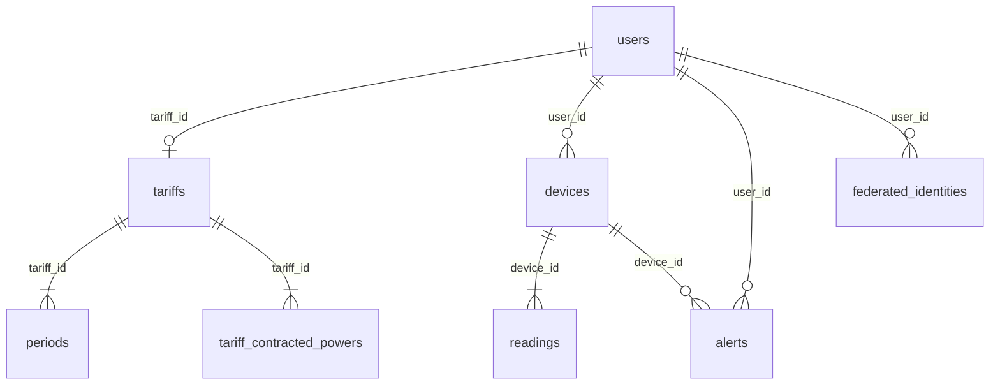
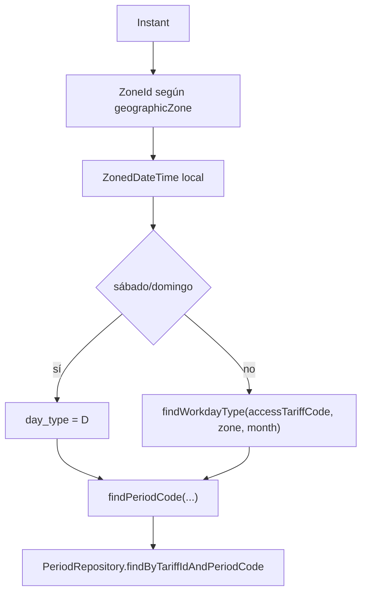

# Anexo D. TimescaleDB, tablas y analítica

## 1. Enfoque de persistencia

Wattimizer usa PostgreSQL con TimescaleDB para guardar lecturas IoT. El modelo
no se gestiona con Flyway o Liquibase. La estructura base la crea Hibernate con:

```properties
spring.jpa.hibernate.ddl-auto=update
```

Después se aplican scripts SQL para:

1. Activar la extensión TimescaleDB.
2. Convertir `readings` en hypertable.
3. Añadir restricciones que Hibernate no expresa.
4. Cargar el calendario tarifario.

Orden de referencia:

```text
backend/src/main/resources/db/dev-seed/00-extensions.sql
backend/src/main/resources/db/dev-seed/01-hypertable.sql
backend/src/main/resources/db/tariffs-td-schema.sql
backend/src/main/resources/db/seed-tariff-calendar-slots.sql
backend/src/main/resources/db/dev-seed/03-seed-users-dev.sql
backend/src/main/resources/db/dev-seed/04-seed-device-shelly.sql
backend/src/main/resources/db/dev-seed/05-seed-device-simulation.sql
backend/src/main/resources/db/prod/99-resync-sequences.sql
```

## 2. Modelo relacional



### 2.1. Tabla `users`

Representa las cuentas de la aplicación. `username` se usa como email y tiene
unicidad en base de datos. Puede tener una tarifa asociada mediante `tariff_id`.

Relaciones:

- Uno a muchos con `devices`.
- Uno a muchos con `alerts`.
- Uno a muchos con `federated_identities`.
- Muchos a uno opcional con `tariffs` para la tarifa privada activa.

### 2.2. Tabla `devices`

Entidad `Device`.

| Columna | Uso |
| --- | --- |
| `id` | Clave primaria autogenerada. |
| `user_id` | Usuario propietario; puede ser nulo en dispositivos no reclamados. |
| `name` | Nombre visible. |
| `mac_address` | MAC única del Shelly o MAC simulada `SIM...`. |
| `is_on` | Estado lógico usado por UI y simulación. |
| `is_simulated` | Distingue hardware real de simuladores. |
| `simulation_profile` | Perfil de consumo cuando `is_simulated=true`. |

El cambio reciente de simuladores añadió `simulation_profile` y el seed
`05-seed-device-simulation.sql`, que crea nueve dispositivos virtuales para
demo.

### 2.3. Tabla `readings`

Entidad `Reading`. Es la tabla temporal principal.

| Columna | Tipo lógico | Uso |
| --- | --- | --- |
| `time` | `Instant` | Instante de la lectura; parte de la clave. |
| `device_id` | FK a `devices` | Dispositivo; parte de la clave. |
| `power_w` | `NUMERIC(10,2)` | Potencia activa en vatios. |
| `energy_total_kwh` | `NUMERIC(14,4)` | Odómetro de energía acumulada. |
| `is_on` | boolean | Estado del equipo si el origen lo informa. |

La clave primaria es compuesta: `(time, device_id)`. En JPA se modela con
`@IdClass(ReadingId.class)`.

### 2.4. Tablas de tarifa

#### `tariffs`

| Columna | Uso |
| --- | --- |
| `id` | Clave primaria. |
| `name` | Nombre de la tarifa o contrato. |
| `market` | Mercado libre o regulado. |
| `access_tariff_code` | Peaje: `2.0TD`, `3.0TD`, `6.1TD`, `6.2TD`. |
| `geographic_zone` | Zona: `PENINSULA`, `CANARIAS`, `ISLAS_BALEARES`, `CEUTA`, `MELILLA`. |
| `energy_company` | Comercializadora. |

El script `tariffs-td-schema.sql` añade checks para peajes y zonas.

#### `periods`

Precios de energía por periodo.

| Columna | Uso |
| --- | --- |
| `tariff_id` | FK a `tariffs`. |
| `period_code` | P1-P6. |
| `price_kwh` | Precio en euros/kWh. |

Tiene índice único por `(tariff_id, period_code)`.

#### `tariff_contracted_powers`

Potencias contratadas por periodo.

| Columna | Uso |
| --- | --- |
| `tariff_id` | FK a `tariffs`. |
| `period_code` | P1-P6. |
| `contracted_power_kw` | Potencia contratada en kW. |

Se usa en `AlertService` para comprobar picos de potencia.

### 2.5. Tabla `tariff_calendar_slots`

Tabla global de calendario regulatorio. No pertenece a un usuario ni a una
tarifa concreta.

| Columna | Uso |
| --- | --- |
| `access_tariff_code` | Discrimina peajes. |
| `geographic_zone` | Zona eléctrica. |
| `month_number` | Mes 1-12. |
| `season_code` | Temporada: `HIGH`, `MID_HIGH`, `MID`, `LOW`. |
| `day_type` | Tipo de día: `A`, `B`, `B1`, `C`, `D`. |
| `period_code` | Resultado P1-P6. |
| `start_time` | Inicio del tramo horario. |
| `end_time` | Fin del tramo horario. |

El seed cubre:

| Dimensión | Cubierto |
| --- | --- |
| Peajes | `2.0TD`, `3.0TD` |
| Zonas | `PENINSULA`, `ISLAS_BALEARES` |
| Meses | 1-12 |
| Fines de semana | `day_type = 'D'` |

No modela festivos nacionales o autonómicos concretos. En Java, sábados y
domingos son tipo `D`; los laborables leen la temporada desde la tabla.

## 3. Hypertable TimescaleDB

La única hypertable del proyecto es `readings`.

Script:

```sql
SELECT create_hypertable('readings', 'time');
```

Datos clave:

| Aspecto | Valor |
| --- | --- |
| Tabla | `readings` |
| Columna temporal | `time` |
| Requisito | Ejecutar antes de que entren lecturas o usar `migrate_data => true`. |
| Extensión previa | `timescaledb` |

El script comenta que TimescaleDB gestionará chunks semanales automáticamente.
No hay políticas de compresión, retención ni agregados continuos en el código
actual.

## 4. Repositorios y consultas usadas

### 4.1. `ReadingRepository`

Consulta principal de analítica:

```java
@Query("SELECT r FROM Reading r WHERE r.device.macAddress = :macAddress " +
       "AND r.time >= :start AND r.time <= :end ORDER BY r.time ASC")
List<Reading> findReadingsInInterval(
        @Param("macAddress") String macAddress,
        @Param("start") Instant start,
        @Param("end") Instant end);
```

Aunque se consulta una hypertable, la query es JPQL. No usa `time_bucket`,
agregados de TimescaleDB ni SQL nativo. El beneficio de TimescaleDB queda en la
partición temporal y la gestión interna de chunks.

Otras consultas:

| Método | Uso |
| --- | --- |
| `findFirstByDeviceMacAddressOrderByTimeDesc` | Última lectura de un dispositivo. |
| `findByTimeAndDeviceMacAddress` | Lectura por clave compuesta lógica. |
| `deleteByTimeAndDeviceMacAddress` | Borrado de lectura concreta. |
| `deleteAllByDeviceMacAddress` | Limpieza de telemetría al borrar dispositivo. |

### 4.2. `TariffCalendarSlotRepository`

Resolución del periodo:

```java
@Query("""
        SELECT cs.periodCode FROM TariffCalendarSlot cs
        WHERE cs.accessTariffCode = :accessTariffCode
          AND cs.geographicZone   = :zone
          AND cs.monthNumber      = :month
          AND cs.dayType          = :dayType
          AND (
                (cs.startTime <> cs.endTime AND cs.startTime <= :localTime AND cs.endTime > :localTime)
                OR
                (cs.startTime = cs.endTime AND cs.dayType = 'D')
                OR (cs.endTime = :endOfDay AND :localTime >= cs.startTime)
              )
        """)
Optional<String> findPeriodCode(...);
```

La condición especial con `endOfDay` existe porque PostgreSQL `TIME` no usa
`24:00`; el seed representa el final del día con `23:59`.

Consulta de tipo de día laborable:

```java
@Query("""
        SELECT DISTINCT cs.dayType FROM TariffCalendarSlot cs
        WHERE cs.accessTariffCode = :accessTariffCode
          AND cs.geographicZone   = :zone
          AND cs.monthNumber      = :month
          AND cs.dayType          <> 'D'
        """)
Optional<String> findWorkdayType(...);
```

## 5. Analítica de costes

La clase central es `ConsumptionService`.

### 5.1. Coste total por periodo

Método:

```java
calculateCostInPeriod(String macAddress, Instant start, Instant end)
```

Algoritmo:

1. Carga lecturas de la MAC en `[start, end]` ordenadas por tiempo.
2. Si hay menos de dos lecturas, devuelve `BigDecimal.ZERO`.
3. Comprueba que el dispositivo tiene usuario y tarifa.
4. Recorre pares consecutivos.
5. Calcula `deltaKwh = current.energyTotalKwh - previous.energyTotalKwh`.
6. Ignora deltas nulos, cero o negativos.
7. Resuelve el periodo aplicable para `current.time`.
8. Multiplica `deltaKwh * priceKwh`.
9. Suma y devuelve el resultado con escala 2.

El uso de `energy_total_kwh` como odómetro evita integrar manualmente la potencia
en históricos. Si el Shelly reinicia contador y aparece un delta negativo, el
sistema lo ignora.

### 5.2. Consumo fantasma

Método:

```java
calculateGhostCost(String macAddress, Instant start, Instant end)
```

Usa el mismo cálculo por delta, pero filtra las lecturas cuya hora local cae en:

```text
00:00 <= hora < 06:00
```

Este tramo es una decisión funcional de la aplicación. No equivale exactamente
al periodo valle P6, que puede tener otra duración según el peaje.

La zona horaria se resuelve con `CalendarResolverService`:

- `CANARIAS` usa `Atlantic/Canary`.
- El resto usa `Europe/Madrid`.

### 5.3. Coste instantáneo

Método:

```java
calculateInstantaneousCost(String macAddress, double powerW, int durationSeconds)
```

Fórmula:

```text
kWh = (powerW / 1000) * (durationSeconds / 3600)
coste = kWh * priceKwh(periodo actual)
```

Este cálculo se usa para estimaciones puntuales. No sustituye el cálculo
histórico basado en deltas de odómetro.

## 6. Resolución de periodos eléctricos

`CalendarResolverService` convierte un `Instant` UTC en periodo contractual:



Si `tariff_calendar_slots` no tiene datos para esa combinación de peaje, zona y
mes, el servicio devuelve `Optional.empty()`. Los servicios llamantes degradan el
resultado a coste cero o ausencia de alerta.

## 7. Alertas sobre potencia contratada

Aunque las alertas no son una consulta analítica de histórico, usan el mismo
modelo tarifario.

Proceso:

1. Llega una lectura MQTT o simulada.
2. `AlertService.checkPowerThreshold` obtiene usuario y tarifa.
3. `CalendarResolverService` resuelve el periodo aplicable.
4. Se busca `TariffContractedPower` para ese periodo.
5. Se compara `power_w / 1000` con `contracted_power_kw`.
6. Si se supera, se crea una alerta `OVERPOWER`.

## 8. Limitaciones técnicas actuales

- `readings` usa `@IdClass(ReadingId.class)`, pero `ReadingRepository` extiende
  `JpaRepository<Reading, Long>`. Para consultas actuales funciona por métodos
  personalizados, aunque el tipo genérico no representa la PK real.
- TimescaleDB se usa solo para hypertable; la analítica no usa funciones
  temporales específicas.
- El calendario seed cubre `2.0TD` y `3.0TD` para Península e Islas Baleares;
  otras combinaciones admitidas por el formulario pueden no resolver periodo.
- Los festivos laborables no se modelan; solo sábado y domingo pasan a tipo `D`.
- `findWorkdayType` usa `DISTINCT`; el seed actual garantiza un único tipo
  laborable por mes, peaje y zona.
- No hay índice explícito `(device_id, time)` en los scripts; la query filtra
  por MAC mediante relación JPA y por rango temporal.

## 9. Ejemplo de lectura persistida

```json
{
  "time": "2026-09-01T18:30:00Z",
  "macAddress": "9070694d3590",
  "powerW": 125.40,
  "energyTotalKwh": 4.3120,
  "isOn": true
}
```

En base de datos, la MAC no se guarda en `readings`; se obtiene por la relación
`readings.device_id -> devices.id`.
