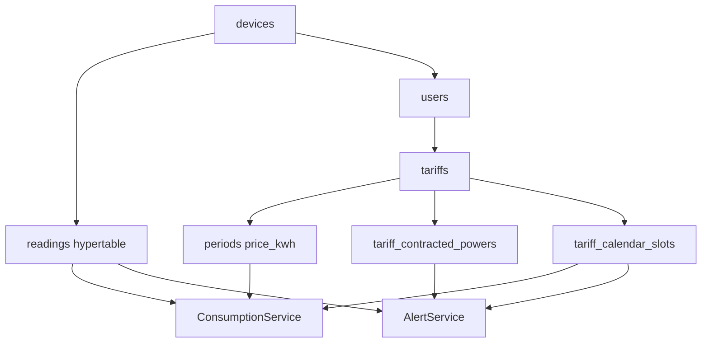

# Anexo D. TimescaleDB, modelo de datos y consultas analiticas

Este anexo documenta la estructura de datos de Wattimizer y la forma en la que se calculan las metricas energeticas. La base de datos se ejecuta con PostgreSQL + TimescaleDB, usando la imagen `timescale/timescaledb-ha:pg17`.

## 1. Estrategia de base de datos

El proyecto combina dos mecanismos:

| Mecanismo | Archivo | Papel |
| --- | --- | --- |
| Hibernate `ddl-auto=update` | `backend/src/main/resources/application.properties` | Crea y actualiza tablas JPA. |
| Scripts SQL | `backend/src/main/resources/db/` | Anaden extensiones, hypertable, constraints, indices y datos iniciales. |

Esta mezcla se debe a que JPA puede generar entidades y relaciones, pero no puede expresar bien elementos propios de TimescaleDB, como `create_hypertable`.

## 2. Tablas del modelo


### 2.1. `users`

**Entidad:** `entities/UserEntity.java`
**Repositorio:** `repositories/UserRepository.java`

| Columna | Descripcion |
| --- | --- |
| `id` | PK heredada de `BaseEntity`. |
| `tariff_id` | FK opcional a `tariffs`. |
| `username` | Email/usuario, unico y obligatorio. |
| `password` | Hash BCrypt. |
| `role` | `ROLE_USER` o `ROLE_ADMIN`. |
| `active` | Indica si la cuenta esta habilitada. |

Tambien hereda auditoria: `created_at`, `updated_at`, `created_by`, `updated_by`.

### 2.2. `devices`

**Entidad:** `entities/Device.java`
**Repositorio:** `repositories/DeviceRepository.java`

| Columna | Descripcion |
| --- | --- |
| `id` | PK. |
| `user_id` | FK opcional a `users`; puede ser `NULL` si se auto-crea por MQTT antes del claim. |
| `name` | Nombre visible del medidor. |
| `mac_address` | MAC unica del dispositivo. |
| `is_on` | Estado del enchufe. |
| `is_simulated` | Marca dispositivos del simulador. |

La opcion `user_id` nullable permite que una lectura MQTT registre un dispositivo huerfano y que despues el usuario lo reclame por MAC.

### 2.3. `readings`

**Entidad:** `entities/Reading.java`
**PK compuesta:** `entities/ReadingId.java`
**Repositorio:** `repositories/ReadingRepository.java`

| Columna | Tipo logico | Descripcion |
| --- | --- | --- |
| `time` | `Instant` | Instante UTC de la lectura. |
| `device_id` | FK a `devices` | Dispositivo origen. |
| `power_w` | decimal | Potencia instantanea en vatios. |
| `energy_total_kwh` | decimal | Energia acumulada del contador en kWh. |
| `is_on` | boolean | Estado del enchufe. |

La clave primaria real es `(time, device_id)`. Esta tabla es la unica hypertable TimescaleDB del proyecto.

### 2.4. `tariffs`

**Entidad:** `entities/Tariff.java`
**Repositorio:** `repositories/TariffRepository.java`

| Columna | Descripcion |
| --- | --- |
| `id` | PK. |
| `name` | Nombre de tarifa o contrato. |
| `market` | Mercado, con valores usados por el frontend como `libre` y `regulado`. |
| `access_tariff_code` | Peaje: `2.0TD`, `3.0TD`, `6.1TD`, `6.2TD`. |
| `geographic_zone` | Zona: `PENINSULA`, `CANARIAS`, `ISLAS_BALEARES`, `CEUTA`, `MELILLA`. |
| `energy_company` | Comercializadora. |

El script `tariffs-td-schema.sql` anade constraints para validar valores de peaje y zona.

La entidad y los constraints admiten mas combinaciones que las sembradas actualmente en el calendario. El seed real `seed-tariff-calendar-slots.sql` cubre `2.0TD` y `3.0TD` para `PENINSULA` e `ISLAS_BALEARES`. Para peajes o zonas sin slots cargados, `CalendarResolverService.resolveApplicablePeriod` devuelve `Optional.empty()` y los servicios de coste/alertas degradan el calculo sin lanzar excepcion, normalmente devolviendo coste `0` o no generando alerta.

### 2.5. `periods`

**Entidad:** `entities/Period.java`
**Repositorio:** `repositories/PeriodRepository.java`

| Columna | Descripcion |
| --- | --- |
| `id` | PK. |
| `tariff_id` | FK obligatoria a `tariffs`. |
| `period_code` | Codigo P1-P6. |
| `price_kwh` | Precio en euros por kWh. |

Tiene constraint unica `(tariff_id, period_code)`. Esto asegura que una tarifa no tenga dos precios para el mismo periodo.

### 2.6. `tariff_contracted_powers`

**Entidad:** `entities/TariffContractedPower.java`
**Repositorio:** `repositories/TariffContractedPowerRepository.java`

| Columna | Descripcion |
| --- | --- |
| `id` | PK. |
| `tariff_id` | FK obligatoria a `tariffs`. |
| `period_code` | P1-P6. |
| `contracted_power_kw` | Potencia contratada en kW. |

Se usa en `AlertService` para detectar excesos de potencia.

### 2.7. `tariff_calendar_slots`

**Entidad:** `entities/TariffCalendarSlot.java`
**Repositorio:** `repositories/TariffCalendarSlotRepository.java`

| Columna | Descripcion |
| --- | --- |
| `id` | PK. |
| `access_tariff_code` | Peaje al que aplica el slot. |
| `geographic_zone` | Zona geografica. |
| `month_number` | Mes 1-12. |
| `season_code` | Temporada regulatoria. |
| `day_type` | Tipo de dia: `A`, `B`, `B1`, `C`, `D`. |
| `period_code` | Periodo que aplica. |
| `start_time` | Inicio del intervalo. |
| `end_time` | Fin del intervalo. |

Esta tabla evita codificar en Java una gran matriz de horarios. El servicio solo pregunta que periodo corresponde a una fecha/hora concreta.

### 2.8. `alerts`

**Entidad:** `entities/Alert.java`
**Repositorio:** `repositories/AlertRepository.java`

| Columna | Descripcion |
| --- | --- |
| `id` | PK. |
| `user_id` | FK al usuario propietario. |
| `device_id` | FK al dispositivo que origino la alerta. |
| `type` | Tipo de alerta, actualmente `OVERPOWER`. |
| `message` | Mensaje mostrado al usuario. |

### 2.9. `federated_identities`

**Entidad:** `entities/FederatedIdentity.java`
**Repositorio:** `repositories/FederatedIdentityRepository.java`

| Columna | Descripcion |
| --- | --- |
| `id` | PK. |
| `user_id` | FK a `users`. |
| `provider` | `GOOGLE` o `GITHUB`. |
| `provider_subject` | Identificador del usuario en el proveedor. |
| `email_at_login` | Email recibido en el login. |
| `created_at` | Fecha de vinculacion. |

Tiene constraint unica `(provider, provider_subject)` para no vincular dos veces la misma identidad externa.

## 3. TimescaleDB

### 3.1. Extensiones

**Archivo:** `backend/src/main/resources/db/dev-seed/00-extensions.sql`

```sql
CREATE EXTENSION IF NOT EXISTS timescaledb;
CREATE EXTENSION IF NOT EXISTS pgcrypto;
```

| Extension | Uso |
| --- | --- |
| `timescaledb` | Hypertable para lecturas temporales. |
| `pgcrypto` | Hashes BCrypt en seeds de desarrollo. |

### 3.2. Hypertable `readings`

**Archivo:** `backend/src/main/resources/db/dev-seed/01-hypertable.sql`

```sql
SELECT create_hypertable('readings', 'time');
```

| Propiedad | Valor |
| --- | --- |
| Tabla | `readings` |
| Columna temporal | `time` |
| Motivo | Las lecturas son una serie temporal y creceran mucho mas que las tablas de usuarios o tarifas. |

El propio script deja una alternativa si la tabla ya tuviera datos:

```sql
SELECT create_hypertable('readings', 'time', migrate_data => true);
```

### 3.3. Verificacion

```sql
SELECT hypertable_name, num_chunks
FROM timescaledb_information.hypertables;
```

Resultado esperado:

```text
readings | 0
```

El numero de chunks sera mayor que cero cuando ya haya telemetria insertada.

### 3.4. Capacidades no utilizadas todavia

El repositorio no define:

- `time_bucket()`
- continuous aggregates
- politicas de compresion
- politicas de retencion
- vistas materializadas de analitica

Por tanto, TimescaleDB se usa ahora como base preparada para series temporales, pero los calculos analiticos se hacen en Java.

## 4. Scripts SQL del proyecto

| Archivo | Proposito |
| --- | --- |
| `db/dev-seed/00-extensions.sql` | Activa TimescaleDB y pgcrypto. |
| `db/dev-seed/01-hypertable.sql` | Convierte `readings` en hypertable. |
| `db/tariffs-td-schema.sql` | Constraints, indices y limpieza de columnas antiguas de tarifas. |
| `db/seed-tariff-calendar-slots.sql` | Inserta slots regulatorios para resolver periodos. En el estado actual cubre `2.0TD` y `3.0TD` para `PENINSULA` e `ISLAS_BALEARES`. |
| `db/dev-seed/03-seed-users-dev.sql` | Usuarios admin y user de desarrollo. |
| `db/dev-seed/04-seed-device-shelly.sql` | Dispositivo Shelly fisico de referencia. |
| `db/dev-seed/05-seed-device-simulation.sql` | Dispositivo simulado. |
| `db/prod/99-resync-sequences.sql` | Resincroniza secuencias tras seeds. |

Orden recomendado:

```text
00-extensions.sql
01-hypertable.sql
tariffs-td-schema.sql
seed-tariff-calendar-slots.sql
seeds de desarrollo, si procede
99-resync-sequences.sql
```

## 5. Consultas reales en repositorios

### 5.1. Lecturas por intervalo

**Archivo:** `repositories/ReadingRepository.java`

```java
@Query("SELECT r FROM Reading r WHERE r.device.macAddress = :macAddress " +
        "AND r.time >= :start AND r.time <= :end ORDER BY r.time ASC")
List<Reading> findReadingsInInterval(
        @Param("macAddress") String macAddress,
        @Param("start") Instant start,
        @Param("end") Instant end);
```

Uso:

- `ConsumptionService.calculateCostInPeriod`
- `ConsumptionService.calculateGhostCost`

Esta consulta trae lecturas ordenadas por tiempo. Despues Java calcula los deltas de energia entre lecturas consecutivas.

### 5.2. Lectura ultima y busqueda por clave logica

```java
Optional<Reading> findFirstByDeviceMacAddressOrderByTimeDesc(String macAddress);
Optional<Reading> findByTimeAndDeviceMacAddress(Instant time, String macAddress);
```

Uso:

- Endpoint `GET /api/v1/readings/latest/{macAddress}`
- Endpoint `GET /api/v1/readings/search`

### 5.3. Borrado por lectura concreta

```java
@Modifying
@Transactional
@Query("DELETE FROM Reading r WHERE r.time = :time AND r.device.macAddress = :macAddress")
Long deleteByTimeAndDeviceMacAddress(@Param("time") Instant time, @Param("macAddress") String macAddress);
```

Uso:

- Endpoint `DELETE /api/v1/readings/search`

### 5.4. Resolucion de periodo tarifario

**Archivo:** `repositories/TariffCalendarSlotRepository.java`

```java
@Query("""
        SELECT cs.periodCode FROM TariffCalendarSlot cs
        WHERE cs.accessTariffCode = :accessTariffCode
          AND cs.geographicZone   = :zone
          AND cs.monthNumber      = :month
          AND cs.dayType          = :dayType
          AND (
                (cs.startTime <> cs.endTime AND cs.startTime <= :localTime AND cs.endTime > :localTime)
                OR
                (cs.startTime = cs.endTime AND cs.dayType = 'D')
                OR (cs.endTime = :endOfDay AND :localTime >= cs.startTime)
              )
        """)
Optional<String> findPeriodCode(
        String accessTariffCode,
        String zone,
        int month,
        String dayType,
        LocalTime localTime,
        LocalTime endOfDay
);
```

Esta consulta es el centro de la logica tarifaria: convierte una fecha local en `P1`, `P2`, `P3`, `P4`, `P5` o `P6`.

Tambien existe:

```java
@Query("""
        SELECT DISTINCT cs.dayType FROM TariffCalendarSlot cs
        WHERE cs.accessTariffCode = :accessTariffCode
          AND cs.geographicZone   = :zone
          AND cs.monthNumber      = :month
          AND cs.dayType          <> 'D'
        """)
Optional<String> findWorkdayType(
        String accessTariffCode,
        String zone,
        int month
);
```

Sirve para deducir el tipo de dia laborable segun peaje, zona y mes.

### 5.5. Catalogo maestro de tarifas

**Archivo:** `repositories/TariffRepository.java`

```java
@Query("SELECT t FROM Tariff t WHERE t.id NOT IN " +
       "(SELECT u.tariff.id FROM UserEntity u WHERE u.tariff IS NOT NULL)")
List<Tariff> findAllCatalog();
```

La intencion es separar plantillas globales de clones privados asignados a usuarios. Si una tarifa esta asociada a un usuario, no se considera catalogo maestro.

## 6. Analitica implementada en Java

### 6.1. Coste energetico total

**Servicio:** `services/ConsumptionService.java`
**Endpoint:** `GET /api/v1/analytics/cost`

Algoritmo:

1. Recupera lecturas ordenadas con `findReadingsInInterval`.
2. Si hay menos de dos lecturas, devuelve `0`.
3. Busca el dispositivo y su tarifa.
4. Recorre pares consecutivos de lecturas.
5. Calcula:

```text
deltaKwh = current.energyTotalKwh - previous.energyTotalKwh
```

6. Si `deltaKwh` es positivo, resuelve el periodo tarifario del instante actual.
7. Multiplica:

```text
costePaso = deltaKwh * priceKwh
```

8. Suma y redondea a dos decimales.

No hay `SUM()` en SQL porque el precio cambia segun periodo y zona horaria. La logica necesita consultar `CalendarResolverService` por cada tramo.

### 6.2. Consumo fantasma

**Servicio:** `ConsumptionService.calculateGhostCost`
**Endpoint:** `GET /api/v1/analytics/ghost-consumption`

Usa la misma idea de deltas, pero solo suma tramos cuya hora local este entre `00:00` y `05:59`.

Punto importante: no se usa una zona fija. El servicio llama a `CalendarResolverService.resolveZoneIdForTariff`, por ejemplo:

| Zona tarifa | Zona horaria |
| --- | --- |
| Peninsula | `Europe/Madrid` |
| Canarias | `Atlantic/Canary` |

Esto esta cubierto por `ConsumptionServiceTest`, especialmente para evitar que una lectura de Canarias se evalue como si fuera Peninsula.

La zona horaria de Canarias esta implementada en Java, pero el calendario tarifario sembrado no incluye slots de `CANARIAS`. Por eso el caso de coste completo para Canarias queda condicionado a cargar esos slots en base de datos.

### 6.3. Alertas de maximetro

**Servicio:** `services/AlertService.java`

Algoritmo:

1. Recibe una `Reading`.
2. Comprueba que exista dispositivo, potencia e instante.
3. Obtiene usuario y tarifa del dispositivo.
4. Resuelve el periodo P1-P6 con `CalendarResolverService`.
5. Consulta `TariffContractedPowerRepository.findByTariffIdAndPeriodCode`.
6. Compara:

```text
reading.powerW / 1000 > contractedPowerKw
```

7. Si se supera el umbral, inserta una alerta `OVERPOWER`.

Esta analitica no mira historico: evalua cada lectura entrante.

### 6.4. Coste instantaneo

`ConsumptionService` y `TariffService` contienen logica de coste instantaneo:

```text
kWh = (powerW / 1000) * (durationSeconds / 3600)
coste = kWh * priceKwh
```

Actualmente no esta expuesta por un endpoint ni usada por el dashboard. Queda como funcionalidad preparada o candidata a limpieza/refactor.

## 7. Flujo de datos entre tablas



Lectura resumida:

1. `readings` aporta potencia y energia acumulada.
2. `devices` vincula la lectura con un usuario.
3. `users.tariff_id` indica que contrato aplicar.
4. `tariff_calendar_slots` decide el periodo P1-P6.
5. `periods` aporta precio kWh.
6. `tariff_contracted_powers` aporta limite de potencia.

## 8. Endpoints que consumen analitica

| Endpoint | Servicio | Datos usados |
| --- | --- | --- |
| `GET /api/v1/analytics/cost` | `ConsumptionService.calculateCostInPeriod` | `readings`, `devices`, `tariffs`, `periods`, `tariff_calendar_slots`. |
| `GET /api/v1/analytics/ghost-consumption` | `ConsumptionService.calculateGhostCost` | Mismas tablas, filtrando horas nocturnas. |
| `GET /api/v1/readings/latest/{macAddress}` | `ReadingRepository.findFirstByDeviceMacAddressOrderByTimeDesc` | Ultima lectura del dispositivo. |
| `GET /api/v1/alerts` | `AlertRepository.findByUserUsername` | Alertas generadas por exceso de potencia. |

## 9. Observaciones tecnicas

| Observacion | Impacto |
| --- | --- |
| `readings` es hypertable, pero las consultas son JPQL sin funciones TimescaleDB. | La base esta preparada para series temporales, pero aun no se aprovecha toda la potencia analitica. |
| Los calculos recorren lecturas en memoria. | Sencillo y correcto para volumen pequeno/medio; puede escalar peor con intervalos grandes. |
| `ReadingRepository` extiende `JpaRepository<Reading, Long>`, aunque la PK real es compuesta. | Funciona para los metodos usados, pero conceptualmente deberia ser `JpaRepository<Reading, ReadingId>`. |
| `ReadingService.listByUsername()` filtra lecturas en memoria. | A escala convendria una consulta por usuario y rango temporal. |
| No hay retencion ni compresion configurada. | La tabla puede crecer indefinidamente si hay muchos dispositivos. |

## 10. Mejoras analiticas propuestas

Estas mejoras no estan implementadas en el codigo actual, pero son la evolucion natural del modelo:

### 10.1. Agregados con `time_bucket`

```sql
SELECT
  time_bucket('15 minutes', r.time) AS bucket,
  d.mac_address,
  avg(r.power_w) AS avg_power_w,
  max(r.power_w) AS max_power_w
FROM readings r
JOIN devices d ON d.id = r.device_id
WHERE d.mac_address = :macAddress
  AND r.time BETWEEN :start AND :end
GROUP BY bucket, d.mac_address
ORDER BY bucket;
```

Permitiria pintar historicos de potencia sin traer todas las lecturas crudas.

### 10.2. Politica de compresion

```sql
ALTER TABLE readings SET (
  timescaledb.compress,
  timescaledb.compress_segmentby = 'device_id'
);

SELECT add_compression_policy('readings', INTERVAL '7 days');
```

Ayudaria a reducir espacio cuando las lecturas antiguas ya no necesiten escritura frecuente.

### 10.3. Retencion

```sql
SELECT add_retention_policy('readings', INTERVAL '2 years');
```

Serviria para cumplir una politica clara de almacenamiento y evitar crecimiento indefinido.

Estas propuestas se dejan como lineas futuras porque la implementacion actual prioriza claridad y entrega funcional del MVP.
