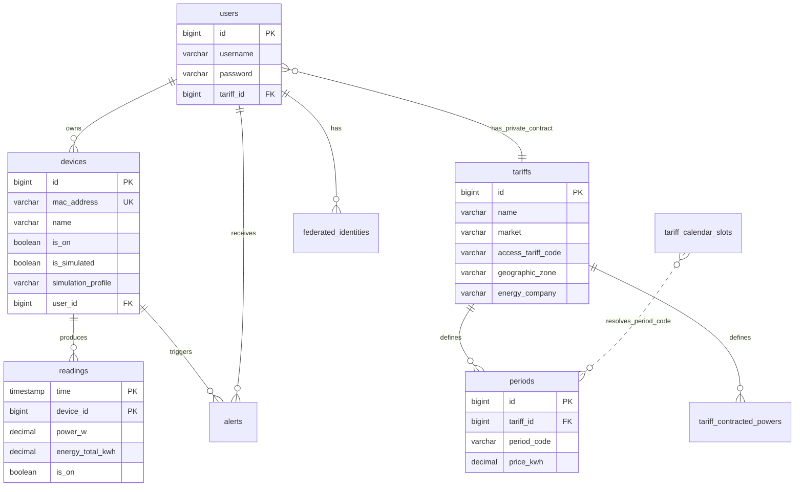
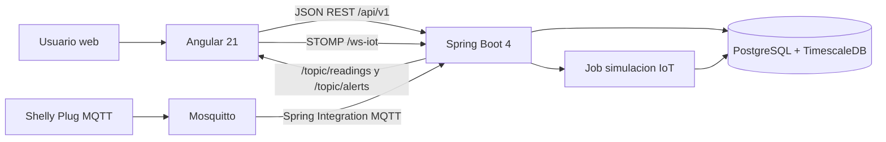

# Memoria tecnica del proyecto DAW: Wattimizer

## Indice

1. [Introduccion y justificacion](#1-introduccion-y-justificacion)
2. [Fase 1: Analisis funcional](#2-fase-1-analisis-funcional)
3. [Fase 2: Diseno tecnico](#3-fase-2-diseno-tecnico)
4. [Fase 3: Implementacion y desarrollo](#4-fase-3-implementacion-y-desarrollo)
5. [Fase 4: Pruebas y despliegue](#5-fase-4-pruebas-y-despliegue)
6. [Conclusiones y lineas futuras](#6-conclusiones-y-lineas-futuras)
7. [Bibliografia y recursos](#7-bibliografia-y-recursos)
8. [Anexos tecnicos](#8-anexos-tecnicos)

## 1. Introduccion y justificacion

### 1.1. Titulo del proyecto

**Wattimizer App** es una aplicacion web de monitorizacion energetica orientada a pequenas empresas y usuarios que necesitan entender su consumo electrico con datos en tiempo real.

El repositorio del proyecto es:

```text
https://github.com/joellmar/wattpath-app
```

### 1.2. Descripcion del problema

El problema principal que se intenta resolver es la falta de visibilidad sobre el consumo electrico real. En una instalacion pequena, como una tienda, un aula, un taller o una oficina, se suele conocer el importe final de la factura, pero no se sabe con claridad que dispositivos consumen mas, cuando se producen los picos de potencia ni cuanto dinero se pierde por consumos de fondo.

Wattimizer parte de una idea concreta: si se capturan lecturas de potencia mediante enchufes inteligentes y se cruzan con una tarifa electrica real, el usuario puede pasar de ver solo vatios o kilovatios hora a ver impacto economico. La aplicacion no se queda en "hay consumo", sino que intenta responder a preguntas practicas:

- Que dispositivo esta consumiendo ahora mismo.
- Cuanto esta costando el consumo del dia.
- Si existe consumo fantasma durante la madrugada.
- Si se supera la potencia contratada de un periodo tarifario.
- Como probar la plataforma aunque no haya hardware fisico, usando dispositivos simulados.

Esta necesidad encaja bien con un proyecto DAW porque combina frontend, backend, seguridad, base de datos, mensajeria, despliegue y experiencia de usuario.

### 1.3. Objetivos

#### Objetivo general

Desarrollar una plataforma web full-stack que permita registrar usuarios, gestionar dispositivos IoT o simulados, recibir telemetria de consumo electrico, calcular costes segun tarifas TD espanolas y mostrar la informacion al usuario mediante una interfaz clara y reactiva.

#### Objetivos especificos

- Implementar autenticacion con JWT y login social mediante OAuth2.
- Permitir el registro de usuarios y la asignacion de una tarifa electrica personal.
- Gestionar dispositivos asociados al usuario, tanto fisicos como simulados.
- Ingerir telemetria desde MQTT con Spring Integration y persistirla como serie temporal.
- Generar telemetria sintetica para modo demostracion sin depender siempre del enchufe real.
- Modelar tarifas electricas con periodos P1-P6, potencia contratada por periodo y calendario regulatorio.
- Calcular coste energetico y consumo fantasma a partir del odometro `energyTotalKwh`.
- Avisar al usuario cuando un dispositivo supera la potencia contratada aplicable.
- Construir un frontend Angular con estado reactivo usando Signals, RxJS y NgRx Signals.
- Desplegar el sistema con Docker Compose, Nginx, Mosquitto y TimescaleDB.

### 1.4. Tipos de usuarios

| Usuario | Uso previsto en la plataforma | Funciones principales |
| --- | --- | --- |
| Usuario registrado | Persona que quiere controlar sus dispositivos y su tarifa | Login, panel de consumo, alta de dispositivos, consulta de alertas, configuracion de tarifa privada |
| Administrador | Responsable de mantener el catalogo base de tarifas | CRUD de tarifas maestras y revision de datos de configuracion |
| Sistema IoT | Dispositivo Shelly o simulador interno | Envio o generacion de lecturas de potencia y energia |
| Usuario visitante | Persona sin sesion | Acceso a login, registro y flujo OAuth |

## 2. Fase 1: Analisis funcional

### 2.1. Mapa de funcionalidades

| Modulo | Funcionalidades reales documentadas en el codigo |
| --- | --- |
| Autenticacion | Login JWT, registro, registro admin con secreto, login OAuth2 Google/GitHub y canje de ticket |
| Dispositivos | Listado, reclamacion por MAC, creacion de simulados, pack demo, edicion, encendido/apagado y borrado |
| Telemetria | Ingesta MQTT Shelly, procesado de estados, simulacion programada, historico reciente y WebSocket STOMP |
| Dashboard | Grafica de potencia del dispositivo activo, selector multi-dispositivo, coste diario y consumo fantasma |
| Tarifas | Catalogo maestro, tarifa privada de usuario, periodos P1-P6, potencias contratadas por periodo |
| Alertas | Deteccion de sobrepotencia, listado de incidencias y eliminacion de alertas del usuario |
| Analitica | Coste en una ventana temporal, coste fantasma de madrugada y resolucion de periodo por calendario |
| Despliegue | Docker Compose, TimescaleDB, Mosquitto, backend Spring Boot, frontend Angular y Nginx inverso |

### 2.2. Historias de usuario

| ID | Historia | Criterios de aceptacion | Prioridad |
| --- | --- | --- | --- |
| HU-01 | Como usuario, quiero registrarme con email y contrasena para acceder a mis datos. | El sistema rechaza passwords no coincidentes, guarda la contrasena cifrada y permite hacer login despues del registro. | MVP |
| HU-02 | Como usuario, quiero iniciar sesion para consultar mi panel personal. | El login devuelve un JWT, el frontend lo guarda en `sessionStorage` y las rutas privadas quedan protegidas. | MVP |
| HU-03 | Como usuario, quiero iniciar sesion con Google o GitHub para no crear otra contrasena. | El backend redirige al proveedor OAuth2 y el frontend canjea un ticket temporal por un JWT. | Opcional |
| HU-04 | Como usuario, quiero reclamar un enchufe por MAC para asociarlo a mi cuenta. | La MAC queda vinculada al usuario autenticado y no puede ser reclamada por otro usuario si ya tiene propietario. | MVP |
| HU-05 | Como usuario, quiero crear dispositivos simulados para probar la aplicacion sin hardware. | El sistema crea dispositivos con MAC `SIM...`, perfil de consumo y telemetria generada por el job de simulacion. | MVP |
| HU-06 | Como usuario, quiero ver el consumo en tiempo real del dispositivo activo. | El dashboard carga lecturas recientes y despues recibe nuevas lecturas por WebSocket. | MVP |
| HU-07 | Como usuario, quiero cambiar entre varios dispositivos. | El selector del dashboard cambia la MAC activa, recarga historico y cambia la suscripcion STOMP. | MVP |
| HU-08 | Como usuario, quiero asignar mi tarifa electrica para calcular costes reales. | La tarifa se guarda como contrato privado y el dashboard desbloquea las tarjetas de coste. | MVP |
| HU-09 | Como administrador, quiero mantener el catalogo de tarifas para ofrecer plantillas a los usuarios. | Solo `ROLE_ADMIN` puede crear, editar o borrar tarifas maestras. | MVP |
| HU-10 | Como usuario, quiero ver el consumo fantasma para detectar gasto nocturno innecesario. | La analitica calcula coste entre las 00:00 y las 05:59 en la zona horaria de la tarifa. | Opcional |
| HU-11 | Como usuario, quiero recibir alertas si supero la potencia contratada. | Al persistir una lectura se compara la potencia con el limite del periodo aplicable y se guarda una alerta `OVERPOWER`. | MVP |
| HU-12 | Como usuario, quiero eliminar alertas revisadas para mantener limpia la vista. | Solo se puede borrar una alerta propia y la pantalla se actualiza despues del borrado. | Opcional |

### 2.3. Gestion del trabajo

- **Repositorio:** `https://github.com/joellmar/wattpath-app`
- **Rama analizada:** `cursor/documentaci-n-t-cnica-del-proyecto-b784`
- **Base de desarrollo:** `main`
- **Flujo usado en el repositorio:** commits pequenos por funcionalidad o correccion. En el historial reciente aparecen cambios separados para simuladores, pack demo, panel multi-dispositivo y despliegue.

Columnas del tablero Kanban previstas para la memoria:

| Columna | Uso |
| --- | --- |
| Backlog | Historias pendientes o ideas no priorizadas |
| Por hacer | Tareas aceptadas para la siguiente iteracion |
| En progreso | Desarrollo activo |
| En revision | Cambios pendientes de pruebas o revision |
| Hecho | Funcionalidades completadas |

### 2.4. Planificacion inicial

| Fase | Historias asociadas | Dificultad tecnica |
| --- | --- | --- |
| Registro y seguridad | HU-01, HU-02, HU-03 | Media, por JWT, OAuth2 y control de sesion |
| Dispositivos | HU-04, HU-05 | Media-alta, por reglas de propiedad y simulacion |
| Telemetria | HU-06, HU-07 | Alta, por MQTT, WebSocket y series temporales |
| Tarifas | HU-08, HU-09 | Alta, por modelo regulatorio P1-P6 y validaciones |
| Analitica | HU-10, HU-11 | Alta, por calculo de coste, calendario y alertas |
| Experiencia de usuario | HU-12 y navegacion general | Media, por estados reactivos y feedback visual |
| Despliegue | Proyecto completo | Alta, por varios servicios Docker y configuracion HTTPS |

## 3. Fase 2: Diseno tecnico

### 3.1. Diseno de la base de datos

La base de datos combina entidades relacionales clasicas con una tabla temporal optimizada para lecturas IoT. PostgreSQL se usa como base principal y TimescaleDB aporta la hypertable `readings`.



El modelo relacional detallado y las consultas analiticas estan en [Anexo D](anexo-d-timescaledb-analitica.md).

### 3.2. Arquitectura del sistema



- **Backend:** Java 26 con Spring Boot 4.0.5, Spring Security, Spring MVC, Spring Data JPA, Spring Integration MQTT, MapStruct y WebSocket STOMP.
- **Frontend:** Angular 21 con componentes standalone, PrimeNG, Tailwind, RxJS y NgRx Signals.
- **Base de datos:** TimescaleDB sobre PostgreSQL 17 para almacenar lecturas temporales.
- **Mensajeria IoT:** Mosquitto como broker MQTT; el backend se suscribe al topico del enchufe Shelly.
- **Comunicacion:** REST para operaciones de negocio y STOMP/WebSocket para telemetria en tiempo real.
- **Despliegue:** Docker Compose con servicios `timescaledb`, `mosquitto`, `backend`, `frontend` y `nginx`.

### 3.3. Diseno de interfaz

Las pantallas principales implementadas en Angular son:

| Pantalla | Ruta | Intencion de diseno |
| --- | --- | --- |
| Login | `/login` | Entrada simple con email/password y botones OAuth |
| Registro | `/register` | Alta de usuario con validacion de contrasenas |
| Dashboard | `/dashboard` | Vista principal de consumo, selector de medidor, grafica y tarjetas de coste |
| Mis dispositivos | `/devices` | Gestion de enchufes reales y simulados |
| Tarifas electricas | `/tariffs` | Asignacion de tarifa personal y administracion del catalogo |
| Alertas | `/alerts` | Revision y borrado de incidencias de potencia |

El frontend usa un layout comun autenticado con barra lateral y cabecera. La decision tiene sentido porque las vistas privadas comparten sesion, navegacion y acciones de salida.

### 3.4. Relacion entre historias y diseno

| Historia | Tablas principales | Codigo responsable |
| --- | --- | --- |
| HU-01/HU-02 | `users`, `role` | `AuthController`, `AuthRegistrationService`, `JwtTokenService`, `LoginComponent` |
| HU-03 | `users`, `federated_identities` | `OAuth2AuthenticationSuccessHandler`, `OAuth2LoginTicketService`, `OAuthCallbackComponent` |
| HU-04/HU-05 | `devices`, `users` | `DeviceController`, `DeviceService`, `DevicesComponent`, `TelemetryStore` |
| HU-06/HU-07 | `readings`, `devices` | `ReadingController`, `TelemetryBroadcaster`, `WebsocketService`, `DashboardComponent` |
| HU-08/HU-09 | `tariffs`, `periods`, `tariff_contracted_powers` | `TariffController`, `UserTariffController`, `TariffService`, `TariffStore`, `TariffComponent` |
| HU-10 | `readings`, `periods`, `tariff_calendar_slots` | `ConsumptionController`, `ConsumptionService`, `CalendarResolverService` |
| HU-11/HU-12 | `alerts`, `devices`, `users` | `AlertService`, `AlertController`, `AlertsComponent` |

## 4. Fase 3: Implementacion y desarrollo

### 4.1. Tecnologias utilizadas

| Area | Tecnologia | Version indicada en el repositorio |
| --- | --- | --- |
| Backend | Spring Boot | 4.0.5 |
| Backend | Java | 26 |
| Persistencia | Spring Data JPA + PostgreSQL driver | Gestionado por Maven |
| Seguridad | Spring Security + jjwt | jjwt 0.12.5 |
| MQTT | Spring Integration MQTT + Eclipse Paho | Paho 1.2.5 |
| Mapeo DTO | MapStruct | 1.6.3 |
| Frontend | Angular | 21.x |
| Estado frontend | NgRx Signals | 21.1.0 |
| UI | PrimeNG + PrimeIcons | PrimeNG 21.1.7 |
| Graficas | Chart.js | 4.5.1 |
| WebSocket cliente | `@stomp/rx-stomp` / `@stomp/stompjs` | 2.4.0 / 7.3.0 |
| Base de datos | TimescaleDB HA | PostgreSQL 17 |
| Broker MQTT | Eclipse Mosquitto | 2.1.2-alpine |
| Contenedores | Docker Compose | Definido en `docker-compose.yml` |

### 4.2. Desarrollo del backend

El backend se organiza en controladores REST, servicios, repositorios, entidades, DTOs y configuraciones. La parte mas importante no esta en exponer CRUD sin mas, sino en mantener separadas tres responsabilidades:

1. **API de negocio:** usuarios, dispositivos, tarifas, lecturas, analitica y alertas.
2. **Ingesta IoT:** recepcion MQTT, parseo de payloads Shelly y persistencia temporal.
3. **Calculo energetico:** resolucion de periodos tarifarios, coste por energia y deteccion de sobrepotencia.

La seguridad se basa en JWT para las rutas `/api/v1/**`, con excepciones publicas para login, registro, OAuth y WebSocket. Las operaciones sensibles, como modificar el catalogo de tarifas, requieren `ROLE_ADMIN`.

El detalle de endpoints, parametros, DTOs y errores esta en [Anexo A](anexo-a-backend-rest.md).

### 4.3. Desarrollo del frontend

El frontend esta construido con Angular standalone. Las rutas privadas cuelgan de un `MainLayout`, y el acceso se controla con `authGuard`. La sesion se guarda en `sessionStorage`, y un interceptor HTTP anade el JWT a las peticiones `/api/v1/*`.

La decision mas importante de estado es usar NgRx Signals en vez de NgRx clasico. `TelemetryStore` centraliza dispositivos, MAC seleccionada, historico y conexion de telemetria. `TariffStore` centraliza catalogo, tarifa privada y estados de carga/error.

El detalle de componentes, servicios, flujos RxJS y NgRx Signals esta en [Anexo B](anexo-b-frontend-angular.md).

### 4.4. Control de versiones

Los cambios recientes analizados en esta documentacion son:

| Commit | Intencion |
| --- | --- |
| `2db18a4` | Anade perfiles de simulacion de consumo, CRUD de dispositivos simulados y tests asociados |
| `eff9456` | Activa simuladores en modo demo y anade pack de demostracion |
| `d77851b` | Ajusta borrado en cascada, telemetria por perfil y panel multi-dispositivo |
| `ee032fd` | Corrige despliegue reiniciando Nginx despues de `compose up` para evitar 502 |

El flujo observado separa funcionalidades y correcciones en commits concretos. Esto facilita justificar que cada cambio tiene una finalidad reconocible: dominio, frontend, simulacion, pruebas o despliegue.

## 5. Fase 4: Pruebas y despliegue

### 5.1. Plan de pruebas

| Prueba | Criterio validado | Evidencia en codigo |
| --- | --- | --- |
| Login con credenciales validas | Devuelve JWT y permite navegar al dashboard | `AuthService`, `LoginComponent`, tests de sesion |
| Registro con passwords distintas | Muestra error de validacion | `RegisterComponent` |
| Carga de dispositivos | Recupera solo dispositivos del usuario | `TelemetryStore.loadDevices`, `DeviceController.listDevices` |
| Creacion de dispositivo simulado | Exige perfil y genera MAC simulada | `DeviceServiceTest`, `DevicesComponent` |
| Pack demo | Crea un simulador por perfil faltante | `DeviceServiceTest`, `DeviceController` |
| Cambio de medidor en dashboard | Recarga historico y cambia WebSocket | `DashboardComponent`, `TelemetryStore.connectTelemetry` |
| Calculo de coste | Suma deltas de `energyTotalKwh` por precio de periodo | `ConsumptionServiceTest` |
| Consumo fantasma | Filtra consumo de 00:00 a 05:59 local | `ConsumptionServiceTest` |
| Tarifas | Valida periodos, potencias y catalogo | `TariffServiceTest`, `UserTariffServiceTest` |
| Simulacion periodica | Genera lecturas segun perfil | `IotTelemetrySimulationJobTest`, `SimulationProfileRegistryTest` |
| Frontend dispositivos | Verifica llamadas HTTP y estados de UI | `devices.component.spec.ts` |
| Frontend dashboard | Comprueba integracion de stores y analitica | `dashboard.component.spec.ts` |

### 5.2. Manual de instalacion y uso tecnico

#### Arranque local con Docker

```bash
cp .env.example .env
docker compose up -d --build
```

Despues del primer arranque deben ejecutarse los scripts SQL indicados por la guia de despliegue para activar TimescaleDB y cargar el calendario tarifario:

```text
backend/src/main/resources/db/dev-seed/00-extensions.sql
backend/src/main/resources/db/dev-seed/01-hypertable.sql
backend/src/main/resources/db/tariffs-td-schema.sql
backend/src/main/resources/db/seed-tariff-calendar-slots.sql
backend/src/main/resources/db/dev-seed/03-seed-users-dev.sql
backend/src/main/resources/db/dev-seed/04-seed-device-shelly.sql
backend/src/main/resources/db/dev-seed/05-seed-device-simulation.sql
```

#### Arranque frontend en desarrollo

```bash
cd frontend
npm install
npm start
```

El proxy `frontend/proxy.conf.json` redirige `/api`, `/oauth2` y `/ws-iot` al backend local.

#### Arranque backend en desarrollo

```bash
cd backend
./mvnw spring-boot:run
```

Las propiedades locales estan en `backend/src/main/resources/application.properties`. En Docker se sustituyen por variables como `SPRING_DATASOURCE_URL`, `MQTT_URL`, `JWT_SECRET` y `SIMULATION_ENABLED`.

### 5.3. Despliegue

El despliegue de produccion descrito en el repositorio usa:

- Servidor Linux con Docker Compose.
- Nginx como proxy inverso para frontend, backend y WebSocket.
- TimescaleDB como base de datos.
- Mosquitto como broker MQTT.
- Certificados gestionados en el host y montados en el contenedor Nginx.

La URL de produccion configurada en el compose es:

```text
https://wattimizer.com
```

La guia detallada esta en `docs/deployment/hetzner-production.md`.

## 6. Conclusiones y lineas futuras

### 6.1. Grado de cumplimiento

El MVP esta cubierto en sus partes principales: autenticacion, gestion de dispositivos, ingesta de telemetria, dashboard, tarifas, analitica basica y alertas. Ademas, el proyecto incluye simulacion de consumo, lo que permite demostrar la aplicacion aunque el hardware real no este disponible.

### 6.2. Dificultades encontradas

- **Telemetria real frente a simulada:** se resolvio separando el origen de datos. MQTT entra por `DeviceMessageHandler`; la simulacion entra por `SimulatedTelemetryProcessor`, pero ambos terminan persistiendo lecturas y emitiendo por WebSocket.
- **Tarifas TD:** el modelo inicial de periodos horarios simples no bastaba. Se movieron los horarios a `tariff_calendar_slots` y se dejaron los precios contractuales en `periods`.
- **Panel multi-dispositivo:** el estado tuvo que indexar historicos por MAC para no mezclar lecturas al cambiar de medidor.
- **Despliegue:** se documentaron correcciones reales, como reiniciar Nginx tras levantar contenedores para evitar errores 502.

### 6.3. Mejoras futuras

- Hacer configurable la suscripcion MQTT para soportar varios Shelly sin tocar codigo.
- Usar funciones nativas de TimescaleDB como `time_bucket`, agregados continuos y politicas de retencion.
- Suscribir el frontend tambien a `/topic/alerts/{username}` para recibir alertas sin refrescar por REST.
- Anadir una aplicacion movil o PWA para consultar alertas desde el telefono.
- Incorporar notificaciones por email o push cuando se supere la potencia contratada.
- Crear informes descargables en PDF o CSV para periodos mensuales.
- Mejorar el modelo de roles con un panel de administracion mas completo.

## 7. Bibliografia y recursos

Recursos consultables para justificar las tecnologias utilizadas en el proyecto:

| Recurso | URL |
| --- | --- |
| Documentacion oficial de Spring Boot | `https://docs.spring.io/spring-boot/` |
| Documentacion oficial de Spring Security | `https://docs.spring.io/spring-security/reference/` |
| Documentacion oficial de Spring Integration MQTT | `https://docs.spring.io/spring-integration/reference/mqtt.html` |
| Documentacion oficial de Eclipse Paho | `https://eclipse.dev/paho/` |
| Documentacion oficial de Angular | `https://angular.dev/` |
| Documentacion oficial de NgRx Signals | `https://ngrx.io/guide/signals` |
| Documentacion oficial de RxJS | `https://rxjs.dev/` |
| Documentacion oficial de PrimeNG | `https://primeng.org/` |
| Documentacion oficial de TimescaleDB | `https://docs.timescale.com/` |
| Documentacion oficial de PostgreSQL | `https://www.postgresql.org/docs/` |
| Documentacion oficial de Eclipse Mosquitto | `https://mosquitto.org/documentation/` |
| Documentacion oficial de Docker Compose | `https://docs.docker.com/compose/` |
| Repositorio del proyecto Wattimizer | `https://github.com/joellmar/wattpath-app` |

## 8. Anexos tecnicos

- [Anexo A - Controladores REST Spring Boot](anexo-a-backend-rest.md)
- [Anexo B - Frontend Angular, RxJS y NgRx Signals](anexo-b-frontend-angular.md)
- [Anexo C - Ingesta asincrona de telemetria MQTT](anexo-c-telemetria-mqtt.md)
- [Anexo D - TimescaleDB, tablas y analitica](anexo-d-timescaledb-analitica.md)
