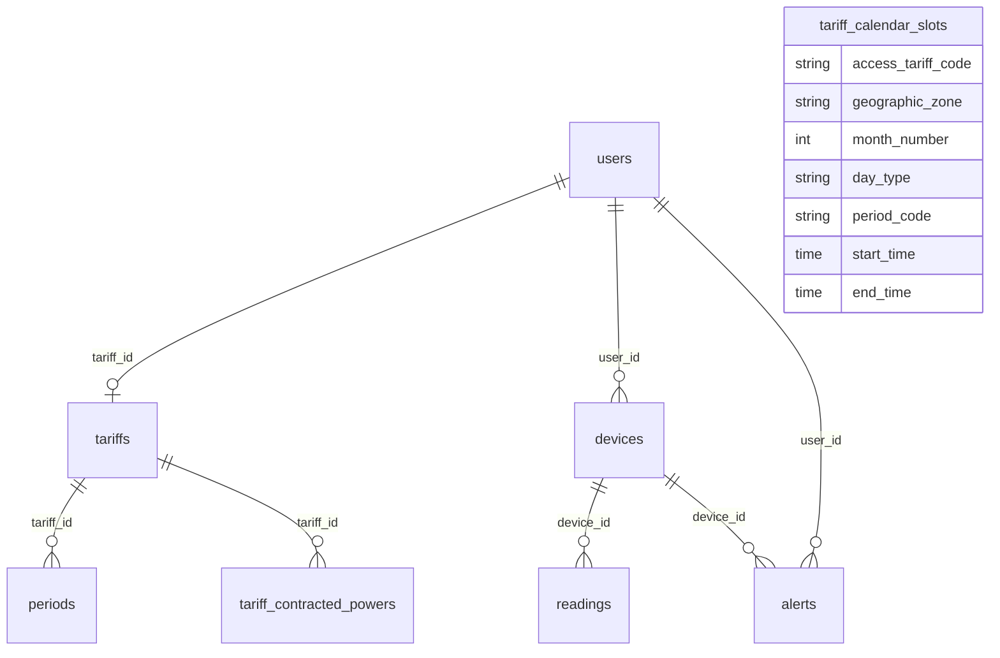
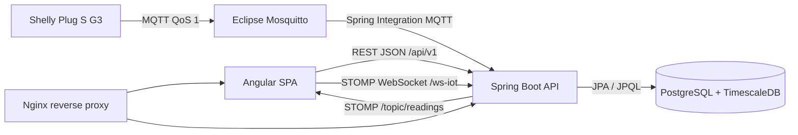

# Memoria técnica del proyecto DAW: Wattimizer

Wattimizer es una aplicación web B2B para monitorizar consumo eléctrico de pequeños negocios y traducirlo a impacto económico. El sistema combina una API REST en Spring Boot, un frontend Angular, telemetría IoT mediante MQTT, comunicación WebSocket/STOMP y una base de datos PostgreSQL con TimescaleDB para series temporales.

Esta memoria se ha redactado como documentación técnica de apoyo para la entrega final del proyecto. Los anexos enlazados al final desarrollan con más detalle los controladores REST, la lógica Angular, la ingesta MQTT y el modelo TimescaleDB.

## Índice detallado

1. [Introducción y justificación](#1-introducción-y-justificación)
2. [Fase 1: Análisis funcional](#2-fase-1-análisis-funcional)
3. [Fase 2: Diseño técnico](#3-fase-2-diseño-técnico)
4. [Fase 3: Implementación y desarrollo](#4-fase-3-implementación-y-desarrollo)
5. [Fase 4: Pruebas y despliegue](#5-fase-4-pruebas-y-despliegue)
6. [Conclusiones y líneas futuras](#6-conclusiones-y-líneas-futuras)
7. [Bibliografía y recursos](#7-bibliografía-y-recursos)
8. [Anexos técnicos](#8-anexos-técnicos)

## 1. Introducción y justificación

### 1.1. Título del proyecto

**Wattimizer App**.

El README del repositorio define el proyecto como una plataforma B2B de inteligencia financiera energética. El nombre comercial combina la idea de potencia eléctrica, representada por el vatio, con la optimización del gasto energético.

### 1.2. Descripción del problema

Muchas pymes conocen el importe total de su factura eléctrica, pero no tienen una visión clara de qué dispositivos generan ese gasto ni en qué momentos se producen los picos de potencia. Esta falta de información provoca tres problemas concretos:

- El consumo se revisa tarde, cuando la factura ya se ha emitido.
- Los picos de potencia se detectan después de que puedan generar penalizaciones o costes innecesarios.
- El consumo fantasma queda oculto porque no se asocia a ningún equipo concreto.

Wattimizer aborda el problema conectando medidores IoT, almacenando sus lecturas de potencia y energía, y cruzando esos datos con una tarifa eléctrica configurada por el usuario. Así, el sistema no se limita a mostrar vatios, sino que los transforma en coste estimado y alertas comprensibles para un pequeño negocio.

### 1.3. Objetivos

#### Objetivo general

Desarrollar una aplicación web que permita a una empresa registrar dispositivos de medición eléctrica, consultar su consumo en tiempo real, calcular el coste económico asociado a una tarifa y recibir alertas cuando se supere la potencia contratada.

#### Objetivos específicos

- Implementar autenticación con JWT y registro de usuarios, incluyendo login tradicional y OAuth2 con Google/GitHub.
- Crear una API REST para dispositivos, lecturas, alertas, tarifas y analítica de consumo.
- Integrar dispositivos Shelly Plug S G3 mediante MQTT y procesar sus mensajes con Spring Integration.
- Añadir simuladores de telemetría para probar la aplicación sin depender siempre de hardware físico.
- Persistir lecturas como serie temporal en PostgreSQL/TimescaleDB.
- Construir un frontend Angular con estado reactivo mediante NgRx Signals y RxJS.
- Mostrar un panel con gráfica de potencia en vivo, coste diario y consumo fantasma.
- Desplegar la aplicación con Docker Compose, Nginx, Mosquitto y TimescaleDB en un VPS Hetzner.

### 1.4. Tipos de usuarios

| Usuario | Rol técnico | Uso dentro de Wattimizer |
|---|---|---|
| Usuario de empresa | `ROLE_USER` | Registra o reclama dispositivos, crea simuladores, consulta dashboard, configura su tarifa privada y revisa alertas. |
| Administrador | `ROLE_ADMIN` | Además de las funciones de usuario, puede crear, editar y borrar plantillas del catálogo maestro de tarifas. |
| Dispositivo IoT | Cliente MQTT externo | Publica telemetría en Mosquitto. No inicia sesión en la API REST; se identifica por MAC y topic MQTT. |

## 2. Fase 1: Análisis funcional

### 2.1. Mapa de funcionalidades

| Módulo | Funcionalidades implementadas |
|---|---|
| Autenticación | Login con email/contraseña, registro, registro admin con secreto, OAuth2 con ticket temporal, cierre de sesión en frontend. |
| Dispositivos | Listado por usuario, alta física por reclamación de MAC, alta simulada por perfil, pack demo, edición, encendido/apagado y borrado con cascada de lecturas y alertas. |
| Telemetría | Ingesta MQTT del Shelly, simulación periódica, persistencia de lecturas, emisión por WebSocket STOMP. |
| Dashboard | Selección de dispositivo, gráfica de potencia en vivo, carga de histórico reciente, coste diario y consumo fantasma. |
| Tarifas | Catálogo maestro, tarifa privada del usuario, periodos P1-P6, potencias contratadas por periodo y validación de potencia ascendente. |
| Alertas | Detección de sobrepotencia por maxímetro, persistencia de alertas y borrado autorizado por usuario. |
| Despliegue | Docker Compose con TimescaleDB, Mosquitto, backend, frontend y Nginx; guía de producción en Hetzner. |

### 2.2. Historias de usuario

| ID | Historia | Criterios de aceptación | Prioridad |
|---|---|---|---|
| HU-01 | Como usuario, quiero registrarme e iniciar sesión para acceder a mis datos energéticos. | El sistema permite registro, login con JWT y redirección al panel si las credenciales son válidas. | Imprescindible |
| HU-02 | Como usuario, quiero vincular un enchufe inteligente por MAC para asociarlo a mi cuenta. | El formulario valida una MAC de 12 caracteres hexadecimales y llama a `POST /api/v1/devices/claim`. | Imprescindible |
| HU-03 | Como usuario, quiero crear dispositivos simulados para probar el sistema sin hardware físico. | El usuario selecciona un perfil, se crea un dispositivo `SIM...` y empieza a generar lecturas. | Imprescindible |
| HU-04 | Como usuario, quiero ver la potencia en tiempo real para detectar consumos anómalos. | El dashboard carga histórico reciente y se suscribe a `/topic/readings/{mac}` por WebSocket. | Imprescindible |
| HU-05 | Como usuario, quiero configurar mi tarifa para calcular el coste de consumo. | El usuario asigna una plantilla o edita precios/potencias en `/api/v1/users/me/tariff`. | Imprescindible |
| HU-06 | Como usuario, quiero consultar el coste diario y el consumo fantasma. | El panel llama a `/api/v1/analytics/cost` y `/api/v1/analytics/ghost-consumption` si hay tarifa asignada. | Imprescindible |
| HU-07 | Como usuario, quiero recibir alertas si supero la potencia contratada. | Cada lectura ejecuta `AlertService.checkPowerThreshold`; si supera el límite, se guarda una alerta `OVERPOWER`. | Imprescindible |
| HU-08 | Como administrador, quiero gestionar el catálogo de tarifas. | Solo `ROLE_ADMIN` puede crear, actualizar y borrar tarifas en `/api/v1/tariffs`. | Imprescindible |
| HU-09 | Como usuario, quiero eliminar un dispositivo y sus datos asociados. | El backend borra lecturas, alertas y dispositivo dentro de `DeviceService.deleteById`. | Imprescindible |
| HU-10 | Como usuario, quiero iniciar sesión con Google o GitHub. | OAuth2 redirige al frontend con ticket temporal y Angular lo intercambia por JWT. | Opcional |

### 2.3. Gestión del trabajo

- **Repositorio:** <https://github.com/joellmar/wattpath-app>
- **Rama documentada:** `cursor/documentaci-n-t-cnica-del-proyecto-4342`
- **Flujo observado en Git:** los commits recientes de `main` incluyen cambios de simuladores, despliegue, seguridad OAuth2, Nginx, Mosquitto y scripts SQL. La rama de documentación parte de ese estado.
- **Kanban propuesto para la memoria:** Backlog, Por hacer, En progreso, En revisión y Hecho. No hay una captura del tablero dentro del repositorio, por lo que en esta documentación se describe la estructura funcional y se deja la captura como material externo de entrega.

### 2.4. Planificación inicial

| Fase | Historias asociadas | Dificultad técnica |
|---|---|---|
| Autenticación y base de usuarios | HU-01, HU-10 | Media: seguridad JWT, OAuth2 y control de sesión en Angular. |
| Dispositivos e ingesta | HU-02, HU-03, HU-04 | Alta: integra MQTT, WebSocket, simuladores y persistencia temporal. |
| Tarifas y analítica | HU-05, HU-06 | Alta: combina calendario regulatorio, periodos P1-P6 y cálculo de coste por deltas de energía. |
| Alertas y administración | HU-07, HU-08, HU-09 | Media-alta: requiere autorización por usuario, rol admin y borrado en cascada. |
| Despliegue | Todas | Media: orquesta cinco servicios Docker y configuración de Nginx/SSL. |

## 3. Fase 2: Diseño técnico

### 3.1. Diseño de la base de datos

El modelo de datos combina entidades de negocio tradicionales con una tabla de lecturas temporales.



Modelo relacional resumido:

- `users`: credenciales, rol, estado y tarifa privada opcional.
- `devices`: dispositivos físicos o simulados asociados a usuario, con MAC única.
- `readings`: lecturas temporales con clave compuesta `time + device_id`, convertida en hypertable TimescaleDB.
- `alerts`: alertas de sobrepotencia asociadas a usuario y dispositivo.
- `tariffs`, `periods`, `tariff_contracted_powers`: contrato energético y precios/potencias por periodo.
- `tariff_calendar_slots`: dimensión regulatoria para resolver hora local y periodo P1-P6.
- `federated_identities`: relación entre usuarios y proveedores OAuth2.

### 3.2. Arquitectura del sistema



| Capa | Tecnología | Responsabilidad |
|---|---|---|
| Backend | Java 26, Spring Boot 4.0.5 | API REST, seguridad, MQTT, WebSocket, JPA y lógica de negocio. |
| Frontend | Angular 21, TypeScript, PrimeNG | Interfaz de usuario, formularios, estado reactivo y gráficos. |
| Estado frontend | NgRx Signals y RxJS | Stores de telemetría/tarifas, flujos HTTP y suscripción STOMP. |
| Base de datos | PostgreSQL 17 + TimescaleDB | Persistencia relacional y serie temporal de lecturas. |
| IoT | Mosquitto + Spring Integration MQTT | Recepción de eventos y estado del Shelly físico. |
| Despliegue | Docker Compose + Nginx | Contenerización, proxy inverso y exposición HTTP/HTTPS. |

### 3.3. Diseño de interfaz

Las pantallas principales se corresponden con componentes Angular independientes:

| Pantalla | Componente | Decisión de interfaz |
|---|---|---|
| Login | `LoginComponent` | Formulario simple con email/contraseña y acceso OAuth2. |
| Registro | `RegisterComponent` | Validación de confirmación de contraseña antes de enviar. |
| Layout privado | `MainLayoutComponent` | Navegación lateral y limpieza de stores en logout. |
| Dashboard | `DashboardComponent` | Gráfica de potencia, selección de dispositivo y métricas económicas. |
| Dispositivos | `DevicesComponent` | Formulario físico/simulado, pack demo, tabla y diálogos de edición. |
| Tarifas | `TariffComponent` | Vista dual: catálogo admin y tarifa privada del usuario. |
| Alertas | `AlertsComponent` | Listado de alertas y acción de descarte. |

### 3.4. Relación entre historias y diseño

| Historia | Tablas | Código principal |
|---|---|---|
| HU-01 | `users`, `federated_identities` | `AuthController`, `SecurityConfig`, `SessionStorageService`, `httpInterceptor`. |
| HU-02 | `devices` | `DeviceController`, `DeviceService.claimOrRegisterDevice`, `DevicesComponent`. |
| HU-03 | `devices`, `readings` | `CreateSimulatedDeviceRequest`, `IotTelemetrySimulationJob`, `SimulatedTelemetryProcessor`. |
| HU-04 | `readings` | `ReadingController`, `TelemetryBroadcaster`, `TelemetryStore`, `WebsocketService`. |
| HU-05 | `tariffs`, `periods`, `tariff_contracted_powers`, `users` | `UserTariffController`, `TariffStore`, `TariffComponent`. |
| HU-06 | `readings`, `tariff_calendar_slots`, `periods` | `ConsumptionController`, `ConsumptionService`, `DashboardComponent`. |
| HU-07 | `alerts`, `devices`, `tariff_contracted_powers` | `AlertService`, `AlertController`, `AlertsComponent`. |
| HU-08 | `tariffs`, `periods`, `tariff_contracted_powers` | `TariffController`, `TariffService`, `TariffComponent`. |
| HU-09 | `devices`, `readings`, `alerts` | `DeviceService.deleteById`, `ReadingRepository`, `AlertRepository`. |

## 4. Fase 3: Implementación y desarrollo

### 4.1. Tecnologías utilizadas

| Área | Tecnología y versión documentada en el repositorio |
|---|---|
| Backend | Spring Boot `4.0.5`, Java `26`, Spring Security, Spring Data JPA, Spring Integration MQTT, WebSocket/STOMP. |
| Frontend | Angular `21.x`, TypeScript `~5.9.2`, RxJS `~7.8.0`, NgRx Signals `^21.1.0`, PrimeNG `^21.1.7`, Chart.js `^4.5.1`. |
| Mensajería | Eclipse Mosquitto `2.1.2-alpine`, Paho MQTT `1.2.5`. |
| Base de datos | `timescale/timescaledb-ha:pg17`. |
| Despliegue | Docker Compose, Nginx Alpine, Certbot en host, Hetzner VPS. |

### 4.2. Desarrollo del backend

El backend expone 29 endpoints REST activos bajo `/api/v1`. La seguridad es stateless con JWT y se complementa con OAuth2. Los endpoints protegidos usan `Principal` para filtrar datos por usuario, especialmente en dispositivos, lecturas, analítica, alertas y tarifa privada.

La lógica de negocio se concentra en servicios:

- `DeviceService`: alta física, simulada, pack demo, edición y borrado en cascada.
- `ReadingService`: persistencia de lecturas MQTT/simuladas y consultas temporales.
- `ConsumptionService`: cálculo de coste por deltas positivos de `energyTotalKwh`.
- `AlertService`: comparación entre potencia real y potencia contratada por periodo.
- `UserTariffService` y `TariffService`: separación entre catálogo maestro y contrato privado.

La gestión de errores se centraliza en `GlobalExceptionHandler`, con respuestas `ErrorResponse` para 400, 401, 403, 404, 409 y 500 según la excepción.

### 4.3. Desarrollo del frontend

Angular se organiza con componentes standalone y rutas lazy loaded. El estado compartido se divide en dos stores:

- `TelemetryStore`: dispositivos, MAC seleccionada, histórico por MAC y conexión STOMP.
- `TariffStore`: catálogo, tarifa privada, flags de carga y errores.

El flujo más representativo es el dashboard:

1. Carga dispositivos con `GET /api/v1/devices`.
2. Selecciona una MAC inicial.
3. Recupera histórico reciente con `GET /api/v1/readings/device/{mac}/recent`.
4. Abre una suscripción STOMP a `/topic/readings/{mac}`.
5. Si existe tarifa privada, consulta coste y consumo fantasma.

### 4.4. Control de versiones

El repositorio usa Git con ramas de trabajo. En los commits recientes de `main` se observan cambios concretos:

- Reinicio de Nginx tras `compose up` para evitar 502 en despliegue.
- Borrado en cascada de dispositivos, telemetría por perfil y panel multi-dispositivo.
- Activación de simuladores en demo y pack de demostración.
- Perfiles de simulación de consumo y CRUD simulado.
- Ajustes de despliegue Hetzner, Mosquitto, OAuth2 y scripts SQL.

Esta documentación se genera en la rama `cursor/documentaci-n-t-cnica-del-proyecto-4342`.

## 5. Fase 4: Pruebas y despliegue

### 5.1. Plan de pruebas

| Prueba | Evidencia en código | Resultado esperado |
|---|---|---|
| Login con credenciales válidas | `AuthController.loginUser`, `LoginComponent` | Devuelve JWT y navega al dashboard. |
| Login con JWT caducado | `JwtValidatorFilter`, `httpInterceptor` | Backend responde 401 y Angular limpia sesión. |
| Alta de dispositivo físico | `DevicesComponent.onSubmit`, `DeviceService.claimOrRegisterDevice` | El dispositivo queda vinculado al usuario autenticado. |
| Alta de simulador | `CreateSimulatedDeviceRequest`, `IotTelemetrySimulationJobTest` | Se crea MAC `SIM...` y el job genera lecturas. |
| Cambio de perfil simulado | `DeviceService.updateDevice` | Solo se actualiza `simulationProfile` si `simulated=true`. |
| Histórico reciente | `ReadingController.getRecentReadingsByDevice` | Devuelve lecturas ordenadas del intervalo solicitado. |
| Coste energético | `ConsumptionService.calculateCostInPeriod` | Suma deltas positivos de kWh multiplicados por precio de periodo. |
| Consumo fantasma | `ConsumptionService.calculateGhostCost` | Suma coste solo entre 00:00 y 05:59 hora local. |
| Alerta de sobrepotencia | `AlertService.checkPowerThreshold` | Crea alerta `OVERPOWER` si kW actuales superan el límite contratado. |
| Tarifa privada sin contrato | `TariffService.getMyTariff`, `TariffStore.loadMyTariff` | Backend puede devolver 204 y frontend lo mapea a `null`. |

### 5.2. Manual de instalación y administración

#### Arranque local orientativo

```bash
# Backend
cd backend
./mvnw test
./mvnw spring-boot:run

# Frontend
cd frontend
npm install
npm start
```

#### Arranque con Docker Compose

```bash
docker compose up -d --build
```

Servicios definidos:

- `timescaledb`: base de datos.
- `mosquitto`: broker MQTT.
- `backend`: API Spring Boot.
- `frontend`: Angular compilado servido por Nginx interno.
- `nginx`: proxy inverso público.

Después de crear la base, los scripts SQL complementarios deben ejecutarse en el orden indicado por `docs/deployment/hetzner-production.md`: extensión TimescaleDB, hypertable `readings`, constraints/índices de tarifas, seed de calendario y seeds de desarrollo o producción cuando proceda.

### 5.3. Despliegue

El despliegue documentado usa un VPS Hetzner con Ubuntu 24.04 LTS, Docker, Docker Compose, Nginx, Certbot y Cloudflare. La guía de producción se encuentra en:

- `docs/deployment/hetzner-production.md`

Dominios descritos en la guía:

- `https://wattimizer.com`
- `https://www.wattimizer.com`
- `https://api.wattimizer.com`

El puerto 1883 de MQTT queda expuesto para el Shelly físico. El propio `docker-compose.yml` marca esta decisión como deuda de seguridad, porque el tráfico MQTT va sin TLS y debería evolucionar hacia TLS/8883 o VPN.

## 6. Conclusiones y líneas futuras

### 6.1. Grado de cumplimiento

El MVP está cubierto en los aspectos principales: autenticación, dispositivos, telemetría, dashboard, tarifas, alertas, simuladores y despliegue. Además, los simuladores facilitan una demo funcional aunque no haya hardware físico conectado.

### 6.2. Dificultades encontradas

- **Telemetría asíncrona:** hubo que separar mensajes `events/rpc` y `status/switch:0`, porque cada uno aporta datos distintos.
- **Coste energético:** el cálculo no se puede hacer con una lectura aislada; se resuelve con deltas positivos entre lecturas consecutivas.
- **Tarifas por periodos:** la relación entre hora local, zona geográfica y periodo P1-P6 obliga a usar `tariff_calendar_slots`.
- **Multi-dispositivo:** el frontend necesita cancelar y abrir suscripciones STOMP al cambiar de MAC; por eso se usa `switchMap`.
- **Despliegue:** Nginx, WebSocket y OAuth2 requieren URLs y cabeceras consistentes entre frontend, backend y proxy.

### 6.3. Mejoras futuras

- Sustituir la suscripción MQTT hardcodeada del Shelly por una configuración multi-dispositivo.
- Añadir TLS al broker MQTT o encapsular el acceso del dispositivo en VPN.
- Usar funciones de TimescaleDB como `time_bucket`, compresión y políticas de retención.
- Mover las mutaciones de dispositivos del componente al `TelemetryStore` para evitar duplicar lógica HTTP.
- Consumir también `/topic/alerts/{username}` en Angular para alertas en tiempo real.
- Añadir tests end-to-end para login, creación de simulador, dashboard y tarifas.

## 7. Bibliografía y recursos

- Documentación oficial de Spring Boot: <https://spring.io/projects/spring-boot>
- Documentación oficial de Spring Security: <https://spring.io/projects/spring-security>
- Documentación oficial de Spring Integration MQTT: <https://docs.spring.io/spring-integration/reference/mqtt.html>
- Documentación oficial de Angular: <https://angular.dev/>
- Documentación oficial de NgRx Signals: <https://ngrx.io/guide/signals>
- Documentación oficial de RxJS: <https://rxjs.dev/>
- Documentación oficial de TimescaleDB: <https://docs.timescale.com/>
- Documentación oficial de Eclipse Mosquitto: <https://mosquitto.org/documentation/>
- Circular CNMC 3/2020, utilizada como referencia funcional para periodos tarifarios TD: <https://www.cnmc.es/>
- Código fuente del repositorio `joellmar/wattpath-app`.

## 8. Anexos técnicos

- [Anexo A. Backend REST Spring Boot](./anexo-a-backend-rest.md)
- [Anexo B. Frontend Angular, RxJS y NgRx Signals](./anexo-b-frontend-angular.md)
- [Anexo C. Ingesta de telemetría MQTT](./anexo-c-telemetria-mqtt.md)
- [Anexo D. TimescaleDB y analítica de consumo](./anexo-d-timescaledb-analitica.md)
- [Canvas documental de arquitectura](../../docs-canvas/arquitectura-wattimizer.md)
