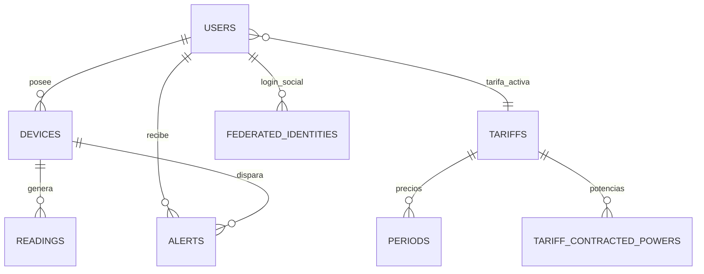
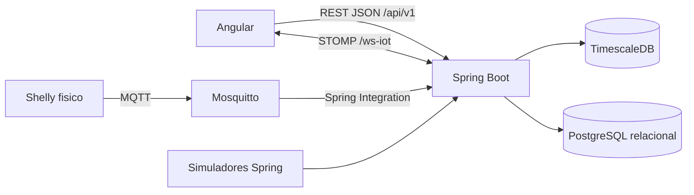

# Memoria tecnica del proyecto Wattimizer

## Indice detallado

1. [Introduccion y justificacion](#1-introduccion-y-justificacion)
   - [1.1. Titulo del proyecto](#11-titulo-del-proyecto)
   - [1.2. Descripcion del problema](#12-descripcion-del-problema)
   - [1.3. Objetivos](#13-objetivos)
   - [1.4. Tipos de usuarios](#14-tipos-de-usuarios)
2. [Fase 1: Analisis funcional](#2-fase-1-analisis-funcional)
   - [2.1. Mapa de funcionalidades](#21-mapa-de-funcionalidades)
   - [2.2. Historias de usuario](#22-historias-de-usuario)
   - [2.3. Gestion del trabajo](#23-gestion-del-trabajo-github-y-kanban)
   - [2.4. Planificacion inicial](#24-planificacion-inicial)
3. [Fase 2: Diseno tecnico](#3-fase-2-diseno-tecnico)
   - [3.1. Diseno de base de datos](#31-diseno-de-la-base-de-datos)
   - [3.2. Arquitectura del sistema](#32-arquitectura-del-sistema)
   - [3.3. Diseno de interfaz](#33-diseno-de-interfaz)
   - [3.4. Relacion entre historias y diseno](#34-relacion-entre-historias-y-diseno)
4. [Fase 3: Implementacion y desarrollo](#4-fase-3-implementacion-y-desarrollo)
   - [4.1. Tecnologias utilizadas](#41-tecnologias-utilizadas)
   - [4.2. Desarrollo del backend](#42-desarrollo-del-backend)
   - [4.3. Desarrollo del frontend](#43-desarrollo-del-frontend)
   - [4.4. Control de versiones](#44-control-de-versiones)
5. [Fase 4: Pruebas y despliegue](#5-fase-4-pruebas-y-despliegue)
   - [5.1. Plan de pruebas](#51-plan-de-pruebas)
   - [5.2. Manual de instalacion y uso](#52-manual-de-instalacion-y-uso)
   - [5.3. Despliegue](#53-despliegue)
6. [Conclusiones y lineas futuras](#6-conclusiones-y-lineas-futuras)
7. [Bibliografia y recursos](#7-bibliografia-y-recursos)
8. [Anexos tecnicos](#8-anexos-tecnicos)

---

## 1. Introduccion y justificacion

### 1.1. Titulo del proyecto

**Wattimizer**: plataforma web de monitorizacion energetica orientada a pequenas empresas y usuarios que necesitan relacionar su consumo electrico real con el coste economico de su tarifa.

### 1.2. Descripcion del problema

En muchos negocios pequenos el consumo electrico se controla tarde, cuando la factura ya ha llegado. Esto impide detectar picos de potencia, consumo nocturno innecesario o equipos que permanecen encendidos fuera de horario. El problema no es solo saber cuantos kWh se consumen, sino entender cuanto dinero representa ese consumo segun la tarifa contratada y el periodo regulatorio que aplica en cada momento.

Wattimizer ataca esa necesidad conectando dispositivos IoT Shelly por MQTT, guardando lecturas temporales en TimescaleDB y mostrando en Angular una vista clara del consumo activo, el gasto diario y el consumo fantasma. Los cambios recientes del repositorio refuerzan esta idea con simuladores IoT por perfil, un pack de demostracion, panel multi-dispositivo y despliegue automatizado en Hetzner.

### 1.3. Objetivos

#### Objetivo general

Desarrollar una aplicacion web full-stack que permita registrar dispositivos electricos, recibir telemetria en tiempo real, calcular costes energeticos y avisar de excesos de potencia contratada.

#### Objetivos especificos

- Implementar una API REST segura con Spring Boot 4 para autenticacion, dispositivos, lecturas, tarifas, alertas y analiticas.
- Ingerir mensajes MQTT de enchufes Shelly mediante Spring Integration y transformarlos en lecturas persistentes.
- Almacenar las lecturas en una hypertable de TimescaleDB para trabajar con series temporales.
- Construir una interfaz Angular 21 con rutas protegidas, formularios reactivos, grafica en tiempo real y estado compartido con NgRx Signal Store.
- Permitir pruebas sin hardware fisico mediante dispositivos simulados y perfiles de consumo.
- Desplegar el sistema en un VPS de Hetzner con Docker Compose, Nginx, Mosquitto, TimescaleDB y CI/CD desde GitHub Actions.

### 1.4. Tipos de usuarios

| Usuario | Rol tecnico | Uso principal |
|---|---|---|
| Visitante registrado | `ROLE_USER` | Gestiona sus dispositivos, asigna una tarifa, consulta el dashboard y revisa alertas. |
| Administrador | `ROLE_ADMIN` | Mantiene el catalogo maestro de tarifas y tambien puede probar su tarifa personal. |
| Dispositivo IoT Shelly | Cliente MQTT | Publica telemetria hacia Mosquitto en topics `events/rpc` y `status/switch:0`. |
| Sistema de simulacion | Job Spring interno | Genera lecturas sinteticas para dispositivos marcados como simulados. |

---

## 2. Fase 1: Analisis funcional

### 2.1. Mapa de funcionalidades

| Modulo | Funcionalidades |
|---|---|
| Autenticacion | Login con usuario y contrasena, registro publico, registro de administrador con cabecera secreta, login social OAuth2 con Google/GitHub y entrega de JWT propio. |
| Dispositivos | Listado por usuario, vinculacion de Shelly fisico por MAC, alta de simuladores, pack de nueve perfiles demo, edicion de nombre/estado/perfil y borrado con limpieza de lecturas y alertas. |
| Telemetria | Recepcion MQTT asincrona, persistencia de lecturas, envio por WebSocket STOMP y carga de historial reciente por REST. |
| Dashboard | Selector multi-dispositivo, grafica de potencia, coste diario, consumo fantasma y aviso si falta tarifa. |
| Tarifas | Catalogo maestro, clonacion de plantilla como tarifa privada, edicion de precios y potencias, validacion de periodos CNMC y desvinculacion. |
| Alertas | Deteccion de exceso de potencia contratada, persistencia de alertas y descarte por usuario. |
| Despliegue | Contenedores Docker, Nginx como proxy, certificados Let's Encrypt, variables `.env` y despliegue automatico en `main`. |

### 2.2. Historias de usuario

| ID | Historia | Criterios de aceptacion | Prioridad |
|---|---|---|---|
| HU-01 | Como usuario, quiero registrarme e iniciar sesion para acceder a mi panel privado. | El backend crea usuarios `ROLE_USER`; el login devuelve JWT; Angular guarda el token y protege rutas privadas. | MVP |
| HU-02 | Como administrador, quiero crear plantillas de tarifas para que los usuarios puedan asignarselas. | Solo `ROLE_ADMIN` puede crear, editar y borrar tarifas; se validan periodos y potencias antes de guardar. | MVP |
| HU-03 | Como usuario, quiero asignarme una tarifa del catalogo para activar calculos de coste. | `POST /api/v1/users/me/tariff` clona la plantilla; la plantilla original no se modifica. | MVP |
| HU-04 | Como usuario, quiero registrar un Shelly fisico por MAC para ver sus datos. | El formulario Angular exige 12 caracteres hexadecimales; si el dispositivo no existe, el backend lo crea y lo asocia al usuario autenticado. | MVP |
| HU-05 | Como usuario, quiero ver lecturas en tiempo real para saber el consumo actual. | El dashboard carga historial reciente por REST y despues recibe nuevas lecturas por STOMP en `/topic/readings/{mac}`. | MVP |
| HU-06 | Como usuario, quiero conocer el coste diario y el consumo fantasma. | Las metricas se calculan solo si existe tarifa; el consumo fantasma se limita a 00:00-05:59 hora local del contrato. | MVP |
| HU-07 | Como usuario, quiero recibir alertas si supero la potencia contratada. | Cada lectura se compara con la potencia contratada del periodo aplicable y genera una alerta `OVERPOWER`. | MVP |
| HU-08 | Como usuario sin hardware, quiero crear simuladores para probar la plataforma. | El sistema permite crear un simulador individual o un pack demo idempotente de nueve perfiles. | MVP |
| HU-09 | Como usuario, quiero borrar dispositivos y alertas que ya no necesito. | Al borrar un dispositivo se eliminan antes sus lecturas y alertas para evitar errores por claves foraneas. | MVP |
| HU-10 | Como administrador, quiero desplegar cambios sin entrar manualmente al servidor. | GitHub Actions compila frontend/backend y actualiza el VPS por SSH cuando se hace push a `main`. | Opcional avanzado |

### 2.3. Gestion del trabajo GitHub y Kanban

- **Repositorio:** `https://github.com/joellmar/wattpath-app`
- **Rama principal:** `main`
- **Flujo observado:** ramas de trabajo para cambios concretos, commits pequenos con prefijos `feat`, `fix`, `docs` y despliegue automatico solo desde `main`.
- **Columnas Kanban recomendadas para la memoria:** Backlog, Por hacer, En progreso, En revision y Hecho.

> Para el documento final de clase conviene insertar aqui una captura real del tablero Kanban de GitHub Projects, porque no se encuentra en el codigo fuente del repositorio.

### 2.4. Planificacion inicial

| Fase | Historias asociadas | Dificultad tecnica |
|---|---|---|
| Analisis y autenticacion | HU-01 | Media: seguridad JWT, OAuth2 y rutas protegidas. |
| Modelo energetico | HU-02, HU-03 | Alta: validacion de periodos TD, calendario por zona y contratos privados. |
| IoT y datos temporales | HU-04, HU-05 | Alta: MQTT, WebSocket, TimescaleDB y persistencia ordenada por tiempo. |
| Analiticas y alertas | HU-06, HU-07 | Media-alta: calculo por deltas de kWh y resolucion del periodo aplicable. |
| Experiencia de demo | HU-08, HU-09 | Media: simuladores, borrado seguro y panel multi-dispositivo. |
| Despliegue | HU-10 | Alta: Docker Compose, Nginx, certificados, secrets y reinicio post-deploy. |

---

## 3. Fase 2: Diseno tecnico

### 3.1. Diseno de la base de datos

El diseno combina tablas relacionales clasicas con una tabla de serie temporal:

- `users`: usuarios de la plataforma y rol Spring Security.
- `federated_identities`: relacion entre usuario local y proveedor OAuth2.
- `devices`: dispositivos fisicos o simulados, asociados opcionalmente a un usuario.
- `readings`: lecturas temporales de potencia y energia, convertida a hypertable en TimescaleDB.
- `tariffs`, `periods`, `tariff_contracted_powers`: contrato electrico, precios por periodo y potencia contratada.
- `tariff_calendar_slots`: dimension regulatoria global para resolver zona + mes + tipo de dia + hora local.
- `alerts`: incidencias de maximetro vinculadas a usuario y dispositivo.



La clave de `readings` es compuesta: `time` + `device_id`. Esta decision evita depender de un identificador artificial para datos de telemetria y encaja con el acceso por rango temporal.

### 3.2. Arquitectura del sistema

| Capa | Tecnologia | Responsabilidad |
|---|---|---|
| Frontend | Angular 21, PrimeNG, Chart.js, RxJS, `@ngrx/signals` | Interfaz, formularios, estado reactivo, consumo REST y WebSocket. |
| Backend | Java 26, Spring Boot 4.0.5, Spring Security, JPA, MapStruct | API REST, autenticacion, reglas de negocio, mapeo DTO-entidad y gestion de errores. |
| Ingesta IoT | Spring Integration MQTT + Eclipse Paho | Suscripcion al broker Mosquitto, ruteo de mensajes Shelly y persistencia asincrona. |
| Base de datos | PostgreSQL + TimescaleDB | Persistencia relacional y almacenamiento eficiente de lecturas temporales. |
| Tiempo real | STOMP WebSocket | Envio de lecturas al dashboard; el backend tambien publica alertas por STOMP, aunque la vista actual de alertas las consulta por REST. |
| Despliegue | Docker Compose, Nginx, GitHub Actions, Hetzner | Orquestacion de servicios, HTTPS, proxy inverso y CI/CD. |



### 3.3. Diseno de interfaz

Las pantallas principales ya estan implementadas como componentes standalone:

- **Login y registro:** entrada publica con autenticacion por credenciales y OAuth2.
- **Layout principal:** barra lateral y cierre de sesion con limpieza de stores.
- **Dashboard:** selector de medidor, grafica de las ultimas 20 lecturas, coste diario y consumo fantasma.
- **Dispositivos:** formulario para fisicos/simulados, tabla de inventario, detalle, edicion, apagado/encendido y borrado.
- **Tarifas:** vista dual; admin gestiona catalogo y usuario gestiona su tarifa activa.
- **Alertas:** listado de incidencias de maximetro y descarte individual.

### 3.4. Relacion entre historias y diseno

| Historia | Tablas principales | Codigo responsable |
|---|---|---|
| HU-01 | `users`, `federated_identities` | `AuthController`, `AuthRegistrationService`, `OAuth2LoginTicketService`, `SessionStorageService`. |
| HU-02 | `tariffs`, `periods`, `tariff_contracted_powers` | `TariffController`, `TariffService`, `TariffComponent`, `TariffStore`. |
| HU-03 | `users.tariff_id`, `tariffs` | `UserTariffController`, `UserTariffService`, `TariffService`. |
| HU-04 | `devices` | `DeviceController`, `DeviceService`, `DevicesComponent`, `TelemetryStore`. |
| HU-05 | `readings` | `MqttConfig`, `DeviceMessageHandler`, `ReadingService`, `TelemetryBroadcaster`, `DashboardComponent`. |
| HU-06 | `readings`, `tariffs`, `periods`, `tariff_calendar_slots` | `ConsumptionController`, `ConsumptionService`, `CalendarResolverService`. |
| HU-07 | `alerts`, `tariff_contracted_powers` | `AlertService`, `AlertController`, `AlertsComponent`. |
| HU-08 | `devices`, `readings` | `IotTelemetrySimulationJob`, `SimulatedTelemetryProcessor`, `SimulationProfileRegistry`, `DevicesComponent`. |
| HU-09 | `devices`, `readings`, `alerts` | `DeviceService.deleteById`, `ReadingRepository.deleteAllByDeviceMacAddress`, `AlertRepository.deleteByDeviceId`. |
| HU-10 | No aplica a dominio | `.github/workflows/deploy.yml`, `docker-compose.yml`, `nginx/default.conf`. |

---

## 4. Fase 3: Implementacion y desarrollo

### 4.1. Tecnologias utilizadas

| Area | Versiones y librerias reales |
|---|---|
| Backend | Java 26, Spring Boot 4.0.5, Spring WebMVC, Spring Security, OAuth2 Client, Spring Data JPA, Spring WebSocket, Spring Integration MQTT. |
| Persistencia | PostgreSQL, TimescaleDB `timescale/timescaledb-ha:pg17`, driver PostgreSQL, Hibernate `ddl-auto=update`. |
| Mapeo | MapStruct 1.6.3 y Lombok. |
| Seguridad | JWT con `jjwt` 0.12.5, filtro `JwtValidatorFilter`, roles `ROLE_USER` y `ROLE_ADMIN`. |
| Frontend | Angular 21, TypeScript 5.9, PrimeNG 21, RxJS 7.8, `@ngrx/signals` 21, Chart.js 4.5.1. |
| Tiempo real | `@stomp/rx-stomp` y `@stomp/stompjs`. |
| Calidad | Maven Wrapper, Angular CLI, Biome, Vitest/jsdom. |
| Infraestructura | Docker Compose, Nginx, Eclipse Mosquitto 2.1.2, GitHub Actions, Hetzner VPS. |

### 4.2. Desarrollo del backend

El backend se organiza alrededor de controladores REST finos y servicios con la logica de negocio. Los controladores reciben DTOs, validan propiedad con el `Principal` cuando toca y delegan en servicios.

Los detalles completos de endpoints, DTOs y servicios estan en:

- [Anexo A - Backend REST](./anexo-a-backend-rest.md)
- [Anexo C - Telemetria MQTT y simulacion IoT](./anexo-c-telemetria-mqtt.md)
- [Anexo D - TimescaleDB y analitica energetica](./anexo-d-timescaledb-analitica.md)

Decisiones importantes:

- Las rutas privadas dependen del JWT, no de `userId` enviado por el cliente. Esto reduce el riesgo de IDOR.
- La tarifa privada del usuario se clona desde una plantilla para no modificar el catalogo global.
- El borrado de dispositivos elimina antes lecturas y alertas asociadas para evitar conflictos de integridad.
- La telemetria simulada entra por el mismo flujo posterior que la real: lectura, WebSocket y comprobacion de alertas.

### 4.3. Desarrollo del frontend

El frontend usa componentes standalone y carga perezosa por rutas. La parte reactiva se reparte en dos niveles:

- **NgRx Signal Store:** `TelemetryStore` y `TariffStore` para estado compartido.
- **Angular Signals locales:** mensajes, formularios, modales, carga de analiticas y estado visual por componente.

No hay NgRx clasico con actions/reducers/effects. El equivalente practico se consigue con `rxMethod`, `patchState`, `computed` y `effect`.

El detalle de componentes, servicios y flujos RxJS esta en:

- [Anexo B - Frontend Angular, RxJS y NgRx Signals](./anexo-b-frontend-angular.md)

### 4.4. Control de versiones

El historial reciente muestra un flujo con commits pequenos y descriptivos:

- `feat(devices)`: perfiles de simulacion y CRUD simulado.
- `feat(prod)`: simuladores en modo demo y pack de demostracion.
- `fix(simulators)`: borrado en cascada, telemetria por perfil y panel multi-dispositivo.
- `fix(deploy)`: reinicio de Nginx tras `docker compose up` para evitar 502 por IP cacheada.

La decision de desplegar solo desde `main` reduce despliegues accidentales desde ramas no revisadas.

---

## 5. Fase 4: Pruebas y despliegue

### 5.1. Plan de pruebas

| Prueba | Validacion esperada | Codigo relacionado |
|---|---|---|
| Login con credenciales incorrectas | Respuesta 401 con mensaje generico. | `AuthController`, `GlobalExceptionHandler`. |
| Registro con correo duplicado | Respuesta 400 si salta `users_username_key`. | `GlobalExceptionHandler`. |
| Acceso a ruta protegida sin JWT | Redireccion a `/login` en frontend o 401 en backend. | `authGuard`, `httpInterceptor`, `SecurityConfig`. |
| Crear tarifa 3.0TD con potencias desordenadas | Error 400 por regla P1 <= P2 <= ... <= P6. | `TariffService.validate6PeriodTariff`. |
| Asignar plantilla de tarifa | Se crea clon privado y el catalogo no cambia. | `UserTariffService.cloneTariff`. |
| Crear simulador individual | Se genera MAC `SIM...`, perfil y lecturas periodicas si `simulation.enabled=true`. | `DeviceService`, `IotTelemetrySimulationJob`. |
| Anadir pack demo dos veces | La segunda llamada no duplica perfiles ya existentes. | `createDemoSimulatorPack`. |
| Dashboard con tarifa | Muestra coste diario y consumo fantasma. | `DashboardComponent`, `ConsumptionController`. |
| Dashboard sin tarifa | Muestra banner y bloquea metricas economicas. | `DashboardComponent`. |
| Borrar dispositivo con lecturas | Se borran lecturas y alertas antes del dispositivo. | `DeviceService.deleteById`. |

El repositorio incluye pruebas unitarias en backend para servicios de consumo, calendario, registro, tarifas y simulacion, y pruebas Angular para componentes/servicios principales.

### 5.2. Manual de instalacion y uso

#### Arranque local

```bash
# Backend
cd backend
./mvnw spring-boot:run

# Frontend
cd frontend
npm install
npm start
```

#### Servicios con Docker

```bash
cp .env.example .env
docker compose --env-file .env up -d --build
```

Despues del primer arranque de base de datos hay que ejecutar, en orden, los scripts SQL documentados en `docs/deployment/hetzner-production.md`:

1. `db/dev-seed/00-extensions.sql`
2. `db/dev-seed/01-hypertable.sql`
3. `db/tariffs-td-schema.sql`
4. `db/seed-tariff-calendar-slots.sql`
5. Seeds de desarrollo solo si se quiere entorno local con datos de prueba.
6. `db/prod/99-resync-sequences.sql`

#### Uso basico

1. Registrarse o iniciar sesion.
2. Ir a **Tarifas** y asignar una plantilla o configurar un contrato.
3. Ir a **Dispositivos** y vincular un Shelly fisico por MAC o crear simuladores.
4. Abrir **Panel** para consultar la grafica y metricas.
5. Revisar **Alertas** si se supera la potencia contratada.

### 5.3. Despliegue

El despliegue de produccion esta documentado en [Guia de Hetzner](../deployment/hetzner-production.md). La arquitectura usa:

- VPS Ubuntu 24.04 LTS en Hetzner.
- Docker Compose con `timescaledb`, `mosquitto`, `backend`, `frontend` y `nginx`.
- Certbot nativo en el host y certificados montados en Nginx.
- GitHub Actions para compilar Angular, empaquetar Spring Boot y actualizar el servidor por SSH.
- Reinicio de Nginx tras recrear contenedores para evitar errores 502 por cache de DNS interna de Docker.

---

## 6. Conclusiones y lineas futuras

### 6.1. Grado de cumplimiento

El MVP esta cubierto: autenticacion, dispositivos, telemetria, tarifas, costes, alertas, dashboard y despliegue. Ademas, la incorporacion de simuladores mejora la defensa del proyecto porque permite demostrar el sistema sin depender de hardware fisico durante la presentacion.

### 6.2. Dificultades

- **Telemetria asincrona:** hubo que separar mensajes Shelly de tipo `events/rpc` y `status/switch:0` antes de persistirlos.
- **Tarifas electricas TD:** el horario no se puede guardar dentro de cada periodo contractual; se resolvio con `tariff_calendar_slots` como tabla de dimension.
- **Contratos privados:** se clonan las plantillas para que el usuario pueda editar precios sin afectar al catalogo.
- **Despliegue Docker:** Nginx podia quedarse apuntando a una IP interna antigua tras recrear contenedores; se resolvio reiniciando Nginx en el workflow.
- **Demo sin hardware:** los simuladores generan lecturas realistas por perfil y respetan el mismo pipeline que los dispositivos reales.

### 6.3. Mejoras futuras

- Sustituir el puerto MQTT 1883 por MQTT sobre TLS o una VPN entre Shelly y servidor.
- Cambiar `ddl-auto=update` por migraciones versionadas cuando el modelo se estabilice.
- Anadir consultas nativas TimescaleDB (`time_bucket`, agregados continuos) para informes historicos grandes.
- Incorporar predicciones de factura mensual y recomendaciones automaticas de potencia contratada.
- Mejorar la gestion de alertas con estados, filtros, severidad y notificaciones por email.
- Crear una app movil o PWA instalable para consultar consumo desde el telefono.

---

## 7. Bibliografia y recursos

- Documentacion oficial de Spring Boot, Spring Security, Spring Data JPA y Spring Integration MQTT.
- Documentacion oficial de Angular, RxJS y NgRx Signal Store.
- Documentacion de TimescaleDB sobre hypertables y particionado temporal.
- Documentacion de PostgreSQL para constraints, indices y claves foraneas.
- Documentacion de Eclipse Mosquitto.
- Documentacion de PrimeNG, Chart.js y STOMP.
- Guia de despliegue interna: `docs/deployment/hetzner-production.md`.

---

## 8. Anexos tecnicos

- [Anexo A - Backend REST](./anexo-a-backend-rest.md)
- [Anexo B - Frontend Angular, RxJS y NgRx Signals](./anexo-b-frontend-angular.md)
- [Anexo C - Telemetria MQTT y simulacion IoT](./anexo-c-telemetria-mqtt.md)
- [Anexo D - TimescaleDB y analitica energetica](./anexo-d-timescaledb-analitica.md)
- [Canvas documental - Arquitectura Wattimizer](../../docs-canvas/arquitectura-wattimizer.md)
