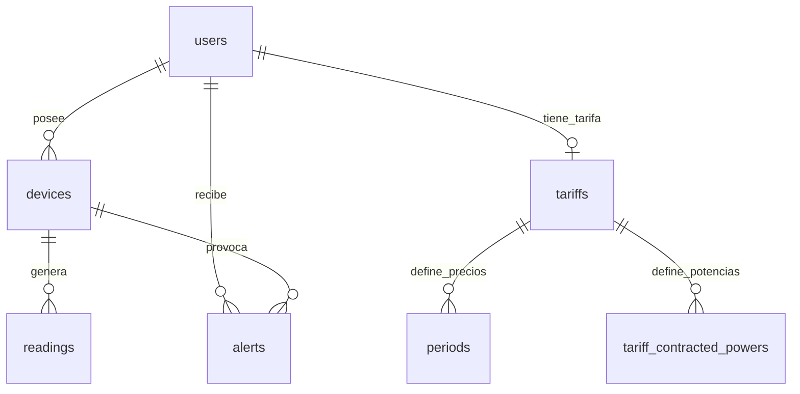

# Memoria técnica del proyecto Wattimizer

## Índice

1. [Introducción y justificación](#1-introducción-y-justificación)
2. [Fase 1: análisis funcional](#2-fase-1-análisis-funcional)
3. [Fase 2: diseño técnico](#3-fase-2-diseño-técnico)
4. [Fase 3: implementación y desarrollo](#4-fase-3-implementación-y-desarrollo)
5. [Fase 4: pruebas y despliegue](#5-fase-4-pruebas-y-despliegue)
6. [Conclusiones y líneas futuras](#6-conclusiones-y-líneas-futuras)
7. [Bibliografía y recursos](#7-bibliografía-y-recursos)
8. [Anexos técnicos](#8-anexos-técnicos)

## 1. Introducción y justificación

### 1.1. Título del proyecto

**Wattimizer**: plataforma web para monitorización energética, análisis de costes eléctricos y gestión de dispositivos IoT.

### 1.2. Descripción del problema

Muchas pymes pueden consultar su factura eléctrica al final del mes, pero no tienen una lectura clara de qué dispositivos están generando el gasto en cada momento. Esa falta de visibilidad provoca decisiones tardías: consumos fantasma por la noche, picos de potencia que superan lo contratado o tarifas que no encajan con el uso real del negocio.

Wattimizer plantea una solución web completa: conecta dispositivos inteligentes tipo Shelly por MQTT, guarda las lecturas como series temporales en TimescaleDB y traduce los kWh en euros usando tarifas TD españolas. La intención no es solo mostrar vatios en una gráfica, sino convertir la telemetría en información económica entendible para el usuario.

### 1.3. Objetivos

#### Objetivo general

Desarrollar una aplicación web full-stack que permita a un usuario autenticado registrar dispositivos energéticos, visualizar su consumo en tiempo real, configurar su tarifa eléctrica y obtener analíticas de coste.

#### Objetivos específicos

- Implementar autenticación con JWT y OAuth2, manteniendo sesiones stateless en el backend.
- Crear una API REST versionada bajo `/api/v1` para usuarios, dispositivos, lecturas, tarifas, alertas y analíticas.
- Integrar telemetría MQTT mediante Spring Integration para procesar mensajes Shelly de forma automática.
- Persistir lecturas en PostgreSQL con TimescaleDB para trabajar con datos temporales.
- Construir un frontend Angular con rutas protegidas, stores reactivos y visualización en tiempo real mediante STOMP.
- Permitir dispositivos simulados para demostrar el sistema sin depender siempre de hardware físico.
- Calcular coste energético y consumo fantasma a partir de lecturas históricas y periodos tarifarios.
- Documentar el proyecto con anexos técnicos reutilizables en la memoria final de DAW.

### 1.4. Tipos de usuarios

| Tipo de usuario | Descripción | Capacidades principales |
| --- | --- | --- |
| Usuario empresa | Cliente final que monitoriza su consumo energético | Registro, login, vinculación de dispositivos, consulta de dashboard, configuración de tarifa privada y revisión de alertas |
| Administrador | Usuario con rol `ROLE_ADMIN` | Gestión del catálogo maestro de tarifas y registro administrativo con secreto |
| Sistema IoT | Dispositivos Shelly o simuladores internos | Envío de telemetría MQTT o generación programada de lecturas |

## 2. Fase 1: análisis funcional

### 2.1. Mapa de funcionalidades

| Módulo | Funcionalidades implementadas |
| --- | --- |
| Autenticación | Login con email/contraseña, registro, registro admin con secreto, OAuth2 con Google/GitHub y canje de ticket |
| Dispositivos | Listado, vinculación por MAC, creación de simuladores, pack demo, edición, encendido/apagado lógico y borrado |
| Dashboard | Selector de medidor, gráfica de potencia en tiempo real, coste diario y consumo fantasma |
| Tarifas | Catálogo maestro, tarifa privada por usuario, validación de periodos TD y potencias contratadas |
| Telemetría | Suscripción MQTT, parseo de payload Shelly, persistencia de lecturas, emisión WebSocket |
| Alertas | Generación de alertas de sobrepotencia y limpieza por usuario |
| Analíticas | Cálculo de coste por periodo y coste de consumo fantasma nocturno |
| Despliegue | Docker Compose con backend, frontend, PostgreSQL/TimescaleDB, Mosquitto y Nginx |

### 2.2. Historias de usuario

| ID | Historia de usuario | Criterios de aceptación | Prioridad |
| --- | --- | --- | --- |
| HU-01 | Como usuario, quiero registrarme e iniciar sesión para acceder a mis datos energéticos. | El registro crea un usuario; el login devuelve un JWT; las rutas privadas redirigen si no hay sesión válida. | Imprescindible |
| HU-02 | Como usuario, quiero vincular un dispositivo por MAC para asociarlo a mi cuenta. | El formulario valida la MAC; el backend vincula el dispositivo al usuario autenticado; aparece en el inventario. | Imprescindible |
| HU-03 | Como usuario, quiero ver mi consumo en tiempo real para detectar picos. | El dashboard se suscribe a `/topic/readings/{mac}` y actualiza la gráfica con las últimas lecturas. | Imprescindible |
| HU-04 | Como usuario, quiero configurar mi tarifa para ver costes en euros. | Se puede clonar una plantilla o guardar una tarifa privada; el dashboard solo muestra analíticas si existe tarifa. | Imprescindible |
| HU-05 | Como usuario, quiero detectar consumo fantasma para reducir gasto nocturno. | El backend calcula coste entre las 00:00 y las 06:00 en la zona horaria del contrato. | Imprescindible |
| HU-06 | Como administrador, quiero mantener el catálogo de tarifas para que los usuarios tengan plantillas correctas. | Solo `ROLE_ADMIN` puede crear, editar o borrar tarifas del catálogo maestro. | Imprescindible |
| HU-07 | Como usuario, quiero probar la aplicación sin hardware físico. | Se pueden crear simuladores y un pack demo con perfiles de consumo predefinidos. | Opcional |
| HU-08 | Como usuario, quiero recibir alertas de sobrepotencia para revisar mi potencia contratada. | Tras cada lectura se compara la potencia con la contratada y se genera una alerta `OVERPOWER` si procede. | Opcional |

### 2.3. Gestión del trabajo

- **Repositorio:** <https://github.com/joellmar/wattpath-app>
- **Rama documentada:** `cursor/documentaci-n-t-cnica-del-proyecto-226c`
- **Base:** `main`
- **Flujo usado:** commits pequeños por funcionalidad en ramas de trabajo y despliegue automatizado sobre la rama principal.

El tablero Kanban usado para la planificación se estructura con las columnas habituales: **Backlog**, **Por hacer**, **En progreso**, **En revisión** y **Hecho**. Para la memoria final puede añadirse una captura del tablero real de GitHub Projects si se entrega en formato PDF.

### 2.4. Planificación inicial

| Fase | Historias asociadas | Dificultad técnica |
| --- | --- | --- |
| Análisis y base del proyecto | HU-01, HU-02 | Media, por el diseño de seguridad y modelo de usuarios |
| Ingesta IoT | HU-03 | Alta, por MQTT, parseo de payloads y persistencia temporal |
| Tarifas y analíticas | HU-04, HU-05, HU-06 | Alta, por la lógica regulatoria TD y cálculo de coste |
| Frontend de usuario | HU-02, HU-03, HU-04, HU-07 | Media-alta, por la coordinación entre signals, RxJS y WebSocket |
| Alertas y refinamiento | HU-08 | Media, por depender de telemetría y tarifa contratada |
| Despliegue | Todas | Media, por integrar Docker, Nginx, Mosquitto y TimescaleDB |

## 3. Fase 2: diseño técnico

### 3.1. Diseño de la base de datos

El modelo combina entidades de negocio clásicas con una tabla de lecturas temporal:

- `users`: usuarios autenticados, roles y tarifa asociada.
- `devices`: dispositivos físicos o simulados, vinculados opcionalmente a un usuario.
- `readings`: lecturas energéticas por instante y dispositivo, convertida en hypertable de TimescaleDB.
- `tariffs`, `periods`, `tariff_contracted_powers`: contrato energético y precios por periodo.
- `tariff_calendar_slots`: calendario regulatorio que resuelve el periodo P1-P6 aplicable.
- `alerts`: avisos asociados a usuario y dispositivo.



La clave de `readings` es compuesta: `(time, device_id)`. Esta decisión evita duplicar lecturas del mismo dispositivo en el mismo instante y encaja con TimescaleDB, donde la dimensión temporal es el centro de la tabla.

### 3.2. Arquitectura del sistema

| Capa | Tecnología | Papel en el proyecto |
| --- | --- | --- |
| Backend | Java 26, Spring Boot 4.0.5, Spring Security, Spring Integration MQTT, JPA | API REST, autenticación, ingesta IoT, analíticas y persistencia |
| Frontend | Angular 21, TypeScript, PrimeNG, Tailwind, NgRx Signals, RxJS | Interfaz web, stores reactivos, formularios y visualización de datos |
| Base de datos | PostgreSQL + TimescaleDB | Datos relacionales y series temporales de lecturas |
| Mensajería IoT | Eclipse Mosquitto + MQTT | Recepción de telemetría desde dispositivos Shelly |
| Tiempo real | WebSocket STOMP | Envío de lecturas y alertas al frontend |
| Despliegue | Docker Compose + Nginx | Orquestación local/producción y proxy HTTP/WebSocket |

```mermaid
flowchart LR
  Angular[Angular 21] -->|REST JSON /api/v1| Backend[Spring Boot]
  Angular -->|STOMP /ws-iot| Backend
  Shelly[Dispositivo Shelly] -->|MQTT| Mosquitto[Eclipse Mosquitto]
  Mosquitto -->|Spring Integration| Backend
  Backend -->|JPA| DB[(PostgreSQL + TimescaleDB)]
  Backend -->|/topic/readings/{mac}| Angular
```

### 3.3. Diseño de interfaz

Las pantallas principales implementadas son:

- **Login y registro:** formularios sencillos con OAuth2 opcional.
- **Dashboard:** selector de dispositivo, gráfica de potencia, coste diario y consumo fantasma.
- **Dispositivos:** alta física por MAC, creación de simuladores, pack demo e inventario.
- **Tarifas:** catálogo, tarifa privada del usuario y edición de periodos/precios.
- **Alertas:** tabla de avisos generados por sobrepotencia.

El diseño visual se apoya en PrimeNG y Tailwind. La interfaz prioriza tarjetas y estados de carga claros porque el dato energético puede tardar en llegar si no hay telemetría reciente.

### 3.4. Relación entre historias y diseño

| Historia | Tablas principales | Código principal |
| --- | --- | --- |
| HU-01 | `users`, identidades federadas | `AuthController`, `JwtTokenService`, `SessionStorageService`, `authGuard` |
| HU-02 | `devices` | `DeviceController`, `DeviceService`, `DevicesComponent`, `TelemetryStore` |
| HU-03 | `readings`, `devices` | `MqttConfig`, `DeviceMessageHandler`, `ReadingService`, `WebsocketService`, `DashboardComponent` |
| HU-04 | `tariffs`, `periods`, `tariff_contracted_powers`, `users` | `UserTariffController`, `TariffService`, `TariffStore`, `TariffComponent` |
| HU-05 | `readings`, `tariff_calendar_slots`, `periods` | `ConsumptionController`, `ConsumptionService`, `CalendarResolverService` |
| HU-06 | `tariffs`, `periods`, `tariff_contracted_powers` | `TariffController`, `TariffComponent` en modo admin |
| HU-07 | `devices`, `readings` | `IotTelemetrySimulationJob`, `SimulatedTelemetryProcessor`, `DevicesComponent` |
| HU-08 | `alerts`, `devices`, `users` | `AlertService`, `TelemetryBroadcaster`, `AlertsComponent` |

## 4. Fase 3: implementación y desarrollo

### 4.1. Tecnologías utilizadas

| Área | Tecnología detectada en el repositorio |
| --- | --- |
| Backend | Spring Boot `4.0.5`, Java `26`, Maven, Lombok, MapStruct `1.6.3` |
| Seguridad | Spring Security, JWT con `jjwt 0.12.5`, OAuth2 Client |
| MQTT | Spring Integration MQTT, Eclipse Paho `1.2.5`, HiveMQ client `1.3.13` |
| Base de datos | PostgreSQL, TimescaleDB, JPA/Hibernate |
| Frontend | Angular `21.x`, TypeScript `5.9`, RxJS `7.8`, NgRx Signals `21.1` |
| UI | PrimeNG `21.1`, Tailwind CSS `4.1`, Chart.js `4.5` |
| WebSocket | `@stomp/rx-stomp`, STOMP sobre `/ws-iot` |
| Calidad | Biome, Vitest, pruebas unitarias Angular |

### 4.2. Desarrollo del backend

El backend expone controladores REST bajo `/api/v1`. La seguridad es stateless y se basa en JWT. En las operaciones privadas de consulta, actualización y borrado, la propiedad de recursos se comprueba a partir del `Principal`, no recibiendo `userId` desde el cliente. Esto es especialmente importante en dispositivos, lecturas y tarifa privada, porque evita que un usuario consulte datos de otro modificando una URL.

La lógica de negocio se reparte en servicios:

- `DeviceService` gestiona vinculación, simuladores y borrado de dispositivos.
- `ReadingService` centraliza la persistencia de lecturas.
- `ConsumptionService` calcula coste real y consumo fantasma.
- `TariffService` y `UserTariffService` validan tarifas y contratos privados.
- `AlertService` crea alertas cuando la potencia supera la contratada.

Los errores de negocio se devuelven con `ErrorResponse`, aunque algunos accesos no autorizados en controladores concretos devuelven `403` sin cuerpo por simplicidad.

### 4.3. Desarrollo del frontend

El frontend está construido con componentes standalone de Angular. Las rutas privadas dependen de `authGuard`, que verifica el JWT almacenado en `sessionStorage`. El interceptor HTTP añade el Bearer token a las llamadas `/api/v1` y redirige al login si recibe un `401`.

La parte reactiva se basa en:

- **Signals** para estado local de componentes.
- **NgRx Signals** para estado compartido (`TelemetryStore` y `TariffStore`).
- **RxJS** para HTTP, WebSocket y métodos reactivos con `rxMethod`.

El dashboard no consulta solo datos históricos: primero carga una ventana reciente desde REST y después mantiene la gráfica viva con STOMP. Así la pantalla no aparece vacía si el usuario entra después de que ya existan lecturas.

### 4.4. Control de versiones

El repositorio utiliza Git con ramas de trabajo. La rama actual de documentación parte de `main`, donde se observan commits recientes orientados a despliegue, simuladores, configuración MQTT/OAuth2, CI y correcciones de Nginx. El flujo recomendado para el proyecto es:

1. Crear rama específica por funcionalidad o documentación.
2. Commit pequeño con mensaje descriptivo.
3. Push a la rama remota.
4. Revisión mediante Pull Request antes de integrar en `main`.

## 5. Fase 4: pruebas y despliegue

### 5.1. Plan de pruebas

| Prueba | Validación esperada | Evidencia en código |
| --- | --- | --- |
| Login con credenciales correctas | Devuelve JWT y navega al dashboard | `AuthController`, `AuthService`, `LoginComponent` |
| Ruta privada sin sesión | Redirección a `/login` | `authGuard` |
| Token expirado | Logout y navegación a login tras `401` | `httpInterceptor` |
| Crear dispositivo físico | Valida MAC de 12 hexadecimales y llama a `/devices/claim` | `DevicesComponent` |
| Crear simulador | Requiere perfil y llama a `/devices/simulated` | `DevicesComponent` |
| Cargar dashboard | Lista dispositivos, histórico reciente y WebSocket | `DashboardComponent`, `TelemetryStore` |
| Configurar tarifa privada | Guarda `UserTariffRequest` y activa analíticas | `TariffStore`, `UserTariffController` |
| Calcular coste | Devuelve `totalCostEur` para MAC y rango | `ConsumptionController` |
| Calcular consumo fantasma | Solo computa ventana 00:00-06:00 | `ConsumptionService` |
| Alertas | Lista y borra alertas del usuario | `AlertsComponent`, `AlertController` |

Pruebas unitarias presentes en el frontend:

- `tariff.service.spec.ts`
- `session-storage.service.spec.ts`
- `dashboard.component.spec.ts`
- `devices.component.spec.ts`
- `tariff.component.spec.ts`

### 5.2. Manual de instalación y uso básico

#### Levantar el proyecto con Docker

```bash
docker compose up -d --build
```

Servicios principales:

- Frontend Angular servido por Nginx.
- Backend Spring Boot en la red interna.
- PostgreSQL con TimescaleDB.
- Mosquitto para MQTT.

#### Desarrollo frontend

```bash
cd frontend
npm install
npm start
```

El proxy de desarrollo redirige `/api`, `/oauth2` y `/ws-iot` al backend.

#### Desarrollo backend

```bash
cd backend
./mvnw spring-boot:run
```

Antes de recibir datos reales, la base debe tener TimescaleDB habilitado y la tabla `readings` convertida en hypertable con los scripts de `backend/src/main/resources/db/dev-seed`.

### 5.3. Despliegue

El repositorio incluye documentación de despliegue en `docs/deployment/hetzner-production.md` y una guía local para Windows. La arquitectura de producción usa contenedores Docker y Nginx como proxy para HTTP y WebSocket. Mosquitto queda como broker MQTT interno con autenticación configurada.

## 6. Conclusiones y líneas futuras

### 6.1. Grado de cumplimiento

El MVP está cubierto: autenticación, gestión de dispositivos, telemetría, dashboard, tarifas, analíticas y despliegue. Además, el proyecto incorpora simuladores, que facilitan la demostración aunque no haya un Shelly físico enviando datos.

### 6.2. Dificultades encontradas

- **Telemetría asíncrona:** hubo que separar tópicos MQTT `events/rpc` y `status/switch:0` porque no comparten exactamente el mismo payload.
- **Cálculo económico:** no basta con multiplicar consumo por precio fijo; hay que resolver el periodo P1-P6 según calendario, zona y hora local.
- **Tiempo real en frontend:** la gráfica necesita combinar histórico REST y eventos STOMP para no perder contexto.
- **Despliegue:** Nginx, WebSocket, OAuth2 y Mosquitto requieren rutas y variables coherentes entre contenedores.

### 6.3. Mejoras futuras

- Suscripción MQTT multi-dispositivo configurable en lugar de un único Shelly hardcodeado.
- Agregaciones nativas TimescaleDB con `time_bucket` y continuous aggregates.
- TLS para MQTT en producción.
- App móvil o PWA para consultar alertas desde el teléfono.
- Exportación de informes mensuales en PDF o CSV.
- Recomendador automático de tarifa según histórico real.

## 7. Bibliografía y recursos

- Documentación oficial de Spring Boot.
- Documentación oficial de Spring Security.
- Documentación de Spring Integration MQTT.
- Documentación de TimescaleDB.
- Documentación de Angular.
- Documentación de RxJS.
- Documentación de NgRx Signals.
- Documentación de PrimeNG.
- Documentación de Eclipse Mosquitto.
- Código fuente del repositorio `joellmar/wattpath-app`.

## 8. Anexos técnicos

- [Anexo A - Backend REST Spring Boot](./anexo-a-backend-rest.md)
- [Anexo B - Frontend Angular, RxJS y NgRx Signals](./anexo-b-frontend-angular.md)
- [Anexo C - Ingesta MQTT con Spring Integration](./anexo-c-telemetria-mqtt.md)
- [Anexo D - TimescaleDB y consultas analíticas](./anexo-d-timescaledb-analitica.md)
