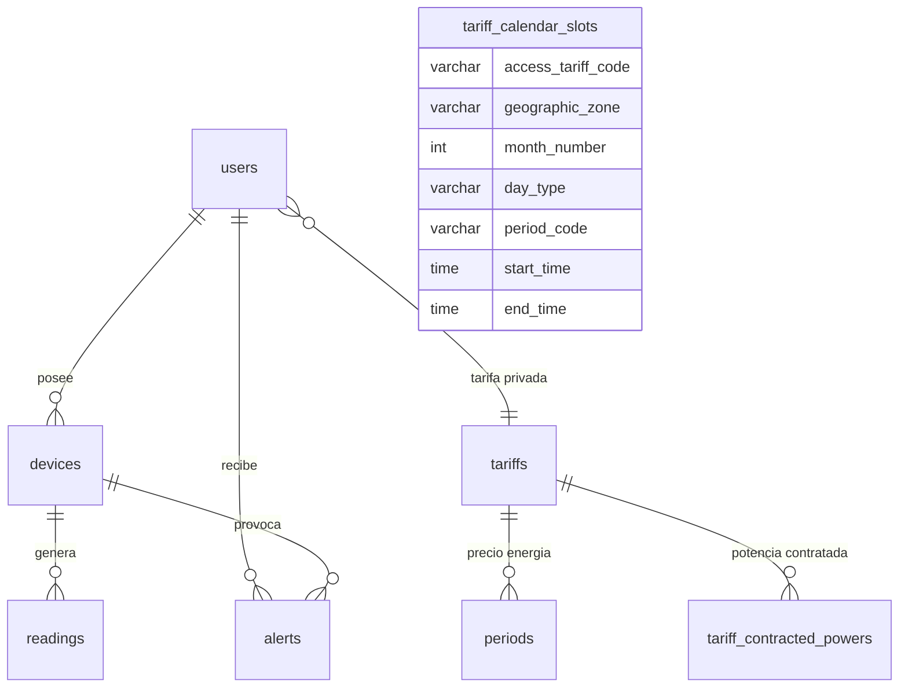
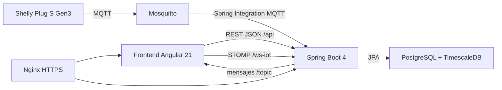

# Memoria técnica del proyecto Wattimizer

## Índice detallado

1. [Introducción y justificación](#1-introduccion-y-justificacion)
2. [Fase 1: Analisis funcional](#2-fase-1-analisis-funcional)
3. [Fase 2: Diseno técnico](#3-fase-2-diseno-tecnico)
4. [Fase 3: Implementacion y desarrollo](#4-fase-3-implementacion-y-desarrollo)
5. [Fase 4: Pruebas y despliegue](#5-fase-4-pruebas-y-despliegue)
6. [Conclusiones y líneas futuras](#6-conclusiones-y-lineas-futuras)
7. [Bibliografía y recursos](#7-bibliografia-y-recursos)
8. [Anexos técnicos](#8-anexos-tecnicos)

---

## 1. Introducción y justificación

### 1.1. Titulo del proyecto

**Wattimizer** es una aplicación web para monitorizar consumo eléctrico IoT y traducirlo a coste económico real. El nombre combina la idea de "watt" como unidad eléctrica con la optimizacion del gasto energético.

### 1.2. Descripcion del problema

Muchas pequeñas empresas conocen el importe total de la factura eléctrica cuando ya es tarde para actuar. El problema no es solo consumir energía, sino no saber **que dispositivo consume**, **cuando consume**, **que coste tiene ese consumo** y **si se estan produciendo picos que pueden superar la potencia contratada**.

Wattimizer nace para cubrir esa necesidad con una solucion web completa: registra enchufes inteligentes Shelly por MQTT, almacena lecturas temporales en TimescaleDB, aplica tarifas eléctricas del mercado español y muestra datos utiles en un panel Angular. La aplicación no se limita a pintar vatios en una gráfica; su objetivo es convertir telemetría técnica en información económica comprensible para tomar decisiones.

### 1.3. Objetivos

#### Objetivo general

Desarrollar una plataforma web full-stack que permita a un usuario autenticado registrar dispositivos eléctricos, consultar su consumo en tiempo real, calcular costes segun su tarifa y recibir alertas cuando haya picos de potencia.

#### Objetivos especificos

- Implementar autenticación con JWT, registro local y acceso federado con OAuth2.
- Permitir que cada usuario gestione sus propios dispositivos fisicos o simulados.
- Ingerir telemetría IoT mediante MQTT usando Spring Integration.
- Persistir lecturas temporales en PostgreSQL con TimescaleDB para soportar series temporales.
- Calcular coste eléctrico a partir del odometro de energía acumulada del dispositivo.
- Modelar tarifas españolas TD con periodos P1-P6, zona geografica y potencia contratada.
- Crear un frontend Angular standalone con estado reactivo basado en Signals y NgRx Signals.
- Visualizar telemetría en tiempo real mediante WebSocket STOMP.
- Preparar despliegue Docker con Nginx, Mosquitto, TimescaleDB y backend Spring Boot.

### 1.4. Tipos de usuarios

| Usuario | Descripcion | Acciones principales |
|---|---|---|
| Usuario registrado | Cliente final de la plataforma. Puede representar una pyme o autonomo que quiere controlar su consumo. | Login, alta de dispositivos, consulta de dashboard, gestión de su tarifa privada y revisión de alertas. |
| Administrador | Usuario con `ROLE_ADMIN`. Gestiona el catalogo maestro de tarifas. | Crear, editar y borrar tarifas del catalogo global. |
| Dispositivo IoT | Enchufe Shelly físico o dispositivo simulado. No usa la interfaz, pero envia lecturas de potencia y energía. | Publicar telemetría MQTT o generar lecturas simuladas desde el backend. |

---

## 2. Fase 1: Analisis funcional

### 2.1. Mapa de funcionalidades

| Modulo | Funcionalidades reales del proyecto |
|---|---|
| Autenticacion | Registro de usuario, registro de administrador con clave, login JWT, OAuth2 con Google/GitHub, cierre de sesion. |
| Dispositivos | Listado por usuario, detalle, reclamacion de Shelly físico, creacion de simuladores, pack demo, edicion de nombre/estado/perfil y borrado con lecturas/alertas asociadas. |
| Telemetria | Entrada MQTT Shelly, generacion simulada programada, persistencia de lecturas, publicacion WebSocket y consulta de historico reciente. |
| Dashboard | Selector de dispositivo, gráfica de potencia, lecturas recientes, coste diario y coste de consumo fantasma. |
| Tarifas | Catalogo maestro, tarifa privada de usuario, periodos P1-P6, zona geografica, potencias contratadas y validación de reglas TD. |
| Alertas | Deteccion de sobrepotencia, listado de alertas por usuario y borrado individual. |
| Despliegue | Docker Compose, Nginx HTTPS, Mosquitto, TimescaleDB, Certbot y GitHub Actions. |

### 2.2. Historias de usuario

| ID | Historia | Criterios de aceptacion | Prioridad |
|---|---|---|---|
| HU-01 | Como usuario, quiero registrarme con email y contraseña para acceder a la plataforma. | El backend válida email, contraseña mínima y confirmación; si el registro es válido devuelve `201 Created` sin cuerpo. | Imprescindible |
| HU-02 | Como usuario, quiero iniciar sesion para acceder a mis datos energéticos. | El login devuelve un JWT; el frontend lo guarda en `sessionStorage`; las rutas protegidas solo se abren con token válido. | Imprescindible |
| HU-03 | Como usuario, quiero entrar con Google o GitHub para no depender solo de contraseña local. | Spring Security procesa OAuth2, genera un ticket temporal y Angular lo canjea por JWT en `/api/v1/auth/oauth/exchange`. | Opcional |
| HU-04 | Como usuario, quiero vincular un enchufe Shelly a mi cuenta para ver sus lecturas. | `POST /api/v1/devices/claim` asocia la MAC al usuario autenticado si no pertenece a otra cuenta. | Imprescindible |
| HU-05 | Como usuario, quiero crear dispositivos simulados para probar la aplicación sin hardware real. | El backend genera MAC `SIM#########`, asigna un perfil de consumo y pública lecturas periodicas si la simulación esta activada. | Imprescindible |
| HU-06 | Como usuario, quiero ver una gráfica de potencia en tiempo real. | Angular se suscribe a `/topic/readings/{macAddress}` y mantiene una ventana de 20 puntos por dispositivo. | Imprescindible |
| HU-07 | Como usuario, quiero configurar mi tarifa para que el consumo se traduzca a euros. | El usuario puede clonar una tarifa del catalogo y ajustar precios/potencias en su contrato privado. | Imprescindible |
| HU-08 | Como usuario, quiero ver el coste diario y el coste fantasma. | El dashboard llama a `/api/v1/analytics/cost` y `/ghost-consumption` para el dispositivo y dia seleccionados. | Imprescindible |
| HU-09 | Como usuario, quiero recibir avisos si supero la potencia contratada. | Tras cada lectura, `AlertService` compara `powerW` con la potencia del periodo aplicable y crea una alerta `OVERPOWER`. | Opcional |
| HU-10 | Como administrador, quiero mantener el catalogo de tarifas eléctricas. | Solo `ROLE_ADMIN` puede crear, actualizar o borrar tarifas globales en `/api/v1/tariffs`. | Opcional |

### 2.3. Gestion del trabajo

- **Repositorio:** <https://github.com/joellmar/wattpath-app>
- **Rama de trabajo de esta documentacion:** `cursor/documentaci-n-t-cnica-del-proyecto-ca65`
- **Flujo usado:** ramas de feature sobre `main`, commits pequeños y despliegue automatizado mediante GitHub Actions.
- **Kanban previsto:** Backlog, Por hacer, En progreso, En revisión y Hecho. El repositorio no versiona capturas del tablero, así que esta memoria documenta las columnas usadas y deja la evidencia visual fuera del código fuente.

### 2.4. Planificacion inicial

| Fase | Historias asociadas | Dificultad técnica |
|---|---|---|
| Analisis y seguridad base | HU-01, HU-02 | Media: requiere JWT, filtros, roles y almacenamiento seguro del token en frontend. |
| Dispositivos e IoT | HU-04, HU-05, HU-06 | Alta: mezcla CRUD, MQTT, WebSocket y series temporales. |
| Tarifas y analítica | HU-07, HU-08, HU-09 | Alta: necesita modelo tarifario, calendario regulatorio y calculos con `BigDecimal`. |
| Administracion y despliegue | HU-03, HU-10 | Media-alta: OAuth2, Nginx, Docker Compose y configuracion de dominios. |

---

## 3. Fase 2: Diseno técnico

### 3.1. Diseno de la base de datos

El modelo de datos separa usuarios, dispositivos, lecturas, alertas y tarifas. Las lecturas se almacenan en la tabla `readings`, convertida en hypertable de TimescaleDB porque es la parte que más crece con el tiempo.



La definicion detallada de tablas, claves e indices esta en el [Anexo D](./anexo-d-timescaledb-analitica.md).

### 3.2. Arquitectura del sistema



- **Backend:** Java 26 con Spring Boot 4.0.5, Spring Security, Spring Data JPA, Spring Integration MQTT, WebSocket STOMP y MapStruct.
- **Frontend:** Angular 21 standalone, TypeScript, Signals, `@ngrx/signals`, RxJS, PrimeNG, Tailwind CSS y Chart.js.
- **Comunicacion:** API REST JSON para operaciones de negocio y WebSocket STOMP para telemetría en tiempo real.
- **Persistencia:** PostgreSQL con TimescaleDB para convertir `readings` en hypertable temporal.
- **Mensajeria IoT:** Mosquitto recibe publicaciones MQTT del Shelly; Spring Integration enruta por topic.

### 3.3. Diseno de interfaz

El repositorio no contiene imagenes de wireframes, pero el frontend permite reconstruir las pantallas principales:

| Pantalla | Diseno funcional implementado |
|---|---|
| Login | Formulario de email/contraseña, botones OAuth2 y aviso de error temporal. |
| Registro | Formulario con confirmación de contraseña y navegación posterior al login. |
| Layout principal | Cabecera con usuario, boton de logout y menu lateral a Dashboard, Dispositivos, Tarifas y Alertas. |
| Dashboard | Selector de dispositivo, gráfica de potencia, tarjetas de coste diario/fantasma y banner si falta tarifa. |
| Dispositivos | Tabla de medidores, alta física, alta simulada, pack demo, edicion y borrado. |
| Tarifas | Catalogo, formulario de periodos P1-P6, potencias contratadas y controles especiales para admin. |
| Alertas | Tabla de alertas con accion de descartar. |

### 3.4. Relacion entre historias y diseño

| Historia | Tablas principales | Codigo principal |
|---|---|---|
| HU-01, HU-02 | `users`, `federated_identities` | `AuthController`, `AuthRegistrationService`, `JwtTokenService`, `SecurityConfig`, `SessionStorageService`, `authGuard`. |
| HU-04, HU-05 | `devices`, `readings`, `alerts` | `DeviceController`, `DeviceService`, `DevicesComponent`, `TelemetryStore`. |
| HU-06 | `readings` | `MqttConfig`, `DeviceMessageHandler`, `TelemetryBroadcaster`, `WebsocketService`, `DashboardComponent`. |
| HU-07, HU-08 | `tariffs`, `periods`, `tariff_contracted_powers`, `tariff_calendar_slots`, `readings` | `TariffController`, `UserTariffController`, `ConsumptionController`, `TariffStore`, `TariffComponent`. |
| HU-09 | `alerts`, `readings`, `devices`, `tariff_contracted_powers` | `AlertService`, `AlertController`, `AlertsComponent`. |
| HU-10 | `tariffs`, `periods`, `tariff_contracted_powers` | `TariffController`, `TariffService`, `TariffComponent`. |

---

## 4. Fase 3: Implementacion y desarrollo

### 4.1. Tecnologias utilizadas

| Area | Tecnologia |
|---|---|
| Backend | Java 26, Spring Boot 4.0.5, Spring Web MVC, Spring Security, OAuth2 Client, Spring Data JPA, Spring Integration MQTT, WebSocket STOMP. |
| Frontend | Angular 21.1/21.2, TypeScript 5.9, RxJS 7.8, NgRx Signals 21.1, PrimeNG 21, Tailwind CSS 4, Chart.js 4.5. |
| Base de datos | PostgreSQL 17 con TimescaleDB HA. |
| IoT | Eclipse Mosquitto 2.1.2, MQTT QoS 1, Shelly Plug S Gen3. |
| Infraestructura | Docker Compose, Nginx Alpine, Certbot, Cloudflare, GitHub Actions. |
| Calidad | Vitest en frontend, Maven test en backend, Biome para lint frontend. |

### 4.2. Desarrollo del backend

El backend esta organizado por capas. Los controladores reciben peticiones HTTP y delegan en servicios; los servicios aplican reglas de negocio y usan repositorios JPA; los mappers MapStruct convierten entidades a DTOs. La seguridad se basa en JWT stateless, por lo que cada peticion a `/api/v1/**` debe llevar token salvo rutas de login, registro, OAuth2 y WebSocket.

Los detalles completos de endpoints y DTOs estan en el [Anexo A](./anexo-a-backend-rest.md).

### 4.3. Desarrollo del frontend

Angular se ha montado con componentes standalone y rutas lazy. El estado compartido se concentra en dos stores:

- `TelemetryStore`: dispositivos, MAC seleccionada e historico de lecturas por dispositivo.
- `TariffStore`: catalogo de tarifas, tarifa privada y estados de carga/error.

La lógica reactiva combina Signals para estado local y NgRx Signals/RxJS para llamadas HTTP y WebSocket. La explicacion detallada de componentes, servicios y flujos esta en el [Anexo B](./anexo-b-frontend-angular.md).

### 4.4. Control de versiones

El flujo observado en el repositorio usa commits descriptivos sobre `main`, con ramas generadas para tareas concretas. Los cambios recientes más relevantes para esta memoria son:

- `d77851b fix(simulators): borrado en cascada, telemetria por perfil y panel multi-dispositivo`
- `eff9456 feat(prod): activar simuladores en demo y pack de demostracion`
- `2db18a4 feat(devices): perfiles de simulacion de consumo y CRUD simulado`
- `3021eba docs(deployment): update Hetzner guide with all fixes found during real deployment`
- `ee032fd fix(deploy): reiniciar nginx tras compose up para evitar 502`

Estos commits explican por que la memoria ya incluye simuladores, pack demo, Nginx con resolver DNS interno y despliegue productivo documentado.

---

## 5. Fase 4: Pruebas y despliegue

### 5.1. Plan de pruebas

| Prueba | Accion | Resultado esperado |
|---|---|---|
| Login sin token previo | Enviar credenciales válidas a `/api/v1/auth/login`. | Respuesta `LoginUserJwt` con `statusCode` y `jwt`; Angular navega a `/dashboard`. |
| Ruta protegida sin JWT | Abrir `/dashboard` sin token válido. | `authGuard` redirige a `/login`. |
| Registro con contraseñas distintas | Enviar `RegisterRequest` con `password` y `confirmPassword` diferentes. | Backend responde error controlado por `GlobalExceptionHandler`. |
| Reclamar dispositivo | `POST /api/v1/devices/claim` con MAC y nombre. | Dispositivo asociado al usuario autenticado. |
| Crear simulador | `POST /api/v1/devices/simulated` con nombre y perfil. | Dispositivo `simulated=true`, MAC `SIM#########` y lecturas generadas por el job. |
| Telemetria MQTT | Publicar mensaje Shelly en `events/rpc` o `status/switch:0`. | Lectura persistida en `readings` y broadcast a `/topic/readings/{mac}`. |
| Coste diario | Consultar `/api/v1/analytics/cost` con MAC, `start` y `end`. | Coste en euros calculado a partir de deltas positivos de kWh. |
| Consumo fantasma | Consultar `/api/v1/analytics/ghost-consumption`. | Coste solo para lecturas cuya hora local esta entre 00:00 y 05:59. |
| Alerta de potencia | Generar lectura con `powerW` superior a la potencia contratada. | Se crea alerta `OVERPOWER` y se emite por `/topic/alerts/{username}`. |
| Logout | Pulsar cerrar sesion en `MainLayoutComponent`. | WebSocket desconectado, stores reseteados, token eliminado y vuelta a `/login`. |

### 5.2. Manual de instalacion y uso

#### Desarrollo local

1. Levantar TimescaleDB y Mosquitto con Docker Compose o seguir `GUIA_DESPLIEGUE_LOCAL_WINDOWS.md`.
2. Configurar variables de entorno equivalentes a `.env.example`.
3. Arrancar backend:

```bash
cd backend
./mvnw spring-boot:run
```

4. Ejecutar scripts SQL tras el primer arranque de Hibernate:

```sql
\i backend/src/main/resources/db/dev-seed/00-extensions.sql
\i backend/src/main/resources/db/dev-seed/01-hypertable.sql
\i backend/src/main/resources/db/tariffs-td-schema.sql
\i backend/src/main/resources/db/seed-tariff-calendar-slots.sql
```

5. Arrancar frontend:

```bash
cd frontend
npm install
npm start
```

6. Acceder a `http://localhost:4200`.

#### Uso básico

1. Registrarse o iniciar sesion.
2. Entrar en **Tarifas** y asignar una tarifa privada.
3. Entrar en **Dispositivos** y reclamar un Shelly o crear simuladores.
4. Consultar **Dashboard** para ver potencia y costes.
5. Revisar **Alertas** cuando haya sobrepotencia.

### 5.3. Despliegue

La guia de producción esta en `docs/deployment/hetzner-production.md`. El entorno objetivo es un VPS Hetzner con Ubuntu 24.04, Docker Compose, Nginx como proxy HTTPS, TimescaleDB sin puerto público, Mosquitto expuesto en 1883 para el Shelly físico y certificados Certbot montados en Nginx.

El despliegue usa:

- `wattimizer.com` y `www.wattimizer.com` para la SPA Angular.
- `api.wattimizer.com` para API/WebSocket con Cloudflare en nube gris.
- GitHub Actions para reconstruir contenedores y reiniciar Nginx tras `docker compose up`, evitando 502 por cache de IP interna.

---

## 6. Conclusiones y líneas futuras

### 6.1. Grado de cumplimiento

El MVP queda cubierto en sus partes principales: autenticación, gestión de dispositivos, telemetría real/simulada, dashboard, tarifas, calculo económico, alertas y despliegue. La aplicación ya tiene una arquitectura completa de frontend, backend, base de datos temporal y mensajeria IoT.

### 6.2. Dificultades encontradas

- **Integrar telemetría IoT con datos de negocio:** una lectura MQTT no sirve por si sola; hay que asociarla a dispositivo, usuario y tarifa.
- **Resolver periodos tarifarios españoles:** se separo el calendario regulatorio (`tariff_calendar_slots`) de los precios contractuales (`periods`) para no duplicar horarios en cada tarifa.
- **Evitar falsos datos entre usuarios:** el logout desconecta WebSocket y resetea stores para que el siguiente usuario no vea cache anterior.
- **Despliegue con contenedores reiniciables:** se anadio resolver DNS interno en Nginx y reinicio posterior al `compose up` para evitar upstreams obsoletos.
- **Simulacion sin hardware:** se incorporaron perfiles de consumo y transacciones independientes para que un fallo en un simulador no bloquee el resto.

### 6.3. Mejoras futuras

- Sustituir el topic MQTT fijo por alta dinámica de dispositivos y suscripciones por patron configurable.
- Activar TLS en MQTT o mover el trafico del Shelly a una VPN si el hardware lo permite.
- Migrar los scripts SQL manuales a Flyway o Liquibase.
- Usar funciones propias de TimescaleDB (`time_bucket`, agregados continuos, compresion y politicas de retencion).
- Externalizar tickets OAuth2 a Redis si se despliega el backend en más de una instancia.
- Crear una app movil o PWA con notificaciones push de alertas energéticas.

---

## 7. Bibliografía y recursos

- Documentacion oficial de Spring Boot: <https://docs.spring.io/spring-boot/>
- Documentacion oficial de Spring Security: <https://docs.spring.io/spring-security/reference/>
- Spring Integration MQTT: <https://docs.spring.io/spring-integration/reference/mqtt.html>
- Angular: <https://angular.dev/>
- NgRx Signals: <https://ngrx.io/guide/signals>
- RxJS: <https://rxjs.dev/>
- TimescaleDB: <https://docs.timescale.com/>
- Eclipse Mosquitto: <https://mosquitto.org/documentation/>
- Shelly API: <https://shelly-api-docs.shelly.cloud/>
- Circular CNMC 3/2020 y documentacion regulatoria de peajes eléctricos.
- Documentacion interna del repositorio: `README.md`, `GUIA_DESPLIEGUE_LOCAL_WINDOWS.md` y `docs/deployment/hetzner-production.md`.

---

## 8. Anexos técnicos

- [Anexo A. Backend REST Spring Boot](./anexo-a-backend-rest.md)
- [Anexo B. Frontend Angular, RxJS y NgRx Signals](./anexo-b-frontend-angular.md)
- [Anexo C. Ingesta de telemetría MQTT](./anexo-c-telemetria-mqtt.md)
- [Anexo D. TimescaleDB y analítica energética](./anexo-d-timescaledb-analitica.md)
- [Canvas documental de arquitectura](../../docs-canvas/arquitectura-wattimizer.md)
