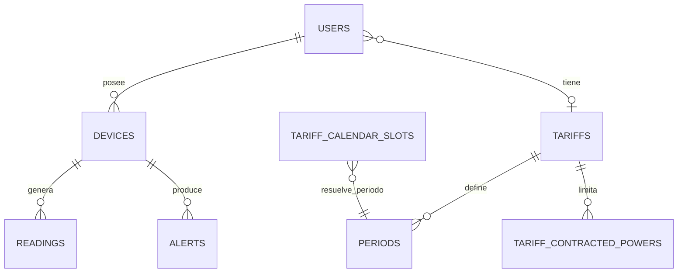

# Memoria tecnica del proyecto Wattimizer

## Indice de anexos tecnicos

Esta memoria se complementa con anexos pensados para poder incorporarse
directamente a la entrega final del proyecto:

- [Anexo A. Backend REST con Spring Boot](./anexo-a-backend-rest.md)
- [Anexo B. Frontend Angular, RxJS y NgRx Signals](./anexo-b-frontend-angular.md)
- [Anexo C. Ingesta asincrona de telemetria con MQTT](./anexo-c-telemetria-mqtt.md)
- [Anexo D. TimescaleDB y analitica energetica](./anexo-d-timescaledb-analitica.md)
- [Vista visual de arquitectura y flujos](../../docs-canvas/arquitectura-wattimizer.md)

## 1. Introduccion y justificacion

### 1.1. Titulo del proyecto

**Wattimizer** es una aplicacion web B2B para monitorizar consumo electrico en
pequenas empresas y convertir la telemetria de dispositivos IoT en informacion
economica util.

### 1.2. Descripcion del problema

Muchas pymes no tienen una lectura clara de cuanto les cuesta realmente la energia
que consumen durante la jornada. Pueden ver la factura al final del mes, pero no
saben que aparato ha provocado un pico de potencia, cuanto dinero se pierde por
consumos fantasma durante la noche o si la potencia contratada encaja con su uso
real.

Wattimizer parte de esa necesidad concreta. La aplicacion recibe mediciones de
enchufes inteligentes Shelly mediante MQTT, las guarda como serie temporal en
PostgreSQL con TimescaleDB y las cruza con tarifas electricas reales del modelo
TD. El objetivo no es solo pintar vatios en una grafica, sino traducir esos datos
a euros, alertas de sobrepotencia y decisiones de ahorro.

### 1.3. Objetivos

#### Objetivo general

Desarrollar una aplicacion web full-stack que permita a un usuario autenticado
registrar dispositivos electricos, consultar su consumo en tiempo real, asignar
una tarifa electrica y analizar el coste economico asociado a sus lecturas.

#### Objetivos especificos

- Implementar autenticacion local con JWT y entrada OAuth2 con Google/GitHub.
- Crear una API REST para dispositivos, lecturas, alertas, tarifas y analitica.
- Ingerir telemetria MQTT de Shelly Plug S Gen3 mediante Spring Integration.
- Guardar lecturas en una hypertable `readings` de TimescaleDB para series
  temporales.
- Construir una interfaz Angular con rutas protegidas, formularios reactivos,
  PrimeNG y grafica de potencia en tiempo real.
- Usar NgRx Signals y RxJS para coordinar estado de dispositivos, historial,
  tarifa activa y suscripcion STOMP.
- Calcular coste total y consumo fantasma a partir del odometro energetico
  `energyTotalKwh`.
- Generar alertas cuando la potencia instantanea supere la potencia contratada
  del periodo tarifario correspondiente.

### 1.4. Tipos de usuarios

| Tipo de usuario | Uso principal en la aplicacion | Soporte en codigo |
| --- | --- | --- |
| Usuario registrado (`ROLE_USER`) | Gestiona sus dispositivos, elige una tarifa del catalogo, consulta dashboard y alertas. | `RegisterRequest`, `AuthRegistrationService.registerUser`, rutas protegidas de Angular. |
| Administrador (`ROLE_ADMIN`) | Puede crear, editar y borrar tarifas del catalogo maestro. | `POST /api/v1/tariffs`, `POST /api/v1/tariffs/{id}`, `DELETE /api/v1/tariffs/{id}` con `@PreAuthorize`. |
| Usuario sistema (`SYSTEM`) | Propietario temporal de dispositivos fisicos detectados antes de ser reclamados. | `DeviceService.claimOrRegisterDevice`, semillas de desarrollo. |

## 2. Fase 1: Analisis funcional

### 2.1. Mapa de funcionalidades

| Modulo | Funcionalidades implementadas | Codigo relacionado |
| --- | --- | --- |
| Autenticacion | Login, registro, registro admin con secreto, intercambio OAuth2 por JWT. | `AuthController`, `AuthService`, `LoginComponent`, `RegisterComponent`, `OAuthCallbackComponent`. |
| Dispositivos | Listado, alta fisica, reclamacion, simuladores, demo pack, edicion y borrado. | `DeviceController`, `DeviceService`, `DevicesComponent`, `TelemetryStore`. |
| Telemetria | Lectura mas reciente, historial reciente, busqueda por clave compuesta y emision STOMP. | `ReadingController`, `ReadingService`, `WebsocketService`, `DashboardComponent`. |
| Tarifas | Catalogo maestro, tarifa privada del usuario, clonacion de plantilla, periodos y potencias. | `TariffController`, `UserTariffController`, `TariffService`, `UserTariffService`, `TariffComponent`, `TariffStore`. |
| Analitica | Coste total del periodo y coste de consumo fantasma. | `ConsumptionController`, `ConsumptionService`, `CalendarResolverService`. |
| Alertas | Deteccion de sobrepotencia, listado y descarte de alertas. | `AlertService`, `AlertController`, `AlertsComponent`. |
| Simulacion IoT | Generacion periodica de lecturas para perfiles de consumo. | `IotTelemetrySimulationJob`, `SimulatedTelemetryProcessor`, calculadoras de `simulation/`. |

### 2.2. Historias de usuario

| ID | Historia | Criterios de aceptacion | Prioridad |
| --- | --- | --- | --- |
| HU-01 | Como usuario, quiero registrarme con email y contrasena para acceder a mi panel privado. | El formulario valida email y confirmacion de contrasena; el backend crea `ROLE_USER`; el login posterior devuelve JWT. | Imprescindible |
| HU-02 | Como usuario, quiero iniciar sesion para consultar mis dispositivos. | `POST /api/v1/auth/login` devuelve `LoginUserJwt`; Angular guarda `auth_token`; las rutas protegidas quedan accesibles. | Imprescindible |
| HU-03 | Como usuario, quiero vincular un enchufe fisico por MAC para asociarlo a mi cuenta. | `POST /api/v1/devices/claim` crea o reclama el dispositivo; no permite reclamar uno de otro usuario. | Imprescindible |
| HU-04 | Como usuario, quiero crear dispositivos simulados para probar el sistema sin hardware real. | `POST /api/v1/devices/simulated` valida nombre y perfil; el simulador genera lecturas periodicas. | Imprescindible |
| HU-05 | Como usuario, quiero ver la potencia actual y el historico reciente de un dispositivo. | El dashboard carga `/readings/device/{mac}/recent` y se actualiza por STOMP en `/topic/readings/{mac}`. | Imprescindible |
| HU-06 | Como usuario, quiero asignar una tarifa para calcular costes reales. | `GET /api/v1/users/me/tariff` informa si hay tarifa; `POST` clona plantilla o guarda contrato propio. | Imprescindible |
| HU-07 | Como usuario, quiero ver el coste diario y el consumo fantasma. | El dashboard consulta `/analytics/cost` y `/analytics/ghost-consumption` con rango temporal. | Imprescindible |
| HU-08 | Como usuario, quiero recibir alertas si supero la potencia contratada. | `AlertService.checkPowerThreshold` compara potencia W con kW contratados y publica alerta STOMP. | Imprescindible |
| HU-09 | Como administrador, quiero mantener el catalogo de tarifas. | Solo `ROLE_ADMIN` puede crear, editar o borrar tarifas en `/api/v1/tariffs`. | Imprescindible |
| HU-10 | Como usuario, quiero borrar dispositivos que ya no uso. | `DELETE /api/v1/devices/{id}` valida propietario y elimina lecturas/alertas asociadas. | Opcional |
| HU-11 | Como usuario, quiero descartar alertas ya revisadas. | `DELETE /api/v1/alerts/{id}` borra solo alertas del usuario autenticado. | Opcional |

### 2.3. Gestion del trabajo

- **Repositorio:** <https://github.com/joellmar/wattpath-app>
- **Rama de documentacion:** `cursor/documentaci-n-t-cnica-del-proyecto-be95`
- **Flujo usado en el repositorio:** ramas de trabajo sobre `main`, commits pequenos y pull request final.
- **Kanban:** no hay una captura versionada dentro del repositorio. Para la entrega maquetada se debe insertar la captura real del tablero de GitHub Projects si el centro la exige como evidencia visual.

### 2.4. Planificacion inicial

| Fase | Historias asociadas | Dificultad tecnica |
| --- | --- | --- |
| Analisis y seguridad base | HU-01, HU-02 | Media: JWT, OAuth2 y persistencia de usuarios. |
| Gestion de dispositivos | HU-03, HU-04, HU-10 | Media-alta: propiedad por usuario, simuladores y borrado de datos asociados. |
| Telemetria y tiempo real | HU-05 | Alta: MQTT, STOMP, TimescaleDB y actualizacion reactiva en Angular. |
| Tarifas y calendario TD | HU-06, HU-09 | Alta: validaciones por peaje, periodos P1-P6 y clonacion por usuario. |
| Analitica y alertas | HU-07, HU-08, HU-11 | Alta: calculo por deltas de energia, zona horaria y potencia contratada. |

## 3. Fase 2: Diseno tecnico

### 3.1. Diseno de la base de datos

El modelo combina entidades transaccionales clasicas (`users`, `devices`,
`tariffs`, `alerts`) con una tabla de serie temporal (`readings`). La tabla
`readings` usa clave compuesta por `time` y `device_id`, y despues se convierte
en hypertable con TimescaleDB para que PostgreSQL gestione los chunks temporales.



El modelo relacional y los scripts SQL se explican con detalle en el
[Anexo D](./anexo-d-timescaledb-analitica.md).

### 3.2. Arquitectura del sistema

| Capa | Tecnologia | Responsabilidad real |
| --- | --- | --- |
| Backend | Java 26, Spring Boot 4.0.5, Spring Security, Spring Data JPA | API REST, seguridad JWT/OAuth2, servicios de negocio, ingestion MQTT, WebSocket STOMP. |
| Frontend | Angular 21.x, TypeScript 5.9, PrimeNG 21, Tailwind CSS 4 | Interfaz, formularios, dashboard, estado con Signals y consumo de API REST/STOMP. |
| Base de datos | PostgreSQL + TimescaleDB | Persistencia relacional e historico temporal en `readings`. |
| Mensajeria IoT | MQTT con Mosquitto y Eclipse Paho | Recepcion de eventos Shelly `events/rpc` y `status/switch:0`. |
| Comunicacion | JSON sobre REST y STOMP sobre WebSocket | REST para consultas/mutaciones; WebSocket para lecturas y alertas en tiempo real. |

### 3.3. Diseno de interfaz

No hay wireframes versionados como imagen en el repositorio. La interfaz final
queda organizada en estas pantallas implementadas:

- **Login y registro:** formularios centrados con validacion y mensajes PrimeNG.
- **Layout principal:** cabecera y menu lateral para dashboard, dispositivos, tarifas y alertas.
- **Dashboard:** selector de medidor, grafica de potencia, tarjetas de coste y avisos si falta tarifa.
- **Dispositivos:** formulario de alta, tabla, dialogo de detalle y dialogo de edicion.
- **Tarifas:** catalogo, tarifa activa del usuario y formulario dinamico de periodos/potencias.
- **Alertas:** tabla con mensajes de sobrepotencia y accion de descarte.

### 3.4. Relacion entre historias y diseno

| Historia | Tablas principales | Backend | Frontend |
| --- | --- | --- | --- |
| HU-01/HU-02 | `users`, `federated_identities` | `AuthController`, `SecurityConfig`, `JwtTokenService` | `LoginComponent`, `RegisterComponent`, `authGuard`. |
| HU-03/HU-04/HU-10 | `devices`, `readings`, `alerts` | `DeviceController`, `DeviceService` | `DevicesComponent`, `TelemetryStore`. |
| HU-05 | `readings` | `ReadingController`, `TelemetryBroadcaster` | `DashboardComponent`, `WebsocketService`. |
| HU-06/HU-09 | `tariffs`, `periods`, `tariff_contracted_powers`, `tariff_calendar_slots` | `TariffController`, `UserTariffController` | `TariffComponent`, `TariffStore`. |
| HU-07 | `readings`, `tariffs`, `periods` | `ConsumptionController`, `ConsumptionService` | `DashboardComponent`. |
| HU-08/HU-11 | `alerts`, `readings`, `tariff_contracted_powers` | `AlertService`, `AlertController` | `AlertsComponent`. |

## 4. Fase 3: Implementacion y desarrollo

### 4.1. Tecnologias utilizadas

| Area | Versiones observadas |
| --- | --- |
| Java | `java.version` 26 en `backend/pom.xml`. |
| Spring Boot | 4.0.5. |
| MapStruct | 1.6.3. |
| JWT | `jjwt` 0.12.5. |
| MQTT | `spring-integration-mqtt`, Eclipse Paho 1.2.5, HiveMQ client 1.3.13 declarado. |
| Angular | Dependencias Angular 21.x en `frontend/package.json`. |
| NgRx Signals | 21.1.0. |
| RxJS | 7.8.x. |
| PrimeNG | 21.1.7. |
| Chart.js | 4.5.1. |
| Biome | 2.4.16. |
| Docker | `docker-compose.yml` con servicios de aplicacion, base de datos, MQTT y Nginx. |

### 4.2. Desarrollo del backend

El backend sigue una separacion clara entre controladores, servicios, repositorios,
entidades y DTOs. Los controladores solo exponen HTTP y validan propiedad en los
casos sensibles. La logica de negocio queda en servicios como `DeviceService`,
`TariffService`, `UserTariffService`, `ConsumptionService` y `AlertService`.

La seguridad se basa en sesiones stateless con JWT. Las rutas publicas son login,
registro e intercambio OAuth2; el resto de `/api/v1/**` requiere usuario
autenticado salvo reglas concretas. Las operaciones de administracion de tarifas
se protegen con `ROLE_ADMIN`.

Los errores se normalizan en `GlobalExceptionHandler` con `ErrorResponse`, aunque
algunas respuestas 403 se devuelven directamente sin cuerpo desde controladores.

### 4.3. Desarrollo del frontend

Angular usa componentes standalone y carga perezosa por rutas. La autenticacion se
guarda en `sessionStorage` y un interceptor anade `Authorization: Bearer` a las
peticiones `/api/v1` privadas.

La parte mas reactiva esta en:

- `TelemetryStore`: mantiene dispositivos, MAC seleccionada e historial corto de
  potencia para la grafica.
- `TariffStore`: mantiene catalogo, tarifa privada, estados de carga y errores.
- `DashboardComponent`: combina Signals, efectos y llamadas HTTP para enlazar
  historial, STOMP y analitica.

El detalle tecnico se desarrolla en el [Anexo B](./anexo-b-frontend-angular.md).

### 4.4. Control de versiones

El flujo observado para esta documentacion trabaja en una rama especifica sobre
`main`, con commits descriptivos y push al remoto `origin`. El repositorio se
prepara para que la integracion final se haga mediante pull request, evitando
empujar directamente a la rama principal.

## 5. Fase 4: Pruebas y despliegue

### 5.1. Plan de pruebas

| Prueba | Criterio validado | Evidencia en codigo |
| --- | --- | --- |
| Login con credenciales invalidas | Debe devolver 401 con mensaje de credenciales incorrectas. | `AuthController`, `GlobalExceptionHandler`. |
| Registro con contrasenas distintas | Debe rechazarse como error de negocio. | `AuthRegistrationService`. |
| Acceso a ruta privada sin JWT | Angular redirige a login y backend exige autenticacion. | `authGuard`, `SecurityConfig`, `httpInterceptor`. |
| Crear dispositivo simulado | Debe aparecer en listado y generar lecturas periodicas. | `DeviceServiceTest`, `IotTelemetrySimulationJobTest`. |
| Borrar dispositivo | Debe eliminar lecturas y alertas asociadas. | `DeviceService.deleteById`, `ReadingRepository`, `AlertRepository`. |
| Coste por intervalo | Debe sumar deltas positivos de `energyTotalKwh` por precio de periodo. | `ConsumptionServiceTest`. |
| Resolucion de tarifas | Debe validar periodos y potencias por peaje. | `TariffServiceTest`, `UserTariffServiceTest`. |
| Interfaz de tarifa | Debe construir formulario con periodos y potencias correctos. | `tariff.component.spec.ts`. |
| Dashboard | Debe cargar store, seleccionar dispositivo y preparar grafica. | `dashboard.component.spec.ts`. |

### 5.2. Manual de instalacion y uso

#### Instalacion local con Docker

```bash
# Se usa Docker Compose porque el proyecto necesita backend, frontend,
# PostgreSQL/TimescaleDB y broker MQTT coordinados.
docker compose up --build
```

#### Backend aislado

```bash
cd backend
./mvnw test
./mvnw spring-boot:run
```

Variables relevantes:

- `MQTT_URL`, `MQTT_USER`, `MQTT_PASSWORD`
- `JWT_SECRET`
- `ADMIN_KEY`
- `APP_CORS_ALLOWED_ORIGINS`
- credenciales OAuth2 de Google/GitHub

#### Frontend aislado

```bash
cd frontend
npm install
npm start
```

En desarrollo, `frontend/proxy.conf.json` redirige `/api`, `/oauth2` y `/ws-iot`
al backend local en `http://localhost:8080`.

#### Uso basico

1. Registrarse o iniciar sesion.
2. Crear un dispositivo simulado o reclamar un Shelly por MAC.
3. Asignar una tarifa desde la pantalla de tarifas.
4. Entrar en dashboard y seleccionar el medidor.
5. Revisar costes, consumo fantasma y alertas.

### 5.3. Despliegue

El repositorio incluye documentacion de despliegue en
`docs/deployment/hetzner-production.md` y configuracion de Nginx/Docker. El
entorno previsto combina contenedores para frontend, backend, base de datos y
broker MQTT. La URL publica concreta no aparece versionada en el codigo.

## 6. Conclusiones y lineas futuras

### 6.1. Grado de cumplimiento

El MVP queda cubierto a nivel funcional: autenticacion, gestion de dispositivos,
telemetria en tiempo real, tarifas, calculo economico y alertas. La aplicacion
tambien incorpora simuladores, lo que facilita demostrar el proyecto aunque no se
disponga siempre del enchufe fisico.

### 6.2. Dificultades encontradas

- **Telemetria asincrona:** se resolvio separando topics MQTT en ramas
  `EVENTS` y `STATUS` con Spring Integration.
- **Series temporales:** se uso TimescaleDB para que `readings` pueda crecer sin
  tratarse como una tabla relacional normal.
- **Tarifas TD:** se modelo el calendario regulatorio en `tariff_calendar_slots`
  para no meter las reglas horarias directamente en el codigo.
- **Estado reactivo:** Angular combina Signals, RxJS y STOMP para que la grafica
  se actualice sin recargar la pagina.
- **Multitenencia:** la mayoria de endpoints comprueban el propietario desde el
  `Principal`, evitando que un usuario consulte dispositivos de otro.

### 6.3. Mejoras futuras

- Suscripcion MQTT dinamica por todos los dispositivos registrados, no solo por
  el Shelly configurado actualmente.
- Autenticacion JWT en el handshake WebSocket para proteger topics STOMP.
- Uso mas avanzado de TimescaleDB con `time_bucket`, agregados continuos,
  compresion y politicas de retencion.
- Deduccion de alertas para evitar que cada lectura sobre umbral genere una
  alerta repetida.
- Consolidar el CRUD de dispositivos en `TelemetryStore` para no duplicar HTTP
  entre store y componente.
- Ampliar semillas de calendario a Canarias, Ceuta, Melilla y peajes 6.x.
- Crear aplicacion movil o PWA para avisos push de sobrepotencia.

## 7. Bibliografia y recursos

- Documentacion oficial de Spring Boot, Spring Security y Spring Integration.
- Documentacion de Eclipse Paho MQTT y Mosquitto.
- Documentacion de PostgreSQL y TimescaleDB.
- Documentacion oficial de Angular, NgRx Signals, RxJS y PrimeNG.
- Circular CNMC 3/2020 como base normativa para periodos tarifarios TD.
- Codigo fuente del repositorio `joellmar/wattpath-app`.
