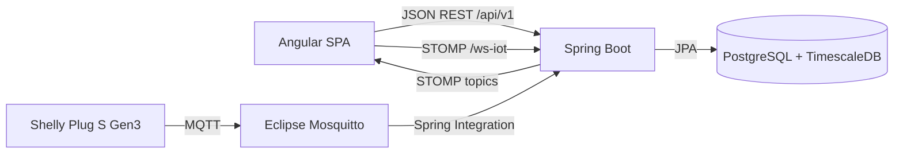

# Memoria técnica del proyecto DAW: Wattimizer

Wattimizer es una aplicación web para monitorizar consumo eléctrico, traducirlo a coste económico y avisar de excesos de potencia. Esta memoria está redactada como documentación técnica del proyecto y se apoya en el código actual del repositorio `joellmar/wattpath-app`.

## Índice

1. [Introducción y justificación](#1-introducción-y-justificación)
2. [Fase 1: Análisis funcional](#2-fase-1-análisis-funcional)
3. [Fase 2: Diseño técnico](#3-fase-2-diseño-técnico)
4. [Fase 3: Implementación y desarrollo](#4-fase-3-implementación-y-desarrollo)
5. [Fase 4: Pruebas y despliegue](#5-fase-4-pruebas-y-despliegue)
6. [Conclusiones y líneas futuras](#6-conclusiones-y-líneas-futuras)
7. [Bibliografía y recursos](#7-bibliografía-y-recursos)
8. [Anexos técnicos](#8-anexos-técnicos)

## 1. Introducción y justificación

### 1.1. Título del proyecto

**Wattimizer App**: plataforma web B2B de inteligencia financiera energética.

### 1.2. Descripción del problema

Muchas pymes conocen el importe final de la factura eléctrica, pero no tienen una visión clara de cuándo se produce el gasto ni qué dispositivos están provocando los picos. Esta falta de información hace que se tomen decisiones tarde: se detecta el problema al recibir la factura, no cuando el consumo está ocurriendo.

Wattimizer intenta resolver esa falta de visibilidad uniendo tres piezas: enchufes inteligentes Shelly, una API backend y una interfaz web. El sistema recibe telemetría de potencia en tiempo real, la guarda como serie temporal y la cruza con una tarifa eléctrica TD. Con eso puede mostrar consumo, coste estimado, consumo fantasma nocturno y alertas de potencia cuando se supera la potencia contratada.

### 1.3. Objetivos

#### Objetivo general

Desarrollar una aplicación web capaz de monitorizar dispositivos eléctricos, almacenar sus lecturas y convertir el consumo en información económica comprensible para una empresa pequeña o mediana.

#### Objetivos específicos

- Implementar autenticación con JWT y registro de usuarios, incluyendo login social con Google y GitHub.
- Permitir que cada usuario gestione sus dispositivos físicos o simulados.
- Ingerir telemetría MQTT desde enchufes Shelly y persistirla en PostgreSQL con TimescaleDB.
- Mostrar lecturas en tiempo real en Angular mediante WebSocket/STOMP.
- Gestionar tarifas TD españolas con periodos de energía y potencia contratada.
- Calcular coste energético y consumo fantasma a partir de lecturas reales.
- Generar alertas cuando la potencia instantánea supera la potencia contratada del periodo aplicable.
- Desplegar la aplicación con Docker Compose, Nginx, Mosquitto y TimescaleDB.

### 1.4. Tipos de usuarios

| Tipo de usuario | Uso principal en la aplicación |
| --- | --- |
| Usuario estándar | Se registra, vincula dispositivos, consulta el dashboard, configura su tarifa y revisa alertas. |
| Administrador | Mantiene el catálogo maestro de tarifas y puede crear usuarios administradores mediante clave interna. |
| Dispositivo IoT | Publica lecturas MQTT en topics Shelly. No interactúa con la UI, pero alimenta el sistema. |

## 2. Fase 1: Análisis funcional

### 2.1. Mapa de funcionalidades

| Módulo | Funcionalidades |
| --- | --- |
| Autenticación | Login, registro, registro admin con clave, OAuth2 con Google/GitHub, cierre de sesión. |
| Dashboard | Selección de medidor, gráfica de potencia, coste diario, consumo fantasma, aviso si falta tarifa. |
| Dispositivos | Reclamar dispositivo físico por MAC, crear simulador, crear pack demo, editar nombre/perfil, eliminar. |
| Tarifas | Consultar catálogo, asignar tarifa propia, editar precios y potencias, CRUD de catálogo para admin. |
| Telemetría | Ingesta MQTT, generación simulada, persistencia en hypertable `readings`, emisión STOMP. |
| Analítica | Cálculo de coste por periodo, detección de consumo fantasma y alertas de maxímetro. |
| Despliegue | Docker Compose, Nginx, certificados externos, variables de entorno de producción. |

### 2.2. Historias de usuario

| ID | Historia | Criterios de aceptación | Prioridad |
| --- | --- | --- | --- |
| HU-01 | Como usuario, quiero registrarme para acceder a mi panel privado. | El backend crea un usuario con rol `ROLE_USER`; las contraseñas se validan y se guardan cifradas. | Imprescindible |
| HU-02 | Como usuario, quiero iniciar sesión para recibir un token JWT. | El login devuelve `LoginUserJwt`; el frontend guarda el token en `sessionStorage`; las rutas privadas quedan protegidas. | Imprescindible |
| HU-03 | Como usuario, quiero entrar con Google o GitHub para no crear otra contraseña. | OAuth2 redirige al proveedor, el backend genera un ticket temporal y Angular lo canjea por JWT. | Opcional |
| HU-04 | Como usuario, quiero reclamar un enchufe físico por MAC para asociarlo a mi cuenta. | `POST /api/v1/devices/claim` asocia el dispositivo al usuario autenticado o lo crea si no existe. | Imprescindible |
| HU-05 | Como usuario, quiero crear dispositivos simulados para probar la demo sin hardware. | Se pueden crear perfiles como horno, lavadora, televisión o frigorífico; el job programado genera lecturas. | Imprescindible |
| HU-06 | Como usuario, quiero ver la potencia en tiempo real para detectar consumos anómalos. | El dashboard carga lecturas recientes y se actualiza por STOMP en `/topic/readings/{mac}`. | Imprescindible |
| HU-07 | Como usuario, quiero configurar mi tarifa para que el sistema calcule euros y no solo kWh. | El usuario puede guardar una tarifa privada derivada de una plantilla o creada manualmente. | Imprescindible |
| HU-08 | Como usuario, quiero ver el coste del día y el consumo fantasma nocturno. | Los endpoints de analítica devuelven `totalCostEur` y `ghostCostEur` para la MAC seleccionada. | Imprescindible |
| HU-09 | Como usuario, quiero recibir alertas si supero la potencia contratada. | `AlertService` compara `power_w` con `contracted_power_kw` del periodo y guarda una alerta `OVERPOWER`. | Imprescindible |
| HU-10 | Como administrador, quiero mantener el catálogo de tarifas. | Solo `ROLE_ADMIN` puede crear, actualizar o borrar tarifas en `/api/v1/tariffs`. | Opcional |
| HU-11 | Como usuario, quiero eliminar dispositivos que ya no uso. | Al borrar un dispositivo se eliminan antes sus lecturas y alertas asociadas para evitar errores por FK. | Imprescindible |

### 2.3. Gestión del trabajo

- **Repositorio:** <https://github.com/joellmar/wattpath-app>
- **Rama documentada:** `cursor/documentaci-n-t-cnica-del-proyecto-89b1`
- **Flujo observado:** commits pequeños por funcionalidad (`feat(devices)`, `fix(simulators)`, `fix(deploy)`, `docs(deployment)`).
- **Kanban:** no hay una captura versionada en este repositorio. Para la entrega en PDF, la captura del tablero debe añadirse desde GitHub Projects o la herramienta usada en clase, con columnas de Backlog, Por hacer, En progreso, En revisión y Hecho.

### 2.4. Planificación inicial

| Fase | Historias relacionadas | Dificultad técnica |
| --- | --- | --- |
| Autenticación y seguridad | HU-01, HU-02, HU-03 | Media: JWT, OAuth2 y control de rutas privadas. |
| Dispositivos y simuladores | HU-04, HU-05, HU-11 | Media-alta: propiedad por usuario, borrado en cascada y perfiles de consumo. |
| Telemetría en tiempo real | HU-06 | Alta: MQTT, Spring Integration, persistencia y WebSocket. |
| Tarifas y analítica | HU-07, HU-08, HU-09, HU-10 | Alta: reglas TD, calendario horario, cálculo de costes y alertas. |
| Despliegue | Todas | Media-alta: coordinación de contenedores, Nginx, variables y certificados. |

## 3. Fase 2: Diseño técnico

### 3.1. Diseño de la base de datos

El modelo combina tablas relacionales clásicas y una tabla de series temporales. La tabla `readings` es la única convertida en hypertable de TimescaleDB; el resto se gestiona con JPA/Hibernate y scripts SQL complementarios.

```mermaid
erDiagram
    users ||--o| tariffs : "tarifa privada"
    users ||--o{ devices : "posee"
    users ||--o{ alerts : "recibe"
    devices ||--o{ readings : "genera"
    devices ||--o{ alerts : "provoca"
    tariffs ||--|{ periods : "precios"
    tariffs ||--|{ tariff_contracted_powers : "potencias"

    readings {
        timestamptz time PK
        bigint device_id PK_FK
        numeric power_w
        numeric energy_total_kwh
        boolean is_on
    }

    tariff_calendar_slots {
        bigint id PK
        varchar access_tariff_code
        varchar geographic_zone
        int month_number
        varchar day_type
        varchar period_code
        time start_time
        time end_time
    }
```

El calendario `tariff_calendar_slots` no tiene FK directa con `tariffs`; se consulta por código de peaje, zona, mes, tipo de día y hora local. Esta decisión separa el contrato privado del usuario de la normativa horaria común.

### 3.2. Arquitectura del sistema

| Capa | Tecnología | Responsabilidad |
| --- | --- | --- |
| Frontend | Angular 21, PrimeNG 21, Tailwind 4, NgRx Signals, RxJS | Interfaz de usuario, formularios, stores reactivos, gráficos y conexión STOMP. |
| Backend | Spring Boot 4.0.5, Java 26, Spring Security, JPA, Spring Integration MQTT | API REST, autenticación, reglas de negocio, ingesta MQTT, WebSocket y persistencia. |
| Base de datos | PostgreSQL 17 + TimescaleDB | Datos relacionales y telemetría particionada por tiempo. |
| Mensajería IoT | Eclipse Mosquitto + MQTT QoS 1 | Entrada de datos desde Shelly Plug S Gen3. |
| Despliegue | Docker Compose + Nginx | Orquestación de servicios y proxy inverso HTTP/HTTPS. |



### 3.3. Diseño de interfaz

El repositorio no contiene wireframes como imágenes, pero la estructura final de pantallas está clara en las rutas Angular:

| Pantalla | Archivo principal | Intención de interfaz |
| --- | --- | --- |
| Login | `frontend/src/app/components/login/login.component.ts` | Entrada por email/contraseña u OAuth2. |
| Registro | `frontend/src/app/components/register/register.component.ts` | Alta de usuario con confirmación de contraseña. |
| Dashboard | `frontend/src/app/components/dashboard/dashboard.component.ts` | Gráfica de potencia, coste del día y consumo fantasma. |
| Dispositivos | `frontend/src/app/components/devices/devices.component.ts` | Tabla CRUD, formulario físico/simulado y pack demo. |
| Tarifas | `frontend/src/app/components/tariff/tariff.component.ts` | Edición de periodos, potencias contratadas y catálogo admin. |
| Alertas | `frontend/src/app/components/alerts/alerts.component.ts` | Listado de incidencias y descarte manual. |

### 3.4. Relación entre historias y diseño

| Historia | Tablas principales | Código principal |
| --- | --- | --- |
| HU-01, HU-02, HU-03 | `users`, `federated_identities` | `AuthController`, `AuthRegistrationService`, `JwtTokenService`, `OAuth2LoginTicketService` |
| HU-04, HU-05, HU-11 | `devices`, `readings`, `alerts` | `DeviceController`, `DeviceService`, `TelemetryStore`, `DevicesComponent` |
| HU-06 | `readings` | `MqttConfig`, `DeviceMessageHandler`, `TelemetryBroadcaster`, `WebsocketService`, `DashboardComponent` |
| HU-07, HU-10 | `tariffs`, `periods`, `tariff_contracted_powers` | `TariffController`, `UserTariffController`, `TariffService`, `TariffComponent` |
| HU-08, HU-09 | `readings`, `tariff_calendar_slots`, `alerts` | `ConsumptionController`, `ConsumptionService`, `CalendarResolverService`, `AlertService` |

## 4. Fase 3: Implementación y desarrollo

### 4.1. Tecnologías utilizadas

| Área | Versiones y librerías |
| --- | --- |
| Backend | Spring Boot `4.0.5`, Java `26`, MapStruct `1.6.3`, JJWT `0.12.5`, Spring Integration MQTT, Eclipse Paho `1.2.5`, PostgreSQL JDBC. |
| Frontend | Angular `21.x`, TypeScript `5.9`, PrimeNG `21.1.7`, NgRx Signals `21.1.0`, RxJS `7.8`, Chart.js `4.5.1`, `@stomp/rx-stomp`. |
| Infraestructura | TimescaleDB HA `pg17`, Mosquitto `2.1.2-alpine`, Nginx `alpine`, Docker Compose. |
| Calidad | Vitest en frontend, pruebas Angular con TestBed, test de arranque Spring Boot. |

### 4.2. Desarrollo del backend

El backend expone una API REST bajo `/api/v1`, protegida por JWT salvo autenticación y WebSocket. Las decisiones más importantes son:

- **Seguridad stateless:** `SecurityConfig` desactiva sesión de servidor y `JwtValidatorFilter` rellena el `SecurityContext` a partir del token.
- **Propiedad por usuario:** muchos endpoints reciben `Principal` y comparan el usuario autenticado con el dueño del recurso. Esto evita que el cliente mande un `userId` arbitrario.
- **Tarifa privada:** `UserTariffService` trabaja siempre con `principal.getName()`, de modo que cada usuario solo edita su propio contrato.
- **Analítica en Java:** `ConsumptionService` recorre las lecturas del intervalo y calcula deltas de energía. No usa todavía agregaciones TimescaleDB.
- **Errores globales:** `GlobalExceptionHandler` transforma excepciones frecuentes en respuestas HTTP coherentes.

Los controladores y DTOs se detallan en [Anexo A](./anexo-a-backend-rest.md).

### 4.3. Desarrollo del frontend

Angular usa componentes standalone y rutas lazy. La aplicación no utiliza NgRx clásico con acciones y reducers, sino **NgRx Signals** mediante `signalStore`. La telemetría y las tarifas se almacenan en stores reactivos, mientras que algunas pantallas usan `HttpClient` directo para operaciones concretas.

El patrón general es:

```text
HTTP o WebSocket -> rxMethod/switchMap -> patchState -> signal/computed -> plantilla Angular
```

Esta estructura encaja bien con el dashboard: primero se cargan dispositivos, se selecciona una MAC, se piden lecturas recientes y después se mantiene la gráfica viva con STOMP.

Los componentes, servicios y flujos RxJS se detallan en [Anexo B](./anexo-b-frontend-angular.md).

### 4.4. Control de versiones

El historial reciente muestra trabajo por cambios pequeños:

- `feat(devices): perfiles de simulacion de consumo y CRUD simulado`
- `feat(prod): activar simuladores en demo y pack de demostracion`
- `fix(simulators): borrado en cascada, telemetria por perfil y panel multi-dispositivo`
- `fix(deploy): reiniciar nginx tras compose up para evitar 502`
- `docs(deployment): update Hetzner guide with all fixes found during real deployment`

Este estilo facilita revisar cada avance: primero se implementan funcionalidades, luego se corrigen fallos de integración y finalmente se documenta el despliegue real.

## 5. Fase 4: Pruebas y despliegue

### 5.1. Plan de pruebas

| Prueba | Criterio validado | Evidencia en código |
| --- | --- | --- |
| Login con credenciales válidas | Devuelve JWT y permite navegar a rutas privadas. | `AuthController`, `auth.guard.ts`, `session-storage.service.spec.ts` |
| Login con token expirado | Se limpia sesión y se redirige a `/login`. | `http.interceptor.ts`, `SessionStorageService.isLoggedIn()` |
| Registro con contraseñas distintas | El formulario impide enviar datos incoherentes. | `RegisterComponent` con `passwordMatchValidator` |
| Carga de dashboard | Se cargan dispositivos, lecturas recientes y gráfico. | `dashboard.component.spec.ts`, `TelemetryStore` |
| CRUD de dispositivos simulados | Alta, edición y borrado refrescan la lista. | `DevicesComponent`, `devices.component.spec.ts`, `DeviceService.deleteById` |
| Tarifa sin asignar | El dashboard muestra llamada a configurar tarifa. | `TariffStore.hasMyTariff`, `DashboardComponent` |
| `GET /users/me/tariff` con 204 | Se interpreta como ausencia de tarifa, no como error. | `tariff.service.spec.ts` |
| Borrado de dispositivo con lecturas | Se eliminan dependencias antes del dispositivo. | `DeviceService.deleteById`, `ReadingRepository.deleteAllByDeviceMacAddress` |
| Despliegue con Nginx | Se reinicia Nginx tras `compose up` para evitar upstream stale. | `.github/workflows/deploy.yml`, commit `fix(deploy)` |

### 5.2. Manual de instalación

#### Instalación local con Docker

```bash
cp .env.example .env
docker compose up -d --build
```

Después de que Hibernate cree las tablas, se deben ejecutar los scripts SQL de base de datos:

```bash
docker exec -i db_iot psql -U "$DB_USER" -d "$DB_NAME" < backend/src/main/resources/db/dev-seed/00-extensions.sql
docker exec -i db_iot psql -U "$DB_USER" -d "$DB_NAME" < backend/src/main/resources/db/dev-seed/01-hypertable.sql
docker exec -i db_iot psql -U "$DB_USER" -d "$DB_NAME" < backend/src/main/resources/db/tariffs-td-schema.sql
docker exec -i db_iot psql -U "$DB_USER" -d "$DB_NAME" < backend/src/main/resources/db/seed-tariff-calendar-slots.sql
```

`01-hypertable.sql` debe ejecutarse antes de que entren lecturas MQTT. El motivo es que `create_hypertable('readings', 'time')` espera la tabla vacía, salvo que se use la variante comentada con `migrate_data => true`.

#### Instalación por separado

Backend:

```bash
cd backend
./mvnw spring-boot:run
```

Frontend:

```bash
cd frontend
npm install
npm start
```

Mosquitto debe estar disponible en `tcp://localhost:1883` para el modo local por defecto.

### 5.3. Despliegue

El despliegue de producción se describe en `docs/deployment/hetzner-production.md`. La arquitectura usa:

- VPS Hetzner con Docker Compose.
- TimescaleDB y backend sin exponer directamente al host.
- Mosquitto expuesto en `1883` para el dispositivo Shelly físico.
- Nginx como única puerta pública en `80` y `443`.
- Certificados gestionados fuera del contenedor mediante Certbot en el host.
- Variables de entorno para credenciales, JWT, OAuth2, CORS y simulación.

La URL configurada en el compose es `https://wattimizer.com` y `https://www.wattimizer.com`.

## 6. Conclusiones y líneas futuras

### 6.1. Grado de cumplimiento

El MVP está cubierto: autenticación, gestión de dispositivos, telemetría, dashboard, tarifas, costes, alertas y despliegue. Además, se han añadido simuladores y pack de demostración para enseñar el producto sin depender del hardware físico.

### 6.2. Dificultades encontradas

- **Telemetría real y simulada:** fue necesario unificar la salida para que ambas fuentes acabasen en `ReadingService`, STOMP y alertas.
- **Borrado con dependencias:** las lecturas y alertas tienen FK al dispositivo, por lo que el servicio borra primero esos datos antes de eliminar el medidor.
- **Tarifas TD:** separar precios, potencias y calendario horario evita duplicar horarios por usuario, pero obliga a resolver el periodo en tiempo de ejecución.
- **Despliegue con Nginx:** se corrigió el problema de 502 reiniciando Nginx después de recrear contenedores, porque podía quedarse con IP internas antiguas.
- **OAuth2 en Docker:** se añadieron valores dummy para evitar que Spring Boot 4 rechazara configuraciones vacías.

### 6.3. Mejoras futuras

- Añadir índices específicos en TimescaleDB, por ejemplo `(device_id, time DESC)`.
- Migrar analíticas pesadas a consultas SQL con `time_bucket` o continuous aggregates.
- Configurar topics MQTT de forma dinámica en lugar de tener una MAC hardcodeada.
- Proteger el WebSocket STOMP con autenticación en handshake o canal.
- Añadir app móvil o PWA para notificaciones de consumo.
- Modelar festivos nacionales y autonómicos en el calendario tarifario.
- Sustituir `ddl-auto=update` por migraciones versionadas con Flyway o Liquibase.

## 7. Bibliografía y recursos

- Documentación oficial de Spring Boot: <https://docs.spring.io/spring-boot/>
- Documentación de Spring Security: <https://docs.spring.io/spring-security/reference/>
- Documentación de Spring Integration MQTT: <https://docs.spring.io/spring-integration/reference/mqtt.html>
- Documentación de Angular: <https://angular.dev/>
- Documentación de NgRx Signals: <https://ngrx.io/guide/signals>
- Documentación de RxJS: <https://rxjs.dev/>
- Documentación de TimescaleDB: <https://docs.timescale.com/>
- Documentación de Eclipse Mosquitto: <https://mosquitto.org/documentation/>
- Documentación de PrimeNG: <https://primeng.org/>

## 8. Anexos técnicos

- [Anexo A. Controladores REST de Spring Boot](./anexo-a-backend-rest.md)
- [Anexo B. Componentes y servicios de Angular](./anexo-b-frontend-angular.md)
- [Anexo C. Ingesta asíncrona MQTT con Spring Integration](./anexo-c-telemetria-mqtt.md)
- [Anexo D. TimescaleDB: hypertables y consultas analíticas](./anexo-d-timescaledb-analitica.md)
