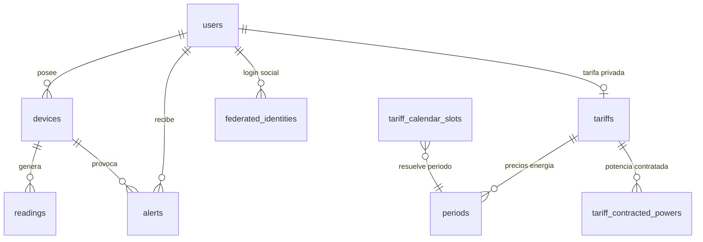
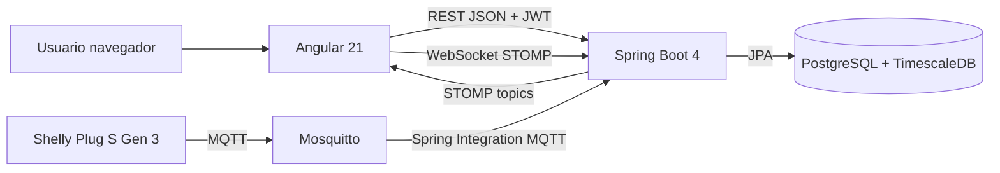

# Memoria técnica del proyecto DAW: Wattimizer

## 1. Introducción y justificación

### 1.1. Título del proyecto

El proyecto se presenta con el nombre comercial **Wattimizer**. En el repositorio aparece como `wattpath-app`, pero la marca usada en la aplicación y en la documentación funcional es Wattimizer.

### 1.2. Descripción del problema

Muchas pequeñas y medianas empresas reciben facturas eléctricas difíciles de interpretar. El dato de consumo en kWh no suele explicar por sí mismo cuánto dinero se está gastando, cuándo se producen los picos de potencia ni si hay consumo fuera del horario útil del negocio. Esta falta de visibilidad provoca que se tomen decisiones tarde: se detecta el sobrecoste al recibir la factura, no cuando se está generando.

Wattimizer aborda ese problema conectando dispositivos IoT de medición eléctrica, almacenando sus lecturas como series temporales y calculando el coste económico según tarifas eléctricas españolas. La aplicación no se limita a enseñar vatios en una gráfica: intenta traducir el consumo técnico a información comprensible para una empresa, como coste acumulado, consumo fantasma y alertas por exceso de potencia contratada.

### 1.3. Objetivos

#### Objetivo general

Desarrollar una aplicación web completa para monitorizar consumo eléctrico en tiempo real, calcular costes energéticos y ayudar a una pyme a tomar mejores decisiones sobre su uso de la electricidad.

#### Objetivos específicos

- Implementar un backend REST con Spring Boot para autenticación, gestión de dispositivos, lecturas, tarifas, analítica y alertas.
- Crear un frontend Angular con panel de control, formularios de gestión y visualización de telemetría en tiempo real.
- Integrar un flujo MQTT mediante Spring Integration para recibir datos de enchufes inteligentes Shelly.
- Almacenar lecturas eléctricas en PostgreSQL con TimescaleDB para tratar la telemetría como serie temporal.
- Aplicar tarifas eléctricas por periodos para convertir consumo energético en coste estimado.
- Incorporar dispositivos simulados para que la demo funcione aunque no haya hardware físico conectado.
- Desplegar la aplicación en un entorno real con Docker Compose, nginx, certificados TLS y CI/CD.

### 1.4. Tipos de usuarios

| Tipo de usuario | Uso previsto |
| --- | --- |
| Usuario de empresa | Consulta el dashboard, vincula dispositivos, configura su tarifa, revisa alertas y analiza costes. |
| Administrador | Gestiona el catálogo general de tarifas y puede crear usuarios administradores mediante un endpoint protegido por clave maestra. |
| Sistema / dispositivo IoT | Publica telemetría por MQTT o genera lecturas simuladas desde el backend. No interactúa con la interfaz visual, pero alimenta los datos de la plataforma. |

## 2. Fase 1: Análisis funcional

### 2.1. Mapa de funcionalidades

| Módulo | Funcionalidades |
| --- | --- |
| Autenticación | Registro, login con email y contraseña, login social Google/GitHub, emisión de JWT, cierre de sesión. |
| Dispositivos | Listado, vinculación por MAC, creación de simuladores, pack de demo, edición, borrado y cambio de estado. |
| Dashboard | Selector de dispositivo, gráfica de potencia, histórico reciente, coste diario y consumo fantasma. |
| Tarifas | Catálogo de tarifas, tarifa privada de usuario, precios por periodo, potencias contratadas y validación de reglas CNMC. |
| Telemetría | Entrada MQTT, normalización de mensajes Shelly, persistencia de lecturas, emisión por WebSocket. |
| Alertas | Detección de exceso de potencia contratada, listado y descarte de alertas. |
| Despliegue | Docker Compose, nginx, Mosquitto, TimescaleDB, variables de entorno y GitHub Actions. |

### 2.2. Historias de usuario

| ID | Historia de usuario | Criterios de aceptación | Prioridad |
| --- | --- | --- | --- |
| HU-01 | Como usuario, quiero registrarme e iniciar sesión para acceder a mis datos energéticos. | El sistema permite registro, login y acceso con JWT; si el token caduca, se redirige al login. | Imprescindible |
| HU-02 | Como usuario, quiero vincular un dispositivo por MAC para ver sus lecturas. | El dispositivo queda asociado a mi cuenta y no puede ser consultado por otros usuarios. | Imprescindible |
| HU-03 | Como usuario, quiero ver una gráfica de potencia en tiempo real para detectar picos de consumo. | El dashboard carga histórico reciente y añade nuevas lecturas por WebSocket. | Imprescindible |
| HU-04 | Como usuario, quiero configurar mi tarifa eléctrica para calcular costes reales. | La tarifa guarda periodos de energía y potencia, y se usa en el cálculo de analítica. | Imprescindible |
| HU-05 | Como usuario, quiero ver el coste acumulado y el consumo fantasma del día. | El dashboard consulta `/api/v1/analytics/cost` y `/api/v1/analytics/ghost-consumption`. | Imprescindible |
| HU-06 | Como usuario, quiero recibir alertas cuando supere la potencia contratada. | Cada lectura se compara con la potencia del periodo correspondiente y genera alerta `OVERPOWER`. | Imprescindible |
| HU-07 | Como administrador, quiero gestionar el catálogo de tarifas para ofrecer plantillas base. | Solo usuarios con rol `ADMIN` pueden crear, modificar o borrar tarifas del catálogo. | Imprescindible |
| HU-08 | Como visitante de demo, quiero probar la aplicación sin hardware real. | Se pueden crear dispositivos simulados y un pack de demo con perfiles de consumo. | Opcional |
| HU-09 | Como usuario, quiero iniciar sesión con Google o GitHub para evitar crear otra contraseña. | OAuth2 genera un ticket temporal que Angular intercambia por un JWT propio. | Opcional |

### 2.3. Gestión del trabajo

- **Repositorio GitHub:** <https://github.com/joellmar/wattpath-app>
- **Rama principal:** `main`
- **Rama de documentación:** `cursor/documentaci-n-t-cnica-del-proyecto-2e2b`
- **Tablero Kanban:** la memoria puede incorporar una captura del tablero con columnas `Backlog`, `Por hacer`, `En progreso`, `En revisión` y `Hecho`.

### 2.4. Planificación inicial

| Fase | Historias asociadas | Dificultad técnica |
| --- | --- | --- |
| Fase 1: base funcional | HU-01, HU-02 | Media, por la seguridad JWT y la relación usuario-dispositivo. |
| Fase 2: telemetría | HU-03, HU-06 | Alta, porque combina MQTT, persistencia temporal y WebSocket. |
| Fase 3: tarifas y analítica | HU-04, HU-05, HU-07 | Alta, por las reglas de periodos eléctricos y el cálculo económico. |
| Fase 4: demo y UX | HU-08, HU-09 | Media, porque reutiliza servicios existentes pero añade simulación y OAuth2. |
| Fase 5: despliegue | Todas | Alta, por la coordinación entre contenedores, nginx, TLS, dominio y CI/CD. |

## 3. Fase 2: Diseño técnico

### 3.1. Diseño de la base de datos

La base de datos usa PostgreSQL con TimescaleDB. Hibernate crea las tablas principales con `spring.jpa.hibernate.ddl-auto=update`, mientras que los scripts SQL de `backend/src/main/resources/db/` añaden lo que JPA no cubre bien: extensión TimescaleDB, conversión de `readings` en hypertable, constraints de tarifas e inserción del calendario regulatorio.



El detalle completo de tablas, claves y consultas aparece en [`anexo-d-timescaledb-analitica.md`](./anexo-d-timescaledb-analitica.md).

### 3.2. Arquitectura del sistema



- **Backend:** Java 26 con Spring Boot 4.0.5. Expone API REST, seguridad JWT/OAuth2, ingesta MQTT, WebSocket STOMP y servicios de negocio.
- **Frontend:** Angular 21 standalone, PrimeNG, Tailwind CSS, Chart.js, RxJS y `@ngrx/signals`.
- **Base de datos:** PostgreSQL 17 con TimescaleDB para la tabla temporal `readings`.
- **Mensajería IoT:** Mosquitto recibe la telemetría MQTT; Spring Integration enruta mensajes por topic.
- **Comunicación:** REST JSON para operaciones de negocio y STOMP para lecturas en tiempo real.

### 3.3. Diseño de interfaz

Las pantallas principales están representadas por rutas Angular:

| Ruta | Pantalla | Intención |
| --- | --- | --- |
| `/login` | Inicio de sesión | Acceso clásico y social. |
| `/register` | Registro | Alta de usuario. |
| `/dashboard` | Panel energético | Gráfica, selector de dispositivo y métricas económicas. |
| `/devices` | Dispositivos | Alta, vinculación, simuladores, edición y borrado. |
| `/tariffs` | Tarifas | Catálogo y tarifa privada. |
| `/alerts` | Alertas | Consulta y descarte de avisos de potencia. |

El diseño visual real se implementa con componentes PrimeNG y estilos propios en los archivos `*.component.html` y `*.css` del frontend.

### 3.4. Relación entre historias y diseño

| Historia | Tablas principales | Código principal |
| --- | --- | --- |
| HU-01 | `users`, `federated_identities` | `AuthController`, `SecurityConfig`, `SessionStorageService`, `authGuard`. |
| HU-02 | `devices` | `DeviceController`, `DeviceService`, `DevicesComponent`, `TelemetryStore`. |
| HU-03 | `readings`, `devices` | `ReadingController`, `TelemetryBroadcaster`, `DashboardComponent`, `WebsocketService`. |
| HU-04 | `tariffs`, `periods`, `tariff_contracted_powers`, `tariff_calendar_slots` | `TariffController`, `UserTariffController`, `TariffService`, `TariffComponent`, `TariffStore`. |
| HU-05 | `readings`, `tariffs`, `periods` | `ConsumptionController`, `ConsumptionService`, `CalendarResolverService`, `DashboardComponent`. |
| HU-06 | `alerts`, `readings`, `tariff_contracted_powers` | `AlertService`, `AlertController`, `AlertsComponent`. |
| HU-08 | `devices`, `readings` | `IotTelemetrySimulationJob`, `SimulatedTelemetryProcessor`, `SimulationProfileRegistry`, `DevicesComponent`. |

## 4. Fase 3: Implementación y desarrollo

### 4.1. Tecnologías utilizadas

| Área | Tecnología |
| --- | --- |
| Backend | Java 26, Spring Boot 4.0.5, Spring Security, Spring Data JPA, Spring Integration MQTT, WebSocket STOMP, MapStruct, Lombok. |
| Frontend | Angular 21, TypeScript 5.9, PrimeNG 21, Tailwind CSS 4, Chart.js 4, RxJS 7.8, NgRx Signals 21. |
| Datos | PostgreSQL 17, TimescaleDB, scripts SQL idempotentes. |
| IoT | Mosquitto 2.1.2, Eclipse Paho, Shelly Plug S Gen 3. |
| DevOps | Docker Compose, nginx, Let's Encrypt, GitHub Actions, Hetzner VPS. |
| Pruebas | JUnit/Spring Test en backend, Vitest en frontend, Biome para lint. |

### 4.2. Desarrollo del backend

El backend se organiza por controladores, servicios, repositorios, entidades, DTOs y mappers. Los controladores no concentran la lógica de negocio: validan la propiedad del recurso con el `Principal`, delegan en servicios y devuelven DTOs o respuestas HTTP.

Las decisiones principales son:

- **JWT stateless:** no hay sesión de servidor. El frontend guarda el token en `sessionStorage`.
- **OAuth2 con ticket temporal:** el login social no devuelve directamente el JWT en la redirección, sino un ticket de un solo uso que Angular intercambia por un token propio.
- **Multitenencia por usuario:** los endpoints de dispositivos, lecturas, analítica y alertas comprueban que el recurso pertenece al usuario autenticado.
- **DTOs y mappers:** se evita exponer directamente entidades JPA en la API.
- **Errores centralizados:** `GlobalExceptionHandler` normaliza errores frecuentes con `ErrorResponse`.

El detalle de endpoints y DTOs está en [`anexo-a-backend-rest.md`](./anexo-a-backend-rest.md).

### 4.3. Desarrollo del frontend

El frontend usa Angular standalone. La navegación está definida en `src/app/app.routes.ts` con rutas públicas y un layout protegido por `authGuard`.

La lógica reactiva combina:

- **Signals de Angular** para estado local de componentes.
- **NgRx Signals** para stores de telemetría y tarifas.
- **RxJS** para llamadas HTTP, WebSocket STOMP y métodos reactivos (`rxMethod`).
- **Formularios reactivos** en login, registro, dispositivos y tarifas.

El dashboard es la pantalla más representativa: carga dispositivos, selecciona una MAC, pide histórico reciente por REST, escucha lecturas nuevas por WebSocket y actualiza la gráfica de Chart.js.

El detalle de componentes, servicios y stores está en [`anexo-b-frontend-angular.md`](./anexo-b-frontend-angular.md).

### 4.4. Control de versiones

El historial reciente muestra un flujo por ramas y commits temáticos. Los últimos cambios se concentran en:

- Simuladores IoT y pack de demostración.
- Panel multi-dispositivo.
- Borrado en cascada de lecturas y alertas.
- Ajustes de despliegue en producción.
- Correcciones de nginx y GitHub Actions.
- Documentación de despliegue en Hetzner.

La rama `main` se usa como base estable y las ramas `cursor/*` se emplean para trabajos concretos, como esta documentación.

## 5. Fase 4: Pruebas y despliegue

### 5.1. Plan de pruebas

| Prueba | Validación |
| --- | --- |
| Login con credenciales válidas | Devuelve JWT y permite acceder a rutas protegidas. |
| Login con token caducado | El interceptor limpia sesión y redirige a `/login`. |
| Registro con email válido | Crea usuario con rol estándar. |
| Vinculación de dispositivo | Asocia la MAC al usuario autenticado. |
| Lecturas recientes | `GET /api/v1/readings/device/{mac}/recent` devuelve datos solo al propietario. |
| WebSocket dashboard | Una lectura nueva actualiza la serie de potencia. |
| Cálculo de coste | `ConsumptionServiceTest` valida coste por intervalos y zonas horarias. |
| Consumo fantasma | Se filtra el tramo nocturno y se calcula coste específico. |
| Tarifas | `TariffServiceTest` y `UserTariffServiceTest` validan reglas y asignaciones. |
| Simulación IoT | `IotTelemetrySimulationJobTest` y `SimulationProfileRegistryTest` validan perfiles simulados. |

### 5.2. Manual de instalación

#### Desarrollo local

1. Clonar el repositorio:

```bash
git clone https://github.com/joellmar/wattpath-app.git
cd wattpath-app
```

2. Levantar infraestructura mínima:

```bash
docker compose --env-file .env up -d timescaledb mosquitto
```

3. Arrancar backend:

```bash
cd backend
./mvnw spring-boot:run
```

4. Instalar y arrancar frontend:

```bash
cd frontend
npm install
npm start
```

5. Ejecutar scripts SQL en el orden documentado:

```text
00-extensions.sql
01-hypertable.sql
tariffs-td-schema.sql
seed-tariff-calendar-slots.sql
03-seed-users-dev.sql
04-seed-device-shelly.sql
05-seed-device-simulation.sql
```

#### Uso básico de la aplicación

1. Registrarse o iniciar sesión.
2. Crear un dispositivo simulado o reclamar un dispositivo físico por MAC.
3. Configurar una tarifa propia desde la pantalla de tarifas.
4. Entrar al dashboard para visualizar potencia, coste y consumo fantasma.
5. Revisar alertas si se supera la potencia contratada.

### 5.3. Despliegue

El despliegue está documentado en `docs/deployment/hetzner-production.md`. El entorno de producción usa:

- VPS Hetzner con Ubuntu 24.04.
- Docker Compose con contenedores para TimescaleDB, Mosquitto, backend, frontend y nginx.
- Dominio `https://wattimizer.com`.
- Subdominio/API mediante nginx.
- Certificados Let's Encrypt.
- GitHub Actions para reconstruir y desplegar tras cambios en `main`.

## 6. Conclusiones y líneas futuras

### 6.1. Grado de cumplimiento

El MVP funcional está cubierto: autenticación, gestión de dispositivos, telemetría, dashboard, tarifas, cálculo de costes, alertas, simuladores y despliegue. El proyecto no se queda en una maqueta de frontend, sino que conecta varias piezas reales de una aplicación web moderna.

### 6.2. Dificultades encontradas

- **Integración IoT:** hubo que adaptar los mensajes MQTT del Shelly a DTOs propios y persistirlos con una estructura coherente.
- **Series temporales:** TimescaleDB exige convertir la tabla `readings` antes de cargar datos si no se usa `migrate_data => true`.
- **Tarifas eléctricas:** el cálculo depende de periodos, calendario, zona geográfica y potencia contratada.
- **Tiempo real:** se combinan REST para el histórico inicial y WebSocket para la actualización continua.
- **Despliegue:** nginx, certificados, Docker y Cloudflare requieren una configuración coordinada para evitar errores como 502 o problemas con WebSocket.

### 6.3. Mejoras futuras

- Añadir compresión y retención automática en TimescaleDB.
- Crear agregados continuos para métricas por hora, día o mes.
- Incorporar TLS en MQTT o una VPN para evitar tráfico en claro por el puerto 1883.
- Permitir varios modelos de medidores además del Shelly Plug S Gen 3.
- Añadir predicción de coste mensual.
- Crear una app móvil o PWA con notificaciones push.
- Generar informes PDF para responsables de negocio.

## 7. Bibliografía y recursos

- Documentación oficial de Spring Boot: <https://spring.io/projects/spring-boot>
- Documentación oficial de Spring Security: <https://spring.io/projects/spring-security>
- Documentación de Spring Integration MQTT: <https://docs.spring.io/spring-integration/reference/mqtt.html>
- Documentación de Angular: <https://angular.dev>
- Documentación de RxJS: <https://rxjs.dev>
- Documentación de NgRx Signals: <https://ngrx.io/guide/signals>
- Documentación de TimescaleDB: <https://docs.timescale.com>
- Documentación de PostgreSQL: <https://www.postgresql.org/docs>
- Documentación de Mosquitto: <https://mosquitto.org/documentation>
- Documentación de Docker Compose: <https://docs.docker.com/compose>
- Repositorio del proyecto: <https://github.com/joellmar/wattpath-app>

