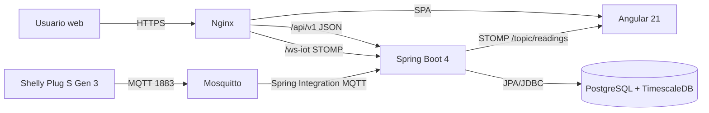

# Memoria tecnica del proyecto DAW: Wattimizer

Wattimizer es una aplicacion web B2B para monitorizar consumo electrico en pymes, convertir lecturas IoT en coste economico y avisar cuando un equipo supera la potencia contratada. Esta memoria se redacta a partir del codigo real del repositorio `joellmar/wattpath-app`, no como una descripcion teorica separada de la implementacion.

## Cambios recientes analizados

La rama de documentacion `cursor/documentaci-n-t-cnica-del-proyecto-8f34` parte del mismo commit que `main` (`3021eba`). Por tanto, no hay cambios funcionales propios de esta rama antes de generar estos documentos. El analisis se ha centrado en el estado actual de `main` y en los commits recientes de despliegue, CI/CD y configuracion que afectan directamente a la memoria tecnica.

Los ultimos cambios relevantes del repositorio refuerzan la parte de produccion: guia de Hetzner actualizada con incidencias reales, ajuste de variables OAuth de GitHub (`GH_OAUTH_*`), permisos de `mvnw` en CI, resolver DNS interno de Nginx, scripts SQL tarifarios reejecutables y apertura controlada de `/api/v1/auth/register/admin` para que pueda evaluarse la clave de administrador.

## Indice

1. [Introduccion y justificacion](#1-introduccion-y-justificacion)
2. [Fase 1: Analisis funcional](#2-fase-1-analisis-funcional)
3. [Fase 2: Diseno tecnico](#3-fase-2-diseno-tecnico)
4. [Fase 3: Implementacion y desarrollo](#4-fase-3-implementacion-y-desarrollo)
5. [Fase 4: Pruebas y despliegue](#5-fase-4-pruebas-y-despliegue)
6. [Conclusiones y lineas futuras](#6-conclusiones-y-lineas-futuras)
7. [Bibliografia y recursos](#7-bibliografia-y-recursos)
8. [Anexos tecnicos](#8-anexos-tecnicos)

## 1. Introduccion y justificacion

### 1.1. Titulo del proyecto

**Wattimizer**: plataforma web de inteligencia financiera energetica para pymes.

El repositorio se llama `wattpath-app`, pero la marca que aparece en la aplicacion, en el `README.md` y en el despliegue es **Wattimizer**. Por eso la memoria utiliza Wattimizer como nombre comercial.

### 1.2. Descripcion del problema

Muchas pequenas y medianas empresas conocen el importe final de su factura electrica, pero no tienen una vision clara de como se genera ese coste durante el dia. La factura llega tarde, agrupa consumos y hace dificil detectar si una maquina esta consumiendo fuera de horario, si hay stand-by innecesario o si se estan produciendo picos de potencia que pueden penalizar el contrato.

Wattimizer intenta resolver ese problema conectando enchufes inteligentes Shelly Plug S Gen 3 con una plataforma web. El sistema recibe telemetria por MQTT, guarda las lecturas como serie temporal en TimescaleDB y aplica tarifas electricas reales de acceso, como `2.0TD` y `3.0TD`, para traducir kWh a euros. La parte importante no es solo ver una grafica de vatios, sino entender el impacto economico de cada lectura.

### 1.3. Objetivos

#### Objetivo general

Desarrollar una aplicacion web completa que permita a una pyme registrar sus dispositivos electricos, visualizar consumo en tiempo real, configurar su tarifa y consultar el coste energetico asociado a sus lecturas.

#### Objetivos especificos

- Implementar un backend REST con Spring Boot para usuarios, dispositivos, lecturas, alertas, tarifas y analitica.
- Proteger la aplicacion mediante JWT, roles `ROLE_USER` y `ROLE_ADMIN`, y login social con Google y GitHub.
- Ingerir telemetria IoT de forma asincrona mediante Spring Integration MQTT y un broker Mosquitto.
- Persistir lecturas electricas en PostgreSQL con TimescaleDB, usando la tabla `readings` como hypertable particionada por tiempo.
- Construir un frontend Angular con rutas protegidas, formularios reactivos, PrimeNG y estado compartido mediante NgRx Signals Store.
- Mostrar telemetria en tiempo real mediante WebSocket STOMP y mantener una ventana de ultimas lecturas para el dashboard.
- Calcular coste energetico y consumo fantasma a partir de las lecturas historicas y de la tarifa asignada al usuario.
- Documentar instalacion, despliegue y flujo de desarrollo para que otro desarrollador pueda levantar el proyecto.

### 1.4. Tipos de usuarios

| Usuario | Uso previsto en la aplicacion | Permisos principales |
| --- | --- | --- |
| Usuario de pyme (`ROLE_USER`) | Gestiona sus dispositivos, consulta dashboard, configura su tarifa privada y revisa alertas. | Acceso a `/dashboard`, `/devices`, `/tariffs` y `/alerts`. Solo opera sobre sus propios datos. |
| Administrador (`ROLE_ADMIN`) | Mantiene el catalogo maestro de tarifas y puede usar las funciones de usuario. | Ademas de lo anterior, puede crear, editar y borrar tarifas globales desde `/api/v1/tariffs`. La lectura de plantillas esta disponible para usuarios autenticados. |
| Sistema IoT / broker MQTT | No entra por interfaz web; publica telemetria de enchufes Shelly o del simulador. | Inserta lecturas indirectamente mediante el pipeline MQTT del backend. |

## 2. Fase 1: Analisis funcional

### 2.1. Mapa de funcionalidades

| Modulo | Funcionalidades implementadas | Evidencia en codigo |
| --- | --- | --- |
| Autenticacion | Login local, registro, alta de admin con clave, OAuth2 Google/GitHub, emision JWT. | `AuthController`, `SecurityConfig`, `OAuth2AuthenticationSuccessHandler` |
| Dispositivos | Listado por usuario, alta, claim de dispositivo huerfano, edicion, borrado. | `DeviceController`, `DeviceService`, `TelemetryStore`, `DevicesComponent` |
| Telemetria | Recepcion MQTT, persistencia de lecturas, simulador cada 5 segundos y emision STOMP. | `MqttConfig`, `DeviceMessageHandler`, `ReadingService`, `IotTelemetrySimulationJob` |
| Dashboard | Grafica de potencia en vivo, coste diario y consumo fantasma. | `DashboardComponent`, `TelemetryStore`, `ConsumptionController` |
| Tarifas | Catalogo maestro, tarifa privada por usuario, precios P1-P6 y potencias contratadas. | `TariffController`, `UserTariffController`, `TariffComponent`, `TariffStore` |
| Alertas | Deteccion de exceso de potencia contratada y borrado de alertas. | `AlertService`, `AlertController`, `AlertsComponent` |
| Despliegue | Docker Compose, Nginx, Certbot, GitHub Actions y guia Hetzner. | `docker-compose.yml`, `.github/workflows/deploy.yml`, `docs/deployment/hetzner-production.md` |

### 2.2. Historias de usuario

Las historias no estaban versionadas como documento separado, asi que se han reconstruido desde rutas, controladores, componentes y commits.

| ID | Historia de usuario | Criterios de aceptacion | Prioridad |
| --- | --- | --- | --- |
| HU-01 | Como usuario, quiero registrarme con email y contrasena para acceder a la plataforma. | `POST /api/v1/auth/register` crea usuario; la contrasena se valida con confirmacion; tras registro se puede iniciar sesion. | MVP |
| HU-02 | Como usuario, quiero iniciar sesion para ver solo mis datos energeticos. | `POST /api/v1/auth/login` devuelve JWT; el frontend guarda el token en `sessionStorage`; las rutas privadas usan `authGuard`. | MVP |
| HU-03 | Como usuario, quiero vincular un enchufe inteligente por MAC para asociarlo a mi cuenta. | `POST /api/v1/devices/claim` asigna el dispositivo al `Principal`; si el dispositivo no existe, se registra con esa MAC. | MVP |
| HU-04 | Como usuario, quiero consultar mis dispositivos para elegir cual analizar. | `GET /api/v1/devices` devuelve solo dispositivos del usuario autenticado; el store selecciona automaticamente el primero. | MVP |
| HU-05 | Como usuario, quiero ver la potencia en tiempo real para detectar consumos anormales. | El dashboard se suscribe a `/topic/readings/{macAddress}`; solo conserva las ultimas 20 lecturas para la grafica. | MVP |
| HU-06 | Como usuario, quiero configurar mi tarifa electrica para convertir kWh en euros. | `GET/POST/DELETE /api/v1/users/me/tariff` gestiona la tarifa privada sin recibir `userId` en la URL ni en el body. | MVP |
| HU-07 | Como usuario, quiero ver el coste energetico del periodo actual. | `GET /api/v1/analytics/cost` calcula deltas de `energyTotalKwh` y aplica el precio del periodo tarifario. | MVP |
| HU-08 | Como usuario, quiero detectar consumo fantasma nocturno para reducir gasto fuera de horario. | `GET /api/v1/analytics/ghost-consumption` filtra de 00:00 a 05:59 en la zona horaria de la tarifa. | MVP |
| HU-09 | Como usuario, quiero recibir alertas si supero la potencia contratada. | `AlertService.checkPowerThreshold` compara `powerW / 1000` con `contracted_power_kw` y crea alerta `OVERPOWER`. | MVP |
| HU-10 | Como administrador, quiero mantener un catalogo de tarifas para que los usuarios partan de plantillas. | Los usuarios autenticados pueden leer plantillas; crear, editar y borrar el catalogo requiere `ROLE_ADMIN`. | MVP |
| HU-11 | Como desarrollador/demostrador, quiero simular telemetria para mostrar la app sin hardware fisico. | `IotTelemetrySimulationJob` genera lecturas para dispositivos `is_simulated=true` cada 5 segundos. | Opcional util |
| HU-12 | Como usuario, quiero iniciar sesion con Google o GitHub para no crear otra contrasena. | OAuth2 genera ticket temporal y el frontend lo intercambia por JWT en `/api/v1/auth/oauth/exchange`. | Opcional util |

### 2.3. Gestion del trabajo

- **Repositorio:** <https://github.com/joellmar/wattpath-app>
- **Rama base de produccion:** `main`
- **Rama de documentacion actual:** `cursor/documentaci-n-t-cnica-del-proyecto-8f34`
- **Flujo observado:** commits pequenos con prefijos `feat`, `fix`, `docs`, `ci` y merges de ramas de funcionalidad hacia `main`.
- **Tablero Kanban:** el repositorio no contiene captura del tablero. Para la entrega academica, esta evidencia debe adjuntarse desde GitHub Projects o la herramienta usada durante el desarrollo.

### 2.4. Planificacion inicial

| Fase | Historias asociadas | Dificultad tecnica | Justificacion |
| --- | --- | --- | --- |
| Analisis y autenticacion | HU-01, HU-02, HU-12 | Media | Incluye JWT, roles y OAuth2, con coordinacion backend/frontend. |
| Dispositivos y telemetria | HU-03, HU-04, HU-05, HU-11 | Alta | Requiere MQTT, WebSocket, persistencia temporal y simulacion. |
| Tarifas y analitica | HU-06, HU-07, HU-08, HU-09, HU-10 | Alta | Combina calendario regulatorio, precios por periodo, potencias contratadas y calculos sobre lecturas. |
| Interfaz y experiencia de usuario | HU-04 a HU-10 | Media | Angular standalone, PrimeNG, formularios reactivos, Signals y NgRx Signals Store. |
| Despliegue | Todas | Alta | Docker, Nginx, TLS, Cloudflare, CI/CD y variables de entorno sensibles. |

## 3. Fase 2: Diseno tecnico

### 3.1. Diseno de base de datos

El modelo se genera principalmente con Hibernate (`spring.jpa.hibernate.ddl-auto=update`) y se completa con scripts SQL para TimescaleDB, constraints regulatorios y seeds. La tabla central de telemetria es `readings`, convertida en hypertable.


Resumen relacional:

| Tabla | Clave principal | Relaciones principales | Uso |
| --- | --- | --- | --- |
| `users` | `id` | `tariff_id` opcional hacia `tariffs` | Identidad local, rol y tarifa asignada. |
| `federated_identities` | `id` | `user_id` hacia `users` | Vinculacion OAuth2 Google/GitHub. |
| `devices` | `id` | `user_id` opcional hacia `users` | Enchufes reales o simulados. |
| `readings` | `(time, device_id)` | `device_id` hacia `devices` | Serie temporal de potencia, energia acumulada y estado. |
| `alerts` | `id` | `user_id`, `device_id` | Avisos de exceso de potencia. |
| `tariffs` | `id` | Relacion con `users`, `periods`, `tariff_contracted_powers` | Contrato energetico. |
| `periods` | `id` | `tariff_id` | Precio por kWh de P1 a P6. |
| `tariff_contracted_powers` | `id` | `tariff_id` | Potencia contratada por periodo. |
| `tariff_calendar_slots` | `id` | Sin FK directa | Tabla dimension para resolver hora local a periodo. |

El detalle completo esta en [Anexo D](./anexo-d-timescaledb-analitica.md).

### 3.2. Arquitectura del sistema



| Capa | Tecnologia real | Decision de diseno |
| --- | --- | --- |
| Frontend | Angular 21, PrimeNG, Tailwind CSS, Chart.js | SPA con rutas publicas y area privada protegida por guard. |
| Estado cliente | Signals de Angular y NgRx Signals Store | Estado compartido simple para telemetria y tarifas sin montar NgRx clasico. |
| Backend | Spring Boot 4.0.5, Java 26, Spring Security | API REST stateless con JWT y OAuth2. |
| Tiempo real | STOMP sobre WebSocket | El backend emite lecturas y alertas sin hacer polling desde Angular. |
| IoT | MQTT con Mosquitto y Spring Integration MQTT | Entrada asincrona desacoplada de las peticiones HTTP. |
| Datos | PostgreSQL + TimescaleDB | `readings` se particiona por tiempo; JPA gestiona el resto del dominio. |
| Despliegue | Docker Compose, Nginx, Certbot, GitHub Actions | Produccion en VPS Hetzner con servicios internos no expuestos salvo Nginx y MQTT. |

### 3.3. Diseno de interfaz

El repositorio no contiene wireframes graficos versionados. A partir de las rutas y plantillas Angular, las pantallas principales quedan asi:

| Pantalla | Ruta | Estructura funcional |
| --- | --- | --- |
| Login | `/login` | Formulario email/contrasena, botones OAuth2 Google/GitHub y enlace a registro. |
| Registro | `/register` | Formulario con confirmacion de contrasena y validacion de coincidencia. |
| Dashboard | `/dashboard` | Selector de medidor, grafica de potencia, coste total, consumo fantasma y aviso si no hay tarifa. |
| Dispositivos | `/devices` | Tabla de dispositivos, vinculacion segura por `claim` de MAC, edicion de nombre/estado y borrado. |
| Tarifas | `/tariffs` | Gestion de tarifa privada para todos; lectura de plantillas para usuarios autenticados y mutacion del catalogo solo para `ROLE_ADMIN`. |
| Alertas | `/alerts` | Listado de alertas `OVERPOWER` y accion de descartarlas. |

### 3.4. Relacion entre historias y diseno

| Historia | Tablas principales | Backend | Frontend |
| --- | --- | --- | --- |
| HU-01, HU-02 | `users` | `AuthController`, `JwtTokenService` | `LoginComponent`, `RegisterComponent`, `SessionStorageService` |
| HU-03, HU-04 | `devices` | `DeviceController`, `DeviceService` | `DevicesComponent`, `TelemetryStore` |
| HU-05 | `readings`, `devices` | `MqttConfig`, `DeviceMessageHandler`, `TelemetryBroadcaster` | `DashboardComponent`, `WebsocketService`, `TelemetryStore` |
| HU-06, HU-10 | `tariffs`, `periods`, `tariff_contracted_powers` | `TariffController`, `UserTariffController`, `TariffService` | `TariffComponent`, `TariffService`, `TariffStore` |
| HU-07, HU-08 | `readings`, `tariffs`, `periods`, `tariff_calendar_slots` | `ConsumptionController`, `ConsumptionService`, `CalendarResolverService` | `DashboardComponent` |
| HU-09 | `alerts`, `tariff_contracted_powers` | `AlertService`, `AlertController` | `AlertsComponent` |
| HU-11 | `devices`, `readings` | `IotTelemetrySimulationJob`, `ReadingService` | Reutiliza dashboard y dispositivos. |
| HU-12 | `users`, `federated_identities` | `OAuth2AuthenticationSuccessHandler`, `OAuth2LoginTicketService` | `OAuthCallbackComponent` |

## 4. Fase 3: Implementacion y desarrollo

### 4.1. Tecnologias utilizadas

| Ambito | Tecnologia | Version observada |
| --- | --- | --- |
| Backend | Spring Boot | `4.0.5` |
| Lenguaje backend | Java | `26` |
| Seguridad | Spring Security, OAuth2 Client, JJWT | `jjwt 0.12.5` |
| Persistencia | Spring Data JPA, PostgreSQL JDBC | Gestionado por Spring Boot |
| MQTT | Spring Integration MQTT, Eclipse Paho, HiveMQ client | Paho `1.2.5`, HiveMQ `1.3.13` |
| Mapeo | MapStruct | `1.6.3` |
| Frontend | Angular | dependencias `^21.1.0`, CLI `^21.1.3` |
| Lenguaje frontend | TypeScript | `~5.9.2` |
| UI | PrimeNG, PrimeIcons, Tailwind CSS, Chart.js | PrimeNG `^21.1.7`, Chart.js `^4.5.1` |
| Estado | `@ngrx/signals` | `^21.1.0` |
| Tiempo real cliente | `@stomp/rx-stomp`, `@stomp/stompjs` | `^2.4.0`, `^7.3.0` |
| Calidad frontend | Biome, Vitest | Biome `2.4.16`, Vitest `^4.0.8` |
| Base de datos | TimescaleDB sobre PostgreSQL | imagen `timescale/timescaledb-ha:pg17` |
| Broker | Eclipse Mosquitto | `2.1.2-alpine` |
| Infraestructura | Docker Compose, Nginx, Certbot, GitHub Actions | Configurado en repositorio |

### 4.2. Desarrollo del backend

El backend esta organizado por controladores REST, servicios de dominio, repositorios JPA, entidades y mappers. La decision principal ha sido separar las peticiones HTTP del flujo de telemetria:

- Las operaciones de usuario entran por `/api/v1/*`.
- Las lecturas de hardware entran por MQTT y se procesan en canales de Spring Integration.
- Las actualizaciones en vivo salen por STOMP hacia el frontend.

La seguridad se basa en JWT stateless. El frontend envia `Authorization: Bearer <token>` y `JwtValidatorFilter` reconstruye el `SecurityContext`. Para evitar accesos cruzados entre usuarios, varios controladores consultan el `Principal` y comprueban que el recurso pertenezca al usuario autenticado. Un ejemplo claro es `UserTariffController`, que no acepta `userId` ni en URL ni en body: siempre opera sobre `/api/v1/users/me/tariff`.

La gestion de errores se centraliza en `GlobalExceptionHandler`, que devuelve `ErrorResponse` con codigo, tipo de error, mensaje y timestamp. Hay excepciones que se tratan fuera del handler, como los JWT expirados, porque se detectan en el filtro de seguridad antes de llegar a los controladores.

El detalle de endpoints y DTOs esta en [Anexo A](./anexo-a-backend-rest.md).

### 4.3. Desarrollo del frontend

El frontend usa Angular standalone components y carga diferida de componentes en rutas. La navegacion se divide en tres rutas publicas (`/login`, `/register`, `/auth/oauth/callback`) y un layout privado con las vistas principales.

La logica reactiva se reparte en:

- Signals locales para estado de UI: mensajes, loaders, dialogos y datos calculados.
- `TelemetryStore` para dispositivos, seleccion de MAC y lecturas en vivo.
- `TariffStore` para catalogo maestro y tarifa privada del usuario.
- RxJS para peticiones HTTP, WebSocket STOMP y deduplicacion de lecturas.

El `httpInterceptor` anade el token a las peticiones `/api/v1` salvo rutas publicas de autenticacion, y ante un `401` limpia la sesion y redirige al login. Esta decision evita que cada servicio tenga que repetir la misma logica de seguridad.

El detalle de componentes, servicios y stores esta en [Anexo B](./anexo-b-frontend-angular.md).

### 4.4. Control de versiones

El historial reciente muestra una evolucion por ramas y commits tematicos:

| Tipo de commit | Ejemplos recientes | Aporte al proyecto |
| --- | --- | --- |
| `feat` | tarifas, OAuth2, simulador IoT, CI/CD | Nuevas funcionalidades. |
| `fix` | CORS, seguridad admin, Nginx DNS, scripts SQL | Correcciones encontradas durante integracion/despliegue. |
| `docs` | guia Hetzner | Documentacion de despliegue real. |
| `ci` | primer deploy automatico | Evidencia de automatizacion del despliegue. |

El ultimo cambio antes de esta documentacion actualizaba la guia de Hetzner con problemas reales detectados durante el despliegue. Eso es importante para la memoria porque no se trata solo de una arquitectura local, sino de una aplicacion publicada en produccion.

## 5. Fase 4: Pruebas y despliegue

### 5.1. Plan de pruebas

| Prueba | Codigo o flujo | Resultado esperado |
| --- | --- | --- |
| Login con credenciales validas | `AuthService.authentication` + `POST /api/v1/auth/login` | Se guarda JWT y se navega a `/dashboard`. |
| Acceso a ruta privada sin token | `authGuard` | Redireccion a `/login`. |
| Token expirado en peticion API | `httpInterceptor` + `JwtValidatorFilter` | Limpieza de sesion y vuelta al login. |
| Registro con contrasenas diferentes | `RegisterComponent.passwordMatchValidator` | Formulario invalido y mensaje de error. |
| Carga de dispositivos | `TelemetryStore.loadDevices` | Se guarda la lista y se selecciona la primera MAC si no habia seleccion previa. |
| WebSocket de lecturas | `TelemetryStore.connectTelemetry` | Suscripcion a `/topic/readings/{mac}` y maximo 20 puntos en grafica. |
| Coste fantasma Peninsula/Canarias | `ConsumptionServiceTest` | El intervalo 00:00-05:59 se evalua con la zona horaria correcta de la tarifa. |
| Catalogo de tarifas | `tariff.service.spec.ts` | Peticiones HTTP esperadas para CRUD y tarifa privada. |
| Dashboard sin tarifa | `dashboard.component.spec.ts` | Se muestra aviso y no se fuerza calculo economico sin contrato. |
| Build frontend en CI | `.github/workflows/deploy.yml` | `npm ci --legacy-peer-deps` y build de produccion. |
| Build backend en CI | `.github/workflows/deploy.yml` | `./mvnw -DskipTests clean package`. |

### 5.2. Manual de instalacion y administracion

Para desarrollo local, la guia principal es [`GUIA_DESPLIEGUE_LOCAL_WINDOWS.md`](../../GUIA_DESPLIEGUE_LOCAL_WINDOWS.md). El modo recomendado separa infraestructura y codigo:

```bash
docker compose up -d timescaledb mosquitto
cd backend
./mvnw spring-boot:run
cd ../frontend
npm install
npm start
```

Orden critico de SQL tras el primer arranque de Hibernate:

1. `backend/src/main/resources/db/dev-seed/00-extensions.sql`
2. `backend/src/main/resources/db/dev-seed/01-hypertable.sql`
3. `backend/src/main/resources/db/tariffs-td-schema.sql`
4. `backend/src/main/resources/db/seed-tariff-calendar-slots.sql`
5. Seeds de desarrollo si se necesita demo local.
6. `backend/src/main/resources/db/prod/99-resync-sequences.sql`

Variables importantes:

| Variable | Uso |
| --- | --- |
| `DB_NAME`, `DB_USER`, `DB_PASSWORD` | Conexion de TimescaleDB. |
| `MQTT_URL`, `MQTT_USER`, `MQTT_PASSWORD` | Conexion del backend con Mosquitto. |
| `JWT_SECRET` | Firma de tokens JWT. |
| `ADMIN_KEY` | Alta protegida de administradores. |
| `GOOGLE_CLIENT_ID`, `GOOGLE_CLIENT_SECRET` | OAuth2 Google. |
| `GH_OAUTH_CLIENT_ID`, `GH_OAUTH_CLIENT_SECRET` | OAuth2 GitHub en GitHub Actions. |
| `APP_CORS_ALLOWED_ORIGINS` | Origenes permitidos para frontend. |

### 5.3. Despliegue

El despliegue de produccion esta documentado en [`docs/deployment/hetzner-production.md`](../deployment/hetzner-production.md).

| Elemento | Valor |
| --- | --- |
| Proveedor | Hetzner VPS |
| Sistema operativo | Ubuntu 24.04 LTS |
| Dominio | `https://wattimizer.com` |
| Proxy | Nginx en contenedor, con certificados Certbot montados desde el host |
| Base de datos | TimescaleDB en red Docker interna, sin puerto expuesto al exterior |
| Broker MQTT | Mosquitto, puerto `1883` expuesto para Shelly fisico |
| CI/CD | GitHub Actions con validacion frontend, validacion backend y despliegue por SSH |

Los arreglos recientes mas relevantes del despliegue fueron:

- Uso de `GH_OAUTH_*` para evitar conflicto con prefijos reservados de GitHub Actions.
- Permiso de ejecucion de `mvnw` para que el build backend funcione en CI.
- Resolver DNS interno en Nginx para evitar cache de IP de contenedores.
- Scripts SQL idempotentes para que el esquema tarifario pueda reejecutarse con seguridad.
- Apertura de `/api/v1/auth/register/admin` como `permitAll` para que el filtro de clave admin pueda evaluarse.

## 6. Conclusiones y lineas futuras

### 6.1. Grado de cumplimiento

El MVP queda cubierto a nivel funcional: existe login, registro, gestion de dispositivos, telemetria en vivo, tarifas, calculo de coste, alertas y despliegue en produccion. Tambien se han anadido mejoras utiles para una demo real, como OAuth2 y simulacion de telemetria sin hardware.

### 6.2. Dificultades encontradas

| Dificultad | Solucion aplicada |
| --- | --- |
| Integrar datos IoT asincronos con una API REST tradicional. | Se separo la entrada MQTT mediante Spring Integration y se emitio el resultado por STOMP. |
| Aplicar tarifas electricas con periodos P1-P6 dependientes de zona, mes y hora. | Se creo `tariff_calendar_slots` como tabla dimension y `CalendarResolverService` como punto unico de resolucion. La cobertura seed actual se centra en `2.0TD` y `3.0TD` para `PENINSULA` e `ISLAS_BALEARES`. |
| Evitar que un usuario consulte recursos de otro. | Se uso `Principal` en controladores y rutas `/me` para operaciones multitenant. |
| Desplegar WebSocket detras de Nginx y Cloudflare. | Se configuro `api.wattimizer.com` con nube gris y proxy especifico para `/ws-iot`. |
| Arranque de backend sin credenciales OAuth en local. | Se dejaron fallbacks dummy en `application.properties` y valores por defecto en Compose. |
| SQL mixto entre Hibernate y TimescaleDB. | Hibernate crea tablas y scripts SQL completan extensiones, hypertable, constraints y seeds. |

### 6.3. Mejoras futuras

- Activar TLS en MQTT (`8883`) o tunel VPN para no exponer telemetria en texto plano.
- Sustituir `spring.jpa.hibernate.ddl-auto=update` en produccion por migraciones controladas con Flyway o Liquibase.
- Aprovechar TimescaleDB con `time_bucket`, continuous aggregates, compresion y politicas de retencion.
- Crear endpoint historico agregado para que el dashboard no dependa solo de las ultimas 20 lecturas en memoria.
- Anadir guard de rol en frontend para separar claramente vistas de administrador.
- Unificar mutaciones de dispositivos en `TelemetryStore`, ya que `DevicesComponent` usa `HttpClient` directo.
- Crear aplicacion movil o PWA para consulta rapida de alertas.
- Incorporar notificaciones push o email cuando aparezca una alerta `OVERPOWER`.

## 7. Bibliografia y recursos

- Spring Boot Documentation: <https://docs.spring.io/spring-boot/>
- Spring Security Reference: <https://docs.spring.io/spring-security/reference/>
- Spring Integration MQTT: <https://docs.spring.io/spring-integration/reference/mqtt.html>
- Angular Documentation: <https://angular.dev/>
- NgRx Signals: <https://ngrx.io/guide/signals>
- RxJS Documentation: <https://rxjs.dev/>
- PrimeNG Documentation: <https://primeng.org/>
- TimescaleDB Documentation: <https://docs.timescale.com/>
- PostgreSQL Documentation: <https://www.postgresql.org/docs/>
- Eclipse Mosquitto Documentation: <https://mosquitto.org/documentation/>
- STOMP over WebSocket: <https://stomp.github.io/>
- Circular CNMC 3/2020 y documentacion publica de peajes electricos de acceso.
- Documentacion interna del repositorio: `README.md`, `GUIA_DESPLIEGUE_LOCAL_WINDOWS.md`, `docs/deployment/hetzner-production.md`.

## 8. Anexos tecnicos

- [Anexo A: Backend Spring Boot REST, seguridad y DTOs](./anexo-a-backend-rest.md)
- [Anexo B: Frontend Angular, RxJS y NgRx Signals](./anexo-b-frontend-angular.md)
- [Anexo C: Ingesta asincrona de telemetria MQTT](./anexo-c-telemetria-mqtt.md)
- [Anexo D: TimescaleDB, modelo de datos y consultas analiticas](./anexo-d-timescaledb-analitica.md)
