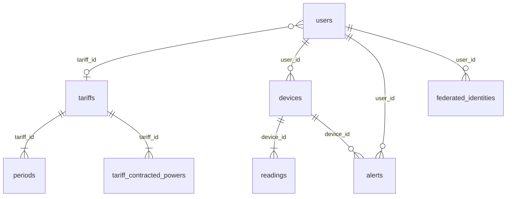

# Memoria técnica del proyecto DAW: Wattimizer

## Índice

1. [Introducción y justificación](#1-introducción-y-justificación)
2. [Fase 1: Análisis funcional](#2-fase-1-análisis-funcional)
3. [Fase 2: Diseño técnico](#3-fase-2-diseño-técnico)
4. [Fase 3: Implementación y desarrollo](#4-fase-3-implementación-y-desarrollo)
5. [Fase 4: Pruebas y despliegue](#5-fase-4-pruebas-y-despliegue)
6. [Conclusiones y líneas futuras](#6-conclusiones-y-líneas-futuras)
7. [Bibliografía y recursos](#7-bibliografía-y-recursos)
8. [Anexos técnicos](#8-anexos-técnicos)

## 1. Introducción y justificación

### 1.1. Título del proyecto

**Wattimizer**: plataforma web de inteligencia energética para pymes.

### 1.2. Descripción del problema

Muchas pequeñas y medianas empresas pagan la electricidad como un gasto fijo
difícil de controlar. Aunque algunas ya tienen contadores digitales o enchufes
inteligentes, normalmente no traducen esas lecturas a decisiones claras: cuánto
cuesta realmente el consumo de un equipo, cuándo se supera la potencia
contratada o qué parte del gasto se produce por aparatos que quedan encendidos
fuera del horario útil.

Wattimizer nace para resolver ese problema desde una aplicación web completa.
El sistema recibe lecturas IoT de enchufes Shelly mediante MQTT, las guarda como
serie temporal en TimescaleDB y calcula costes usando contratos eléctricos con
periodos P1-P6. Además, incorpora simuladores de consumo para poder enseñar la
aplicación sin depender siempre de hardware físico.

### 1.3. Objetivos

#### Objetivo general

Desarrollar una aplicación web que permita registrar dispositivos eléctricos,
recibir telemetría en tiempo real y convertir los datos de consumo en
información económica útil para una empresa.

#### Objetivos específicos

- Implementar autenticación con JWT y registro de usuarios con rol `ROLE_USER`
  o `ROLE_ADMIN`.
- Gestionar dispositivos físicos Shelly y dispositivos simulados desde el
  frontend Angular.
- Ingerir telemetría asíncrona mediante Spring Integration MQTT.
- Persistir lecturas de potencia y energía acumulada en una hypertable de
  TimescaleDB.
- Calcular coste energético y consumo fantasma por intervalo temporal.
- Asociar tarifas eléctricas al usuario y resolver periodos horarios mediante
  calendario regulatorio.
- Mostrar en el panel una gráfica reactiva alimentada por HTTP inicial y STOMP
  en tiempo real.
- Generar alertas cuando la potencia instantánea supera la potencia contratada
  del periodo vigente.

### 1.4. Tipos de usuarios

| Usuario | Uso previsto | Capacidades principales |
| --- | --- | --- |
| Usuario empresa | Pyme que monitoriza su consumo | Registrar dispositivos, asignar tarifa, consultar dashboard y alertas. |
| Administrador | Responsable técnico o gestor de la plataforma | Mantener el catálogo de tarifas y probar datos de demostración. |
| Sistema IoT | Backend y broker MQTT | Recibir mensajes del Shelly, persistir lecturas y emitir eventos en tiempo real. |

## 2. Fase 1: Análisis funcional

### 2.1. Mapa de funcionalidades

| Módulo | Funcionalidades |
| --- | --- |
| Autenticación | Login, registro, registro de administrador con clave, OAuth2 con Google/GitHub y canje de ticket. |
| Dispositivos | Listado por usuario, vinculación de MAC física, creación de simulador, pack demo, edición, encendido/apagado y borrado con lecturas asociadas. |
| Telemetría | Recepción MQTT, persistencia en `readings`, emisión STOMP y carga inicial de lecturas recientes. |
| Tarifas | Catálogo maestro, contrato privado del usuario, periodos P1-P6 y potencias contratadas. |
| Analítica | Coste total del día, coste fantasma de 00:00 a 05:59 y coste instantáneo estimado. |
| Alertas | Avisos `OVERPOWER` cuando la potencia supera el maxímetro contratado. |
| Despliegue | Docker Compose con backend, frontend, TimescaleDB, Mosquitto y Nginx. |

### 2.2. Historias de usuario

| ID | Historia | Criterios de aceptación | Prioridad |
| --- | --- | --- | --- |
| HU-01 | Como usuario, quiero registrarme e iniciar sesión para acceder a mis datos. | El backend acepta `POST /api/v1/auth/register`; el login devuelve JWT; el frontend guarda el token en `sessionStorage`. | Imprescindible |
| HU-02 | Como empresa, quiero vincular un enchufe Shelly por MAC para controlar mis equipos. | El formulario valida 12 caracteres hexadecimales; `POST /api/v1/devices/claim` vincula el dispositivo al usuario autenticado. | Imprescindible |
| HU-03 | Como usuario, quiero crear dispositivos simulados para probar la aplicación sin hardware. | `POST /api/v1/devices/simulated` genera una MAC `SIM000000001`; el job programado emite lecturas cada `simulation.interval-ms`. | Imprescindible |
| HU-04 | Como usuario, quiero ver una gráfica de potencia en tiempo real. | El dashboard carga los últimos datos por HTTP y después escucha `/topic/readings/{mac}` por STOMP. | Imprescindible |
| HU-05 | Como usuario, quiero asignarme una tarifa eléctrica para calcular costes. | `GET /api/v1/users/me/tariff` devuelve la tarifa o 204; `POST /api/v1/users/me/tariff` guarda plantilla u override contractual. | Imprescindible |
| HU-06 | Como usuario, quiero conocer el coste energético de hoy. | `GET /api/v1/analytics/cost` calcula el coste con diferencias positivas de `energy_total_kwh`. | Imprescindible |
| HU-07 | Como usuario, quiero detectar consumo fantasma nocturno. | `GET /api/v1/analytics/ghost-consumption` filtra la ventana local 00:00-05:59. | Imprescindible |
| HU-08 | Como administrador, quiero mantener el catálogo de tarifas. | Los endpoints `POST /api/v1/tariffs`, `POST /api/v1/tariffs/{id}` y `DELETE /api/v1/tariffs/{id}` requieren `ROLE_ADMIN`. | Imprescindible |
| HU-09 | Como usuario, quiero recibir avisos si supero la potencia contratada. | `AlertService` compara `power_w / 1000` con `contracted_power_kw` del periodo resuelto y persiste una alerta. | Imprescindible |
| HU-10 | Como visitante de demo, quiero crear un pack de simuladores. | `POST /api/v1/devices/simulated/demo-pack` crea un dispositivo por perfil que todavía no tenga el usuario. | Opcional |

### 2.3. Gestión del trabajo

- **Repositorio:** <https://github.com/joellmar/wattpath-app>
- **Rama base analizada:** `main`
- **Rama de documentación:** `cursor/documentaci-n-t-cnica-del-proyecto-727b`
- **Columnas Kanban utilizadas en la memoria:** Backlog, Por hacer, En
  progreso, En revisión y Hecho.

### 2.4. Planificación inicial por fases

| Fase | Historias relacionadas | Dificultad técnica |
| --- | --- | --- |
| Autenticación y seguridad | HU-01, HU-08 | Media, por integración JWT, roles y OAuth2. |
| Modelo energético | HU-05, HU-06, HU-07, HU-09 | Alta, por reglas de calendario, periodos y contratos eléctricos. |
| IoT y tiempo real | HU-02, HU-04 | Alta, por MQTT, STOMP y series temporales. |
| Simulación y demo | HU-03, HU-10 | Media, por perfiles de potencia y odómetro acumulado. |
| Frontend operativo | HU-01 a HU-10 | Alta, por formularios reactivos, stores con señales y sincronización con backend. |
| Despliegue | Todas | Media, por coordinación de contenedores, Nginx, Mosquitto y variables de entorno. |

## 3. Fase 2: Diseño técnico

### 3.1. Diseño de la base de datos

La base combina entidades relacionales normales con una tabla temporal de
lecturas. Hibernate crea y actualiza las tablas principales mediante
`spring.jpa.hibernate.ddl-auto=update`; después se ejecutan scripts SQL para
activar TimescaleDB, convertir `readings` en hypertable y cargar el calendario
tarifario.

Modelo resumido:



La relación usuario-tarifa es opcional desde `users.tariff_id`: varios usuarios
pueden apuntar a una misma plantilla o a contratos privados clonados desde el
catálogo.

El detalle de tablas, claves, restricciones e hypertable está documentado en
[`anexo-d-timescaledb-analitica.md`](./anexo-d-timescaledb-analitica.md).

### 3.2. Arquitectura del sistema

| Capa | Tecnología real del repositorio | Responsabilidad |
| --- | --- | --- |
| Frontend | Angular 21, TypeScript, PrimeNG, NgRx Signals y RxJS | Interfaz SPA, formularios, dashboard y estado reactivo. |
| Backend | Java 26, Spring Boot 4.0.5, Spring Security, JPA y MapStruct | API REST, reglas de negocio, seguridad, telemetría y analítica. |
| Mensajería IoT | Eclipse Mosquitto 2.1.2 y Spring Integration MQTT | Recepción asíncrona de mensajes Shelly. |
| Tiempo real web | Spring WebSocket/STOMP y `@stomp/rx-stomp` | Envío de lecturas nuevas al navegador. |
| Datos | PostgreSQL 17 con TimescaleDB | Persistencia relacional y serie temporal `readings`. |
| Despliegue | Docker Compose, Nginx y certificados del host | Publicación de frontend, backend, broker y base de datos. |

La comunicación principal es JSON sobre API REST (`/api/v1/**`). Para datos en
tiempo real se usa STOMP sobre WebSocket en `/ws-iot`, publicando lecturas en
`/topic/readings/{macAddress}`.

### 3.3. Diseño de interfaz

Las pantallas principales implementadas en Angular son:

- **Login y registro:** formularios reactivos y acceso social mediante OAuth2.
- **Layout privado:** navegación lateral a dashboard, dispositivos, tarifas y
  alertas.
- **Dashboard:** selector de dispositivo, gráfica de potencia, coste del día y
  consumo fantasma.
- **Dispositivos:** alta física por MAC, alta simulada por perfil, pack demo,
  edición y eliminación.
- **Tarifas:** catálogo maestro, contrato propio y edición de periodos y
  potencias.
- **Alertas:** listado de avisos de maxímetro y borrado manual.

Los diagramas de apoyo están en
[`../../docs-canvas/arquitectura-wattimizer.md`](../../docs-canvas/arquitectura-wattimizer.md).

### 3.4. Relación entre historias y diseño

| Historia | Tablas principales | Código responsable |
| --- | --- | --- |
| HU-01 | `users`, `federated_identities` | `AuthController`, `JwtTokenService`, `SessionStorageService`, `authGuard`. |
| HU-02 | `devices` | `DeviceController`, `DeviceService.claimOrRegisterDevice`, `DevicesComponent`. |
| HU-03 | `devices`, `readings` | `DeviceService.createSimulatedDevice`, `IotTelemetrySimulationJob`, `SimulationProfileRegistry`. |
| HU-04 | `readings` | `ReadingController`, `TelemetryBroadcaster`, `WebsocketService`, `TelemetryStore`. |
| HU-05 | `tariffs`, `periods`, `tariff_contracted_powers`, `users` | `UserTariffController`, `TariffStore`, `TariffComponent`. |
| HU-06 | `readings`, `periods`, `tariff_calendar_slots` | `ConsumptionController`, `ConsumptionService`, `CalendarResolverService`. |
| HU-07 | `readings`, `periods`, `tariff_calendar_slots` | `ConsumptionService.calculateGhostCost`, `DashboardComponent`. |
| HU-08 | `tariffs`, `periods`, `tariff_contracted_powers` | `TariffController`, `TariffService`, `TariffComponent`. |
| HU-09 | `alerts`, `devices`, `tariff_contracted_powers` | `AlertService`, `AlertController`, `AlertsComponent`. |
| HU-10 | `devices`, `readings` | `DeviceController.createDemoSimulatorPack`, `DevicesComponent.addDemoPack`. |

## 4. Fase 3: Implementación y desarrollo

### 4.1. Tecnologías utilizadas

| Área | Versión o librería |
| --- | --- |
| Java | 26 (`<java.version>26</java.version>`) |
| Spring Boot | 4.0.5 |
| Spring Integration MQTT | Dependencia `spring-integration-mqtt` |
| MQTT cliente | Eclipse Paho 1.2.5 |
| MapStruct | 1.6.3 |
| Angular | 21.x |
| TypeScript | 5.9.2 |
| RxJS | 7.8.x |
| NgRx Signals | 21.1.x |
| PrimeNG | 21.1.x |
| Chart.js | 4.5.1 |
| Base de datos | TimescaleDB HA sobre PostgreSQL 17 |
| Broker | Eclipse Mosquitto 2.1.2 |

### 4.2. Desarrollo del backend

El backend está organizado alrededor de controladores REST, servicios de
dominio, repositorios JPA y mapeadores MapStruct. La seguridad se basa en JWT:
el filtro `JwtValidatorFilter` extrae `Authorization: Bearer ...`, valida el
token y construye el contexto de Spring Security.

Las operaciones de usuario se resuelven casi siempre con `Principal`, evitando
que el frontend mande un identificador de usuario editable. El ejemplo más
claro está en `/api/v1/users/me/tariff`, donde el contrato se asocia al usuario
autenticado y no a un parámetro de ruta.

La gestión de errores se centraliza en `GlobalExceptionHandler`, que devuelve
`ErrorResponse` para credenciales incorrectas, entidades no encontradas, reglas
de negocio y conflictos de integridad. Hay excepciones prácticas: algunos 403
por propiedad de dispositivo devuelven cuerpo vacío, y el filtro JWT caducado
emite un JSON propio.

Los endpoints y DTOs se documentan con detalle en
[`anexo-a-backend-rest.md`](./anexo-a-backend-rest.md).

### 4.3. Desarrollo del frontend

El frontend usa componentes standalone y rutas lazy. El estado global se apoya
en dos stores de NgRx Signals:

- `TelemetryStore`: dispositivos, MAC seleccionada, historial de lecturas y
  conexión WebSocket.
- `TariffStore`: catálogo, tarifa del usuario, estados de carga y errores.

La lógica reactiva combina `signal`, `computed`, `effect` y `rxMethod`. El
dashboard no espera a que llegue una lectura por WebSocket: primero carga las
lecturas recientes por HTTP y después se suscribe al canal STOMP de la MAC
seleccionada.

El detalle de componentes, servicios y flujos RxJS está en
[`anexo-b-frontend-angular.md`](./anexo-b-frontend-angular.md).

### 4.4. Control de versiones y cambios recientes analizados

La documentación se ha generado sobre la rama `main` en el commit `ee032fd`.
Los cambios recientes más relevantes para la memoria son:

| Commit | Cambio | Impacto documental |
| --- | --- | --- |
| `2db18a4` | Perfiles de simulación y CRUD simulado | Se documenta `CreateSimulatedDeviceRequest`, MAC `SIM...` y perfiles de consumo. |
| `eff9456` | Activación de simuladores en demo | Se documenta el pack de demostración y `SIMULATION_ENABLED=true` por defecto. |
| `d77851b` | Borrado en cascada, telemetría por perfil y panel multi-dispositivo | Se documenta eliminación de lecturas/alertas y selector de dispositivo en dashboard. |
| `ee032fd` | Reinicio de Nginx tras `compose up` | Se incorpora al apartado de despliegue como ajuste para evitar 502 por caché de upstream. |

## 5. Fase 4: Pruebas y despliegue

### 5.1. Plan de pruebas

| Prueba | Validación esperada |
| --- | --- |
| Login con credenciales válidas | `POST /api/v1/auth/login` devuelve `LoginUserJwt` y Angular navega a `/dashboard`. |
| Registro con contraseñas distintas | El backend rechaza la operación desde `AuthRegistrationService`. |
| Alta de MAC física inválida | El formulario de `DevicesComponent` bloquea el envío por patrón hexadecimal. |
| Alta de simulador sin perfil | El formulario exige `simulationProfile`; el backend también valida el request. |
| Creación de pack demo repetida | El backend omite perfiles ya existentes y puede devolver lista vacía. |
| Dashboard con tarifa configurada | Se llaman `/analytics/cost` y `/analytics/ghost-consumption` para la MAC seleccionada. |
| Dashboard sin tarifa | Se muestran métricas vacías y enlace a configuración de tarifas. |
| Mensaje MQTT `status/switch:0` | Se persiste una lectura con `Instant.now()` e `is_on` tomado de `output`. |
| Mensaje MQTT `events/rpc` | Se persiste potencia y energía con timestamp del dispositivo. |
| Borrado de dispositivo | `DeviceService.deleteById` elimina lecturas y alertas asociadas antes de borrar el equipo. |
| Cálculo de coste con menos de dos lecturas | `ConsumptionService` devuelve `0.00` y no lanza error. |

### 5.2. Manual de instalación y administración

#### Arranque local con Docker

```bash
docker compose up --build
```

Servicios levantados:

- `timescaledb`: base de datos `wattimizer_db`.
- `mosquitto`: broker MQTT en el puerto 1883.
- `backend`: API Spring Boot conectada a PostgreSQL y Mosquitto.
- `frontend`: Angular compilado servido por Nginx interno.
- `nginx`: proxy inverso público en 80/443.

#### Arranque frontend en desarrollo

```bash
cd frontend
npm install
npm start
```

El proxy de Angular redirige `/api`, `/oauth2` y `/ws-iot` al backend local.

#### Arranque backend en desarrollo

```bash
cd backend
./mvnw spring-boot:run
```

La configuración local usa PostgreSQL en `localhost:5432` y Mosquitto en
`tcp://localhost:1883`, salvo que se sobrescriban variables como `DB_URL`,
`MQTT_URL`, `JWT_SECRET` o `ADMIN_KEY`.

#### Scripts SQL de soporte

Orden recomendado para preparar la base:

```sql
-- 1. Activar extensión TimescaleDB
\i backend/src/main/resources/db/dev-seed/00-extensions.sql

-- 2. Convertir readings en hypertable antes de cargar telemetría
\i backend/src/main/resources/db/dev-seed/01-hypertable.sql

-- 3. Aplicar restricciones de tarifas y calendario regulatorio
\i backend/src/main/resources/db/tariffs-td-schema.sql
\i backend/src/main/resources/db/seed-tariff-calendar-slots.sql
```

### 5.3. Despliegue

El despliegue de producción está descrito en
[`../deployment/hetzner-production.md`](../deployment/hetzner-production.md).
La URL configurada en el `docker-compose.yml` es `https://wattimizer.com`, con
callback OAuth2 en `/auth/oauth/callback`.

Nginx es la única entrada pública HTTP/HTTPS. El backend y el frontend solo son
accesibles dentro de la red Docker `iot_net`. Mosquitto también expone MQTT en
el puerto 1883 para el Shelly físico; el propio `docker-compose.yml` lo marca
como deuda de seguridad por ir en texto plano, recomendando TLS/8883, VPN o
filtrado de red cuando el hardware y la infraestructura lo permitan.

## 6. Conclusiones y líneas futuras

### 6.1. Grado de cumplimiento

El MVP queda cubierto: autenticación, gestión de dispositivos, telemetría,
dashboard, tarifas, cálculo de coste, consumo fantasma, alertas y despliegue en
contenedores. La simulación permite enseñar el proyecto incluso sin el Shelly
físico conectado.

### 6.2. Dificultades técnicas

- **Telemetría IoT:** se resolvió separando los mensajes MQTT por sufijo de
  tópico y transformándolos a DTOs distintos.
- **Coste eléctrico:** se evitó calcular con potencia instantánea para históricos
  y se usó el delta positivo de `energy_total_kwh`.
- **Tiempo real en Angular:** se combinó una carga inicial HTTP con STOMP para
  no dejar la gráfica vacía hasta que llegara el siguiente mensaje.
- **Demo sin hardware:** se añadieron perfiles simulados y un job programado
  que comparte persistencia, WebSocket y alertas con la telemetría real.
- **Despliegue:** se ajustó Nginx tras `docker compose up` para evitar errores
  502 por resolución de upstream obsoleta.

### 6.3. Mejoras futuras

- Externalizar el tópico MQTT para soportar varios dispositivos Shelly físicos
  sin recompilar el backend.
- Añadir TLS al broker MQTT o limitar el acceso mediante VPN.
- Usar funciones nativas de TimescaleDB como `time_bucket`, agregados continuos
  y políticas de retención.
- Modelar festivos nacionales y autonómicos en `tariff_calendar_slots`.
- Unificar los formatos de error 403 y 401 para que Angular los trate de forma
  más homogénea.
- Crear una aplicación móvil o PWA orientada a responsables de tienda.

## 7. Bibliografía y recursos

- Documentación oficial de Spring Boot: <https://spring.io/projects/spring-boot>
- Documentación oficial de Spring Security: <https://spring.io/projects/spring-security>
- Documentación de Spring Integration MQTT: <https://docs.spring.io/spring-integration/reference/mqtt.html>
- Documentación de Angular: <https://angular.dev/>
- Documentación de NgRx Signals: <https://ngrx.io/guide/signals>
- Documentación de RxJS: <https://rxjs.dev/>
- Documentación de TimescaleDB: <https://docs.timescale.com/>
- Circular CNMC 3/2020 usada como referencia para periodos tarifarios:
  <https://www.boe.es/eli/es/cir/2020/01/15/3>
- Documentación técnica del dispositivo Shelly Plug S Gen3:
  <https://kb.shelly.cloud/knowledge-base/shelly-plug-s-gen3>

## 8. Anexos técnicos

- [Anexo A. Controladores REST Spring Boot](./anexo-a-backend-rest.md)
- [Anexo B. Frontend Angular, RxJS y NgRx Signals](./anexo-b-frontend-angular.md)
- [Anexo C. Telemetría asíncrona con Spring Integration MQTT](./anexo-c-telemetria-mqtt.md)
- [Anexo D. TimescaleDB, tablas y analítica](./anexo-d-timescaledb-analitica.md)
- [Docs Canvas. Diagramas de arquitectura](../../docs-canvas/arquitectura-wattimizer.md)
