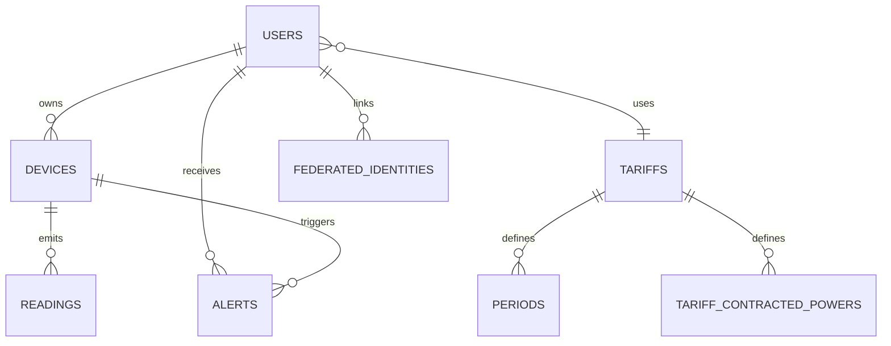
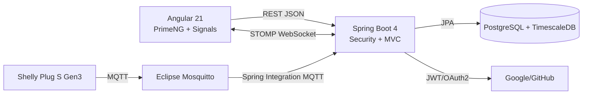

# Memoria final del proyecto DAW: Wattimizer

## Índice

1. [Introducción y justificación](#1-introducción-y-justificación)
2. [Fase 1: Análisis funcional](#2-fase-1-análisis-funcional)
3. [Fase 2: Diseño técnico](#3-fase-2-diseño-técnico)
4. [Fase 3: Implementación y desarrollo](#4-fase-3-implementación-y-desarrollo)
5. [Fase 4: Pruebas y despliegue](#5-fase-4-pruebas-y-despliegue)
6. [Conclusiones y líneas futuras](#6-conclusiones-y-líneas-futuras)
7. [Bibliografía y recursos](#7-bibliografía-y-recursos)
8. [Anexos técnicos](#8-anexos-técnicos)

## 1. Introducción y justificación

### 1.1. Título del proyecto

**Wattimizer**: plataforma web de inteligencia financiera energética para pymes.

### 1.2. Descripción del problema

Muchas pequeñas empresas conocen el importe final de su factura eléctrica, pero no saben qué parte de ese gasto se produce en cada momento ni qué aparatos están provocando picos de potencia. Esa falta de información impide tomar decisiones prácticas: mover consumos a franjas más baratas, detectar aparatos encendidos de madrugada o saber si la potencia contratada es razonable.

Wattimizer se plantea para convertir una lectura técnica de un enchufe inteligente, como potencia en vatios o energía acumulada en kWh, en información económica comprensible. El sistema recoge telemetría MQTT, la guarda como serie temporal en TimescaleDB y aplica tarifas eléctricas TD españolas para calcular coste real, consumo fantasma y alertas de exceso de potencia.

### 1.3. Objetivos

#### Objetivo general

Desarrollar una aplicación web completa que permita registrar dispositivos IoT, visualizar consumo eléctrico en tiempo real y traducirlo a impacto económico según la tarifa del usuario.

#### Objetivos específicos

- Implementar autenticación con JWT y OAuth2 social para proteger las rutas privadas.
- Registrar enchufes Shelly físicos y dispositivos simulados para poder hacer demostraciones sin depender siempre del hardware.
- Ingerir telemetría mediante Spring Integration MQTT y transformarla en lecturas persistentes.
- Convertir la tabla `readings` en hypertable de TimescaleDB para trabajar con datos temporales.
- Calcular coste energético y consumo fantasma a partir de lecturas consecutivas y periodos tarifarios.
- Crear una interfaz Angular con dashboard, gestión de dispositivos, tarifas y alertas.
- Desplegar el sistema con Docker Compose, Nginx, Mosquitto, TimescaleDB y backend/frontend separados.

### 1.4. Tipos de usuarios

| Usuario | Función dentro del sistema |
| --- | --- |
| Usuario estándar | Registra o reclama dispositivos, consulta dashboard, configura su tarifa privada y revisa alertas. |
| Administrador | Mantiene el catálogo global de tarifas y puede crear usuarios administradores mediante clave interna. |
| Dispositivo IoT | Publica mensajes MQTT en topics Shelly para alimentar las lecturas del sistema. |
| Simulador interno | Genera lecturas programadas para perfiles como horno, lavadora o carga constante. |

## 2. Fase 1: Análisis funcional

### 2.1. Mapa de funcionalidades

| Módulo | Funcionalidades reales implementadas |
| --- | --- |
| Autenticación | Login, registro, registro admin con `X-Wattimizer-Admin-Secret`, OAuth2 Google/GitHub con ticket temporal. |
| Dispositivos | Listado por usuario, reclamar Shelly por MAC, crear simulador individual, crear pack demo, editar y borrar. |
| Telemetría | Recepción MQTT, persistencia de lecturas, histórico reciente y stream STOMP por dispositivo. |
| Analítica energética | Coste por intervalo, consumo fantasma entre 00:00 y 05:59 hora local del contrato. |
| Tarifas | Catálogo TD, tarifa privada del usuario, potencias contratadas por periodo y validaciones por peaje. |
| Alertas | Generación de alerta `OVERPOWER` y borrado por usuario autenticado. |
| Despliegue | Docker Compose completo, Nginx con WebSocket, Mosquitto con password file y CI/CD a Hetzner. |

### 2.2. Historias de usuario

| HU | Historia | Criterios de aceptación | Prioridad |
| --- | --- | --- | --- |
| HU-01 | Como usuario, quiero registrarme e iniciar sesión para acceder a mis datos energéticos. | El backend devuelve JWT en `/api/v1/auth/login`; Angular guarda el token y protege rutas con `authGuard`. | Imprescindible |
| HU-02 | Como usuario, quiero vincular un enchufe por MAC para verlo en mi cuenta. | `POST /api/v1/devices/claim` asocia la MAC al `Principal`; el listado posterior muestra el dispositivo. | Imprescindible |
| HU-03 | Como usuario, quiero crear simuladores para probar el dashboard sin hardware. | `POST /api/v1/devices/simulated` crea un dispositivo con `simulationProfile`; el job programado genera lecturas. | Imprescindible |
| HU-04 | Como usuario, quiero ver el consumo en tiempo real para detectar picos. | Angular se suscribe a `/topic/readings/{macAddress}` y actualiza una gráfica con los últimos 20 puntos. | Imprescindible |
| HU-05 | Como usuario, quiero configurar mi tarifa para calcular costes reales. | `POST /api/v1/users/me/tariff` guarda una tarifa privada o clonada desde catálogo. | Imprescindible |
| HU-06 | Como usuario, quiero ver coste diario y consumo fantasma. | Dashboard llama a `/api/v1/analytics/cost` y `/ghost-consumption` con `macAddress`, `start` y `end`. | Imprescindible |
| HU-07 | Como usuario, quiero recibir alertas por exceso de potencia. | `AlertService.checkPowerThreshold` compara potencia instantánea con la potencia contratada del periodo. | Imprescindible |
| HU-08 | Como administrador, quiero mantener el catálogo de tarifas. | Solo `ROLE_ADMIN` puede crear, editar o borrar en `/api/v1/tariffs`. | Opcional |
| HU-09 | Como usuario, quiero entrar con Google o GitHub para no recordar otra contraseña. | OAuth2 crea un ticket de 60 segundos y Angular lo canjea en `/oauth/exchange`. | Opcional |
| HU-10 | Como equipo técnico, quiero desplegar con Docker y CI para reproducir producción. | `docker-compose.yml` levanta TimescaleDB, Mosquitto, backend, frontend y Nginx; GitHub Actions despliega en `main`. | Imprescindible |

### 2.3. Gestión del trabajo

- **Repositorio:** <https://github.com/joellmar/wattpath-app>
- **Rama documentada:** `cursor/documentaci-n-t-cnica-del-proyecto-cc36`
- **Commits recientes analizados:** simuladores de consumo, pack demo, despliegue Hetzner, reinicio Nginx post deploy y scripts SQL seguros.
- **Kanban:** el repositorio no incluye captura del tablero. Para la memoria final se recomienda insertar una captura externa con columnas `Backlog`, `Por hacer`, `En progreso`, `En revisión` y `Hecho`.

### 2.4. Planificación inicial

| Fase | Historias asociadas | Dificultad técnica |
| --- | --- | --- |
| Autenticación y base | HU-01, HU-09 | Media: Spring Security, JWT, OAuth2 y guards Angular. |
| IoT y datos temporales | HU-02, HU-03, HU-04 | Alta: MQTT, TimescaleDB, STOMP y simulación. |
| Tarifas y analítica | HU-05, HU-06, HU-07 | Alta: calendario regulatorio, coste incremental y maxímetro. |
| Administración | HU-08 | Media: roles, formularios dinámicos y catálogo compartido. |
| Despliegue | HU-10 | Alta: Docker, Nginx, certificados, Mosquitto y CI/CD. |

## 3. Fase 2: Diseño técnico

### 3.1. Diseño de base de datos

La base de datos combina tablas relacionales tradicionales con una hypertable de TimescaleDB:

- `users`: credenciales, rol y tarifa asociada.
- `devices`: enchufes físicos o simulados, vinculados opcionalmente a un usuario.
- `readings`: lecturas temporales con PK compuesta por `time` y `device_id`.
- `tariffs`, `periods`, `tariff_contracted_powers`: contrato eléctrico y precios por periodo.
- `tariff_calendar_slots`: resolución horaria de periodos TD por zona y peaje.
- `alerts`: incidencias generadas para el usuario.
- `federated_identities`: vínculo entre usuario local y proveedor OAuth2.



El detalle de columnas, índices y consultas está en [Anexo D](anexo-d-timescaledb-analitica.md).

### 3.2. Arquitectura del sistema



- **Backend:** Java 26 con Spring Boot 4.0.5, Spring Security, Spring MVC, JPA, MapStruct y Spring Integration MQTT.
- **Frontend:** Angular 21 standalone, PrimeNG 21, Tailwind CSS 4, Chart.js y `@ngrx/signals`.
- **Comunicación:** REST JSON para operaciones de negocio; STOMP WebSocket para lecturas y alertas en tiempo real; MQTT para entrada de telemetría IoT.
- **Persistencia:** PostgreSQL con TimescaleDB; `readings` se convierte manualmente en hypertable.

### 3.3. Diseño de interfaz

Las pantallas principales existentes son:

- Login y registro con acceso tradicional y botones OAuth2.
- Layout autenticado con navegación a dashboard, dispositivos, tarifas y alertas.
- Dashboard con selector de dispositivo, gráfica de potencia, coste diario y consumo fantasma.
- Gestión de dispositivos con formulario para Shelly físico o simulador.
- Gestión de tarifas con formulario reactivo por periodos P1-P6 y control de rol admin.
- Listado de alertas con limpieza individual.

### 3.4. Relación entre historias y diseño

| Historia | Tablas principales | Código principal |
| --- | --- | --- |
| HU-01 | `users`, `federated_identities` | `AuthController`, `JwtTokenService`, `auth.guard.ts`, `http.interceptor.ts` |
| HU-02 | `devices` | `DeviceController`, `DeviceService`, `devices.component.ts` |
| HU-03 | `devices`, `readings` | `IotTelemetrySimulationJob`, `SimulatedTelemetryProcessor`, `SimulationProfile` |
| HU-04 | `readings` | `MqttConfig`, `DeviceMessageHandler`, `TelemetryStore`, `WebsocketService` |
| HU-05 | `tariffs`, `periods`, `tariff_contracted_powers` | `UserTariffController`, `TariffStore`, `tariff.component.ts` |
| HU-06 | `readings`, `tariff_calendar_slots`, `periods` | `ConsumptionController`, `ConsumptionService`, `DashboardComponent` |
| HU-07 | `alerts`, `tariff_contracted_powers` | `AlertService`, `AlertController`, `TelemetryBroadcaster` |
| HU-08 | `tariffs` | `TariffController`, `TariffService`, `TariffComponent` |
| HU-10 | Todas | `docker-compose.yml`, `.github/workflows/deploy.yml`, `nginx/default.conf` |

## 4. Fase 3: Implementación y desarrollo

### 4.1. Tecnologías utilizadas

| Capa | Tecnología | Versión observada |
| --- | --- | --- |
| Frontend | Angular | `^21.1.0` |
| Frontend | PrimeNG | `^21.1.7` |
| Frontend | `@ngrx/signals` | `^21.1.0` |
| Frontend | RxJS | `~7.8.0` |
| Frontend | Chart.js | `^4.5.1` |
| Frontend | TypeScript | `~5.9.2` |
| Backend | Spring Boot | `4.0.5` |
| Backend | Java | `26` |
| Backend | MapStruct | `1.6.3` |
| Backend | JJWT | `0.12.5` |
| Mensajería | Eclipse Paho MQTT | `1.2.5` |
| Base de datos | TimescaleDB/PostgreSQL | `timescale/timescaledb-ha:pg17` |
| Broker | Eclipse Mosquitto | `2.1.2-alpine` |
| Calidad frontend | Biome | `2.4.16` |
| Tests frontend | Vitest | `^4.0.8` |

### 4.2. Desarrollo del backend

El backend se organiza por controladores REST, servicios de negocio, repositorios JPA, entidades y mappers MapStruct. La seguridad es stateless: cada petición privada debe traer `Authorization: Bearer <jwt>`. El `Principal` se usa como fuente de verdad para saber qué usuario actúa, especialmente en dispositivos, lecturas, tarifas privadas y alertas.

Las decisiones más importantes son:

- Separar catálogo global de tarifas y tarifa privada de usuario para que cada cliente pueda adaptar su contrato sin modificar una plantilla común.
- Usar `readings` como tabla temporal porque es la tabla que más crecerá por mensajes MQTT o simulación.
- Mantener REST para operaciones de consulta/mutación y WebSocket solo para eventos vivos, evitando depender de polling continuo en Angular.
- Dejar la ingesta MQTT como inbound: el backend recibe lecturas, pero los controladores STOMP de comandos están comentados y no forman parte activa del sistema.

El detalle de endpoints está en [Anexo A](anexo-a-backend-rest.md).

### 4.3. Desarrollo del frontend

Angular se ha construido con componentes standalone y rutas lazy. La aplicación utiliza signals para estado local y `@ngrx/signals` para estado compartido de telemetría y tarifas. No se usa `@ngrx/store` clásico con reducers/effects.

El flujo típico en el dashboard es:

1. `DashboardComponent` carga dispositivos y tarifa del usuario.
2. `TelemetryStore` selecciona una MAC y pide las lecturas recientes.
3. `WebsocketService` escucha `/topic/readings/{macAddress}`.
4. El store mantiene un buffer de 20 lecturas por MAC.
5. Chart.js pinta la potencia y los endpoints analíticos devuelven coste económico.

El detalle de componentes, servicios y lógica RxJS está en [Anexo B](anexo-b-frontend-angular.md).

### 4.4. Control de versiones

El flujo observado trabaja sobre `main` y ramas de documentación generadas por automatización. Los commits recientes del proyecto se centran en:

- Activar simuladores y pack de demostración.
- Añadir perfiles de simulación de consumo.
- Corregir borrado en cascada de dispositivos.
- Ajustar configuración de producción, Mosquitto, Nginx y CI/CD.
- Documentar despliegue real en Hetzner.

La rama actual de documentación se prepara para abrir una PR independiente sin tocar lógica productiva.

## 5. Fase 4: Pruebas y despliegue

### 5.1. Plan de pruebas

| Prueba | Validación |
| --- | --- |
| Login sin credenciales válidas | El backend responde 401 y Angular limpia sesión si el interceptor recibe 401. |
| Registro admin sin clave | `AuthController` lanza `ForbiddenException`. |
| Acceso a `/dashboard` sin JWT | `authGuard` redirige a `/login`. |
| Reclamar dispositivo con MAC válida | `DeviceService.claimOrRegisterDevice` vincula la MAC al usuario autenticado. |
| Crear simulador | Se crea dispositivo con `is_simulated=true` y perfil elegido. |
| Recibir MQTT `events/rpc` | `MqttConfig` transforma JSON, `DeviceMessageHandler` persiste y emite por STOMP. |
| Consultar coste diario | `ConsumptionService` calcula deltas positivos de kWh y aplica precio por periodo. |
| Consultar consumo fantasma | Solo se suman lecturas entre 00:00 y 05:59 hora local del contrato. |
| Exceso de potencia | `AlertService` compara `powerW / 1000` con potencia contratada y crea alerta. |
| Build frontend | `npm run build` genera aplicación de producción. |
| Build backend | `./mvnw -DskipTests clean package` genera artefacto Spring Boot. |

### 5.2. Manual de instalación

#### Desarrollo local

```bash
git clone https://github.com/joellmar/wattpath-app.git
cd wattpath-app
cp .env.example .env
docker compose --env-file .env up -d timescaledb mosquitto
```

Backend:

```bash
cd backend
./mvnw spring-boot:run
```

Frontend:

```bash
cd frontend
npm install --legacy-peer-deps
npm start
```

Scripts SQL recomendados después de que Hibernate cree tablas:

```bash
backend/src/main/resources/db/dev-seed/00-extensions.sql
backend/src/main/resources/db/dev-seed/01-hypertable.sql
backend/src/main/resources/db/tariffs-td-schema.sql
backend/src/main/resources/db/seed-tariff-calendar-slots.sql
```

#### Uso básico

1. Registrar usuario o entrar con OAuth2.
2. Configurar tarifa propia desde `Tarifas`.
3. Añadir un dispositivo físico por MAC o crear simuladores.
4. Abrir `Dashboard` para ver telemetría, coste y consumo fantasma.
5. Revisar `Alertas` cuando haya exceso de potencia.

### 5.3. Despliegue

El despliegue documentado usa Hetzner VPS con Ubuntu, Docker Compose, Nginx y certificados TLS. El dominio productivo indicado en la documentación existente es:

- <https://wattimizer.com>

Servicios de producción:

- `timescaledb`: base PostgreSQL/TimescaleDB.
- `mosquitto`: broker MQTT con autenticación.
- `backend`: API Spring Boot.
- `frontend`: build Angular servido por Nginx interno.
- `nginx`: proxy público, TLS y WebSocket.

La workflow `.github/workflows/deploy.yml` valida frontend y backend al hacer push a `main`, conecta por SSH al VPS, actualiza el repositorio y reconstruye contenedores.

## 6. Conclusiones y líneas futuras

### 6.1. Grado de cumplimiento

El MVP está cubierto: autenticación, dispositivos físicos/simulados, telemetría, dashboard, tarifas, analítica, alertas y despliegue. La parte más diferencial del proyecto es la unión entre IoT, TimescaleDB y cálculo económico por tarifa, porque convierte datos técnicos en decisiones útiles para una pyme.

### 6.2. Dificultades encontradas

- **Telemetría real vs simulada:** se resolvió creando simuladores internos para demo, sin eliminar soporte Shelly.
- **Series temporales:** Hibernate crea la tabla, pero TimescaleDB requiere script manual para convertirla en hypertable.
- **Tarifas TD:** se separó calendario horario (`tariff_calendar_slots`) de precios (`periods`) para no duplicar reglas en Java.
- **Despliegue:** se ajustaron Nginx, Mosquitto y reinicio post `compose up` para evitar errores 502 y problemas de resolución interna.
- **Estado frontend:** se combinan signals, `rxMethod` y llamadas HTTP directas; esto funciona, aunque deja margen para homogeneizar patrones.

### 6.3. Mejoras futuras

- Configurar topics MQTT de forma dinámica para varios Shelly físicos, no solo el topic hardcoded actual.
- Reactivar comandos hacia dispositivos si se implementa un canal seguro de control.
- Añadir agregaciones continuas de TimescaleDB por hora/día para dashboards históricos largos.
- Incorporar comparación automática entre tarifas para sugerir ahorro.
- Crear app móvil o PWA para avisos push de alertas.
- Completar seeds para Canarias, Ceuta, Melilla y peajes 6.xTD si se amplía el alcance comercial.

## 7. Bibliografía y recursos

- Documentación oficial de Spring Boot 4.
- Documentación oficial de Spring Security.
- Documentación oficial de Spring Integration MQTT.
- Documentación de Eclipse Paho MQTT.
- Documentación oficial de Angular 21.
- Documentación de NgRx Signals.
- Documentación de PrimeNG.
- Documentación de TimescaleDB.
- Circular CNMC 3/2020 para periodos tarifarios TD.
- Guías internas del repositorio: `README.md`, `GUIA_DESPLIEGUE_LOCAL_WINDOWS.md` y `docs/deployment/hetzner-production.md`.

## 8. Anexos técnicos

- [Anexo A: Backend REST Spring Boot](anexo-a-backend-rest.md)
- [Anexo B: Frontend Angular, RxJS y NgRx Signals](anexo-b-frontend-angular.md)
- [Anexo C: Ingesta asíncrona MQTT](anexo-c-telemetria-mqtt.md)
- [Anexo D: TimescaleDB y analítica](anexo-d-timescaledb-analitica.md)
- [Canvas documental de arquitectura](../../docs-canvas/arquitectura-wattimizer.md)
