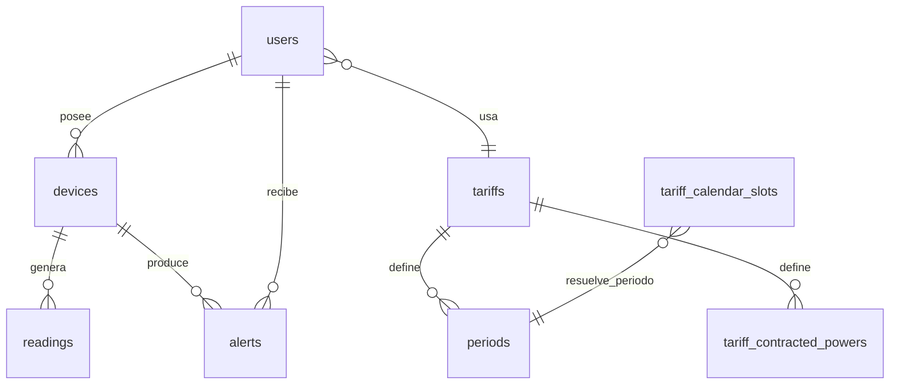
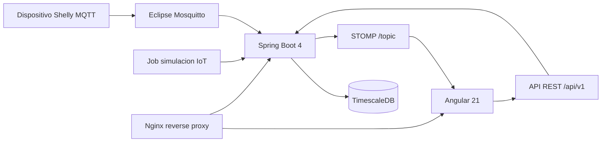

# Memoria técnica del proyecto Wattimizer

## 1. Introducción y justificación

### 1.1. Título del proyecto

**Wattimizer**: plataforma web B2B para monitorización energética, cálculo de coste eléctrico y detección de consumos anómalos en pequeñas empresas.

### 1.2. Descripción del problema

Muchas pymes saben cuánto pagan de luz al final del mes, pero no tienen una visión clara de **cuándo**, **dónde** y **por qué** se produce ese gasto. La factura eléctrica llega tarde y resume el consumo de forma agregada, mientras que las decisiones diarias se toman sin datos: equipos encendidos fuera de horario, picos de potencia que pueden superar la potencia contratada, o consumos fantasma que parecen pequeños pero se repiten cada noche.

Wattimizer aborda este problema conectando dispositivos IoT tipo Shelly Plug mediante MQTT, guardando lecturas de potencia y energía en TimescaleDB y transformando esos datos técnicos en información económica: coste diario estimado, coste de consumo fantasma, evolución en tiempo real y alertas por exceso de potencia. La aplicación no se limita a mostrar vatios; intenta traducirlos a euros y a decisiones concretas para el negocio.

### 1.3. Objetivos

#### Objetivo general

Desarrollar una aplicación web full stack que permita a una empresa registrar sus dispositivos de medición, recibir telemetría energética en tiempo real, aplicar una tarifa eléctrica personalizada y consultar indicadores económicos derivados del consumo.

#### Objetivos específicos

- Implementar autenticación segura con JWT y soporte de login social mediante OAuth2.
- Permitir que cada usuario gestione sus dispositivos físicos y simulados sin acceder a datos de otros usuarios.
- Ingerir mensajes MQTT de dispositivos Shelly con Spring Integration y persistir las lecturas como serie temporal.
- Convertir la tabla de lecturas en hypertable de TimescaleDB para preparar el sistema para datos temporales.
- Modelar tarifas TD españolas con periodos P1-P6, precios por kWh y potencias contratadas.
- Calcular coste acumulado y consumo fantasma a partir del odómetro `energy_total_kwh`.
- Mostrar en Angular una gráfica reactiva de potencia en tiempo real usando WebSocket STOMP, RxJS y NgRx Signal Store.
- Crear simuladores IoT para disponer de una demo funcional aunque no haya hardware físico conectado.
- Desplegar el sistema en un VPS con Docker Compose, Nginx, Mosquitto, TimescaleDB y GitHub Actions.

### 1.4. Tipos de usuarios

| Tipo de usuario | Rol técnico | Funciones principales |
|---|---|---|
| Usuario de empresa | `ROLE_USER` | Gestiona sus dispositivos, asigna su tarifa privada, consulta dashboard y alertas. |
| Administrador | `ROLE_ADMIN` | Puede crear, editar y eliminar plantillas del catálogo de tarifas, además de usar las funciones de usuario. |
| Dispositivo IoT | No es usuario web | Publica telemetría MQTT que el backend procesa de forma asíncrona. |
| Simulador IoT | Entidad interna | Genera lecturas sintéticas para pruebas, demostración y desarrollo sin hardware real. |

---

## 2. Fase 1: Análisis funcional

### 2.1. Mapa de funcionalidades

| Módulo | Funcionalidades reales implementadas |
|---|---|
| Autenticación | Registro, login con email/contraseña, login OAuth2 Google/GitHub, emisión de JWT, registro de administradores con cabecera secreta. |
| Dispositivos | Listado por usuario, alta física por MAC, alta simulada por perfil, pack demo, edición, encendido/apagado lógico y borrado con limpieza de lecturas/alertas. |
| Telemetría | Ingesta MQTT Shelly, generación simulada cada intervalo, guardado de lecturas, emisión WebSocket STOMP en tiempo real. |
| Dashboard | Selector de medidor, gráfica de potencia, coste diario estimado, consumo fantasma y aviso si falta tarifa. |
| Tarifas | Catálogo global, CRUD de plantillas por administrador, clon privado por usuario, edición de precios y potencias contratadas. |
| Analítica | Coste acumulado por intervalo y coste de consumo fantasma entre las 00:00 y las 05:59 hora local. |
| Alertas | Generación por exceso de potencia contratada, listado y descarte por usuario. |
| Despliegue | Docker Compose, Nginx, TimescaleDB, Mosquitto, certificados, variables de producción y GitHub Actions. |

### 2.2. Historias de usuario

| ID | Historia | Criterios de aceptación | Prioridad |
|---|---|---|---|
| HU-01 | Como usuario, quiero registrarme e iniciar sesión para acceder a mis datos energéticos. | El usuario puede registrarse, iniciar sesión y recibir un JWT válido; si el token caduca, el frontend redirige a login. | Imprescindible |
| HU-02 | Como usuario, quiero vincular un dispositivo por MAC para consultar sus lecturas. | El alta física llama a `/api/v1/devices/claim`; la MAC se valida en frontend; el backend asocia el dispositivo al `Principal`. | Imprescindible |
| HU-03 | Como usuario, quiero crear dispositivos simulados para probar la aplicación sin hardware. | El usuario puede elegir perfil; el backend crea MAC sintética `SIM...`; el job genera lecturas si `simulation.enabled=true`. | Imprescindible |
| HU-04 | Como usuario, quiero ver mi consumo en tiempo real para detectar picos. | El dashboard carga lecturas recientes, abre WebSocket por MAC y muestra una ventana móvil de 20 puntos. | Imprescindible |
| HU-05 | Como usuario, quiero configurar mi tarifa eléctrica para calcular costes reales. | Puede asignar una plantilla o editar su tarifa privada; el endpoint no acepta `userId`, usa el JWT para evitar IDOR. | Imprescindible |
| HU-06 | Como usuario, quiero ver el coste diario y el consumo fantasma. | El dashboard consulta `/analytics/cost` y `/analytics/ghost-consumption` solo si hay tarifa configurada. | Imprescindible |
| HU-07 | Como usuario, quiero recibir alertas si supero la potencia contratada. | Tras guardar cada lectura, `AlertService.checkPowerThreshold` compara kW medidos con potencia contratada del periodo. | Imprescindible |
| HU-08 | Como administrador, quiero mantener el catálogo de tarifas. | Solo `ROLE_ADMIN` puede crear, editar o borrar en `/api/v1/tariffs`; los usuarios autenticados solo leen. | Imprescindible |
| HU-09 | Como usuario, quiero descartar alertas revisadas. | `DELETE /api/v1/alerts/{id}` borra solo si la alerta pertenece al usuario autenticado. | Opcional |
| HU-10 | Como responsable del proyecto, quiero desplegar la app de forma repetible. | GitHub Actions compila frontend/backend y despliega en Hetzner con Docker Compose tras push a `main`. | Imprescindible |

### 2.3. Gestión del trabajo

- **Repositorio:** <https://github.com/joellmar/wattpath-app>
- **Rama documentada:** `cursor/documentaci-n-t-cnica-del-proyecto-d6ef`
- **Rama base:** `main`
- **Flujo observado:** commits pequeños con prefijos `feat`, `fix`, `docs` y `ci`.
- **Kanban propuesto para la memoria:** Backlog, Por hacer, En progreso, En revisión y Hecho. No hay una captura de tablero versionada en este repositorio, así que la captura debe añadirse en la entrega final si se exporta la memoria a PDF.

### 2.4. Planificación inicial

| Fase | Historias asociadas | Dificultad técnica |
|---|---|---|
| Autenticación y seguridad | HU-01 | Media: JWT, OAuth2 y roles. |
| Dispositivos e ingesta | HU-02, HU-03, HU-04 | Alta: MQTT, WebSocket, simulación y persistencia temporal. |
| Tarifas y analítica | HU-05, HU-06, HU-07 | Alta: modelo TD, calendario regulatorio y cálculo económico. |
| Frontend funcional | HU-04, HU-05, HU-06, HU-09 | Media-alta: Angular standalone, signals, RxJS y formularios dinámicos. |
| Administración y despliegue | HU-08, HU-10 | Media-alta: Docker, Nginx, CI/CD y variables seguras. |

---

## 3. Fase 2: Diseño técnico

### 3.1. Diseño de la base de datos

El modelo combina tablas transaccionales normales con una tabla temporal optimizada:

- `users`: cuentas de usuario, rol y tarifa asignada.
- `devices`: dispositivos físicos o simulados asociados a un usuario.
- `readings`: lecturas temporales de potencia y energía. Es la hypertable de TimescaleDB.
- `tariffs`, `periods`, `tariff_contracted_powers`: definición de contrato eléctrico.
- `tariff_calendar_slots`: calendario regulatorio para resolver el periodo P1-P6.
- `alerts`: incidencias generadas a partir de lecturas.



El detalle completo de columnas, claves y consultas se documenta en [Anexo D](./anexo-d-timescaledb-analitica.md).

### 3.2. Arquitectura del sistema



| Capa | Tecnología | Decisión tomada |
|---|---|---|
| Backend | Java 26, Spring Boot 4.0.5 | Se centraliza negocio, seguridad, MQTT, WebSocket y persistencia. |
| Frontend | Angular 21, TypeScript, PrimeNG | Componentes standalone, rutas lazy y estado reactivo con signals. |
| Comunicación REST | JSON sobre `/api/v1` | Endpoints protegidos por JWT excepto login, registro y OAuth exchange. |
| Tiempo real | STOMP WebSocket en `/ws-iot` | El backend emite lecturas por MAC para que el dashboard no haga polling. |
| Telemetría IoT | MQTT con Spring Integration | El adaptador enruta mensajes Shelly a handlers transaccionales. |
| Base de datos | PostgreSQL + TimescaleDB | `readings` se convierte en hypertable por `time`. |
| Despliegue | Docker Compose + Nginx + GitHub Actions | Separación de servicios y despliegue automático en VPS Hetzner. |

### 3.3. Diseño de interfaz

No hay wireframes gráficos versionados en el repositorio, pero el diseño real se puede reconstruir desde las rutas y componentes Angular:

| Pantalla | Componente | Elementos principales |
|---|---|---|
| Login | `LoginComponent` | Formulario email/contraseña y botones OAuth Google/GitHub. |
| Registro | `RegisterComponent` | Validación de contraseña y confirmación. |
| Dashboard | `DashboardComponent` | Selector de medidor, gráfica de potencia, tarjetas de coste y banner para configurar tarifa. |
| Dispositivos | `DevicesComponent` | Formulario físico/simulado, botón pack demo, tabla, diálogos de detalle y edición. |
| Tarifas | `TariffComponent` | Catálogo, formulario dinámico de periodos y potencias, edición de tarifa privada. |
| Alertas | `AlertsComponent` | Tabla de alertas y acción de descarte. |

### 3.4. Relación entre historias y diseño

| Historia | Tablas implicadas | Código principal |
|---|---|---|
| HU-01 | `users`, `federated_identities` | `AuthController`, `SecurityConfig`, `SessionStorageService`, `httpInterceptor` |
| HU-02 | `devices` | `DeviceController`, `DeviceService`, `DevicesComponent`, `TelemetryStore` |
| HU-03 | `devices`, `readings` | `SimulationProfile`, `IotTelemetrySimulationJob`, `SimulatedTelemetryProcessor` |
| HU-04 | `readings` | `ReadingController`, `TelemetryBroadcaster`, `WebsocketService`, `DashboardComponent` |
| HU-05 | `tariffs`, `periods`, `tariff_contracted_powers`, `users` | `UserTariffController`, `TariffStore`, `TariffComponent` |
| HU-06 | `readings`, `tariff_calendar_slots`, `periods` | `ConsumptionController`, `ConsumptionService`, `CalendarResolverService` |
| HU-07 | `alerts`, `readings`, `tariff_contracted_powers` | `AlertService`, `AlertController`, `AlertsComponent` |
| HU-08 | `tariffs`, `periods`, `tariff_contracted_powers` | `TariffController`, `TariffService`, `TariffComponent` |
| HU-10 | Servicios Docker y workflow CI/CD | `docker-compose.yml`, `.github/workflows/deploy.yml`, `docs/deployment/hetzner-production.md` |

---

## 4. Fase 3: Implementación y desarrollo

### 4.1. Tecnologías utilizadas

| Área | Tecnología |
|---|---|
| Backend | Java 26, Spring Boot 4.0.5, Spring Security, Spring Data JPA, Spring Integration MQTT, Spring WebSocket |
| Frontend | Angular 21, TypeScript 5.9, RxJS 7.8, NgRx Signals 21.1, PrimeNG 21, Chart.js |
| Base de datos | PostgreSQL con TimescaleDB `timescale/timescaledb-ha:pg17` |
| IoT | Eclipse Mosquitto 2.1.2, MQTT QoS 1, dispositivos Shelly Plug S Gen3 |
| Build y pruebas | Maven Wrapper, npm, Vitest/Angular test builder, GitHub Actions |
| Despliegue | Docker Compose, Nginx, Certbot, Hetzner VPS Ubuntu 24.04 |

### 4.2. Desarrollo del backend

El backend está organizado en controladores REST, servicios de negocio, repositorios JPA, DTOs y mappers. La seguridad se aplica con JWT stateless y reglas por ruta:

- `/api/v1/auth/*` tiene endpoints públicos para login, registro y OAuth exchange.
- `GET /api/v1/tariffs/**` exige autenticación.
- Las mutaciones de `/api/v1/tariffs/**` exigen `ROLE_ADMIN`.
- El resto de endpoints requiere token válido.

La lógica de negocio evita que el frontend mande identificadores de usuario en operaciones sensibles. Por ejemplo, `UserTariffController` extrae siempre el usuario desde `Principal`, y los endpoints de lecturas, analítica, claim, simulación, consulta, edición y borrado de dispositivos comprueban que la MAC o el dispositivo pertenezcan al usuario autenticado. La ruta directa `POST /api/v1/devices` queda como alta simple basada en el `DeviceDto` recibido y no es la ruta usada por la pantalla actual de dispositivos.

El detalle de endpoints, parámetros y DTOs está en [Anexo A](./anexo-a-backend-rest.md).

### 4.3. Desarrollo del frontend

El frontend usa componentes standalone y rutas lazy. La parte más reactiva está en:

- `TelemetryStore`: estado de dispositivos, MAC seleccionada, histórico de lecturas y conexión WebSocket.
- `TariffStore`: catálogo, tarifa privada, estados de carga y errores.
- `DashboardComponent`: coordina stores, WebSocket y llamadas de analítica.
- `TariffComponent`: construye formularios dinámicos según el peaje TD.

El detalle de componentes, servicios, RxJS y NgRx Signals está en [Anexo B](./anexo-b-frontend-angular.md).

### 4.4. Control de versiones

El historial reciente muestra una evolución incremental:

| Commit | Tipo | Cambio documentado |
|---|---|---|
| `2db18a4` | `feat(devices)` | Perfiles de simulación de consumo y CRUD simulado. |
| `eff9456` | `feat(prod)` | Activación de simuladores en demo y pack de demostración. |
| `d77851b` | `fix(simulators)` | Borrado en cascada, telemetría por perfil y panel multi-dispositivo. |
| `3021eba` | `docs(deployment)` | Actualización de guía Hetzner tras despliegue real. |
| `ee032fd` | `fix(deploy)` | Reinicio de Nginx tras `compose up` para evitar 502 por IP interna obsoleta. |

Este patrón encaja con un flujo de ramas cortas: se implementa una capacidad, se corrige al probarla y se documentan las decisiones reales de despliegue.

---

## 5. Fase 4: Pruebas y despliegue

### 5.1. Plan de pruebas

| Área | Prueba existente | Validación |
|---|---|---|
| Tarifas backend | `TariffServiceTest` | Periodos obligatorios, precios positivos, potencias ordenadas y peajes 2.0TD/3.0TD/6.1TD. |
| Tarifa privada | `UserTariffServiceTest` | Clonado de plantilla, no mutar catálogo, anti-IDOR por username autenticado y desvinculación. |
| Simuladores | `DeviceServiceTest`, `IotTelemetrySimulationJobTest`, `SimulationProfileRegistryTest` | MAC sintética, perfiles, pack demo, continuidad si falla un dispositivo y potencia no negativa. |
| Consumo fantasma | `ConsumptionServiceTest` | Ventana nocturna local y cálculo por delta de energía. |
| Frontend tarifas | `tariff.component.spec.ts`, `tariff.service.spec.ts` | Formularios dinámicos, rol admin, endpoints y respuesta 204 de tarifa privada. |
| Frontend dispositivos | `devices.component.spec.ts` | Validación de MAC/perfil y llamadas a `/claim` y `/simulated`. |
| Sesión frontend | `session-storage.service.spec.ts` | Parseo de roles CSV, username y comprobación de rol. |
| Dashboard | `dashboard.component.spec.ts` | Banner sin tarifa y placeholders de coste. |

### 5.2. Manual de instalación, usuario y administrador

#### Instalación local resumida

```bash
# Backend
cd backend
./mvnw spring-boot:run

# Frontend
cd frontend
npm install
npm start
```

Para un entorno completo conviene usar Docker Compose, porque el backend necesita PostgreSQL/TimescaleDB y Mosquitto:

```bash
cp .env.example .env
# rellenar DB_PASSWORD, PROD_MQTT_USER, PROD_MQTT_PASSWORD, PROD_JWT_SECRET y PROD_ADMIN_KEY
docker compose --env-file .env up -d --build
```

#### Uso básico

1. Registrarse o iniciar sesión.
2. Ir a **Tarifas** y asignar una plantilla al usuario.
3. Ir a **Dispositivos** y registrar una MAC física o crear un simulador.
4. Abrir **Dashboard** para ver lecturas, coste y consumo fantasma.
5. Revisar **Alertas** si se supera la potencia contratada.

#### Uso administrador

1. Crear administrador con `POST /api/v1/auth/register/admin` y cabecera `X-Wattimizer-Admin-Secret`.
2. Entrar con ese usuario.
3. Gestionar plantillas de tarifa desde la pantalla de tarifas.

### 5.3. Despliegue

El despliegue de producción está documentado en `docs/deployment/hetzner-production.md`. El entorno usa:

- VPS Hetzner con Ubuntu 24.04.
- Docker Compose con servicios `timescaledb`, `mosquitto`, `backend`, `frontend` y `nginx`.
- Certbot nativo en el host para certificados TLS.
- GitHub Actions en `.github/workflows/deploy.yml`.
- URL de producción indicada en la configuración: `https://wattimizer.com`.

La pipeline compila Angular, empaqueta Spring Boot sin tests de integración que requieren BD y, si ambas validaciones pasan, actualiza el servidor por SSH. Tras reconstruir contenedores, reinicia Nginx para evitar errores 502 por resolución DNS interna de Docker.

---

## 6. Conclusiones y líneas futuras

### 6.1. Grado de cumplimiento

El MVP está cubierto en sus partes principales: autenticación, dispositivos, simulación, ingesta MQTT, dashboard, tarifa privada, cálculo económico, alertas y despliegue. La parte más sólida es la separación entre telemetría, tarifa y analítica, porque permite mostrar datos técnicos como información útil para negocio.

### 6.2. Dificultades encontradas

- **Datos temporales:** se resolvió convirtiendo `readings` en hypertable TimescaleDB.
- **Demo sin hardware:** se añadieron perfiles simulados y pack demo para generar lecturas realistas.
- **Multi-dispositivo:** se ajustó el store de telemetría para mantener histórico por MAC y cambiar de medidor sin mezclar datos.
- **Borrado seguro:** se incorporó limpieza de lecturas y alertas antes de eliminar dispositivos.
- **Despliegue real:** se documentaron problemas de Docker/Nginx, OAuth y variables de entorno tras probar en Hetzner.

### 6.3. Mejoras futuras

- Añadir agregaciones TimescaleDB con `time_bucket` para histórico diario, semanal y mensual.
- Incluir tests de integración con Testcontainers para PostgreSQL/TimescaleDB y MQTT.
- Añadir alertas configurables por usuario, no solo por potencia contratada.
- Mejorar seguridad MQTT con TLS/8883 o VPN para el dispositivo físico.
- Crear app móvil o PWA para avisos push.
- Incorporar importación automática de precios reales de comercializadoras o APIs regulatorias.

---

## 7. Bibliografía y recursos

- Documentación oficial de Spring Boot, Spring Security, Spring Data JPA, Spring Integration MQTT y Spring WebSocket.
- Documentación oficial de Angular, RxJS y NgRx Signal Store.
- Documentación oficial de TimescaleDB y PostgreSQL.
- Documentación de Eclipse Mosquitto y MQTT.
- Circular CNMC 3/2020, usada como base para el modelo de periodos TD en `seed-tariff-calendar-slots.sql`.
- Documentación de Docker, Docker Compose, Nginx, Certbot y GitHub Actions.

---

## Anexos técnicos

- [Anexo A. Controladores REST de Spring Boot](./anexo-a-backend-rest.md)
- [Anexo B. Frontend Angular, RxJS y NgRx Signals](./anexo-b-frontend-angular.md)
- [Anexo C. Ingesta asíncrona de telemetría MQTT](./anexo-c-telemetria-mqtt.md)
- [Anexo D. TimescaleDB, hypertables y analítica energética](./anexo-d-timescaledb-analitica.md)
