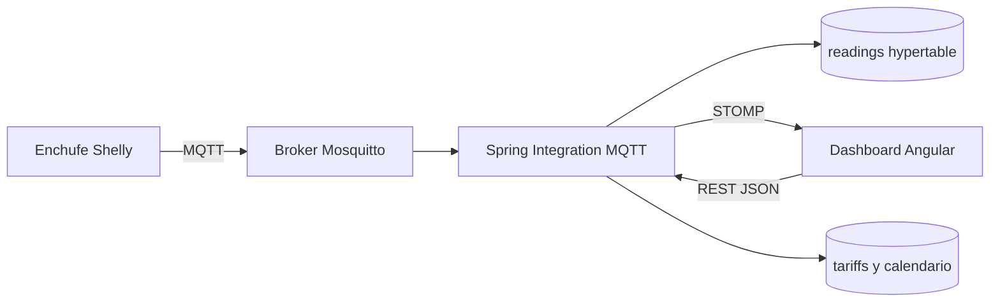

# Memoria tecnica del proyecto DAW: Wattimizer

## Indice

1. [Introduccion y justificacion](#1-introduccion-y-justificacion)
2. [Fase 1: Analisis funcional](#2-fase-1-analisis-funcional)
3. [Fase 2: Diseno tecnico](#3-fase-2-diseno-tecnico)
4. [Fase 3: Implementacion y desarrollo](#4-fase-3-implementacion-y-desarrollo)
5. [Fase 4: Pruebas y despliegue](#5-fase-4-pruebas-y-despliegue)
6. [Conclusiones y lineas futuras](#6-conclusiones-y-lineas-futuras)
7. [Bibliografia y recursos](#7-bibliografia-y-recursos)
8. [Anexos tecnicos](#8-anexos-tecnicos)

---

## 1. Introduccion y justificacion

### 1.1. Titulo del proyecto

**Wattimizer** es una aplicacion web para monitorizar consumo electrico en tiempo real y traducirlo a informacion economica util para pequenas empresas.

El repositorio del proyecto es:

```text
https://github.com/joellmar/wattpath-app
```

### 1.2. Descripcion del problema

Muchas pymes conocen el importe final de la factura electrica, pero no saben con precision que equipos generan mas gasto, en que momentos se producen picos de potencia ni cuanto dinero se pierde por consumo fantasma fuera del horario de actividad. Ese problema se agrava cuando la tarifa tiene discriminacion horaria, porque el coste real no depende solo de los kWh consumidos, sino tambien del periodo regulatorio aplicable.

Wattimizer nace para cubrir esa falta de visibilidad. La aplicacion recibe telemetria de enchufes inteligentes Shelly mediante MQTT, guarda las lecturas como series temporales en TimescaleDB y calcula metricas economicas usando la tarifa del usuario. Para poder demostrar el proyecto sin depender siempre de hardware fisico, se han incorporado tambien dispositivos simulados con perfiles de consumo realistas.

### 1.3. Objetivos

#### Objetivo general

Desarrollar una plataforma web full-stack que permita registrar usuarios, vincular dispositivos IoT, visualizar consumo electrico en tiempo real y estimar el coste economico de ese consumo segun la tarifa contratada.

#### Objetivos especificos

- Implementar una API REST segura con Spring Boot, JWT y control de acceso por usuario autenticado.
- Recibir telemetria asincrona desde MQTT usando Spring Integration y transformar los mensajes del Shelly en lecturas persistentes.
- Almacenar las lecturas en PostgreSQL con TimescaleDB para tratar la tabla `readings` como hypertable.
- Crear una interfaz Angular con estado reactivo mediante Signals, RxJS y `@ngrx/signals`.
- Mostrar graficas de potencia en tiempo real usando WebSocket STOMP y Chart.js.
- Permitir la configuracion de tarifas electricas, incluyendo periodos de energia y potencias contratadas.
- Calcular coste energetico diario y consumo fantasma a partir de lecturas historicas.
- Incorporar simuladores de consumo para pruebas, demos y validacion sin hardware real.
- Documentar el proyecto con anexos tecnicos reutilizables en la memoria final.

### 1.4. Tipos de usuarios

| Usuario | Descripcion | Funciones principales |
| --- | --- | --- |
| Usuario de pyme | Persona que gestiona el consumo de su negocio | Registro, login, vinculacion de dispositivos, consulta de lecturas, configuracion de tarifa privada y revision de alertas |
| Administrador | Usuario con rol `ROLE_ADMIN` | Gestion del catalogo maestro de tarifas y acceso a funciones administrativas |
| Sistema IoT | Broker MQTT, backend y dispositivos Shelly | Publicacion y procesamiento automatico de lecturas electricas |
| Usuario de demostracion | Perfil pensado para ensenar la aplicacion | Uso del pack de dispositivos simulados y visualizacion de datos sin enchufe fisico |

---

## 2. Fase 1: Analisis funcional

### 2.1. Mapa de funcionalidades

| Modulo | Funcionalidades |
| --- | --- |
| Autenticacion | Registro, login con email y contrasena, login OAuth2 con Google/GitHub, canje de ticket OAuth por JWT |
| Dispositivos | Listado de medidores, reclamacion por MAC, alta de simuladores, pack de demostracion, edicion, conmutacion y borrado |
| Telemetria | Ingesta MQTT, generacion simulada programada, historico reciente, WebSocket STOMP y grafica en dashboard |
| Tarifas | Catalogo maestro, tarifa privada de usuario, periodos CNMC 3/2020, potencias contratadas y validacion de orden |
| Analitica | Coste por periodo, consumo fantasma de madrugada y alertas de sobrepotencia |
| Alertas | Listado de incidencias y descarte por usuario |
| Despliegue | Docker Compose con TimescaleDB, Mosquitto, backend, frontend y Nginx |

### 2.2. Historias de usuario

| ID | Historia | Criterios de aceptacion | Prioridad |
| --- | --- | --- | --- |
| HU-01 | Como usuario, quiero registrarme e iniciar sesion para acceder a mis datos energeticos. | El sistema valida credenciales, emite JWT y protege las rutas privadas. | Imprescindible |
| HU-02 | Como usuario, quiero vincular un enchufe por su MAC para ver solo mis dispositivos. | El endpoint `POST /api/v1/devices/claim` asocia la MAC al usuario autenticado y rechaza dispositivos de otros usuarios. | Imprescindible |
| HU-03 | Como usuario, quiero ver la potencia en tiempo real para detectar consumos anormales. | El dashboard se suscribe a `/topic/readings/{macAddress}` y actualiza la grafica con las ultimas lecturas. | Imprescindible |
| HU-04 | Como usuario, quiero consultar lecturas recientes al cambiar de dispositivo. | El frontend llama a `GET /api/v1/readings/device/{macAddress}/recent?seconds=120` y mantiene historico por MAC. | Imprescindible |
| HU-05 | Como usuario, quiero configurar mi tarifa para calcular el coste real del consumo. | La tarifa privada se guarda en `/api/v1/users/me/tariff` sin aceptar IDs de usuario en path ni body. | Imprescindible |
| HU-06 | Como administrador, quiero mantener el catalogo de tarifas para ofrecer plantillas reutilizables. | Solo `ROLE_ADMIN` puede crear, editar o eliminar tarifas en `/api/v1/tariffs`. | Imprescindible |
| HU-07 | Como usuario, quiero conocer mi consumo fantasma para reducir gasto fuera del horario laboral. | El backend calcula coste entre 00:00 y 05:59 en la zona horaria de la tarifa. | Imprescindible |
| HU-08 | Como usuario, quiero recibir alertas de sobrepotencia para evitar penalizaciones. | Cada lectura se compara con la potencia contratada del periodo resuelto y genera alerta `OVERPOWER` si procede. | Imprescindible |
| HU-09 | Como usuario, quiero descartar alertas ya revisadas para mantener limpia la bandeja. | `DELETE /api/v1/alerts/{id}` borra solo alertas del usuario autenticado. | Imprescindible |
| HU-10 | Como evaluador, quiero probar la app sin hardware real para revisar la demo completa. | El pack de demostracion crea simuladores con perfiles de consumo distintos. | Opcional |
| HU-11 | Como usuario, quiero crear dispositivos simulados individuales para probar escenarios concretos. | El formulario permite elegir perfil y el backend genera una MAC `SIM...` unica. | Opcional |

### 2.3. Gestion del trabajo con GitHub y Kanban

- **Repositorio:** `https://github.com/joellmar/wattpath-app`
- **Rama base:** `main`
- **Rama de documentacion actual:** `cursor/documentaci-n-t-cnica-del-proyecto-8e54`
- **Flujo observado en el historial:** commits pequenos con prefijos como `feat`, `fix`, `docs` y `ci`.
- **Columnas Kanban previstas para la memoria:** Backlog, Por hacer, En progreso, En revision y Hecho.

No se almacena una captura del tablero dentro del repositorio. Para la entrega final se debe incorporar una captura real desde GitHub Projects o desde el tablero usado durante el desarrollo, evitando crear una imagen ficticia que no represente el trabajo real.

### 2.4. Planificacion inicial

| Fase | Historias relacionadas | Dificultad tecnica |
| --- | --- | --- |
| Autenticacion y seguridad | HU-01 | Media: requiere JWT, OAuth2, roles y proteccion de rutas |
| Gestion de dispositivos | HU-02, HU-10, HU-11 | Media-alta: mezcla dispositivos fisicos, simulados y reglas de propiedad |
| Telemetria en tiempo real | HU-03, HU-04 | Alta: implica MQTT, persistencia temporal y WebSocket |
| Tarifas y analitica | HU-05, HU-06, HU-07, HU-08 | Alta: combina reglas CNMC, calendario, calculo economico y alertas |
| Interfaz de usuario | Todas | Media: Angular standalone, PrimeNG, Signals y graficas |
| Despliegue | Todas | Alta: coordinacion de Docker, Nginx, certificados, Mosquitto y TimescaleDB |

---

## 3. Fase 2: Diseno tecnico

### 3.1. Diseno de la base de datos

El modelo combina datos relacionales clasicos con una tabla de series temporales:

- `users`: usuarios registrados, rol, contrasena cifrada y tarifa asignada.
- `federated_identities`: identidades OAuth2 externas asociadas a usuarios locales.
- `devices`: enchufes fisicos o simulados, MAC unica, propietario opcional y perfil de simulacion.
- `readings`: lecturas de telemetria con clave compuesta `(time, device_id)`.
- `alerts`: incidencias generadas por sobrepotencia.
- `tariffs`: contratos o plantillas de tarifa.
- `periods`: precio energetico por periodo `P1` a `P6`.
- `tariff_contracted_powers`: potencias contratadas por periodo.
- `tariff_calendar_slots`: calendario regulatorio para resolver el periodo aplicable.

La tabla `readings` se convierte en hypertable mediante:

```sql
SELECT create_hypertable('readings', 'time');
```

El detalle de tablas, claves y consultas esta desarrollado en [Anexo D](./anexo-d-timescaledb-analitica.md).

### 3.2. Arquitectura del sistema

| Capa | Tecnologia | Responsabilidad |
| --- | --- | --- |
| Frontend | Angular 21, PrimeNG, Chart.js, RxJS, `@ngrx/signals` | Interfaz de usuario, estado reactivo y visualizacion de telemetria |
| Backend | Spring Boot 4.0.5, Java 26, Spring Security, Spring Integration MQTT | API REST, autenticacion, ingesta IoT, reglas de negocio y WebSocket |
| Base de datos | PostgreSQL 17 + TimescaleDB | Persistencia relacional y series temporales |
| Mensajeria IoT | Eclipse Mosquitto + MQTT | Recepcion de mensajes Shelly |
| Tiempo real web | STOMP sobre WebSocket | Emision de lecturas y alertas al navegador |
| Despliegue | Docker Compose + Nginx | Orquestacion de servicios y entrada HTTPS |

Flujo principal de datos:



### 3.3. Diseno de interfaz

La interfaz se organiza con un layout autenticado:

- **Login y registro:** formularios publicos con validacion reactiva.
- **Dashboard:** selector de medidor, grafica de potencia, gasto diario y consumo fantasma.
- **Dispositivos:** tabla de medidores, alta fisica, alta simulada, pack demo y edicion.
- **Tarifas:** gestion de catalogo para admin y contrato privado para usuario.
- **Alertas:** listado de incidencias y accion de descarte.

Los wireframes finales no se guardan como imagenes en el repositorio. La documentacion tecnica describe la estructura real de componentes Angular en [Anexo B](./anexo-b-frontend-angular.md).

### 3.4. Relacion entre historias y diseno

| Historia | Tablas principales | Codigo responsable |
| --- | --- | --- |
| HU-01 | `users`, `federated_identities` | `AuthController`, `AuthRegistrationService`, `JwtTokenService`, `OAuth2LoginTicketService`, `LoginComponent`, `RegisterComponent` |
| HU-02 | `devices` | `DeviceController`, `DeviceService`, `DevicesComponent`, `TelemetryStore` |
| HU-03 | `readings` | `MqttConfig`, `DeviceMessageHandler`, `TelemetryBroadcaster`, `WebsocketService`, `DashboardComponent` |
| HU-04 | `readings`, `devices` | `ReadingController`, `ReadingService`, `TelemetryStore.loadRecentReadings` |
| HU-05 | `tariffs`, `periods`, `tariff_contracted_powers`, `users` | `UserTariffController`, `UserTariffService`, `TariffStore`, `TariffComponent` |
| HU-06 | `tariffs`, `periods`, `tariff_contracted_powers` | `TariffController`, `TariffService`, `TariffComponent` |
| HU-07 | `readings`, `tariffs`, `tariff_calendar_slots` | `ConsumptionController`, `ConsumptionService`, `DashboardComponent` |
| HU-08 | `alerts`, `readings`, `tariff_contracted_powers` | `AlertService`, `AlertController`, `TelemetryBroadcaster` |
| HU-09 | `alerts` | `AlertController`, `AlertService`, `AlertsComponent` |
| HU-10/HU-11 | `devices`, `readings` | `IotTelemetrySimulationJob`, `SimulatedTelemetryProcessor`, `SimulationProfileRegistry`, `DevicesComponent` |

---

## 4. Fase 3: Implementacion y desarrollo

### 4.1. Tecnologias utilizadas

| Ambito | Version / herramienta |
| --- | --- |
| Java | 26 |
| Spring Boot | 4.0.5 |
| MapStruct | 1.6.3 |
| JWT | JJWT 0.12.5 |
| MQTT Java | Spring Integration MQTT + Eclipse Paho 1.2.5 |
| Frontend | Angular 21.x |
| Estado frontend | Angular Signals + `@ngrx/signals` 21.1.0 |
| RxJS | 7.8.x |
| UI | PrimeNG 21.1.7, Tailwind CSS 4.1.x |
| Graficas | Chart.js 4.5.1 |
| WebSocket cliente | `@stomp/rx-stomp` 2.4.0 y `@stomp/stompjs` 7.3.0 |
| Base de datos | PostgreSQL + TimescaleDB `timescale/timescaledb-ha:pg17` |
| Broker MQTT | Eclipse Mosquitto 2.1.2 |
| Tests frontend | Vitest |
| Lint frontend | Biome 2.4.16 |

### 4.2. Desarrollo del backend

El backend se ha organizado alrededor de controladores REST bajo `/api/v1`, servicios de negocio y repositorios Spring Data JPA. La seguridad es stateless: el frontend envia `Authorization: Bearer <jwt>` y el filtro `JwtValidatorFilter` crea el contexto de autenticacion.

Las decisiones principales son:

- El propietario se toma del `Principal`, especialmente en dispositivos, lecturas, alertas y tarifa privada.
- El catalogo de tarifas es comun, pero cada usuario puede clonar una plantilla y mantener su contrato privado.
- La telemetria MQTT no se expone como endpoint manual: entra por Spring Integration, se transforma a entidad `Reading`, se persiste y despues se emite por STOMP.
- Los simuladores comparten el mismo modelo de lectura que los dispositivos reales, asi el dashboard y las analiticas no necesitan una rama especial.

El detalle de controladores, endpoints y DTOs esta en [Anexo A](./anexo-a-backend-rest.md). La ingesta MQTT se explica en [Anexo C](./anexo-c-telemetria-mqtt.md).

### 4.3. Desarrollo del frontend

El frontend utiliza componentes standalone y rutas lazy. La parte central del estado se reparte entre:

- `TelemetryStore`: dispositivos, MAC seleccionada e historico de lecturas por medidor.
- `TariffStore`: catalogo de tarifas, tarifa privada y errores de negocio.

La logica reactiva se apoya en `computed`, `effect`, `signal` y `rxMethod`. En el dashboard, cuando cambia la MAC seleccionada, se carga el historico reciente por REST y se cambia la suscripcion STOMP mediante `switchMap`, evitando que queden suscripciones antiguas activas.

El detalle de componentes, servicios, RxJS y NgRx Signals esta en [Anexo B](./anexo-b-frontend-angular.md).

### 4.4. Control de versiones

El historial reciente muestra una evolucion incremental:

| Commit | Tipo | Cambio documentado |
| --- | --- | --- |
| `2db18a4` | `feat(devices)` | Perfiles de simulacion, CRUD simulado y estructura de demo |
| `eff9456` | `feat(prod)` | Activacion de simuladores en demo y pack de demostracion |
| `d77851b` | `fix(simulators)` | Borrado en cascada, telemetria por perfil y panel multi-dispositivo |
| `ee032fd` | `fix(deploy)` | Reinicio de Nginx tras `compose up` para evitar 502 |

La documentacion generada en esta rama se incorpora como anexos de memoria, no como cambio funcional de aplicacion.

---

## 5. Fase 4: Pruebas y despliegue

### 5.1. Plan de pruebas

| Prueba | Validacion esperada | Evidencia en codigo |
| --- | --- | --- |
| Login con credenciales validas | Devuelve JWT y permite navegar a `/dashboard` | `AuthController`, `AuthService`, `auth.guard.ts` |
| Acceso sin JWT | Redireccion a `/login` | `auth.guard.ts`, `http.interceptor.ts` |
| Registro con contrasenas distintas | El formulario no se envia | `RegisterComponent` y validador `passwordMatchValidator` |
| Reclamar dispositivo fisico | Se vincula por MAC al usuario actual | `DeviceController.claimDevice`, `DeviceService.claimOrRegisterDevice` |
| Crear simulador | Se genera dispositivo `simulated=true` con perfil elegido | `CreateSimulatedDeviceRequest`, `DeviceService.createSimulatedDevice` |
| Crear pack demo | Se crea un dispositivo por perfil no existente | `DeviceService.createDemoSimulatorPack` |
| Cambiar medidor en dashboard | Se recarga historico y se cambia suscripcion STOMP | `DashboardComponent`, `TelemetryStore.connectTelemetry` |
| Calcular coste diario | Devuelve `totalCostEur` si hay tarifa y lecturas suficientes | `ConsumptionController`, `ConsumptionService` |
| Consumo fantasma | Solo computa lecturas de 00:00 a 05:59 hora local | `ConsumptionService.calculateGhostCost` |
| Borrar dispositivo | Elimina lecturas y alertas asociadas antes del dispositivo | `DeviceService.deleteById` |
| Descartar alerta | Solo se elimina si pertenece al usuario | `AlertController`, `AlertService` |

### 5.2. Manual de instalacion y uso tecnico

#### Requisitos

- Java 26.
- Node.js compatible con Angular 21.
- npm 10.9.2.
- Docker y Docker Compose.
- PostgreSQL/TimescaleDB y Mosquitto si se ejecuta fuera de Docker.

#### Levantar con Docker Compose

```bash
cp .env.example .env
docker compose up -d --build
```

Despues de que Hibernate cree las tablas, se ejecutan los scripts SQL necesarios para TimescaleDB y semillas:

```bash
docker compose exec -T timescaledb psql -U postgres -d wattimizer_db \
  < backend/src/main/resources/db/dev-seed/00-extensions.sql
docker compose exec -T timescaledb psql -U postgres -d wattimizer_db \
  < backend/src/main/resources/db/dev-seed/01-hypertable.sql
```

En produccion el documento mas completo esta en `docs/deployment/hetzner-production.md`.

#### Backend en local

```bash
cd backend
./mvnw spring-boot:run
```

#### Frontend en local

```bash
cd frontend
npm install
npm start
```

El proxy de desarrollo envia `/api`, `/oauth2` y `/ws-iot` al backend local.

### 5.3. Despliegue

El despliegue previsto usa:

- VPS Linux.
- Docker Compose para TimescaleDB, Mosquitto, backend y frontend.
- Nginx como proxy inverso.
- Certbot en el host para certificados TLS.
- Dominio de produccion documentado en la configuracion: `https://wattimizer.com`.

Una decision importante es que Mosquitto expone el puerto `1883` para el Shelly fisico. El propio `docker-compose.yml` marca esto como deuda de seguridad porque MQTT viaja en texto plano; la mejora natural seria TLS en `8883` o VPN cuando el hardware lo permita.

---

## 6. Conclusiones y lineas futuras

### 6.1. Grado de cumplimiento

El MVP queda cubierto a nivel funcional: autenticacion, gestion de dispositivos, telemetria en tiempo real, tarifas, calculo de costes, alertas y despliegue. Ademas, los simuladores permiten ensenar la aplicacion sin depender de que el enchufe fisico este conectado durante la evaluacion.

### 6.2. Dificultades encontradas

- **Integracion MQTT con datos heterogeneos:** los topics `events/rpc` y `status/switch:0` no aportan exactamente la misma informacion. La solucion fue separar el mapeo por tipo de mensaje.
- **Propiedad de dispositivos:** la MAC debe quedar asociada al usuario correcto antes de explotar sus lecturas. Por eso se implementa la reclamacion por MAC en la API, evitando depender de altas implicitas desde MQTT.
- **Coste regulatorio:** el calculo no podia usar una tarifa fija simple; necesita resolver periodo por calendario, zona y tipo de peaje.
- **Dashboard multi-dispositivo:** al cambiar de MAC habia que evitar mezclar historicos. Se resolvio guardando las lecturas por MAC en `TelemetryStore.historicalReadings`.
- **Demo sin hardware:** se anadieron simuladores con perfiles de consumo para mantener datos en tiempo real aun sin Shelly fisico.

### 6.3. Mejoras futuras

- Sustituir el topic MQTT hardcodeado por provision dinamica de varios Shelly.
- Anadir TLS a MQTT o tunel VPN para eliminar trafico en claro.
- Crear agregados continuos de TimescaleDB para analitica por hora, dia y mes.
- Incorporar politicas de compresion y retencion para lecturas antiguas.
- Unificar operaciones HTTP de dispositivos en `TelemetryStore` o en un servicio unico para reducir duplicidad.
- Anadir notificaciones push o email para alertas criticas.
- Preparar una app movil o PWA para consulta rapida desde el telefono.

---

## 7. Bibliografia y recursos

- Documentacion oficial de Spring Boot: `https://spring.io/projects/spring-boot`
- Documentacion de Spring Security: `https://spring.io/projects/spring-security`
- Documentacion de Spring Integration MQTT: `https://docs.spring.io/spring-integration/reference/mqtt.html`
- Documentacion de Angular: `https://angular.dev`
- Documentacion de RxJS: `https://rxjs.dev`
- Documentacion de NgRx Signals: `https://ngrx.io/guide/signals`
- Documentacion de TimescaleDB: `https://docs.timescale.com`
- Documentacion de Eclipse Mosquitto: `https://mosquitto.org/documentation/`
- Documentacion de PrimeNG: `https://primeng.org`

---

## 8. Anexos tecnicos

- [Anexo A. Backend REST Spring Boot](./anexo-a-backend-rest.md)
- [Anexo B. Frontend Angular, RxJS y NgRx Signals](./anexo-b-frontend-angular.md)
- [Anexo C. Ingesta asincrona MQTT](./anexo-c-telemetria-mqtt.md)
- [Anexo D. TimescaleDB y consultas analiticas](./anexo-d-timescaledb-analitica.md)
- [Soporte visual de arquitectura](../../docs-canvas/arquitectura-wattimizer.md)
