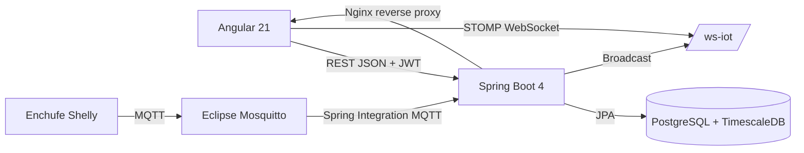

# Memoria final DAW - Wattimizer

## 1. Introducción y Justificación

### 1.1. Título del Proyecto

**Wattimizer** es una aplicación web B2B orientada a la monitorización energética y al análisis económico del consumo eléctrico de pequeñas empresas.

### 1.2. Descripción del Problema

Muchas pymes pueden consultar sus facturas eléctricas, pero no tienen una visión clara de qué equipos generan más gasto, cuándo se producen los picos de potencia o cuánto cuesta mantener dispositivos encendidos fuera del horario productivo. Esa falta de información provoca decisiones reactivas: se actúa cuando llega la factura, no cuando se está generando el consumo.

Wattimizer aborda este problema conectando enchufes inteligentes Shelly mediante MQTT, guardando las lecturas como serie temporal en TimescaleDB y traduciendo el consumo en euros mediante tarifas eléctricas 2.0TD y 3.0TD. Además, el proyecto incorpora simuladores de consumo para poder demostrar el flujo completo sin depender siempre de hardware físico.

### 1.3. Objetivos

#### Objetivo general

Desarrollar una plataforma web capaz de registrar telemetría eléctrica en tiempo real, visualizarla de forma comprensible y calcular el coste asociado según la tarifa contratada por cada usuario.

#### Objetivos específicos

- Implementar autenticación por JWT y acceso OAuth2 con Google y GitHub.
- Permitir que cada usuario gestione sus dispositivos físicos o simulados.
- Ingerir lecturas MQTT de enchufes Shelly mediante Spring Integration.
- Almacenar lecturas de potencia y energía en una hypertable de TimescaleDB.
- Mostrar en Angular un panel reactivo con gráficas por medidor activo.
- Calcular coste diario y coste de consumo fantasma mediante consultas analíticas.
- Generar alertas cuando la potencia instantánea supera la potencia contratada.
- Preparar una guía de despliegue reproducible con Docker Compose, Nginx, Mosquitto y TimescaleDB.

### 1.4. Tipos de Usuarios

| Tipo de usuario | Descripción | Permisos principales |
| --- | --- | --- |
| Usuario empresa | Perfil estándar que consulta sus medidores, su tarifa y sus alertas. | Alta de dispositivos, selección de tarifa privada, consulta de dashboard y analíticas. |
| Administrador | Perfil con permisos de mantenimiento del catálogo tarifario. | Todo lo anterior más creación, edición y borrado de tarifas maestras. |
| Sistema IoT | No es un usuario humano. Representa lecturas recibidas por MQTT sin sesión web. | Registra lecturas de dispositivos ya conocidos por el backend; si el mapper no encuentra la MAC, el código crea un placeholder sin usuario y con MAC vacía, por lo que el alta automática no cubre correctamente MAC nuevas. |

## 2. Fase 1: Análisis Funcional

### 2.1. Mapa de Funcionalidades

| Módulo | Funcionalidades |
| --- | --- |
| Autenticación | Login clásico, registro, registro de administrador con clave, OAuth2, emisión de JWT. |
| Dispositivos | Listado por usuario, vinculación por MAC, alta simulada, pack demo, edición, conmutación lógica y eliminación con limpieza de lecturas y alertas. |
| Telemetría | Recepción MQTT, persistencia de lecturas, difusión WebSocket y simulación periódica por perfiles de consumo. |
| Dashboard | Selector de medidor activo, gráfica de potencia, coste diario, coste fantasma y aviso si no hay tarifa asociada. |
| Tarifas | Catálogo CNMC, contrato privado por usuario, periodos P1-P6, potencias contratadas y validación por peaje. |
| Alertas | Generación de avisos por exceso de potencia y descarte manual por el usuario propietario. |
| Analítica | Cálculo de coste por periodo y coste fantasma usando lecturas, calendario tarifario y tarifa del usuario. |
| Despliegue | Entorno Docker con backend, frontend, TimescaleDB, Mosquitto y proxy Nginx. |

### 2.2. Historias de Usuario

| Código | Historia | Criterios de aceptación | Prioridad |
| --- | --- | --- | --- |
| HU-01 | Como usuario, quiero registrarme e iniciar sesión para acceder a mis datos energéticos. | Registro con email único, contraseña confirmada y JWT válido tras login. | Imprescindible |
| HU-02 | Como usuario, quiero vincular un enchufe por MAC para asociarlo a mi cuenta. | El dispositivo queda asignado al usuario autenticado y aparece en su inventario. | Imprescindible |
| HU-03 | Como usuario, quiero ver lecturas en tiempo real para saber el consumo actual. | El dashboard recibe datos por WebSocket y actualiza la gráfica sin recargar la página. | Imprescindible |
| HU-04 | Como usuario, quiero configurar mi tarifa para convertir kWh en euros. | Se puede clonar una tarifa del catálogo y modificar precios/potencias privadas. | Imprescindible |
| HU-05 | Como usuario, quiero consultar el coste diario de un medidor. | La API devuelve coste en euros para `macAddress`, `start` y `end`. | Imprescindible |
| HU-06 | Como usuario, quiero detectar consumo fantasma nocturno. | El sistema calcula coste entre 00:00 y 05:59 en la zona horaria tarifaria. | Opcional |
| HU-07 | Como administrador, quiero mantener el catálogo de tarifas. | Solo `ROLE_ADMIN` puede crear, editar o borrar tarifas maestras. | Imprescindible |
| HU-08 | Como usuario, quiero recibir alertas si supero la potencia contratada. | El backend compara la potencia instantánea con el periodo tarifario correspondiente y crea alerta `OVERPOWER`. | Opcional |
| HU-09 | Como usuario, quiero cerrar sesión sin que queden datos cacheados. | El frontend borra JWT, desconecta telemetría y resetea stores. | Imprescindible |
| HU-10 | Como usuario, quiero usar login social para no crear otra contraseña. | OAuth2 redirige al frontend con ticket temporal y se canjea por JWT. | Opcional |
| HU-11 | Como desarrollador/demostrador, quiero dispositivos simulados para enseñar la plataforma sin hardware real. | Se pueden crear simuladores individuales y un pack de nueve perfiles; las lecturas se generan periódicamente. | Imprescindible para demo |

### 2.3. Gestión del Trabajo

- **Repositorio:** <https://github.com/joellmar/wattpath-app>
- **Flujo usado:** ramas de funcionalidad, commits atómicos y validación antes de integrar cambios.
- **Kanban propuesto:** Backlog, Por hacer, En progreso, En revisión y Hecho.

### 2.4. Planificación Inicial

| Fase | Historias incluidas | Dificultad estimada |
| --- | --- | --- |
| Arranque técnico | HU-01, estructura Docker, conexión BD | Media |
| IoT y datos | HU-02, HU-03, ingesta MQTT, hypertable | Alta |
| Tarifas y analítica | HU-04, HU-05, HU-06, HU-08 | Alta |
| Interfaz de usuario | Dashboard, dispositivos, alertas, tarifa privada | Media |
| Simulación y demo | HU-11, perfiles de potencia, pack demo | Media |
| Despliegue | Nginx, Mosquitto, VPS Hetzner, variables `.env` | Media |

## 3. Fase 2: Diseño Técnico

### 3.1. Diseño de la Base de Datos

El modelo combina tablas relacionales normales con una tabla de series temporales:

- `users`: cuentas de usuario y rol.
- `devices`: medidores vinculados a usuarios, físicos o simulados.
- `readings`: lecturas de potencia y energía, convertida en hypertable por la columna `time`.
- `alerts`: avisos asociados a usuario y dispositivo.
- `tariffs`, `periods`, `tariff_contracted_powers`: catálogo y contratos eléctricos.
- `tariff_calendar_slots`: calendario regulatorio usado para resolver el periodo P1-P6 según fecha, hora, peaje y zona.
- `federated_identities`: relación entre usuarios internos y proveedores OAuth2.

El detalle técnico de tablas, claves y consultas se desarrolla en el [Anexo D](./anexo-d-timescaledb-analitica.md).

### 3.2. Arquitectura del Sistema



- **Backend:** Java 26, Spring Boot 4.0.5, Spring Security, Spring Integration MQTT, JPA y MapStruct.
- **Frontend:** Angular 21 standalone, PrimeNG 21, Tailwind CSS 4, RxJS y `@ngrx/signals`.
- **Comunicación:** REST JSON para operaciones de negocio y STOMP sobre WebSocket para telemetría en tiempo real.
- **Persistencia:** PostgreSQL con extensión TimescaleDB para lecturas de alta frecuencia.

### 3.3. Diseño de Interfaz

Las pantallas principales se han organizado alrededor de un layout autenticado:

- **Login y registro:** formularios simples con validación y accesos OAuth2.
- **Dashboard:** selector de medidor activo, gráfica de potencia y tarjetas de coste.
- **Dispositivos:** tabla de inventario, alta física/simulada, detalle, edición y eliminación.
- **Tarifas:** catálogo visible para usuarios y mantenimiento completo para administradores.
- **Alertas:** listado de avisos y acción para descartarlos.

El [anexo visual](../../docs-canvas/arquitectura-wattimizer.md) resume estos flujos con diagramas Mermaid.

### 3.4. Relación entre Historias y Diseño

| Historia | Tablas principales | Código responsable |
| --- | --- | --- |
| HU-01 | `users`, `federated_identities` | `AuthController`, `AuthRegistrationService`, `JwtTokenService`, componentes `login`, `register`, `oauth-callback`. |
| HU-02 | `devices` | `DeviceController`, `DeviceService`, `DevicesComponent`, `TelemetryStore`. |
| HU-03 | `readings` | `MqttConfig`, `DeviceMessageHandler`, `TelemetryBroadcaster`, `WebsocketService`, `TelemetryStore`. |
| HU-04 | `tariffs`, `periods`, `tariff_contracted_powers` | `TariffController`, `UserTariffController`, `TariffStore`, `TariffComponent`. |
| HU-05 | `readings`, `tariff_calendar_slots` | `ConsumptionController`, `ConsumptionService`, `CalendarResolverService`, `DashboardComponent`. |
| HU-06 | `readings`, `tariff_calendar_slots` | `ConsumptionService.calculateGhostCost`, widgets de analítica del dashboard. |
| HU-07 | `tariffs`, `periods`, `tariff_contracted_powers` | Endpoints admin de `TariffController` y formulario de `TariffComponent`. |
| HU-08 | `alerts`, `readings`, `tariff_contracted_powers` | `AlertService`, `AlertController`, `AlertsComponent`. |
| HU-09 | Estado de sesión del navegador | `SessionStorageService`, `MainLayoutComponent`, reset de `TelemetryStore` y `TariffStore`. |
| HU-10 | `users`, `federated_identities` | OAuth2 success handler, `OAuth2LoginTicketService`, `OAuthCallbackComponent`. |
| HU-11 | `devices`, `readings`, `alerts` | `CreateSimulatedDeviceRequest`, `IotTelemetrySimulationJob`, `SimulatedTelemetryProcessor`, `DevicesComponent`. |

## 4. Fase 3: Implementación y Desarrollo

### 4.1. Tecnologías Utilizadas

| Capa | Tecnología | Uso concreto |
| --- | --- | --- |
| Backend | Java 26, Spring Boot 4.0.5 | API REST, seguridad, JPA, WebSocket e integración MQTT. |
| Seguridad | Spring Security, JJWT 0.12.5, OAuth2 Client | JWT stateless, roles y login social. |
| Frontend | Angular 21, TypeScript 5.9, PrimeNG 21 | SPA, formularios, componentes visuales y navegación. |
| Estado frontend | RxJS 7.8, `@ngrx/signals` 21 | Stores reactivos y flujos HTTP/WebSocket. |
| Datos | PostgreSQL, TimescaleDB | Modelo relacional y series temporales. |
| IoT | Eclipse Mosquitto, MQTT QoS 1 | Broker de mensajes de enchufes Shelly. |
| Despliegue | Docker Compose, Nginx | Contenerización y reverse proxy. |

### 4.2. Desarrollo del Backend

El backend se organiza en controladores REST del paquete `controllers`, servicios de negocio en `services`, entidades JPA en `entities`, repositorios en `repositories` y mappers/DTOs para separar la API de la persistencia. La seguridad es stateless: el cliente envía `Authorization: Bearer <JWT>` y el filtro de validación rellena el `SecurityContext`.

Los detalles de endpoints, parámetros y DTOs se documentan en el [Anexo A](./anexo-a-backend-rest.md).

### 4.3. Desarrollo del Frontend

Angular usa componentes standalone y rutas protegidas por `authGuard`. La mayor parte del estado compartido está en `TelemetryStore` y `TariffStore`, ambos construidos con `signalStore`. El dashboard no guarda solo una lista lineal de lecturas: mantiene un diccionario por MAC para soportar el panel multi-dispositivo sin mezclar series.

La documentación detallada de componentes, servicios, RxJS y NgRx Signals se encuentra en el [Anexo B](./anexo-b-frontend-angular.md).

### 4.4. Control de Versiones

El repositorio trabaja con commits pequeños asociados a cambios funcionales: despliegue, simuladores, telemetría, frontend o documentación. En los últimos cambios revisados destacan:

- `feat(devices): perfiles de simulacion de consumo y CRUD simulado`
- `feat(prod): activar simuladores en demo y pack de demostracion`
- `fix(simulators): borrado en cascada, telemetria por perfil y panel multi-dispositivo`
- `fix(deploy): reiniciar nginx tras compose up para evitar 502`

## 5. Fase 4: Pruebas y Despliegue

### 5.1. Plan de Pruebas

| Prueba | Validación esperada |
| --- | --- |
| Login con credenciales incorrectas | Respuesta 401 y mensaje de credenciales incorrectas. |
| Registro duplicado | Respuesta 400 indicando que ya existe una cuenta con ese correo. |
| Acceso a dispositivo ajeno | Respuesta 403 o error de permisos según endpoint. |
| Creación de simulador | Se genera MAC `SIM#########`, queda activo y empieza a emitir lecturas. |
| Pack demo | Crea como máximo un dispositivo por cada perfil de simulación. |
| Eliminación de dispositivo | Se eliminan lecturas y alertas asociadas antes de borrar el dispositivo. |
| MQTT `events/rpc` | Se transforma el payload Shelly, se guarda lectura y se emite por WebSocket. |
| Dashboard multi-dispositivo | Al cambiar de MAC se precargan lecturas recientes y se reconecta el stream. |
| Cálculo de coste | Devuelve euros redondeados a dos decimales si hay lecturas y tarifa. |
| Sin tarifa asignada | El dashboard avisa y la API devuelve coste cero sin romper el flujo. |

### 5.2. Manual de Instalación y Uso

Resumen para desarrollo local:

```bash
cp .env.example .env
docker compose up -d timescaledb mosquitto
cd backend && ./mvnw spring-boot:run
cd ../frontend && npm install && npm start
```

Después de que Hibernate cree las tablas, los scripts SQL se ejecutan manualmente en el orden indicado por la guía de despliegue:

```bash
docker compose exec -T timescaledb psql -U "$DB_USER" -d "$DB_NAME" -f /ruta/script.sql
```

Para producción se usa la guía `docs/deployment/hetzner-production.md`, que cubre variables `.env`, Nginx, reinicio tras `compose up`, Mosquitto autenticado y semillas de demostración.

### 5.3. Despliegue

El despliegue previsto usa una VPS con Docker Compose:

- `backend`: API Spring Boot.
- `frontend`: build Angular servido por Nginx.
- `timescaledb`: base PostgreSQL con extensión TimescaleDB.
- `mosquitto`: broker MQTT autenticado.
- `nginx`: proxy inverso y punto de entrada HTTP/HTTPS.

La configuración sensible se externaliza mediante variables de entorno: `JWT_SECRET`, `ADMIN_KEY`, credenciales de base de datos, credenciales MQTT y clientes OAuth2.

## 6. Conclusiones y Líneas Futuras

### 6.1. Grado de cumplimiento

El MVP cubre autenticación, gestión de dispositivos, telemetría, dashboard, tarifas, costes, alertas, simuladores y despliegue. La funcionalidad de simuladores refuerza la defensa del proyecto porque permite demostrar la aplicación aunque no haya enchufes físicos conectados.

### 6.2. Dificultades

- **Series temporales:** se resolvió usando TimescaleDB sobre PostgreSQL para mantener SQL estándar y mejorar el manejo de lecturas por tiempo.
- **Datos IoT reales:** los mensajes Shelly tienen payloads distintos según topic, por eso se separan `events/rpc` y `status/switch:0`.
- **Coste tarifario:** el cálculo requiere calendario por zona, peaje, mes, día y hora; se aisló en `CalendarResolverService`.
- **Demo sin hardware:** se añadió simulación por perfiles para no depender del dispositivo físico durante pruebas o presentación.
- **Integridad al borrar:** se implementó limpieza previa de lecturas y alertas para evitar conflictos de claves foráneas.

### 6.3. Mejoras Futuras

- Parametrizar la suscripción MQTT para soportar múltiples MAC Shelly sin cambiar código.
- Añadir OpenAPI/Swagger para publicar contrato REST formal.
- Implementar retención y compresión de lecturas antiguas en TimescaleDB.
- Añadir pruebas end-to-end del flujo completo login-dispositivo-dashboard.
- Incorporar comparativas tarifarias automáticas y recomendaciones de ahorro.
- Proteger WebSocket/STOMP con autenticación JWT.

## 7. Bibliografía y Recursos

- Documentación oficial de Spring Boot y Spring Security.
- Documentación oficial de Angular, RxJS y NgRx Signals.
- Documentación de Spring Integration MQTT.
- Documentación de TimescaleDB.
- Documentación de PrimeNG y Chart.js.
- Especificación de tarifas de acceso CNMC 3/2020 usada para modelar periodos P1-P6.

## Anexos técnicos

- [Anexo A - Backend REST Spring Boot](./anexo-a-backend-rest.md)
- [Anexo B - Frontend Angular, RxJS y NgRx Signals](./anexo-b-frontend-angular.md)
- [Anexo C - Ingesta de telemetría MQTT](./anexo-c-telemetria-mqtt.md)
- [Anexo D - TimescaleDB y consultas analíticas](./anexo-d-timescaledb-analitica.md)
- [Anexo visual - Arquitectura Wattimizer](../../docs-canvas/arquitectura-wattimizer.md)
