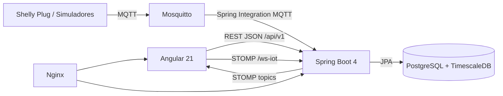

# Memoria final del proyecto DAW: Wattimizer

## Indice de anexos tecnicos

- [Anexo A. Backend REST con Spring Boot](./anexo-a-backend-rest.md)
- [Anexo B. Frontend Angular, RxJS y NgRx Signals](./anexo-b-frontend-angular.md)
- [Anexo C. Ingesta de telemetria MQTT y simulacion IoT](./anexo-c-telemetria-mqtt.md)
- [Anexo D. TimescaleDB, modelo relacional y consultas analiticas](./anexo-d-timescaledb-analitica.md)
- [Canvas documental de arquitectura](../../docs-canvas/arquitectura-wattimizer.md)

---

## 1. Introduccion y justificacion

### 1.1. Titulo del proyecto

**Wattimizer** es una aplicacion web B2B orientada a la monitorizacion energetica y al analisis economico del consumo electrico en pequenas empresas.

### 1.2. Descripcion del problema

Muchas pymes conocen el importe final de su factura electrica, pero no tienen una lectura continua que relacione el consumo real de sus equipos con el coste economico que van generando. Esto provoca tres problemas practicos: no se detectan picos de potencia hasta que ya han afectado al contrato, el consumo nocturno queda oculto dentro del total mensual y las decisiones de ahorro se toman sin datos propios.

Wattimizer nace para cubrir esa falta de visibilidad. La aplicacion recibe telemetria desde enchufes inteligentes Shelly mediante MQTT, guarda lecturas temporales en TimescaleDB y las transforma en informacion util para el usuario: potencia activa, energia acumulada, coste estimado en euros, consumo fantasma y alertas por exceso de potencia contratada. En los ultimos cambios del repositorio tambien se ha incorporado un sistema de simuladores de consumo, lo que permite probar la plataforma sin depender siempre del hardware fisico.

### 1.3. Objetivos

#### Objetivo general

Desarrollar una plataforma web que permita a una pyme controlar su consumo electrico en tiempo real y traducirlo a impacto economico aplicando tarifas electricas TD configuradas por el usuario.

#### Objetivos especificos

- Implementar autenticacion con JWT y OAuth2 para separar rutas publicas y privadas.
- Registrar, reclamar y administrar dispositivos IoT fisicos o simulados.
- Ingerir telemetria asincrona desde MQTT mediante Spring Integration.
- Persistir lecturas temporales en PostgreSQL con TimescaleDB.
- Calcular coste diario y consumo fantasma a partir del odometro de energia.
- Gestionar un catalogo de tarifas y contratos privados por usuario.
- Mostrar graficas de potencia en tiempo real usando Angular, RxJS, STOMP y NgRx Signals.
- Generar alertas cuando la potencia activa supera la potencia contratada del periodo.
- Desplegar la aplicacion con Docker Compose, Nginx y GitHub Actions en un VPS Hetzner.

### 1.4. Tipos de usuarios

| Usuario | Uso principal | Permisos reales en el codigo |
|---|---|---|
| Usuario pyme | Controla sus dispositivos, configura su tarifa y consulta analiticas. | Puede acceder a dispositivos propios, lecturas, alertas y tarifa privada. |
| Administrador | Mantiene el catalogo maestro de tarifas y puede crear usuarios administradores. | Tiene `ROLE_ADMIN`; puede mutar `/api/v1/tariffs/**` y registrar admins con secreto. |
| Dispositivo IoT | Publica lecturas de consumo por MQTT. | No entra por REST; el backend procesa topics Shelly desde Mosquitto. |

---

## 2. Fase 1: analisis funcional

### 2.1. Mapa de funcionalidades

| Modulo | Funcionalidades implementadas |
|---|---|
| Autenticacion | Login con email y password, registro, OAuth2 con Google/GitHub, canje de ticket OAuth por JWT, interceptor HTTP en Angular. |
| Dispositivos | Listado por usuario, claim de Shelly fisico, alta de simuladores, pack demo, edicion, encendido/apagado, borrado con limpieza de lecturas y alertas. |
| Telemetria | Suscripcion MQTT, normalizacion de payloads Shelly, guardado de lecturas, broadcast STOMP y grafica de potencia. |
| Tarifas | Catalogo maestro, tarifa privada por usuario, precios P1-P6, potencias contratadas y validacion de periodos TD. |
| Analitica | Coste por intervalo, coste fantasma nocturno y resolucion del periodo tarifario aplicable. |
| Alertas | Generacion de alertas `OVERPOWER`, listado por usuario y descarte seguro. |
| Despliegue | Docker Compose, Nginx como proxy, certificados con Certbot, GitHub Actions para build y despliegue. |

### 2.2. Historias de usuario

| ID | Historia | Criterios de aceptacion | Prioridad |
|---|---|---|---|
| HU-01 | Como usuario, quiero registrarme e iniciar sesion para acceder a mi panel privado. | El registro crea un usuario activo; el login devuelve JWT; las rutas privadas exigen token. | MVP |
| HU-02 | Como usuario, quiero entrar con Google o GitHub para no gestionar otra contrasena. | El backend redirige por OAuth2, genera un ticket temporal y Angular lo canjea por JWT. | MVP |
| HU-03 | Como usuario, quiero vincular un Shelly a mi cuenta para ver sus lecturas. | `POST /api/v1/devices/claim` asocia la MAC al usuario autenticado o rechaza si pertenece a otro. | MVP |
| HU-04 | Como usuario, quiero crear dispositivos simulados para probar la plataforma sin hardware. | El formulario permite elegir perfil; el backend crea MAC `SIM...`; el job genera lecturas periodicas. | MVP |
| HU-05 | Como usuario, quiero ver una grafica de potencia en tiempo real. | El dashboard carga lecturas recientes y se suscribe a `/topic/readings/{mac}`. | MVP |
| HU-06 | Como usuario, quiero configurar mi tarifa electrica para convertir kWh en euros. | La tarifa privada se guarda en `/api/v1/users/me/tariff`; el dashboard desbloquea los widgets de coste. | MVP |
| HU-07 | Como usuario, quiero conocer mi coste diario y consumo fantasma. | Los endpoints `/analytics/cost` y `/analytics/ghost-consumption` devuelven importes para MAC e intervalo. | MVP |
| HU-08 | Como usuario, quiero recibir alertas si supero la potencia contratada. | Cada lectura se compara con la potencia del periodo; si supera el limite se guarda una alerta. | MVP |
| HU-09 | Como administrador, quiero mantener el catalogo de tarifas. | Solo `ROLE_ADMIN` puede crear, actualizar o borrar tarifas del catalogo. | MVP |
| HU-10 | Como usuario, quiero borrar un dispositivo sin dejar datos colgando. | El servicio elimina lecturas y alertas antes de borrar el dispositivo. | MVP |
| HU-11 | Como equipo de despliegue, quiero reiniciar Nginx tras recrear contenedores. | GitHub Actions ejecuta `docker compose restart nginx` despues de `up -d --build`. | MVP |

### 2.3. Gestion del trabajo: GitHub y Kanban

- **Repositorio:** <https://github.com/joellmar/wattpath-app>
- **Rama de documentacion:** `cursor/documentaci-n-t-cnica-del-proyecto-ccae`
- **Rama base:** `main`

Representacion del flujo Kanban usado para ordenar el trabajo:


El repositorio mantiene commits pequenos y descriptivos. En los cambios recientes se observan commits centrados en simuladores, despliegue real en Hetzner, seguridad de configuracion y resincronizacion de Nginx.

### 2.4. Planificacion inicial

| Fase | Historias incluidas | Dificultad tecnica |
|---|---|---|
| Analisis y dominio | HU-01, HU-03, HU-06 | Media: requiere separar usuarios, dispositivos y contratos. |
| Backend REST | HU-01, HU-02, HU-03, HU-06, HU-09 | Alta: seguridad JWT/OAuth2, DTOs y validaciones de negocio. |
| Telemetria IoT | HU-04, HU-05, HU-08 | Alta: MQTT, STOMP, persistencia temporal y simulacion. |
| Frontend Angular | HU-01, HU-04, HU-05, HU-06, HU-07 | Media-alta: formularios, signals, stores y WebSocket. |
| Base de datos y analitica | HU-06, HU-07, HU-08, HU-10 | Alta: TimescaleDB, periodo tarifario y calculo por intervalos. |
| Despliegue | HU-11 | Media: Docker, Nginx, Certbot y GitHub Actions. |

---

## 3. Fase 2: diseno tecnico

### 3.1. Diseno de la base de datos

El modelo combina tablas de negocio generadas por JPA con scripts SQL que completan lo que Hibernate no puede crear de forma fiable: extension TimescaleDB, hypertable, constraints regulatorios e indices.


Las lecturas usan clave primaria compuesta `(time, device_id)` y se convierten en hypertable por la columna `time`. El detalle completo de tablas, indices y scripts esta en el [Anexo D](./anexo-d-timescaledb-analitica.md).

### 3.2. Arquitectura del sistema



| Capa | Tecnologia real del repositorio | Papel |
|---|---|---|
| Backend | Java 26, Spring Boot 4.0.5, Spring Security, JPA, Spring Integration MQTT, WebSocket STOMP | API, seguridad, ingesta, calculo y broadcast. |
| Frontend | Angular 21, TypeScript 5.9, PrimeNG 21, NgRx Signals, RxJS 7.8, RxSTOMP | Interfaz, estado reactivo, graficas y formularios. |
| Base de datos | PostgreSQL con TimescaleDB HA PG17 | Persistencia relacional y series temporales. |
| Mensajeria | Eclipse Mosquitto 2.1.2 | Broker MQTT para telemetria Shelly. |
| Despliegue | Docker Compose, Nginx, Certbot, GitHub Actions | Entorno productivo en VPS Hetzner. |

### 3.3. Diseno de interfaz

El frontend se organiza con rutas standalone:

- `/login` y `/register`: pantallas publicas de acceso.
- `/auth/oauth/callback`: pantalla tecnica que canjea el ticket OAuth.
- `/dashboard`: panel principal con selector de dispositivo, grafica y widgets economicos.
- `/devices`: gestion de dispositivos fisicos y simulados.
- `/tariffs`: gestion de catalogo y tarifa privada.
- `/alerts`: historico de alertas de maximetro.

Wireframe textual de la pantalla principal:

```text
+-------------------------------------------------------------+
| Header: Wattimizer, usuario, menu lateral, cerrar sesion     |
+----------------------+--------------------------------------+
| Navegacion           | Dashboard                            |
| - Dashboard          | [Selector dispositivo]               |
| - Dispositivos       | [Grafica potencia W en tiempo real]  |
| - Tarifas            | [Coste diario] [Consumo fantasma]    |
| - Alertas            | [CTA configurar tarifa si falta]     |
+----------------------+--------------------------------------+
```

### 3.4. Relacion entre historias y diseno

| Historia | Tablas implicadas | Codigo principal |
|---|---|---|
| HU-01 | `users` | `AuthController`, `JwtTokenService`, `SessionStorageService`, `httpInterceptor` |
| HU-02 | `users`, `federated_identities` | `OAuth2AuthenticationSuccessHandler`, `OAuth2LoginTicketService`, `oauth-callback.component.ts` |
| HU-03 | `devices` | `DeviceController`, `DeviceService`, `DevicesComponent` |
| HU-04 | `devices`, `readings` | `CreateSimulatedDeviceRequest`, `IotTelemetrySimulationJob`, `SimulatedTelemetryProcessor` |
| HU-05 | `readings` | `MqttConfig`, `DeviceMessageHandler`, `TelemetryBroadcaster`, `TelemetryStore`, `WebsocketService` |
| HU-06 | `tariffs`, `periods`, `tariff_contracted_powers`, `users` | `UserTariffController`, `TariffStore`, `TariffComponent` |
| HU-07 | `readings`, `tariff_calendar_slots` | `ConsumptionController`, `ConsumptionService`, `DashboardComponent` |
| HU-08 | `alerts`, `readings`, `devices` | `AlertService`, `AlertController`, `AlertsComponent` |
| HU-09 | `tariffs`, `periods`, `tariff_contracted_powers` | `TariffController`, `TariffService`, `TariffComponent` |
| HU-10 | `devices`, `readings`, `alerts` | `DeviceService.deleteById`, `ReadingRepository.deleteAllByDeviceMacAddress`, `AlertRepository` |

---

## 4. Fase 3: implementacion y desarrollo

### 4.1. Tecnologias utilizadas

| Area | Versiones y herramientas |
|---|---|
| Backend | Spring Boot `4.0.5`, Java `26`, Maven Wrapper, MapStruct `1.6.3`, JJWT `0.12.5`, Spring Integration MQTT. |
| Frontend | Angular `21.x`, TypeScript `5.9`, RxJS `7.8`, NgRx Signals `21.1`, PrimeNG `21.1`, Chart.js `4.5`, Vitest `4.0`. |
| Base de datos | TimescaleDB HA `pg17`, PostgreSQL, scripts SQL versionados en `backend/src/main/resources/db`. |
| Infraestructura | Docker Compose, Nginx Alpine, Mosquitto `2.1.2-alpine`, GitHub Actions, Certbot. |

### 4.2. Desarrollo del backend

El backend expone una API REST bajo `/api/v1`. Spring Security trabaja sin sesion de servidor (`SessionCreationPolicy.STATELESS`) y valida JWT antes de ejecutar los controladores. Los recursos multitenant importantes no reciben `userId` desde el cliente; usan `Principal.getName()` para evitar que un usuario consulte datos de otro.

La logica de negocio se reparte asi:

- Controladores: validan ownership basico y traducen HTTP a servicios.
- Servicios: contienen reglas de negocio, calculo de coste, simulacion y alertas.
- Repositorios: encapsulan consultas JPA/JPQL.
- DTOs: separan la forma publica de la API del modelo de entidades.
- `GlobalExceptionHandler`: devuelve errores con `status`, `error`, `message` y `timestamp`.

Los cambios recientes mas relevantes en backend son:

- perfiles de simulacion (`SINE_WAVE`, `OVEN`, `WASHING_MACHINE`, `TELEVISION`, `FAN`, `DESKTOP_PC`, `FRIDGE`, `STANDBY`, `CONSTANT_HIGH_LOAD`);
- creacion de pack demo desde `/api/v1/devices/simulated/demo-pack`;
- separacion de la simulacion en `IotTelemetrySimulationJob` y `SimulatedTelemetryProcessor`;
- borrado de lecturas y alertas antes de eliminar un dispositivo;
- endpoints de lecturas recientes para alimentar el panel multi-dispositivo.

### 4.3. Desarrollo del frontend

El frontend usa componentes standalone y rutas lazy con `loadComponent`. La sesion se guarda en `sessionStorage` como JWT y el interceptor anade `Authorization: Bearer ...` a las rutas `/api/v1` privadas.

La parte reactiva no se basa en un unico store global clasico, sino en dos stores de NgRx Signals:

- `TelemetryStore`: dispositivos, MAC seleccionada, historico de lecturas por MAC y conexion WebSocket.
- `TariffStore`: catalogo, tarifa privada, estado de carga y errores.

El dashboard combina senales locales (`totalCostEur`, `ghostCostEur`, `analyticsError`) con datos derivados de stores. La grafica se alimenta con las ultimas veinte lecturas y se actualiza por STOMP cuando el backend emite en `/topic/readings/{macAddress}`.

### 4.4. Control de versiones

El flujo de trabajo observado en Git usa commits con prefijos claros:

- `feat(...)`: nuevas funcionalidades, como perfiles de simulacion y pack demo.
- `fix(...)`: correcciones de seguridad, configuracion, SQL o despliegue.
- `docs(...)`: documentacion de despliegue y memoria tecnica.
- `ci(...)`: cambios en GitHub Actions.

En los ultimos commits se han corregido problemas reales de produccion: variables OAuth reservadas por GitHub Actions, Mosquitto, permisos de Maven Wrapper, reinicio de Nginx tras recrear contenedores y ejecucion segura de scripts SQL.

---

## 5. Fase 4: pruebas y despliegue

### 5.1. Plan de pruebas

| Prueba | Archivo o zona | Resultado esperado |
|---|---|---|
| Login con credenciales invalidas | `AuthController`, `login.component.ts` | Respuesta 401 y mensaje de error en pantalla. |
| Registro con passwords distintas | `register.component.ts` | El formulario no se envia y marca el error de grupo. |
| Claim de dispositivo ajeno | `DeviceServiceTest` | El servicio rechaza la vinculacion si la MAC pertenece a otro usuario. |
| Creacion de simulador | `DeviceServiceTest`, `devices.component.spec.ts` | Se crea MAC sintetica y se asigna perfil. |
| Job de simulacion desactivado | `IotTelemetrySimulationJobTest` | No invoca el procesador si `simulation.enabled=false`. |
| Fallo en un simulador | `IotTelemetrySimulationJobTest` | El resto de dispositivos sigue procesandose. |
| Formulario tarifario 2.0TD y 3.0TD | `tariff.component.spec.ts` | Crea los periodos de energia y potencia esperados. |
| Calculo de coste en Canarias | `ConsumptionServiceTest` | Usa zona horaria `Atlantic/Canary` cuando corresponde. |
| Servicio de tarifa privada 204 | `tariff.service.spec.ts` | Mapea respuesta sin cuerpo a `null`. |
| Dashboard sin tarifa | `dashboard.component.spec.ts` | Muestra placeholders y banner de configuracion. |

### 5.2. Manual de instalacion y uso

#### Instalacion local orientativa

```bash
git clone https://github.com/joellmar/wattpath-app.git
cd wattpath-app

# Levantar servicios con Docker Compose si se dispone de .env valido
docker compose up -d --build
```

Para desarrollo por separado:

```bash
# Backend
cd backend
./mvnw spring-boot:run

# Frontend
cd frontend
npm ci --legacy-peer-deps
npm start
```

Pasos funcionales de usuario:

1. Registrarse o iniciar sesion.
2. Crear un simulador o reclamar un dispositivo Shelly por MAC.
3. Configurar una tarifa privada en la seccion Tarifas.
4. Entrar al dashboard y seleccionar el medidor.
5. Revisar coste diario, consumo fantasma y alertas.

### 5.3. Despliegue

La guia real de despliegue esta en [`docs/deployment/hetzner-production.md`](../deployment/hetzner-production.md). El entorno descrito usa:

- VPS Hetzner con Ubuntu 24.04 LTS.
- Dominio `wattimizer.com`.
- Docker Compose para TimescaleDB, Mosquitto, backend, frontend y Nginx.
- Certbot nativo en el host para certificados TLS.
- GitHub Actions en pushes a `main`.

La accion de despliegue ejecuta build de Angular, empaquetado Maven sin tests de integracion que requieran BD y actualizacion remota por SSH. Despues de `docker compose up -d --build`, reinicia Nginx para evitar errores 502 causados por IPs internas antiguas de contenedores recreados.

---

## 6. Conclusiones y lineas futuras

### 6.1. Grado de cumplimiento

El MVP esta cubierto en sus partes esenciales: autenticacion, gestion de dispositivos, telemetria, dashboard en tiempo real, tarifas, analitica basica, alertas y despliegue. El sistema tambien incluye simuladores, lo que mejora mucho la defensa del proyecto porque permite demostrar el flujo completo aunque no haya hardware fisico disponible.

### 6.2. Dificultades encontradas

- **Integracion IoT:** los mensajes Shelly llegan con formatos distintos (`events/rpc` y `status/switch:0`), por lo que se separaron canales y DTOs.
- **Series temporales:** JPA crea tablas, pero TimescaleDB necesita scripts SQL manuales para convertir `readings` en hypertable.
- **Tarifas TD:** el coste no depende solo del precio; tambien del periodo regulatorio y zona geografica.
- **Despliegue real:** Nginx mantenia IPs antiguas de backend/frontend tras recrear contenedores, solucionado reiniciando el proxy.
- **Pruebas sin hardware:** se resolvio con dispositivos simulados y perfiles de potencia.

### 6.3. Mejoras futuras

- Configurar topics MQTT por base de datos o propiedades, en lugar de tener un prefijo Shelly fijo en `MqttConfig`.
- Anadir autenticacion o validacion de suscripciones STOMP para WebSocket.
- Implementar agregaciones con `time_bucket` de TimescaleDB para intervalos largos.
- Definir politicas de compresion y retencion de lecturas antiguas.
- Crear tests especificos para `MqttConfig`, `DeviceMessageHandler`, `TelemetryStore` y `WebsocketService`.
- Incorporar informes descargables en PDF o CSV.
- Preparar una aplicacion movil o PWA para consulta rapida desde el telefono.

---

## 7. Bibliografia y recursos

- Documentacion oficial de Spring Boot, Spring Security y Spring Integration MQTT.
- Documentacion oficial de Angular, RxJS y NgRx Signals.
- Documentacion oficial de TimescaleDB.
- Documentacion de Eclipse Mosquitto.
- Documentacion de PrimeNG, Chart.js y RxSTOMP.
- Circular CNMC 3/2020 para estructura de periodos TD.
- Guia de despliegue propia del repositorio: [`docs/deployment/hetzner-production.md`](../deployment/hetzner-production.md).
