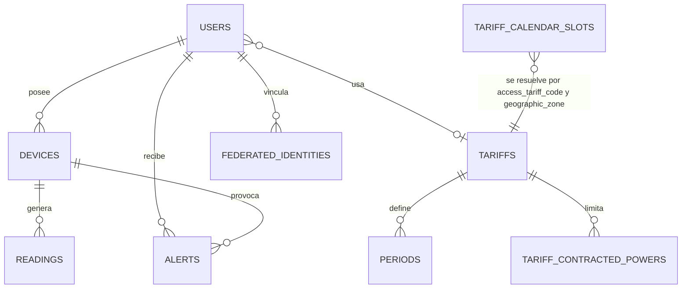
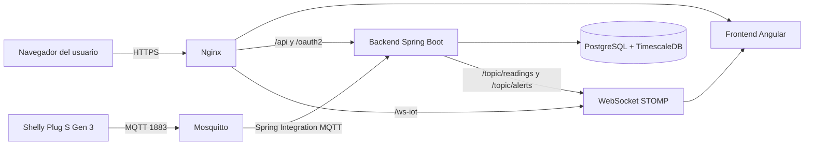
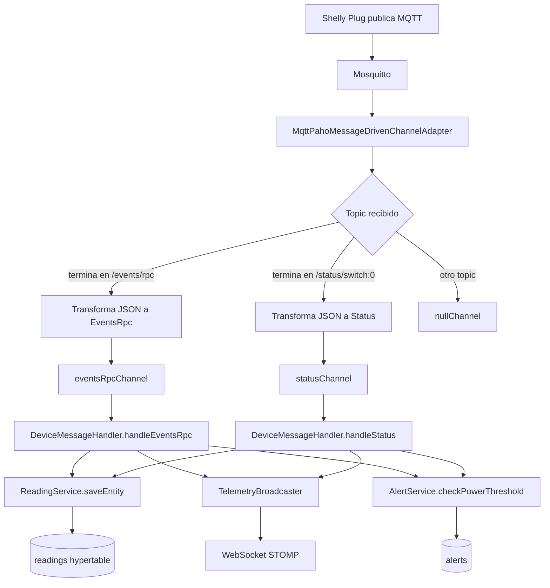
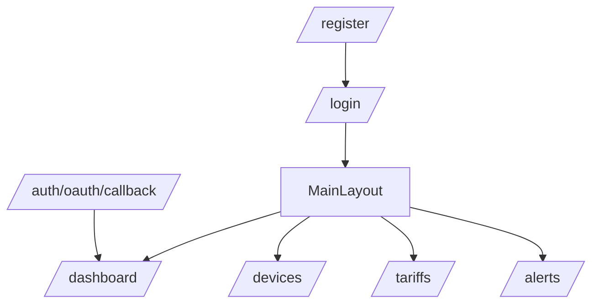
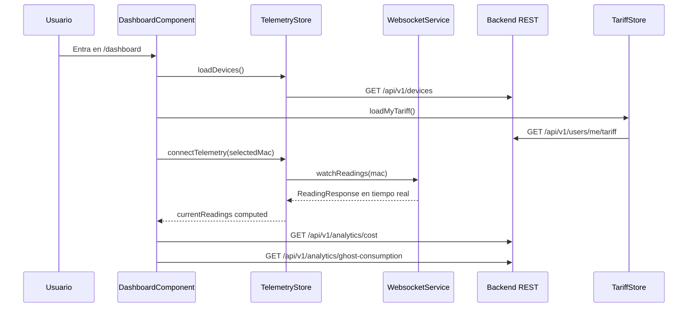
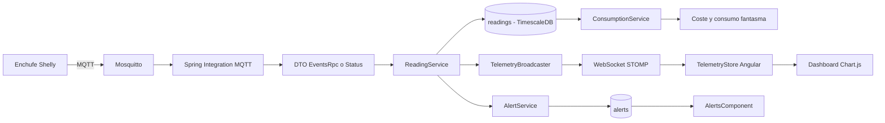

# Memoria técnica del proyecto Wattimizer

> Documento redactado como anexo técnico de la memoria final del proyecto DAW.<br>
> Fuente principal: código y documentación versionada del repositorio `joellmar/wattpath-app`, rama `cursor/documentaci-n-t-cnica-del-proyecto-b8f5`.

## Índice

1. [Introducción y justificación](#1-introducción-y-justificación)
2. [Fase 1: Análisis funcional](#2-fase-1-análisis-funcional)
3. [Fase 2: Diseño técnico](#3-fase-2-diseño-técnico)
4. [Fase 3: Implementación y desarrollo](#4-fase-3-implementación-y-desarrollo)
5. [Fase 4: Pruebas y despliegue](#5-fase-4-pruebas-y-despliegue)
6. [Conclusiones y líneas futuras](#6-conclusiones-y-líneas-futuras)
7. [Bibliografía y recursos](#7-bibliografía-y-recursos)

---

## 1. Introducción y justificación

### 1.1. Título del proyecto

**Wattimizer App**.

El repositorio aparece publicado como `wattpath-app`, pero el nombre comercial usado en el README, en las guías de despliegue y en las URLs de producción es **Wattimizer**.

### 1.2. Descripción del problema

Wattimizer nace para resolver un problema bastante común en pequeñas y medianas empresas: el consumo eléctrico se mide en kWh, pero la empresa suele tomar decisiones pensando en euros. Esa diferencia provoca una falta de visibilidad real sobre cuánto cuesta mantener encendidos determinados equipos, cuándo se producen picos de potencia o qué parte del gasto ocurre fuera del horario normal de actividad.

El problema no es solo técnico. Aunque un enchufe inteligente pueda medir potencia y energía acumulada, esos datos por sí solos no explican el impacto económico. Para que sean útiles hay que relacionarlos con una tarifa eléctrica concreta, con sus periodos horarios, precios por kWh, zona geográfica y potencias contratadas. Por eso el proyecto no se limita a recibir telemetría: transforma lecturas IoT en indicadores financieros entendibles.

La aplicación se centra en tres necesidades:

- **Monitorizar dispositivos eléctricos** mediante telemetría MQTT de enchufes Shelly o datos simulados.
- **Calcular coste económico real** a partir de lecturas de energía acumulada y tarifas TD.
- **Avisar de situaciones relevantes**, como sobrepasar la potencia contratada o detectar consumo nocturno considerado fantasma.

### 1.3. Objetivos

#### Objetivo general

Desarrollar una plataforma web B2B que permita a una pyme registrar sus dispositivos eléctricos, recibir telemetría en tiempo real y traducir el consumo energético en información económica útil para tomar decisiones.

#### Objetivos específicos

- Implementar una API REST segura con Spring Boot para autenticación, dispositivos, lecturas, tarifas, alertas y analítica.
- Usar JWT y OAuth2 para permitir inicio de sesión local y social, manteniendo una sesión stateless.
- Ingerir mensajes MQTT de dispositivos Shelly mediante Spring Integration MQTT.
- Persistir las lecturas en PostgreSQL con TimescaleDB, usando una hypertable para la serie temporal `readings`.
- Modelar tarifas eléctricas TD con periodos de energía, potencias contratadas y calendario regulatorio.
- Calcular coste energético y consumo fantasma a partir de deltas positivos de energía acumulada.
- Construir un frontend Angular con componentes standalone, estado reactivo con NgRx Signals y comunicación en tiempo real por WebSocket STOMP.
- Desplegar la aplicación con Docker Compose, Nginx, Mosquitto y TimescaleDB en un VPS.

### 1.4. Tipos de usuarios

| Tipo de usuario | Rol técnico | Uso principal en la plataforma |
|---|---|---|
| Usuario de empresa | `ROLE_USER` | Reclama dispositivos, consulta el dashboard, configura su tarifa privada y revisa alertas. |
| Administrador | `ROLE_ADMIN` | Mantiene el catálogo maestro de tarifas y puede crear usuarios administradores mediante clave interna. |
| Sistema IoT | No inicia sesión HTTP | Publica telemetría MQTT desde el dispositivo Shelly o desde el simulador interno. |

---

## 2. Fase 1: Análisis funcional

### 2.1. Mapa de funcionalidades

| Módulo | Funcionalidades principales | Evidencia en el repositorio |
|---|---|---|
| Autenticación | Login local, registro, registro admin, OAuth2 Google/GitHub, emisión de JWT | `AuthController`, `JwtTokenService`, `OAuth2AuthenticationSuccessHandler` |
| Dashboard energético | Gráfico de potencia en tiempo real, coste diario, consumo fantasma, selector de dispositivo | `DashboardComponent`, `TelemetryStore`, `ConsumptionController` |
| Dispositivos IoT | Listado, alta, claim, edición, borrado y cambio de estado virtual | `DeviceController`, `DevicesComponent`, `TelemetryStore` |
| Lecturas | Última lectura, búsqueda por tiempo y MAC, borrado por clave compuesta | `ReadingController`, `ReadingRepository` |
| Tarifas eléctricas | Catálogo maestro, tarifa privada del usuario, periodos P1-P6 y potencias contratadas | `TariffController`, `UserTariffController`, `TariffStore` |
| Alertas | Creación automática por sobrepotencia, listado y descarte de alertas | `AlertService`, `AlertController`, `AlertsComponent` |
| Ingesta MQTT | Suscripción a topics Shelly, transformación JSON, persistencia y broadcast | `MqttConfig`, `DeviceMessageHandler` |
| Analítica TimescaleDB | Coste por intervalo, consumo fantasma y resolución de periodos tarifarios | `ConsumptionService`, `CalendarResolverService`, `readings` hypertable |
| Despliegue | Docker Compose, Nginx, Mosquitto, TimescaleDB, CI/CD con GitHub Actions | `docker-compose.yml`, `docs/deployment/hetzner-production.md`, `.github/workflows/deploy.yml` |

### 2.2. Historias de usuario

Las siguientes historias se han reconstruido a partir del código implementado y de los módulos reales de la aplicación.

| ID | Historia de usuario | Criterios de aceptación | Prioridad |
|---|---|---|---|
| HU-01 | Como usuario, quiero registrarme e iniciar sesión para acceder a mis datos energéticos. | El registro crea un usuario con `ROLE_USER`; el login devuelve un JWT; las rutas privadas rechazan usuarios sin sesión. | MVP |
| HU-02 | Como usuario, quiero iniciar sesión con Google o GitHub para no depender solo de contraseña local. | El backend crea o enlaza una identidad federada; el callback entrega un ticket temporal; Angular canjea el ticket por JWT. | MVP |
| HU-03 | Como usuario, quiero ver mis dispositivos para seleccionar qué consumo quiero analizar. | `GET /api/v1/devices` devuelve solo dispositivos del usuario autenticado; el dashboard selecciona la primera MAC disponible. | MVP |
| HU-04 | Como usuario, quiero reclamar un enchufe Shelly detectado para vincularlo a mi cuenta. | `POST /api/v1/devices/claim` acepta nombre y MAC; rechaza dispositivos ya vinculados a otro usuario; actualiza la lista en el frontend. | MVP |
| HU-05 | Como usuario, quiero ver potencia en tiempo real para detectar picos de consumo. | El backend publica lecturas en `/topic/readings/{macAddress}`; Angular se suscribe con RxStomp; el gráfico conserva las últimas 20 muestras. | MVP |
| HU-06 | Como usuario, quiero configurar mi tarifa para que la aplicación calcule costes reales. | `GET/POST/DELETE /api/v1/users/me/tariff` gestiona la tarifa privada; no se envía `userId`, el propietario se obtiene del JWT. | MVP |
| HU-07 | Como administrador, quiero mantener un catálogo de tarifas para que los usuarios puedan partir de plantillas. | El rol `ROLE_ADMIN` puede crear, actualizar y borrar tarifas; los usuarios autenticados pueden consultar el catálogo. | MVP |
| HU-08 | Como usuario, quiero saber cuánto me ha costado la energía consumida hoy. | El dashboard llama a `/api/v1/analytics/cost`; el backend calcula deltas de kWh y aplica el precio del periodo vigente. | MVP |
| HU-09 | Como usuario, quiero detectar consumo fantasma nocturno para reducir gasto innecesario. | `/api/v1/analytics/ghost-consumption` calcula coste solo en la ventana local 00:00-05:59. | MVP |
| HU-10 | Como usuario, quiero recibir alertas cuando un dispositivo supera la potencia contratada. | `AlertService` compara W convertidos a kW con `tariff_contracted_powers`; si supera el límite, crea alerta `OVERPOWER`. | MVP |
| HU-11 | Como desarrollador, quiero levantar el proyecto en local con datos mínimos para probar la aplicación. | Existen scripts SQL de extensiones, hypertable, calendario tarifario, usuarios y dispositivos de desarrollo. | MVP |
| HU-12 | Como administrador del sistema, quiero desplegar la aplicación en producción con servicios aislados. | Docker Compose separa TimescaleDB, Mosquitto, backend, frontend y Nginx; GitHub Actions valida y despliega `main`. | MVP |
| HU-13 | Como usuario, quiero apagar visualmente un dispositivo desde la interfaz. | `PUT /api/v1/devices/{id}` actualiza `isOn`; el frontend refresca el estado. Actualmente no hay comando MQTT outbound real hacia el hardware. | Opcional |
| HU-14 | Como equipo técnico, quiero explotar TimescaleDB con compresión y retención para históricos largos. | El repositorio usa hypertable, pero todavía no define políticas de compresión ni retención. | Opcional |

### 2.3. Gestión del trabajo

#### Repositorio

- Repositorio GitHub: `https://github.com/joellmar/wattpath-app`
- Rama principal de integración: `main`
- Rama de documentación analizada: `cursor/documentaci-n-t-cnica-del-proyecto-b8f5`

#### Kanban

El repositorio no versiona capturas del tablero Kanban. En este anexo queda documentada la estructura funcional del tablero que se ha tenido en cuenta para la organización del trabajo:

1. Backlog
2. Por hacer
3. En progreso
4. En revisión
5. Hecho

Esta aclaración se incluye porque en `.gitignore` aparecen referencias a materiales no versionados, como documentos de fases y posibles capturas, pero no están disponibles dentro del repositorio actual.

### 2.4. Planificación inicial

| Fase | Historias asociadas | Resultado técnico | Dificultad estimada |
|---|---|---|---|
| Análisis funcional | HU-01 a HU-12 | Definición de usuarios, módulos y flujo IoT-energía-coste | Media |
| Diseño de datos | HU-06, HU-08, HU-09, HU-10 | Modelo relacional con tarifas, periodos, calendario y lecturas temporales | Alta |
| Backend base | HU-01, HU-03, HU-04, HU-06, HU-07 | API REST, seguridad JWT/OAuth2 y servicios de negocio | Alta |
| Ingesta IoT | HU-05, HU-10 | Spring Integration MQTT, persistencia y WebSocket | Alta |
| Frontend | HU-01 a HU-10 | Componentes Angular, stores NgRx Signals y vistas PrimeNG | Alta |
| Despliegue | HU-11, HU-12 | Docker Compose, Nginx, Mosquitto, TimescaleDB, CI/CD | Alta |
| Mejoras futuras | HU-13, HU-14 | MQTT outbound real, optimización TimescaleDB, retención histórica | Media/Alta |

---

## 3. Fase 2: Diseño técnico

### 3.1. Diseño de la base de datos

El diseño combina entidades JPA con scripts SQL específicos. Hibernate crea y actualiza las tablas mediante `spring.jpa.hibernate.ddl-auto=update`, mientras que los scripts de `backend/src/main/resources/db/` añaden lo que JPA no cubre bien: extensiones, hypertable de TimescaleDB, constraints regulatorios e índices de calendario.

#### Diagrama E/R



#### Modelo relacional principal

| Tabla | Clave primaria | Claves externas | Función |
|---|---|---|---|
| `users` | `id` | `tariff_id -> tariffs.id` | Usuarios locales, rol, contraseña cifrada y estado activo. |
| `federated_identities` | `id` | `user_id -> users.id` | Relación entre proveedor OAuth2 y usuario local. |
| `devices` | `id` | `user_id -> users.id` | Dispositivos IoT físicos o simulados, identificados por `mac_address`. |
| `readings` | `(time, device_id)` | `device_id -> devices.id` | Serie temporal de potencia, energía acumulada y estado. Es hypertable de TimescaleDB. |
| `alerts` | `id` | `user_id -> users.id`, `device_id -> devices.id` | Alertas de negocio, actualmente sobrepotencia (`OVERPOWER`). |
| `tariffs` | `id` | - | Tarifa eléctrica, compañía, mercado, peaje y zona geográfica. |
| `periods` | `id` | `tariff_id -> tariffs.id` | Precio por kWh para cada periodo P1-P6 de una tarifa. |
| `tariff_contracted_powers` | `id` | `tariff_id -> tariffs.id` | Potencia contratada por periodo para controlar picos. |
| `tariff_calendar_slots` | `id` | - | Calendario regulatorio global para resolver qué periodo aplica según fecha, zona y hora. |

#### Tabla `readings` como hypertable

La tabla más importante para la analítica es `readings`. Está diseñada como serie temporal:

| Columna | Tipo conceptual | Descripción |
|---|---|---|
| `time` | `Instant` | Instante UTC de la lectura. Es la columna de partición temporal de TimescaleDB. |
| `device_id` | `Long` | Dispositivo que generó la lectura. Forma parte de la clave primaria. |
| `power_w` | `NUMERIC(10,2)` | Potencia activa medida en vatios. |
| `energy_total_kwh` | `NUMERIC(14,4)` | Energía acumulada del contador del dispositivo. |
| `is_on` | `boolean` | Estado del relé cuando el mensaje MQTT lo informa. |

Script real:

```sql
SELECT create_hypertable('readings', 'time');
```

La decisión de usar hypertable tiene sentido porque las lecturas crecen con el tiempo y se consultan por intervalos. TimescaleDB permite que la tabla se divida internamente en chunks temporales, lo que evita tratar el histórico como una tabla relacional plana.

En el repositorio actual no hay políticas de compresión ni retención. La base está preparada para series temporales, pero la optimización avanzada queda como mejora futura.

#### Consultas analíticas sobre TimescaleDB

La consulta principal no usa SQL nativo de TimescaleDB, sino JPQL ordenado por tiempo:

```java
@Query("SELECT r FROM Reading r WHERE r.device.macAddress = :macAddress " +
        "AND r.time >= :start AND r.time <= :end ORDER BY r.time ASC")
List<Reading> findReadingsInInterval(
        @Param("macAddress") String macAddress,
        @Param("start") Instant start,
        @Param("end") Instant end);
```

Después, `ConsumptionService` calcula en Java el coste:

1. Recupera lecturas de una MAC en un intervalo.
2. Recorre pares consecutivos de lecturas.
3. Calcula `deltaKwh = lectura_actual.energy_total_kwh - lectura_anterior.energy_total_kwh`.
4. Ignora deltas nulos o negativos, porque pueden venir de reinicios del hardware.
5. Resuelve el periodo tarifario aplicable con `CalendarResolverService`.
6. Multiplica el delta por el precio `price_kwh`.

Para consumo fantasma se reutiliza el mismo cálculo, pero solo si la lectura cae entre las 00:00 y las 05:59 en la zona local del contrato.

### 3.2. Arquitectura del sistema

#### Vista general



#### Backend

- Lenguaje: **Java 26**
- Framework: **Spring Boot 4.0.5**
- Módulos principales:
  - Spring Web MVC para REST.
  - Spring Security para JWT, OAuth2 y roles.
  - Spring Data JPA para persistencia.
  - Spring Integration MQTT para ingesta asíncrona.
  - Spring WebSocket STOMP para tiempo real hacia Angular.
  - MapStruct para convertir entidades y DTOs.

#### Frontend

- Framework: **Angular 21**
- Lenguaje: **TypeScript 5.9**
- UI: **PrimeNG**, **TailwindCSS** y **Chart.js**
- Estado: **NgRx Signals**
- Reactividad: **RxJS 7.8**
- Tiempo real: **RxStomp** sobre WebSocket STOMP.

#### Comunicación

| Comunicación | Tecnología | Uso |
|---|---|---|
| Angular -> Spring | REST JSON | Login, dispositivos, tarifas, lecturas, alertas y analítica. |
| Angular -> Spring | WebSocket STOMP | Suscripción a lecturas en tiempo real. El backend también publica alertas por STOMP, pero el frontend actual las consulta por REST. |
| Shelly -> Backend | MQTT | Envío de telemetría desde enchufe inteligente. |
| Backend -> BD | JPA/PostgreSQL | Persistencia de usuarios, dispositivos, tarifas, lecturas y alertas. |
| CI/CD -> VPS | SSH | Despliegue automático tras push a `main`. |

### 3.3. Diseño de interfaz

El repositorio no contiene wireframes versionados ni imágenes de bocetos. Como anexo técnico basado en código, esta sección reconstruye las pantallas principales a partir de las rutas y componentes Angular implementados:

| Pantalla | Ruta | Diseño funcional implementado |
|---|---|---|
| Login | `/login` | Formulario con email y contraseña, error temporal y acceso OAuth2. |
| Registro | `/register` | Formulario de alta con confirmación de contraseña. |
| Callback OAuth2 | `/auth/oauth/callback` | Pantalla intermedia que procesa ticket y redirige al dashboard. |
| Layout privado | rutas hijas de `MainLayoutComponent` | Cabecera, navegación lateral y cierre de sesión. |
| Dashboard | `/dashboard` | Selector de dispositivo, gráfico de potencia, coste diario y consumo fantasma. |
| Dispositivos | `/devices` | Tabla CRUD para reclamar, editar, borrar y cambiar estado. |
| Tarifas | `/tariffs` | Catálogo, tarifa privada, periodos P1-P6 y modo administrador. |
| Alertas | `/alerts` | Listado de alertas y acción para descartarlas. |

La ausencia de wireframes versionados no impide documentar la interfaz implementada, pero sí limita este anexo a la descripción funcional de las pantallas reales.

### 3.4. Relación entre historias y diseño

| Historia | Tabla principal | Código backend | Código frontend |
|---|---|---|---|
| HU-01 Login/registro | `users` | `AuthController`, `AuthRegistrationService`, `JwtTokenService` | `LoginComponent`, `RegisterComponent`, `AuthService`, `authGuard` |
| HU-02 OAuth2 | `users`, `federated_identities` | `OAuth2AuthenticationSuccessHandler`, `OAuth2LoginTicketService` | `OAuthCallbackComponent`, `AuthService.exchangeOAuthTicket` |
| HU-03 Listado de dispositivos | `devices` | `DeviceController.listDevices` | `TelemetryStore.loadDevices`, `DashboardComponent`, `DevicesComponent` |
| HU-04 Claim de dispositivo | `devices` | `DeviceController.claimDevice`, `DeviceService.claimDevice` | `DevicesComponent`, `TelemetryStore.claimDevice` |
| HU-05 Potencia en tiempo real | `readings` | `MqttConfig`, `DeviceMessageHandler`, `TelemetryBroadcaster` | `WebsocketService`, `TelemetryStore.connectTelemetry`, `DashboardComponent` |
| HU-06 Tarifa privada | `tariffs`, `periods`, `tariff_contracted_powers`, `users` | `UserTariffController`, `UserTariffService` | `TariffComponent`, `TariffStore` |
| HU-07 Catálogo admin | `tariffs`, `periods`, `tariff_contracted_powers` | `TariffController`, `TariffService` | `TariffComponent`, `TariffService` |
| HU-08 Coste energético | `readings`, `periods`, `tariff_calendar_slots` | `ConsumptionController.getEnergyCost`, `ConsumptionService` | `DashboardComponent.loadAnalyticsMetrics` |
| HU-09 Consumo fantasma | `readings`, `periods` | `ConsumptionController.getGhostConsumption` | `DashboardComponent.loadAnalyticsMetrics` |
| HU-10 Alertas | `alerts`, `devices`, `tariff_contracted_powers` | `AlertService`, `AlertController` | `AlertsComponent` |

---

## 4. Fase 3: Implementación y desarrollo

### 4.1. Tecnologías utilizadas

| Categoría | Tecnología | Versión observada | Uso |
|---|---|---|---|
| Backend | Spring Boot | 4.0.5 | API REST, seguridad, WebSocket y configuración general. |
| Backend | Java | 26 | Lenguaje del backend. |
| Backend | Maven | Wrapper del proyecto | Build y gestión de dependencias. |
| Seguridad | Spring Security + JWT | `jjwt 0.12.5` | Autenticación stateless y emisión de tokens. |
| OAuth2 | Spring OAuth2 Client | Spring Boot starter | Login con Google/GitHub. |
| Persistencia | Spring Data JPA | Spring Boot starter | Repositorios y entidades. |
| Base de datos | PostgreSQL + TimescaleDB | `timescale/timescaledb-ha:pg17` | Datos relacionales y serie temporal de lecturas. |
| IoT | Spring Integration MQTT + Eclipse Paho | Paho 1.2.5 | Suscripción MQTT inbound. |
| Frontend | Angular | 21.x | Aplicación SPA. |
| Frontend | TypeScript | 5.9.2 | Lenguaje principal del frontend. |
| Estado | NgRx Signals | 21.1.0 | Stores reactivos sin Redux clásico. |
| Tiempo real | RxStomp / STOMP.js | `@stomp/rx-stomp 2.4.0`, `@stomp/stompjs 7.3.0` | Suscripción a WebSocket STOMP. |
| UI | PrimeNG | 21.1.7 | Componentes visuales. |
| Gráficas | Chart.js | 4.5.1 | Gráfico de potencia. |
| Contenedores | Docker Compose | Compose file | Orquestación de servicios. |
| Proxy | Nginx | `nginx:alpine` | HTTPS, SPA, API y WebSocket. |
| Broker | Mosquitto | 2.1.2-alpine | Broker MQTT. |
| CI/CD | GitHub Actions | Workflow `deploy.yml` | Validación y despliegue en VPS. |

### 4.2. Desarrollo del backend

#### 4.2.1. Controladores REST y DTOs

La API se organiza bajo el prefijo `/api/v1`. La mayor parte de endpoints exigen JWT, excepto login, registro, canje OAuth2 y rutas OAuth2 propias de Spring Security.

##### Autenticación: `AuthController`

| Endpoint | Método | Parámetros | DTO entrada | DTO salida | Lógica |
|---|---|---|---|---|---|
| `/api/v1/auth/login` | POST | body | `LoginUser(username, password)` | `LoginUserJwt(statusCode, jwt)` | Autentica credenciales y genera JWT. |
| `/api/v1/auth/register` | POST | body | `RegisterRequest(username, password, confirmPassword, tariffId)` | `201 Created` sin body | Registra usuario normal con `ROLE_USER`. |
| `/api/v1/auth/register/admin` | POST | header `X-Wattimizer-Admin-Secret`, body | `RegisterRequest` | `201 Created` sin body | Crea admin si la clave interna coincide. |
| `/api/v1/auth/oauth/exchange` | POST | body | `OAuthTicketExchangeRequest(ticket)` | `LoginUserJwt` | Canjea ticket OAuth2 temporal por JWT. |

La decisión de usar ticket OAuth2 intermedio evita devolver el JWT directamente en la URL del navegador. Es más seguro porque el token final no queda expuesto en historial, logs de proxy o capturas del callback.

##### Dispositivos: `DeviceController`

| Endpoint | Método | Parámetros | DTO entrada | DTO salida | Lógica |
|---|---|---|---|---|---|
| `/api/v1/devices` | GET | `Principal` | - | `List<DeviceDto>` | Lista dispositivos del usuario autenticado. |
| `/api/v1/devices/{id}` | GET | path `id`, `Principal` | - | `DeviceDto` | Devuelve un dispositivo solo si pertenece al usuario. |
| `/api/v1/devices` | POST | body | `DeviceDto` | `DeviceDto` con `201 Created` | Crea un dispositivo. |
| `/api/v1/devices/claim` | POST | body, `Principal` | `DeviceDto` con `name`, `macAddress` | `DeviceDto` | Reclama un dispositivo existente o huérfano para el usuario. |
| `/api/v1/devices/{id}` | PUT | path `id`, body, `Principal` | `DeviceDto` | `DeviceDto` | Actualiza nombre o estado si hay propiedad. |
| `/api/v1/devices/{id}` | DELETE | path `id`, `Principal` | - | `204 No Content` | Borra si el dispositivo pertenece al usuario. |

DTO usado:

```java
public record DeviceDto(
        Long id,
        String username,
        String name,
        String macAddress,
        Boolean isOn,
        Boolean simulated
) {}
```

##### Lecturas: `ReadingController`

| Endpoint | Método | Parámetros | DTO entrada | DTO salida | Lógica |
|---|---|---|---|---|---|
| `/api/v1/readings` | GET | `Principal` | - | `List<ReadingResponse>` | Lista lecturas asociadas al usuario. |
| `/api/v1/readings/latest/{macAddress}` | GET | path `macAddress`, `Principal` | - | `ReadingResponse` | Obtiene la última lectura si la MAC es del usuario. |
| `/api/v1/readings/search` | GET | query `time`, `macAddress`, `Principal` | - | `ReadingResponse` | Busca una lectura por clave compuesta lógica. |
| `/api/v1/readings/search` | DELETE | query `time`, `macAddress`, `Principal` | - | `204 No Content` | Borra una lectura concreta. |

DTO:

```java
public record ReadingResponse(
        Instant time,
        String macAddress,
        BigDecimal powerW,
        BigDecimal energyTotalKwh,
        Boolean isOn
) {}
```

##### Analítica: `ConsumptionController`

| Endpoint | Método | Parámetros | DTO entrada | DTO salida | Lógica |
|---|---|---|---|---|---|
| `/api/v1/analytics/cost` | GET | query `macAddress`, `start`, `end`, `Principal` | - | `Map` con `macAddress`, `totalCostEur`, `start`, `end` | Calcula coste acumulado en un intervalo. |
| `/api/v1/analytics/ghost-consumption` | GET | query `macAddress`, `start`, `end`, `Principal` | - | `Map` con `macAddress`, `ghostCostEur`, `start`, `end` | Calcula coste de consumo nocturno 00:00-05:59. |

El controlador valida la propiedad del dispositivo antes de calcular, evitando que un usuario consulte costes de una MAC ajena.

##### Tarifas: `TariffController` y `UserTariffController`

| Endpoint | Método | Rol | DTO entrada | DTO salida | Lógica |
|---|---|---|---|---|---|
| `/api/v1/tariffs` | GET | Usuario autenticado | - | `List<TariffDto>` | Lista catálogo maestro. |
| `/api/v1/tariffs/{id}` | GET | Usuario autenticado | - | `TariffDto` | Detalle de tarifa. |
| `/api/v1/tariffs` | POST | `ROLE_ADMIN` | `TariffDto` | `TariffDto` | Crea tarifa del catálogo. |
| `/api/v1/tariffs/{id}` | POST | `ROLE_ADMIN` | `TariffDto` | `TariffDto` | Actualiza tarifa del catálogo. |
| `/api/v1/tariffs/{id}` | DELETE | `ROLE_ADMIN` | - | `204 No Content` | Borra tarifa si no rompe relaciones. |
| `/api/v1/users/me/tariff` | GET | Usuario autenticado | - | `TariffDto` o `204` | Devuelve tarifa privada del usuario. |
| `/api/v1/users/me/tariff` | POST | Usuario autenticado | `UserTariffRequest` | `TariffDto` | Clona plantilla o guarda contrato privado. |
| `/api/v1/users/me/tariff` | DELETE | Usuario autenticado | - | `204 No Content` | Desvincula la tarifa privada. |

DTO de tarifa:

```java
public record TariffDto(
        Long id,
        String name,
        String market,
        String accessTariffCode,
        String geographicZone,
        String energyCompany,
        List<PeriodDto> periods,
        List<TariffContractedPowerDto> contractedPowers
) {}
```

DTO de tarifa privada:

```java
public record UserTariffRequest(
        Long templateTariffId,
        TariffDto contract
) {}
```

La decisión importante aquí es que `UserTariffRequest` no acepta `userId`. El usuario se resuelve desde `Principal`, lo que reduce riesgo de IDOR porque el cliente no puede elegir a qué usuario pertenece la tarifa.

##### Alertas: `AlertController`

| Endpoint | Método | Parámetros | DTO entrada | DTO salida | Lógica |
|---|---|---|---|---|---|
| `/api/v1/alerts` | GET | `Principal` | - | `List<AlertDto>` | Lista alertas del usuario. |
| `/api/v1/alerts/{id}` | DELETE | path `id`, `Principal` | - | `204 No Content` | Elimina una alerta solo si pertenece al usuario. |

DTO:

```java
public record AlertDto(
        Long id,
        String macAddress,
        String username,
        String type,
        String message,
        LocalDateTime createdAt
) {}
```

#### 4.2.2. Seguridad y gestión de errores

El backend usa una arquitectura stateless:

- Las rutas protegidas requieren `Authorization: Bearer <jwt>`.
- El filtro `JwtValidatorFilter` valida el token y carga la autenticación en el contexto de Spring.
- Las rutas de tarifas separan lectura y mutación: consultar catálogo requiere autenticación, pero crear/editar/borrar exige `ROLE_ADMIN`.
- El registro admin se deja público en Spring Security para que pueda evaluarse la cabecera `X-Wattimizer-Admin-Secret`.
- El WebSocket `/ws-iot` aparece permitido a nivel de handshake. El backend publica lecturas en `/topic/readings/{macAddress}` y alertas en `/topic/alerts/{username}`; en el frontend actual solo existe suscripción implementada para lecturas, mientras que las alertas se cargan por REST. Sería recomendable reforzar autenticación del canal en una evolución futura.

La gestión de errores se concentra en `GlobalExceptionHandler`, que transforma excepciones comunes en respuestas JSON mediante `ErrorResponse`. Esto evita devolver trazas internas y mantiene un formato de error más predecible para Angular.

#### 4.2.3. Ingesta de telemetría asíncrona con Spring Integration MQTT

La ingesta MQTT se define en `MqttConfig`. El backend se conecta al broker Mosquitto con Paho y se suscribe al topic:

```text
shellyplugsg3-9070694d3590/#
```

La configuración usa:

- `MqttPahoMessageDrivenChannelAdapter` como adaptador inbound.
- QoS 1.
- `DirectChannel` para separar eventos RPC y estado.
- `Transformers.fromJson(...)` para convertir el payload JSON a records Java.

Flujo real:



Hay dos ramas:

1. **`/events/rpc`**
   - DTO: `EventsRpc`.
   - Contiene potencia (`apower`), energía acumulada (`aenergy.total`) y timestamp del dispositivo.
   - El mapper convierte Wh a kWh y extrae la MAC desde `src`.
   - Si el dispositivo no existe, se puede crear como dispositivo nuevo no asignado.

2. **`/status/switch:0`**
   - DTO: `Status`.
   - Informa `output`, potencia y energía acumulada.
   - La MAC se extrae del topic MQTT.
   - Requiere que el dispositivo exista para poder asociar la lectura.

Después de guardar, `DeviceMessageHandler` hace dos cosas más:

- Publica la lectura hacia Angular usando `TelemetryBroadcaster`.
- Pide a `AlertService` que compruebe si la potencia supera la potencia contratada del periodo actual.

Esta decisión separa bien responsabilidades: MQTT solo recibe y transforma mensajes; el handler coordina persistencia y efectos de negocio; los servicios calculan y publican.

#### 4.2.4. Simulación IoT

El servicio `IotTelemetrySimulationJob` genera lecturas cada 5 segundos para dispositivos con `is_simulated=true`. Esto permite probar dashboard, alertas y analítica sin depender siempre de un Shelly físico.

El simulador no crea un flujo alternativo artificial en frontend. Inserta lecturas igual que MQTT, publica por WebSocket y evalúa alertas, por lo que sirve como sustituto realista para desarrollo.

#### 4.2.5. Analítica energética

El coste no se calcula con la potencia instantánea, sino con la energía acumulada del dispositivo:

```text
delta kWh = energy_total_kwh actual - energy_total_kwh anterior
coste paso = delta kWh * precio_kWh del periodo vigente
coste total = suma de costes de todos los pasos
```

Ventajas de esta decisión:

- Evita depender de una frecuencia de muestreo exacta.
- Tolera intervalos irregulares entre mensajes MQTT.
- Se aproxima más a cómo funciona un contador real, que acumula energía.

El servicio ignora deltas negativos porque pueden indicar reinicio del enchufe, reinicio del contador interno o lectura corrupta. Esta decisión es conservadora: mejor no sumar un valor sospechoso que inflar el coste.

Para resolver el precio se usa `CalendarResolverService`:

1. Convierte el `Instant` UTC a hora local según zona (`Europe/Madrid` o `Atlantic/Canary`).
2. Decide tipo de día.
3. Busca el periodo P1-P6 en `tariff_calendar_slots`.
4. Busca el precio de ese periodo en `periods`.

El consumo fantasma se define como coste entre 00:00 y 05:59 hora local. No se equipara directamente al periodo P6 porque la intención funcional no es representar el calendario regulatorio, sino detectar actividad nocturna sospechosa.

### 4.3. Desarrollo del frontend

#### 4.3.1. Estructura general Angular

El frontend está montado con componentes standalone y rutas lazy. La aplicación raíz solo actúa como shell con `router-outlet`. Las rutas públicas son login, registro y callback OAuth2. El resto cuelga de `MainLayoutComponent` y está protegido por `authGuard`.



#### 4.3.2. Componentes principales

| Componente | Ruta | Responsabilidad | Servicios/stores usados |
|---|---|---|---|
| `LoginComponent` | `/login` | Login local y redirección OAuth2. | `AuthService`, `SessionStorageService`, `Router` |
| `RegisterComponent` | `/register` | Alta de usuario con validación de contraseña. | `AuthService`, `Router` |
| `OAuthCallbackComponent` | `/auth/oauth/callback` | Canjea ticket OAuth2 por JWT. | `AuthService`, `SessionStorageService`, `ActivatedRoute`, `Router` |
| `MainLayoutComponent` | layout privado | Menú, navegación, usuario actual y logout. | `SessionStorageService`, `TelemetryStore`, `TariffStore`, `Router` |
| `DashboardComponent` | `/dashboard` | Gráfico de potencia, coste diario y consumo fantasma. | `TelemetryStore`, `TariffStore`, `HttpClient` |
| `DevicesComponent` | `/devices` | CRUD visual y claim de dispositivos. | `TelemetryStore`, `HttpClient` |
| `TariffComponent` | `/tariffs` | Catálogo, tarifa privada y modo administrador. | `TariffStore`, `TariffService`, `SessionStorageService` |
| `AlertsComponent` | `/alerts` | Listado y borrado de alertas. | `HttpClient` |

#### 4.3.3. Servicios Angular

| Servicio | Función | Endpoints principales |
|---|---|---|
| `AuthService` | Login, registro y canje OAuth2. | `POST /api/v1/auth/login`, `POST /api/v1/auth/register`, `POST /api/v1/auth/oauth/exchange` |
| `SessionStorageService` | Guarda JWT, comprueba expiración, extrae roles y username. | No llama a API; usa `sessionStorage` y `jwt-decode`. |
| `TariffService` | Encapsula catálogo y tarifa privada. | `/api/v1/tariffs`, `/api/v1/users/me/tariff` |
| `WebsocketService` | Abre conexión STOMP y observa lecturas por MAC. | `/ws-iot`, `/topic/readings/{macAddress}` |
| `DeviceService` | Define `httpResource` para dispositivos. | `/api/v1/devices`; actualmente no es el camino principal usado por componentes. |

El interceptor HTTP añade `Authorization: Bearer ...` a las rutas `/api/v1/*`, salvo login, registro y OAuth exchange. También añade `X-Requested-With: XMLHttpRequest` y, ante un `401`, borra sesión y redirige a login.

#### 4.3.4. Estado reactivo con NgRx Signals

##### `TelemetryStore`

Estado:

```typescript
{
  devices: Device[];
  selectedMac: string | null;
  historicalReadings: {
    [mac: string]: {
      timestamps: number[];
      powerW: number[];
    };
  };
  isLoadingDevices: boolean;
}
```

Métodos:

| Método | Tipo | Lógica |
|---|---|---|
| `loadDevices()` | `rxMethod<void>` | GET de dispositivos, activa loading y selecciona primera MAC si no hay una elegida. |
| `claimDevice(payload)` | `rxMethod` | POST a `/api/v1/devices/claim` y añade el dispositivo al estado. |
| `addDevice(newDevice)` | `rxMethod` | POST a `/api/v1/devices`. |
| `updateDevice(payload)` | `rxMethod` | PUT por id y reemplaza el elemento en la lista. |
| `deleteDevice(id)` | `rxMethod` | DELETE por id, elimina del array y reajusta `selectedMac`. |
| `connectTelemetry(mac)` | `rxMethod<string | null>` | Cambia suscripción WebSocket según MAC y acumula las últimas 20 lecturas. |
| `reset()` | síncrono | Limpia el estado al cerrar sesión. |

Operadores RxJS destacados en telemetría:

- `distinctUntilChanged()` evita reconectar si no cambia la MAC.
- `switchMap()` cancela la suscripción anterior y abre la nueva.
- `filter()` descarta lecturas sin potencia.
- `distinctUntilChanged((prev, curr) => prev.time === curr.time)` evita pintar duplicados por timestamp.
- `tap()` actualiza el estado con `patchState`.

Esta lógica tiene sentido porque el usuario puede cambiar de dispositivo en el dashboard. Con `switchMap`, la aplicación deja de escuchar la MAC anterior y evita mezclar series de dos enchufes en el mismo gráfico.

##### `TariffStore`

Estado:

```typescript
{
  catalog: TariffResponse[];
  myTariff: TariffResponse | null;
  isLoadingCatalog: boolean;
  isLoadingMyTariff: boolean;
  errorMessage: string | null;
}
```

Computed signals:

- `hasMyTariff`: indica si el usuario ya tiene contrato configurado.
- `isCatalogEmpty`: permite adaptar la interfaz cuando no hay plantillas.

Métodos:

| Método | Lógica |
|---|---|
| `loadCatalog()` | Carga catálogo maestro. |
| `loadMyTariff()` | Obtiene tarifa privada; acepta `204` como ausencia de tarifa. |
| `saveMyTariff(payload)` | Crea o actualiza la tarifa privada. |
| `unlinkMyTariff()` | Desvincula la tarifa del usuario. |
| `refreshAfterCatalogMutation()` | Recarga catálogo tras cambios de administrador. |
| `reset()` | Limpia el estado al cerrar sesión. |

El patrón común es `tap` para loading, `switchMap` para llamada HTTP, `tap` para éxito/error y `catchError(() => EMPTY)` para cortar el flujo sin romper la UI.

#### 4.3.5. Dashboard y flujo de datos

El dashboard arranca dos cargas:

1. `TelemetryStore.loadDevices()`
2. `TariffStore.loadMyTariff()`

Después, los `effect()` reaccionan a cambios:

- Si cambia `selectedMac`, se conecta a WebSocket y, si hay tarifa, carga analítica.
- Si cambia `hasMyTariff`, resetea o recalcula las métricas.
- Si hay error analítico, lo oculta tras 8 segundos.

Flujo integrado:



La interfaz no recalcula el coste en el navegador. Delega esa responsabilidad al backend porque allí están las reglas de calendario, tarifas y zonas horarias. Angular se limita a pedir el resultado y mostrarlo.

### 4.4. Control de versiones

El proyecto utiliza Git y GitHub. La rama `main` actúa como rama de integración y despliegue. El workflow `.github/workflows/deploy.yml` se dispara con push a `main`, valida frontend y backend y despliega en el VPS mediante SSH.

Últimos cambios observados en el historial reciente:

| Commit | Tipo | Descripción |
|---|---|---|
| `3021eba` | docs(deployment) | Actualización de guía Hetzner con correcciones encontradas en despliegue real. |
| `5c15db7` | fix(ci) | Permisos de ejecución para `mvnw` en GitHub Actions. |
| `2263634` | fix(config) | Renombrado de variables OAuth de GitHub para evitar prefijos reservados. |
| `269be8d` | fix(security) | Permite `/register/admin` para que se evalúe el filtro de clave admin. |
| `239442d` | fix(nginx) | Resolver DNS interno Docker para evitar caché de IPs obsoletas. |
| `33cf772` | fix(config) | Correcciones en Mosquitto y fallbacks OAuth2. |
| `c6f164e` | fix(sql) | Script de tarifas más seguro y consciente de existencia de tablas. |

Esto muestra que, además del desarrollo funcional, hubo una fase real de endurecimiento de despliegue: CI, Nginx, Mosquitto, OAuth2 y scripts SQL.

---

## 5. Fase 4: Pruebas y despliegue

### 5.1. Plan de pruebas

El repositorio contiene pruebas unitarias en backend y frontend. Además, por el tipo de proyecto, hay pruebas manuales necesarias para validar MQTT, WebSocket y despliegue.

| Prueba | Tipo | Criterio validado | Evidencia/código relacionado |
|---|---|---|---|
| Login con credenciales válidas | Manual/API | Devuelve JWT y permite acceder a rutas privadas. | `AuthController`, `JwtTokenService` |
| Login con credenciales inválidas | Manual/API | Devuelve error de autenticación controlado. | `GlobalExceptionHandler` |
| Registro con contraseñas no coincidentes | Manual/unitaria | No crea usuario. | `AuthRegistrationService` |
| Acceso a dashboard sin token | Frontend | Redirige a `/login`. | `authGuard`, `SessionStorageService.isLoggedIn()` |
| Carga de dispositivos | Frontend/API | Solo aparecen dispositivos del usuario autenticado. | `DeviceController.listDevices`, `TelemetryStore.loadDevices()` |
| Claim de dispositivo | Manual/API | El dispositivo queda vinculado al usuario. | `DeviceController.claimDevice` |
| Recepción MQTT `/events/rpc` | Integración | Se guarda lectura y se publica por WebSocket. | `MqttConfig`, `DeviceMessageHandler` |
| Recepción MQTT `/status/switch:0` | Integración | Se guarda lectura con estado `isOn`. | `StatusMapper`, `DeviceMessageHandler` |
| Cálculo de coste | Unitario/API | Suma deltas positivos y aplica precio del periodo. | `ConsumptionServiceTest`, `ConsumptionService` |
| Consumo fantasma | Unitario/API | Solo cuenta lecturas entre 00:00 y 05:59 local. | `ConsumptionService` |
| Validación de tarifa | Unitario | Reglas de periodos y potencias contratadas. | `TariffServiceTest` |
| Tarifa privada de usuario | Unitario/API | No se puede asignar tarifa a otro usuario desde body. | `UserTariffServiceTest`, `UserTariffController` |
| Alertas de sobrepotencia | Manual/integración | Crea alerta si `powerW/1000` supera potencia contratada. | `AlertService` |
| Build frontend | CI | Angular compila para producción. | `.github/workflows/deploy.yml` |
| Build backend | CI | Maven empaqueta el backend. | `.github/workflows/deploy.yml` |

### 5.2. Manual de instalación, usuario y administración

#### Instalación local

Requisitos documentados:

- Docker Desktop.
- Git.
- JDK 26.
- Node.js 22 LTS.
- Angular CLI.
- IntelliJ IDEA o IDE equivalente para backend.
- VS Code o equivalente para frontend.

Pasos generales:

```bash
git clone https://github.com/joellmar/wattpath-app.git
cd wattpath-app
```

Crear `.env` a partir de `.env.example` y levantar servicios de infraestructura:

```bash
docker compose --env-file .env up -d timescaledb mosquitto
```

Arrancar backend:

```bash
cd backend
./mvnw spring-boot:run
```

Arrancar frontend:

```bash
cd frontend
npm install
npm start
```

Orden de scripts SQL recomendado para entorno local:

1. `backend/src/main/resources/db/dev-seed/00-extensions.sql`
2. `backend/src/main/resources/db/dev-seed/01-hypertable.sql`
3. `backend/src/main/resources/db/tariffs-td-schema.sql`
4. `backend/src/main/resources/db/seed-tariff-calendar-slots.sql`
5. `backend/src/main/resources/db/dev-seed/03-seed-users-dev.sql`
6. `backend/src/main/resources/db/dev-seed/04-seed-device-shelly.sql`
7. `backend/src/main/resources/db/dev-seed/05-seed-device-simulation.sql` si se quiere probar sin hardware físico.

Usuarios de desarrollo documentados:

| Usuario | Contraseña | Rol |
|---|---|---|
| `admin@wattimizer.dev` | `Admin_Wattimizer1!` | `ROLE_ADMIN` |
| `user@wattimizer.dev` | `User_Wattimizer1!` | `ROLE_USER` |

#### Manual breve de usuario

1. Acceder a `/login`.
2. Iniciar sesión con usuario local u OAuth2.
3. Entrar en **Mis dispositivos** para reclamar un enchufe por MAC.
4. Entrar en **Tarifas eléctricas** y asignar una tarifa privada.
5. Volver al **Dashboard** para ver potencia en tiempo real, coste diario y consumo fantasma.
6. Revisar **Alertas** para ver sobrepotencias detectadas.
7. Cerrar sesión desde el layout; el frontend limpia stores para evitar datos cacheados entre usuarios.

#### Manual breve de administrador

1. Crear usuario admin mediante `POST /api/v1/auth/register/admin` con cabecera `X-Wattimizer-Admin-Secret`.
2. Iniciar sesión con el usuario admin.
3. Acceder a **Tarifas eléctricas**.
4. Crear, editar o borrar plantillas del catálogo.
5. Mantener precios por periodo y potencias contratadas con coherencia P1-P6.

### 5.3. Despliegue

El despliegue de producción está documentado para un VPS de Hetzner con Ubuntu 24.04 LTS.

Servicios:

| Servicio | Imagen/base | Exposición |
|---|---|---|
| TimescaleDB | `timescale/timescaledb-ha:pg17` | Solo red Docker interna. |
| Mosquitto | `eclipse-mosquitto:2.1.2-alpine` | Puerto 1883 expuesto para Shelly. |
| Backend | Imagen construida desde `backend/Dockerfile` | Solo accesible por Nginx. |
| Frontend | Angular compilado servido por Nginx interno | Solo accesible por Nginx principal. |
| Nginx | `nginx:alpine` | Puertos 80 y 443. |

Dominio documentado:

- `https://wattimizer.com`
- `https://www.wattimizer.com`
- `https://api.wattimizer.com`

Flujo de despliegue:

1. Push a `main`.
2. GitHub Actions ejecuta build de frontend y backend.
3. Si valida, se conecta por SSH al VPS.
4. Hace `git fetch` y `git reset --hard origin/main`.
5. Regenera `.env` desde GitHub Secrets.
6. Ejecuta `docker compose --env-file .env up -d --build --remove-orphans`.

Deuda de seguridad documentada: MQTT se expone en el puerto 1883 sin TLS. El propio `docker-compose.yml` recomienda mitigarlo con TLS/8883 o VPN cuando el hardware lo permita.

---

## 6. Conclusiones y líneas futuras

### 6.1. Grado de cumplimiento

El MVP queda cubierto a nivel funcional:

- Hay autenticación local y OAuth2.
- Hay CRUD de dispositivos y claim por MAC.
- Hay ingesta MQTT real y simulación IoT.
- Las lecturas se persisten en TimescaleDB.
- El dashboard muestra telemetría en tiempo real.
- El sistema calcula coste energético y consumo fantasma.
- Hay catálogo y tarifa privada por usuario.
- Hay alertas por sobrepotencia.
- Hay despliegue Dockerizado con CI/CD.

La aplicación no se limita a ser un CRUD: conecta hardware, mensajería, series temporales, lógica tarifaria y visualización reactiva en una misma solución.

### 6.2. Dificultades encontradas

| Dificultad | Solución aplicada |
|---|---|
| Relacionar telemetría IoT con coste económico | Se usa energía acumulada y calendario tarifario para calcular deltas y precios reales por periodo. |
| Persistir lecturas temporales crecientes | Se convierte `readings` en hypertable de TimescaleDB. |
| Evitar que un usuario consulte dispositivos de otro | Los controladores verifican ownership con `Principal`. |
| Gestionar OAuth2 sin exponer JWT en URL | Se usa ticket temporal de un solo uso y canje posterior desde Angular. |
| Mantener frontend reactivo sin estado global pesado | Se usa NgRx Signals con `rxMethod`, `computed` y `patchState`. |
| Probar sin hardware físico | Se añade simulador IoT programado con dispositivos `is_simulated=true`. |
| Despliegue real con varios servicios | Se separan TimescaleDB, Mosquitto, backend, frontend y Nginx en Docker Compose. |
| Evitar problemas de despliegue con Nginx y OAuth | Los commits recientes corrigen DNS interno, variables OAuth y fallbacks de configuración. |

### 6.3. Mejoras futuras

- Añadir autenticación y autorización específica al canal WebSocket STOMP.
- Generalizar la suscripción MQTT para múltiples dispositivos en vez de mantener un topic hardcodeado a una MAC concreta.
- Implementar MQTT outbound para controlar físicamente el Shelly desde la acción de encendido/apagado.
- Añadir políticas de compresión y retención de TimescaleDB para históricos largos.
- Incorporar agregaciones SQL con `time_bucket` para dashboards por hora, día o mes.
- Añadir índice compuesto explícito sobre lecturas por dispositivo y tiempo si el volumen crece.
- Mejorar `ReadingService.listByUsername()` para filtrar en base de datos en vez de cargar y filtrar en memoria.
- Añadir capturas de interfaz, tablero Kanban y wireframes a la memoria final.
- Crear notificaciones push o email para alertas críticas.
- Preparar una app móvil o PWA para consulta rápida desde el móvil.

---

## 7. Bibliografía y recursos

### Documentación interna del proyecto

| Recurso | Ruta |
|---|---|
| README principal | `README.md` |
| Guía local Windows | `GUIA_DESPLIEGUE_LOCAL_WINDOWS.md` |
| Guía producción Hetzner | `docs/deployment/hetzner-production.md` |
| Docker Compose | `docker-compose.yml` |
| Configuración backend | `backend/src/main/resources/application.properties` |
| Scripts SQL | `backend/src/main/resources/db/` |
| Workflow CI/CD | `.github/workflows/deploy.yml` |

### Documentación técnica externa

- Documentación oficial de Spring Boot.
- Documentación oficial de Spring Security.
- Documentación oficial de Spring Integration MQTT.
- Documentación oficial de Angular.
- Documentación oficial de NgRx Signals.
- Documentación oficial de RxJS.
- Documentación oficial de TimescaleDB.
- Documentación oficial de PostgreSQL.
- Documentación oficial de Eclipse Mosquitto.
- Documentación oficial de Docker y Docker Compose.
- Documentación oficial de Nginx.
- Circular CNMC 3/2020, usada como referencia para el modelo de tarifas TD.

### Rutas de código más relevantes

| Área | Archivos |
|---|---|
| REST | `backend/src/main/java/com/joselumartos/jwtauthbackenddemo/controllers/` |
| DTOs | `backend/src/main/java/com/joselumartos/jwtauthbackenddemo/dtos/` |
| Servicios backend | `backend/src/main/java/com/joselumartos/jwtauthbackenddemo/services/` |
| Seguridad | `backend/src/main/java/com/joselumartos/jwtauthbackenddemo/security/` |
| MQTT | `backend/src/main/java/com/joselumartos/jwtauthbackenddemo/config/MqttConfig.java`, `DeviceMessageHandler.java` |
| Entidades y repositorios | `backend/src/main/java/com/joselumartos/jwtauthbackenddemo/entities/`, `repositories/` |
| Frontend Angular | `frontend/src/app/components/`, `services/`, `store/` |
| TimescaleDB | `backend/src/main/resources/db/dev-seed/01-hypertable.sql` |

---

### Anexo A. Resumen rápido de endpoints REST

| Controlador | Método | Endpoint | Entrada | Salida |
|---|---|---|---|---|
| Auth | POST | `/api/v1/auth/login` | `LoginUser` | `LoginUserJwt` |
| Auth | POST | `/api/v1/auth/register` | `RegisterRequest` | `201` |
| Auth | POST | `/api/v1/auth/register/admin` | `RegisterRequest` + admin secret | `201` |
| Auth | POST | `/api/v1/auth/oauth/exchange` | `OAuthTicketExchangeRequest` | `LoginUserJwt` |
| Devices | GET | `/api/v1/devices` | JWT | `List<DeviceDto>` |
| Devices | GET | `/api/v1/devices/{id}` | path `id` | `DeviceDto` |
| Devices | POST | `/api/v1/devices` | `DeviceDto` | `DeviceDto` |
| Devices | POST | `/api/v1/devices/claim` | `DeviceDto` | `DeviceDto` |
| Devices | PUT | `/api/v1/devices/{id}` | `DeviceDto` | `DeviceDto` |
| Devices | DELETE | `/api/v1/devices/{id}` | path `id` | `204` |
| Readings | GET | `/api/v1/readings` | JWT | `List<ReadingResponse>` |
| Readings | GET | `/api/v1/readings/latest/{macAddress}` | path `macAddress` | `ReadingResponse` |
| Readings | GET | `/api/v1/readings/search` | `time`, `macAddress` | `ReadingResponse` |
| Readings | DELETE | `/api/v1/readings/search` | `time`, `macAddress` | `204` |
| Analytics | GET | `/api/v1/analytics/cost` | `macAddress`, `start`, `end` | `Map` con `totalCostEur` |
| Analytics | GET | `/api/v1/analytics/ghost-consumption` | `macAddress`, `start`, `end` | `Map` con `ghostCostEur` |
| Tariffs | GET | `/api/v1/tariffs` | JWT | `List<TariffDto>` |
| Tariffs | GET | `/api/v1/tariffs/{id}` | path `id` | `TariffDto` |
| Tariffs | POST | `/api/v1/tariffs` | `TariffDto` | `TariffDto` |
| Tariffs | POST | `/api/v1/tariffs/{id}` | `TariffDto` | `TariffDto` |
| Tariffs | DELETE | `/api/v1/tariffs/{id}` | path `id` | `204` |
| User tariff | GET | `/api/v1/users/me/tariff` | JWT | `TariffDto` o `204` |
| User tariff | POST | `/api/v1/users/me/tariff` | `UserTariffRequest` | `TariffDto` |
| User tariff | DELETE | `/api/v1/users/me/tariff` | JWT | `204` |
| Alerts | GET | `/api/v1/alerts` | JWT | `List<AlertDto>` |
| Alerts | DELETE | `/api/v1/alerts/{id}` | path `id` | `204` |

### Anexo B. Flujo completo de datos



Este flujo resume la idea central de Wattimizer: una lectura técnica del enchufe no se muestra directamente sin contexto, sino que pasa por persistencia, reglas tarifarias y estado reactivo hasta convertirse en información útil para el usuario.
