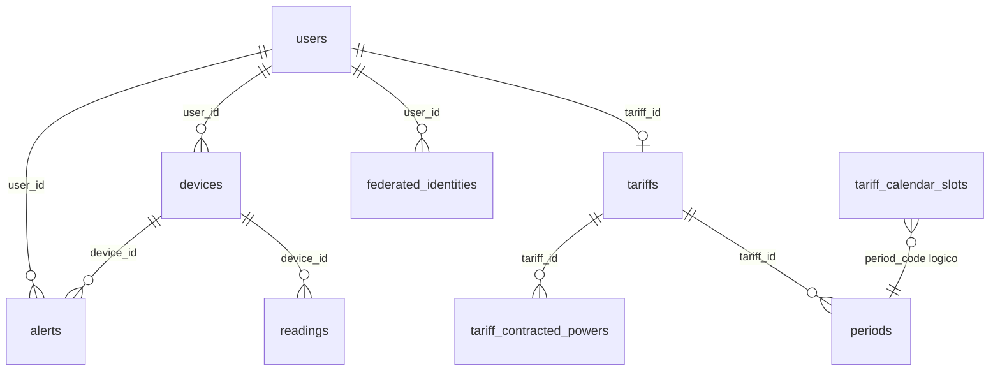
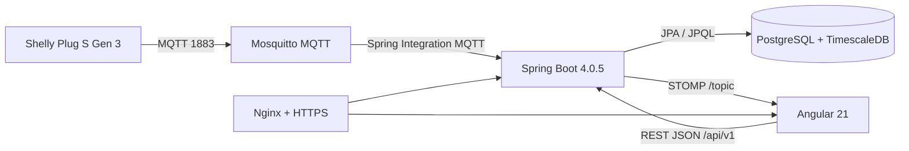
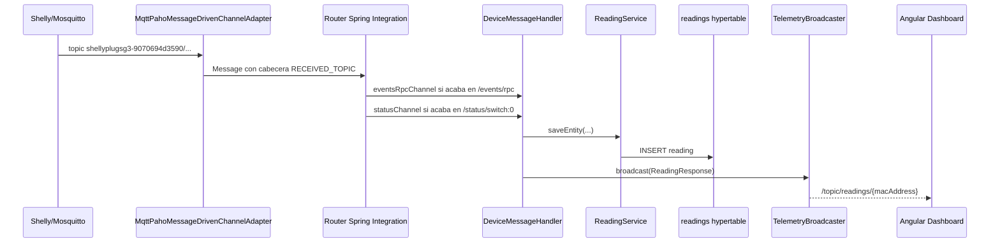
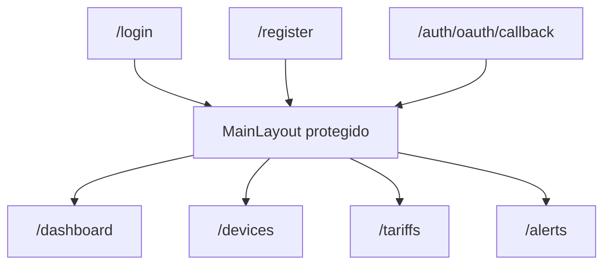

# Memoria tecnica del proyecto Wattimizer

> Documento generado a partir del codigo real del repositorio `joellmar/wattpath-app`, rama `cursor/documentaci-n-t-cnica-del-proyecto-e7ed`.
> El objetivo es servir como anexo tecnico para la memoria final del modulo de Proyecto Intermodular de DAW.

## Indice

1. [Introduccion y justificacion](#1-introduccion-y-justificacion)
2. [Fase 1: Analisis funcional](#2-fase-1-analisis-funcional)
3. [Fase 2: Diseno tecnico](#3-fase-2-diseno-tecnico)
4. [Fase 3: Implementacion y desarrollo](#4-fase-3-implementacion-y-desarrollo)
5. [Fase 4: Pruebas y despliegue](#5-fase-4-pruebas-y-despliegue)
6. [Conclusiones y lineas futuras](#6-conclusiones-y-lineas-futuras)
7. [Bibliografia y recursos](#7-bibliografia-y-recursos)

---

## 1. Introduccion y justificacion

### 1.1. Titulo del proyecto

**Wattimizer App**.

El repositorio define el proyecto como una **plataforma B2B de inteligencia financiera energetica**. La aplicacion conecta enchufes inteligentes tipo Shelly, recoge lecturas electricas en tiempo real y convierte el consumo en euros usando tarifas electricas configuradas por el usuario.

### 1.2. Descripcion del problema

Muchas pequenas empresas conocen el importe de su factura electrica cuando ya es tarde: al final del periodo de facturacion. El problema no es solo consumir energia, sino no saber **cuando**, **en que equipo** y **a que precio** se esta consumiendo.

Wattimizer intenta resolver esa falta de visibilidad. En vez de mostrar un dato tecnico aislado, como vatios o kWh, la aplicacion traduce la telemetria IoT a informacion economica: coste estimado del dia, consumo fantasma nocturno y alertas cuando la potencia activa supera la potencia contratada para el periodo correspondiente.

La decision de usar IoT, MQTT y TimescaleDB no es decorativa. El dominio del proyecto trabaja con series temporales: muchas lecturas pequenas, ordenadas por tiempo, consultadas por rangos y asociadas a un dispositivo concreto. Por eso la tabla `readings` se convierte en hypertable de TimescaleDB y se separa la tarifa contractual de la tabla regulatoria `tariff_calendar_slots`.

### 1.3. Objetivos

#### Objetivo general

Desarrollar una aplicacion web que permita a una empresa monitorizar el consumo electrico de sus dispositivos IoT y estimar el coste economico asociado segun su tarifa electrica.

#### Objetivos especificos

- Implementar una API REST segura con Spring Boot para autenticacion, dispositivos, lecturas, tarifas, analitica y alertas.
- Permitir login tradicional con JWT y login social mediante OAuth2, evitando exponer el JWT directamente en la URL.
- Registrar y vincular dispositivos IoT por direccion MAC.
- Ingerir telemetria MQTT de un Shelly Plug S Gen 3 mediante Spring Integration.
- Persistir lecturas electricas en PostgreSQL + TimescaleDB usando una hypertable temporal.
- Calcular coste energetico y consumo fantasma a partir del odometro `energyTotalKwh`.
- Resolver periodos tarifarios espanoles TD usando peaje de acceso, zona geografica, mes, tipo de dia y hora local.
- Construir un frontend Angular con estado reactivo mediante Signals, RxJS y NgRx Signals.
- Mostrar lecturas en tiempo real mediante WebSocket STOMP.
- Desplegar la aplicacion en un VPS Hetzner con Docker Compose, Nginx, HTTPS y GitHub Actions.

### 1.4. Tipos de usuarios

| Usuario | Uso principal | Evidencia en codigo |
|---|---|---|
| Usuario empresa (`ROLE_USER`) | Gestiona sus dispositivos, asigna una tarifa privada, consulta dashboard y alertas. | `UserEntity.role`, `authGuard`, `TariffComponent`, `DevicesComponent` |
| Administrador (`ROLE_ADMIN`) | Gestiona el catalogo maestro de tarifas y puede crear usuarios administradores con cabecera secreta. | `@PreAuthorize("hasRole('ADMIN')")` en `TariffController`; endpoint `/api/v1/auth/register/admin` |
| Dispositivo IoT | Publica telemetria MQTT hacia Mosquitto. No usa la UI. | Topic `shellyplugsg3-9070694d3590/#` en `MqttConfig` |
| Desarrollador/operador | Levanta el entorno, ejecuta scripts SQL, despliega y verifica logs. | `GUIA_DESPLIEGUE_LOCAL_WINDOWS.md`, `docs/deployment/hetzner-production.md`, `.github/workflows/deploy.yml` |

---

## 2. Fase 1: Analisis funcional

### 2.1. Mapa de funcionalidades

| Modulo | Funcionalidades implementadas |
|---|---|
| Autenticacion | Login con usuario/password, registro, registro admin con secreto, OAuth2 Google/GitHub con canje de ticket por JWT. |
| Dispositivos IoT | Listado por usuario, alta/vinculacion por MAC, renombrado, cambio de estado virtual, borrado. |
| Telemetria | Recepcion MQTT, guardado de lecturas, consulta de ultima lectura, busqueda por clave compuesta y emision WebSocket. |
| Dashboard | Grafica de potencia activa, selector de dispositivo, coste diario, consumo fantasma y aviso si falta tarifa. |
| Tarifas | Catalogo maestro, contrato privado de usuario, periodos P1-P6, potencias contratadas y validacion de orden ascendente. |
| Alertas | Generacion de alerta por exceso de potencia contratada, listado y borrado por usuario. |
| Analitica energetica | Calculo de coste del intervalo y coste fantasma 00:00-05:59 en hora local del contrato. |
| Despliegue | Contenedores para backend, frontend, TimescaleDB, Mosquitto y Nginx; CI/CD sobre `main`. |

### 2.2. Historias de usuario

| ID | Historia | Criterios de aceptacion | Prioridad |
|---|---|---|---|
| HU-01 | Como usuario, quiero registrarme e iniciar sesion para acceder a mi panel privado. | El registro crea un usuario activo; el login devuelve un JWT; las rutas privadas redirigen a `/login` si no hay sesion valida. | MVP |
| HU-02 | Como usuario, quiero iniciar sesion con Google o GitHub para no depender solo de password local. | El backend redirige al proveedor; tras el callback genera un ticket temporal; Angular canjea el ticket por JWT en `/api/v1/auth/oauth/exchange`. | MVP |
| HU-03 | Como usuario, quiero vincular un enchufe inteligente por MAC para monitorizarlo desde mi cuenta. | El formulario exige nombre y MAC de 12 caracteres hexadecimales; el backend asocia el dispositivo al `Principal`. | MVP |
| HU-04 | Como usuario, quiero ver lecturas en tiempo real para detectar picos de consumo. | El dashboard se suscribe a `/topic/readings/{macAddress}` y mantiene las ultimas 20 muestras de potencia. | MVP |
| HU-05 | Como usuario, quiero configurar mi tarifa electrica para ver el consumo expresado en euros. | El usuario puede asignar una plantilla o editar su contrato privado; el endpoint `/api/v1/users/me/tariff` no acepta `userId` externo. | MVP |
| HU-06 | Como usuario, quiero ver el coste diario y el consumo fantasma para detectar gastos evitables. | El dashboard llama a `/api/v1/analytics/cost` y `/api/v1/analytics/ghost-consumption` solo si existe tarifa. | MVP |
| HU-07 | Como usuario, quiero recibir alertas por exceso de potencia para saber si mi contrato se queda corto. | `AlertService.checkPowerThreshold` crea una alerta `OVERPOWER` y `TelemetryBroadcaster` la publica por STOMP. | MVP |
| HU-08 | Como administrador, quiero mantener un catalogo de tarifas para facilitar la configuracion a los usuarios. | Solo `ROLE_ADMIN` puede crear, actualizar o borrar tarifas en `/api/v1/tariffs`. | MVP |
| HU-09 | Como usuario, quiero borrar alertas revisadas para mantener limpio mi panel. | `DELETE /api/v1/alerts/{id}` solo borra si la alerta pertenece al usuario autenticado. | Opcional |
| HU-10 | Como desarrollador, quiero desplegar automaticamente al hacer push a `main`. | GitHub Actions compila frontend y backend antes de ejecutar despliegue SSH en Hetzner. | MVP |

### 2.3. Gestion del trabajo

- **Repositorio:** <https://github.com/joellmar/wattpath-app>
- **Rama actual de documentacion:** `cursor/documentaci-n-t-cnica-del-proyecto-e7ed`
- **Base de desarrollo:** `main`
- **Evidencia de commits recientes analizados:**
  - `docs(deployment): update Hetzner guide with all fixes found during real deployment`
  - `fix(ci): add execute permission to mvnw for GitHub Actions`
  - `fix(config): rename GITHUB_CLIENT_* to GH_OAUTH_CLIENT_* to avoid GitHub Actions reserved prefix`
  - `fix(security): add /api/v1/auth/register/admin to permitAll so X-Admin-Key filter can evaluate it`
  - `fix(nginx): add Docker internal DNS resolver to prevent stale upstream IP cache`
  - `fix(config): replace invalid log_level with log_type in mosquitto.conf and add OAuth2 empty-value fallbacks in compose`
  - `fix(sql): make tariffs schema script transactionally safe and table-existence-aware`

La captura del tablero Kanban no esta versionada en el repositorio. Para la memoria final conviene insertar una captura externa con las columnas usadas en clase: **Backlog**, **Por hacer**, **En progreso**, **En revision** y **Hecho**.

### 2.4. Planificacion inicial

| Fase | Historias asociadas | Dificultad tecnica |
|---|---|---|
| Analisis y modelo | HU-03, HU-05, HU-06 | Alta: se tenia que separar telemetria, contratos y calendario regulatorio. |
| Backend base | HU-01, HU-08 | Media: API REST, JPA, seguridad y DTOs. |
| IoT y datos temporales | HU-03, HU-04, HU-07 | Alta: MQTT, Spring Integration, WebSocket y TimescaleDB. |
| Frontend | HU-04, HU-05, HU-06, HU-09 | Media-alta: Angular standalone, stores reactivos y formularios tipados. |
| Despliegue | HU-10 | Alta: VPS, HTTPS, Nginx, Docker Compose, secretos y CI/CD. |

---

## 3. Fase 2: Diseno tecnico

### 3.1. Diseno de la base de datos

#### Diagrama E/R simplificado



#### Modelo relacional

| Tabla | Entidad | Clave primaria | Relaciones y campos principales |
|---|---|---|---|
| `users` | `UserEntity` | `id` | `tariff_id` nullable hacia `tariffs`; `username` unico; `password`; `role`; `active`; auditoria heredada de `BaseEntity`. |
| `devices` | `Device` | `id` | `user_id` nullable hacia `users`; `name`; `mac_address` unico; `is_on`; `is_simulated`. |
| `readings` | `Reading` | compuesta: `time` + `device_id` | `device_id` hacia `devices`; `power_w`; `energy_total_kwh`; `is_on`. Convertida a hypertable por `time`. |
| `tariffs` | `Tariff` | `id` | `name`; `market`; `access_tariff_code`; `geographic_zone`; `energy_company`. |
| `periods` | `Period` | `id` | `tariff_id`; `period_code`; `price_kwh`; indice unico `(tariff_id, period_code)`. |
| `tariff_contracted_powers` | `TariffContractedPower` | `id` | `tariff_id`; `period_code`; `contracted_power_kw`; indice unico por tarifa y periodo. |
| `tariff_calendar_slots` | `TariffCalendarSlot` | `id` | Dimension regulatoria global: peaje, zona, mes, temporada, tipo de dia, periodo y tramo horario. |
| `alerts` | `Alert` | `id` | `user_id`; `device_id`; `type`; `message`; auditoria temporal. |
| `federated_identities` | `FederatedIdentity` | `id` | Identidades OAuth2 asociadas a usuario. |

#### Hypertable de TimescaleDB

Hibernate crea la tabla `readings` como tabla PostgreSQL normal. Despues se ejecuta:

```sql
-- backend/src/main/resources/db/dev-seed/01-hypertable.sql
SELECT create_hypertable('readings', 'time');
```

La razon es que `readings` almacena series temporales. TimescaleDB particiona internamente por tiempo y permite que las consultas por intervalo no dependan de una tabla monolitica. El script exige que la tabla este vacia; si ya hay datos, el propio fichero deja comentada la variante con `migrate_data => true`.

#### Scripts SQL de soporte

| Archivo | Funcion |
|---|---|
| `db/dev-seed/00-extensions.sql` | Activa `timescaledb` y `pgcrypto`. |
| `db/dev-seed/01-hypertable.sql` | Convierte `readings` en hypertable. |
| `db/tariffs-td-schema.sql` | Anade constraints e indices que Hibernate no expresa bien: peajes, zonas, periodos, potencias positivas e indice de busqueda de calendario. |
| `db/seed-tariff-calendar-slots.sql` | Carga 336 filas para peajes `2.0TD` y `3.0TD` en `PENINSULA` e `ISLAS_BALEARES`. |
| `db/prod/99-resync-sequences.sql` | Resincroniza secuencias tras cargas manuales. |

### 3.2. Arquitectura del sistema

#### Vista general



#### Backend

- **Lenguaje:** Java 26.
- **Framework:** Spring Boot 4.0.5.
- **Persistencia:** Spring Data JPA con PostgreSQL.
- **Seguridad:** Spring Security, JWT, OAuth2 Client y filtro propio `JwtValidatorFilter`.
- **Mensajeria IoT:** Spring Integration MQTT + Eclipse Paho.
- **Tiempo real:** WebSocket STOMP con `SimpMessagingTemplate`.

#### Frontend

- **Framework:** Angular 21 standalone.
- **UI:** PrimeNG 21, Tailwind CSS 4, Chart.js.
- **Estado:** Angular Signals y `@ngrx/signals`; no hay reducers/actions/effects de NgRx clasico.
- **Tiempo real:** `@stomp/rx-stomp`.

#### Comunicacion

- REST JSON para operaciones de negocio bajo `/api/v1`.
- STOMP sobre WebSocket en `/ws-iot` para lecturas en tiempo real.
- MQTT entre el dispositivo fisico y el backend, pasando por Mosquitto.

### 3.3. Diseno de interfaz

Los wireframes no estan guardados como imagenes en el repositorio, pero las rutas y componentes actuales definen estas pantallas:

| Pantalla | Ruta | Componente | Funcion en la UX |
|---|---|---|---|
| Login | `/login` | `LoginComponent` | Entrada con email/password y accesos OAuth2. |
| Registro | `/register` | `RegisterComponent` | Alta de usuario normal con validacion de passwords. |
| Callback OAuth | `/auth/oauth/callback` | `OAuthCallbackComponent` | Canjea ticket temporal por JWT. |
| Layout principal | `/` | `MainLayoutComponent` | Menu lateral, usuario activo y logout. |
| Dashboard | `/dashboard` | `DashboardComponent` | Grafica de potencia, selector de dispositivo y tarjetas de coste. |
| Dispositivos | `/devices` | `DevicesComponent` | Vinculacion por MAC, tabla, dialogo de detalle y edicion de nombre. |
| Tarifas | `/tariffs` | `TariffComponent` | Catalogo, contrato privado y formulario de periodos/potencias. |
| Alertas | `/alerts` | `AlertsComponent` | Listado de alertas y borrado individual. |

### 3.4. Relacion entre historias y diseno

| Historia | Tabla principal | Backend | Frontend |
|---|---|---|---|
| HU-01 | `users` | `AuthController`, `UserProviderDetailsManager`, `JwtTokenService` | `LoginComponent`, `RegisterComponent`, `SessionStorageService`, `authGuard` |
| HU-02 | `users`, `federated_identities` | `OAuth2AuthenticationSuccessHandler`, `OAuth2LoginTicketService` | `OAuthCallbackComponent`, `AuthService.exchangeOAuthTicket` |
| HU-03 | `devices` | `DeviceController`, `DeviceService` | `DevicesComponent`, `TelemetryStore.loadDevices` |
| HU-04 | `readings` | `MqttConfig`, `DeviceMessageHandler`, `TelemetryBroadcaster` | `WebsocketService`, `TelemetryStore.connectTelemetry`, `DashboardComponent` |
| HU-05 | `tariffs`, `periods`, `tariff_contracted_powers`, `users.tariff_id` | `TariffController`, `UserTariffController`, `UserTariffService` | `TariffComponent`, `TariffStore`, `TariffService` |
| HU-06 | `readings`, `tariff_calendar_slots`, `periods` | `ConsumptionController`, `ConsumptionService`, `CalendarResolverService` | `DashboardComponent` |
| HU-07 | `alerts`, `devices`, `tariff_contracted_powers` | `AlertService`, `TelemetryBroadcaster` | `AlertsComponent` |
| HU-08 | `tariffs` | `TariffController` con `@PreAuthorize` | `TariffComponent` con `isAdmin` |
| HU-10 | infraestructura | `.github/workflows/deploy.yml`, `docker-compose.yml`, `nginx/default.conf` | Build Angular en Docker/Nginx |

---

## 4. Fase 3: Implementacion y desarrollo

### 4.1. Tecnologias utilizadas

| Area | Tecnologia |
|---|---|
| Backend | Java 26, Spring Boot 4.0.5, Spring Web MVC, Spring Security, Spring Data JPA |
| Seguridad | JWT (`jjwt` 0.12.5), OAuth2 Client, BCrypt a traves de Spring Security |
| MQTT | Spring Integration MQTT, Eclipse Paho, Mosquitto 2.1.2 |
| Base de datos | PostgreSQL con imagen `timescale/timescaledb-ha:pg17` |
| Frontend | Angular 21, TypeScript 5.9, RxJS 7.8, NgRx Signals 21 |
| UI | PrimeNG 21, Tailwind CSS 4, Chart.js |
| Testing | JUnit 5, Mockito, AssertJ, Angular TestBed, Vitest/jsdom |
| Despliegue | Docker Compose, Nginx, Certbot, GitHub Actions, Hetzner VPS |

### 4.2. Desarrollo del backend

#### 4.2.1. Seguridad y autenticacion

`SecurityConfig` configura una aplicacion stateless:

- Sesiones HTTP desactivadas mediante `SessionCreationPolicy.STATELESS`.
- CSRF desactivado porque el backend no usa sesion de navegador.
- CORS configurable con `app.cors.allowed-origins`.
- Filtro `JwtValidatorFilter` antes de `BasicAuthenticationFilter`.
- Rutas publicas:
  - `/api/v1/auth/login`
  - `/api/v1/auth/register`
  - `/api/v1/auth/register/admin`
  - `/api/v1/auth/oauth/exchange`
  - `/oauth2/authorization/**`
  - `/login/oauth2/code/**`
  - `/ws-iot/**`

La inclusion de `/api/v1/auth/register/admin` como publica es un cambio reciente importante. No significa que cualquiera pueda crear administradores: el endpoint exige la cabecera `X-Wattimizer-Admin-Secret`. La razon tecnica es dejar pasar la peticion por seguridad HTTP para que sea el propio controlador quien valide el secreto.

#### 4.2.2. Controladores REST y DTOs

##### Autenticacion: `AuthController`

Base path: `/api/v1/auth`.

| Metodo | Endpoint | Entrada | Salida | Descripcion |
|---|---|---|---|---|
| `POST` | `/login` | `LoginUser` | `LoginUserJwt` | Autentica credenciales y devuelve JWT. |
| `POST` | `/register` | `RegisterRequest` | `201 Created` sin cuerpo | Registra usuario normal. |
| `POST` | `/register/admin` | `RegisterRequest` + header `X-Wattimizer-Admin-Secret` | `201 Created` sin cuerpo | Registra administrador si el secreto coincide. |
| `POST` | `/oauth/exchange` | `OAuthTicketExchangeRequest` | `LoginUserJwt` | Canjea ticket OAuth2 de un solo uso por JWT. |

DTOs:

```java
public record LoginUser(String username, String password) {}
public record LoginUserJwt(String statusCode, String jwt) {}
public record RegisterRequest(String username, String password, String confirmPassword, Long tariffId) {}
public record OAuthTicketExchangeRequest(String ticket) {}
```

##### Dispositivos: `DeviceController`

Base path: `/api/v1/devices`.

| Metodo | Endpoint | Parametros | Body | Salida |
|---|---|---|---|---|
| `GET` | `/` | `Principal` | - | `List<DeviceDto>` |
| `GET` | `/{id}` | `id`, `Principal` | - | `DeviceDto` o `403` |
| `POST` | `/` | - | `DeviceDto` | `201 DeviceDto` |
| `POST` | `/claim` | `Principal` | `DeviceDto` con `macAddress` y `name` | `DeviceDto` |
| `PUT` | `/{id}` | `id`, `Principal` | `DeviceDto` | `DeviceDto` |
| `DELETE` | `/{id}` | `id`, `Principal` | - | `204 No Content` o `403` |

DTO:

```java
public record DeviceDto(
    Long id,
    String username,
    String name,
    String macAddress,
    Boolean isOn,
    Boolean simulated
) {}
```

La propiedad se comprueba comparando `device.username()` con `principal.getName()` en lectura y borrado. En actualizacion se delega a `DeviceService.updateDevice`.

##### Lecturas: `ReadingController`

Base path: `/api/v1/readings`.

| Metodo | Endpoint | Parametros | Salida |
|---|---|---|---|
| `GET` | `/` | `Principal` | `List<ReadingResponse>` del usuario |
| `GET` | `/latest/{macAddress}` | `macAddress`, `Principal` | Ultima lectura del dispositivo |
| `GET` | `/search` | `time` ISO-8601, `macAddress`, `Principal` | Lectura por clave compuesta |
| `DELETE` | `/search` | `time` ISO-8601, `macAddress`, `Principal` | Borrado por clave compuesta |

DTO de salida:

```java
public record ReadingResponse(
    Instant time,
    String macAddress,
    BigDecimal powerW,
    BigDecimal energyTotalKwh,
    Boolean isOn
) {}
```

##### Analitica: `ConsumptionController`

Base path: `/api/v1/analytics`.

| Metodo | Endpoint | Query params | Salida |
|---|---|---|---|
| `GET` | `/cost` | `macAddress`, `start`, `end` | `macAddress`, `totalCostEur`, `start`, `end` |
| `GET` | `/ghost-consumption` | `macAddress`, `start`, `end` | `macAddress`, `ghostCostEur`, `start`, `end` |

Ambos endpoints validan que la MAC pertenece al usuario autenticado. El resultado se devuelve como `Map<String, Object>`, no como DTO especifico.

##### Tarifas de catalogo: `TariffController`

Base path: `/api/v1/tariffs`.

| Metodo | Endpoint | Rol | Entrada | Salida |
|---|---|---|---|---|
| `GET` | `/` | Usuario autenticado | - | `List<TariffDto>` |
| `GET` | `/{id}` | Usuario autenticado | - | `TariffDto` |
| `POST` | `/` | `ROLE_ADMIN` | `TariffDto` | `201 TariffDto` |
| `POST` | `/{id}` | `ROLE_ADMIN` | `TariffDto` | `TariffDto` actualizado |
| `DELETE` | `/{id}` | `ROLE_ADMIN` | - | `204 No Content` |

DTO principal:

```java
public record TariffDto(
    Long id,
    String name,
    String market,
    String accessTariffCode,
    String geographicZone,
    String energyCompany,
    List<PeriodDto> periods,
    List<TariffContractedPowerDto> contractedPowers
) {}
```

Sub-DTOs:

```java
public record PeriodDto(Long id, String periodCode, BigDecimal priceKwh) {}
public record TariffContractedPowerDto(Long id, String periodCode, BigDecimal contractedPowerKw) {}
```

##### Tarifa privada del usuario: `UserTariffController`

Base path: `/api/v1/users/me/tariff`.

| Metodo | Endpoint | Entrada | Salida |
|---|---|---|---|
| `GET` | `/` | `Principal` | `200 TariffDto` o `204 No Content` |
| `POST` | `/` | `UserTariffRequest` | `200 TariffDto` |
| `DELETE` | `/` | `Principal` | `204 No Content` |

El diseno evita IDOR: no se acepta `userId` ni en ruta ni en body. El usuario propietario se obtiene del JWT.

```java
public record UserTariffRequest(Long templateTariffId, TariffDto contract) {}
```

Modos de uso reales:

- Solo `templateTariffId`: clonar plantilla.
- `templateTariffId` + `contract`: clonar y aplicar cambios.
- Solo `contract`: crear o actualizar contrato privado directamente.

##### Alertas: `AlertController`

Base path: `/api/v1/alerts`.

| Metodo | Endpoint | Salida |
|---|---|---|
| `GET` | `/` | `List<AlertDto>` del usuario autenticado |
| `DELETE` | `/{id}` | `204 No Content`; si no pertenece al usuario, `EntityNotFoundException` |

DTO:

```java
public record AlertDto(
    Long id,
    String macAddress,
    String username,
    String type,
    String message,
    LocalDateTime createdAt
) {}
```

#### 4.2.3. Gestion de errores

`GlobalExceptionHandler` devuelve un `ErrorResponse` con:

- `status`
- `error`
- `message`
- `timestamp`

Casos controlados:

| Excepcion | HTTP | Uso |
|---|---|---|
| `EntityNotFoundException` | 404 | Recursos inexistentes o no autorizados tratados como no encontrados. |
| `BadCredentialsException` | 401 | Login incorrecto. |
| `IllegalStateException` | 400 | Reglas de negocio. |
| `UsernameNotFoundException` | 401 | Usuario no localizado por seguridad. |
| `ForbiddenException` | 403 | Registro admin con secreto incorrecto. |
| `DataIntegrityViolationException` | 400 o 500 | Usuario duplicado u otro error de integridad. |
| `Exception` | 500 | Error interno generico. |

#### 4.2.4. Ingesta de telemetria MQTT con Spring Integration

La ingesta esta en `MqttConfig` y `DeviceMessageHandler`.

Configuracion principal:

- Broker definido por `mqtt.url`.
- Usuario y password definidos por `mqtt.username` y `mqtt.password`.
- Cliente MQTT: `backend-spring-iot`.
- Topic suscrito: `shellyplugsg3-9070694d3590/#`.
- QoS: `1`.
- Reconexion automatica: activada.

Flujo:



Ruteo real:

```java
// La decision se toma mirando el topic recibido.
// Asi se separan mensajes completos de eventos y mensajes de estado del interruptor.
if (topic != null && topic.endsWith("/events/rpc")) return "EVENTS";
if (topic != null && topic.endsWith("/status/switch:0")) return "STATUS";
return "IGNORE";
```

DTOs MQTT:

| DTO | Campos | Funcion |
|---|---|---|
| `EventsRpc` | `source`, `params` | Mensaje de eventos RPC del Shelly. |
| `Params` | `timestamp`, `switchData` | Agrupa timestamp y datos de `switch:0`. |
| `Switch` | `activeEnergy`, `activePower` | Lectura de energia acumulada y potencia activa. |
| `Status` | `output`, `activePower`, `activeEnergy` | Estado del interruptor y mediciones. |
| `ActiveEnergy` | `total` | Energia acumulada en Wh antes de convertir a kWh. |

`DeviceMessageHandler` tiene dos `@ServiceActivator`:

- `handleEventsRpc`: transforma el payload, guarda la lectura, emite por WebSocket y comprueba alertas.
- `handleStatus`: extrae la MAC desde el topic, busca el dispositivo, asigna `Instant.now()` y sigue el mismo flujo.

Decision importante: si llega un `EventsRpc` de una MAC no registrada, `ReadingService.saveEntity(EventsRpc)` crea un `Device` con nombre `"Nuevo Enchufe " + macAddress`. Esto permite no perder telemetria aunque el alta administrativa se haga despues.

#### 4.2.5. Consultas analiticas sobre `readings` y calendario TD

La analitica no usa SQL nativo ni `time_bucket`. El repositorio usa JPQL sobre la entidad `Reading`, y esa entidad apunta a una tabla que en base de datos es hypertable.

Consulta principal de lecturas por intervalo:

```java
@Query("SELECT r FROM Reading r WHERE r.device.macAddress = :macAddress " +
       "AND r.time >= :start AND r.time <= :end ORDER BY r.time ASC")
List<Reading> findReadingsInInterval(
    @Param("macAddress") String macAddress,
    @Param("start") Instant start,
    @Param("end") Instant end
);
```

Esta consulta alimenta:

- `ConsumptionService.calculateCostInPeriod`
- `ConsumptionService.calculateGhostCost`

Algoritmo de coste:

1. Recuperar lecturas ordenadas por tiempo.
2. Si hay menos de dos lecturas, devolver `0`.
3. Localizar dispositivo, usuario y tarifa.
4. Para cada par consecutivo, calcular `deltaKwh = current.energyTotalKwh - previous.energyTotalKwh`.
5. Ignorar deltas nulos o negativos, porque pueden indicar reinicio del odometro.
6. Resolver el periodo tarifario aplicable en `current.time`.
7. Multiplicar `deltaKwh * priceKwh`.
8. Redondear a dos decimales con `HALF_UP`.

El consumo fantasma reutiliza el mismo calculo, pero solo suma lecturas cuya hora local este entre `00:00` y `05:59`.

Resolucion de periodo:

```java
@Query("""
        SELECT cs.periodCode FROM TariffCalendarSlot cs
        WHERE cs.accessTariffCode = :accessTariffCode
          AND cs.geographicZone   = :zone
          AND cs.monthNumber      = :month
          AND cs.dayType          = :dayType
          AND (
                (cs.startTime <> cs.endTime AND cs.startTime <= :localTime AND cs.endTime > :localTime)
                OR
                (cs.startTime = cs.endTime AND cs.dayType = 'D')
                OR (cs.endTime = :endOfDay AND :localTime >= cs.startTime)
              )
        """)
Optional<String> findPeriodCode(...);
```

Firma real del metodo:

```java
Optional<String> findPeriodCode(
    @Param("accessTariffCode") String accessTariffCode,
    @Param("zone") String zone,
    @Param("month") int month,
    @Param("dayType") String dayType,
    @Param("localTime") LocalTime localTime,
    @Param("endOfDay") LocalTime endOfDay
);
```

Consulta auxiliar de tipo de dia laborable:

```java
@Query("""
        SELECT DISTINCT cs.dayType FROM TariffCalendarSlot cs
        WHERE cs.accessTariffCode = :accessTariffCode
          AND cs.geographicZone   = :zone
          AND cs.monthNumber      = :month
          AND cs.dayType          <> 'D'
        """)
Optional<String> findWorkdayType(...);
```

Firma real del metodo:

```java
Optional<String> findWorkdayType(
    @Param("accessTariffCode") String accessTariffCode,
    @Param("zone") String zone,
    @Param("month") int month
);
```

Limitaciones reales:

- El seed cubre `PENINSULA` e `ISLAS_BALEARES` para `2.0TD` y `3.0TD`.
- Si falta calendario para una zona o peaje, el backend no rompe la peticion: devuelve coste `0`.
- No existen agregados continuos ni consultas TimescaleDB avanzadas versionadas en el repositorio.

### 4.3. Desarrollo del frontend

#### 4.3.1. Rutas Angular

`app.routes.ts` define rutas standalone cargadas de forma lazy:



El `authGuard` valida `SessionStorageService.isLoggedIn()`. Si no hay JWT o esta caducado, devuelve `UrlTree` hacia `/login`.

#### 4.3.2. Interceptor HTTP

`httpInterceptor` anade:

- `X-Requested-With: XMLHttpRequest` a todas las peticiones.
- `Authorization: Bearer <token>` a rutas `/api/v1`, excepto:
  - `/api/v1/auth/login`
  - `/api/v1/auth/register`
  - `/api/v1/auth/oauth/exchange`

En caso de `401`, limpia la sesion y navega a `/login`.

#### 4.3.3. Stores con NgRx Signals

El proyecto usa `@ngrx/signals`, no NgRx clasico.

##### `TelemetryStore`

Estado:

```ts
interface TelemetryState {
  devices: Device[];
  selectedMac: string | null;
  historicalReadings: {
    [mac: string]: {
      timestamps: number[];
      powerW: number[];
    };
  };
  isLoadingDevices: boolean;
}
```

Metodos principales:

| Metodo | Tipo | Funcion |
|---|---|---|
| `setSelectedMac` | sincrono | Cambia el dispositivo seleccionado. |
| `loadDevices` | `rxMethod` | `GET /api/v1/devices`; selecciona la primera MAC si no habia una previa. |
| `claimDevice` | `rxMethod` | `POST /api/v1/devices/claim`; definido en store aunque la pantalla usa HTTP directo. |
| `addDevice` | `rxMethod` | `POST /api/v1/devices`; no usado por la UI actual. |
| `updateDevice` | `rxMethod` | `PUT /api/v1/devices/{id}`. |
| `deleteDevice` | `rxMethod` | `DELETE /api/v1/devices/{id}`. |
| `connectTelemetry` | `rxMethod` | Suscribe al WebSocket de la MAC seleccionada. |
| `reset` | sincrono | Limpia estado al cerrar sesion. |

La parte mas importante es `connectTelemetry`:

- `distinctUntilChanged()` evita reconectar si la MAC no cambia.
- `switchMap()` cancela la suscripcion anterior cuando el usuario cambia de dispositivo.
- `filter()` descarta lecturas sin `powerW`.
- Otro `distinctUntilChanged()` deduplica por `time`.
- El historial conserva solo 20 puntos para no hacer crecer la grafica indefinidamente.

##### `TariffStore`

Estado:

- `catalog`
- `myTariff`
- `isLoadingCatalog`
- `isLoadingMyTariff`
- `errorMessage`

Metodos:

| Metodo | Funcion |
|---|---|
| `loadCatalog` | Carga plantillas globales desde `/api/v1/tariffs`. |
| `loadMyTariff` | Carga la tarifa privada; mapea `204` a `null`. |
| `saveMyTariff` | Guarda contrato privado. |
| `unlinkMyTariff` | Desvincula contrato privado. |
| `refreshAfterCatalogMutation` | Recarga catalogo tras cambios admin. |
| `setCatalogTariff`, `addToCatalog`, `removeFromCatalog`, `patchMyTariff` | Helpers sincronos para actualizar UI sin recargar siempre. |

#### 4.3.4. Componentes principales

| Componente | Responsabilidad tecnica |
|---|---|
| `DashboardComponent` | Carga dispositivos y tarifa, conecta WebSocket, prepara grafica Chart.js y solicita analiticas HTTP del dia actual. |
| `DevicesComponent` | Formulario reactivo para vincular MAC, dialogos de detalle/edicion y llamadas HTTP directas a dispositivos. |
| `TariffComponent` | Formulario reactivo con `FormArray` para periodos y potencias; distingue modo admin y modo contrato privado. |
| `AlertsComponent` | Lista alertas por REST y permite borrarlas. |
| `MainLayoutComponent` | Shell autenticado; en logout desconecta telemetria, resetea stores y borra JWT. |
| `OAuthCallbackComponent` | Lee `ticket` de la URL y lo canjea por JWT. |

#### 4.3.5. Formularios y validacion

| Pantalla | Validaciones |
|---|---|
| Login | Email requerido y password con longitud minima. |
| Registro | Password y confirmacion deben coincidir. |
| Dispositivos | Nombre minimo de 3 caracteres; MAC con regex `^[0-9A-Fa-f]{12}$`. |
| Tarifas | Nombre requerido; peaje y zona requeridos; precios positivos; potencias contratadas positivas y ascendentes. |

La validacion `ascendingPowerValidator` fuerza que la potencia contratada no baje al avanzar de P1 a P6. Es una regla de negocio aplicada en UI para evitar enviar contratos incoherentes.

### 4.4. Control de versiones

El flujo del repositorio se apoya en `main` como rama desplegable. La automatizacion de GitHub Actions solo se ejecuta en `push` a `main`, no en pull requests. Esto evita despliegues accidentales de ramas no revisadas.

Los commits recientes muestran trabajo sobre:

- CI/CD y permisos del wrapper Maven.
- Compatibilidad con secretos de GitHub Actions (`GH_OAUTH_*`).
- Seguridad del registro admin.
- Nginx con resolver DNS interno de Docker para evitar cache de IPs obsoletas.
- Correcciones en configuracion de Mosquitto.
- Scripts SQL idempotentes y mas seguros para produccion.

---

## 5. Fase 4: Pruebas y despliegue

### 5.1. Plan de pruebas

| Prueba | Tipo | Evidencia | Resultado esperado |
|---|---|---|---|
| Calculo de consumo fantasma en peninsula | Unit backend | `ConsumptionServiceTest` | Una lectura entre 00:00 y 05:59 hora Madrid suma coste. |
| Calculo de consumo fantasma fuera de ventana | Unit backend | `ConsumptionServiceTest` | Una lectura fuera de 00:00-05:59 devuelve `0`. |
| Caso Canarias | Unit backend | `ConsumptionServiceTest` | Un `Instant` que es medianoche en Madrid pero 23:30 en Canarias no cuenta como fantasma. |
| Delta negativo de odometro | Unit backend | `ConsumptionServiceTest` | Si `energyTotalKwh` baja, el paso se ignora. |
| Tarifa en dashboard | Unit frontend | `dashboard.component.spec.ts` | `hasMyTariff` cambia segun el store mockeado. |
| Dashboard sin tarifa | Unit frontend | `dashboard.component.spec.ts` | Costes arrancan como `null` y aparece CTA de configuracion. |
| Build frontend | CI | `.github/workflows/deploy.yml` | `npm run build -- --configuration=production`. |
| Package backend | CI | `.github/workflows/deploy.yml` | `./mvnw -DskipTests clean package`. |
| Verificacion despliegue | Manual/operativa | `docs/deployment/hetzner-production.md` | `curl -I https://wattimizer.com` devuelve respuesta HTTPS; login incorrecto devuelve codigo esperado de API activa. |

### 5.2. Manual de instalacion y uso tecnico

#### Entorno local recomendado

La guia completa esta en `GUIA_DESPLIEGUE_LOCAL_WINDOWS.md`. El resumen tecnico es:

1. Clonar el repositorio.
2. Crear `.env` con credenciales de base de datos y MQTT.
3. Levantar infraestructura:

```bash
docker compose --env-file .env up -d timescaledb mosquitto
```

4. Arrancar backend Spring Boot en local.
5. Ejecutar scripts SQL en orden:

```sql
-- 1. Extensiones
\i backend/src/main/resources/db/dev-seed/00-extensions.sql

-- 2. Hypertable readings
\i backend/src/main/resources/db/dev-seed/01-hypertable.sql

-- 3. Constraints e indices de tarifas
\i backend/src/main/resources/db/tariffs-td-schema.sql

-- 4. Calendario regulatorio
\i backend/src/main/resources/db/seed-tariff-calendar-slots.sql
```

6. Arrancar Angular:

```bash
cd frontend
npm install
npm start
```

7. Entrar en `http://localhost:4200`.

#### Uso basico de la aplicacion

1. Registrarse o iniciar sesion.
2. Vincular un dispositivo desde `/devices` usando nombre y MAC.
3. Configurar una tarifa desde `/tariffs`.
4. Volver al dashboard para ver potencia, coste diario y consumo fantasma.
5. Revisar alertas desde `/alerts`.

### 5.3. Despliegue

El despliegue de produccion esta documentado en `docs/deployment/hetzner-production.md`.

#### Entorno

| Elemento | Configuracion |
|---|---|
| VPS | Hetzner, Ubuntu 24.04 LTS |
| Dominio | `wattimizer.com`, `www.wattimizer.com`, `api.wattimizer.com` |
| Proxy | Nginx con HTTPS y certificados de Certbot |
| Contenedores | `timescaledb`, `mosquitto`, `backend`, `frontend`, `nginx` |
| Base de datos | `timescale/timescaledb-ha:pg17` |
| Broker MQTT | `eclipse-mosquitto:2.1.2-alpine` |

#### Docker Compose

`docker-compose.yml` mantiene la base de datos sin puerto expuesto al host, expone MQTT `1883` para el Shelly fisico y deja backend/frontend accesibles solo a traves de Nginx.

Decision documentada en el compose: MQTT va por `1883` en texto plano y queda marcada como deuda de seguridad. La mejora prevista es TLS en `8883` o VPN cuando el hardware lo permita.

#### Nginx

`nginx/default.conf`:

- Redirige HTTP a HTTPS.
- Sirve Angular desde el contenedor frontend.
- Proxya `/api/`, `/oauth2/`, `/login/oauth2/` y `/ws-iot`.
- Usa `resolver 127.0.0.11 valid=30s` para que Nginx refresque IPs internas de Docker cuando cambian contenedores.
- Configura upgrade WebSocket y `proxy_read_timeout 86400`.

#### CI/CD

`.github/workflows/deploy.yml` tiene tres jobs:

1. `validate-frontend`: instala dependencias y compila Angular en produccion.
2. `validate-backend`: empaqueta Spring Boot con Maven.
3. `deploy`: por SSH al VPS, hace `git fetch origin main`, `git reset --hard origin/main`, regenera `.env` con secretos y ejecuta `docker compose --env-file .env up -d --build`.

---

## 6. Conclusiones y lineas futuras

### 6.1. Grado de cumplimiento

El MVP tecnico esta cubierto:

- Autenticacion JWT y OAuth2.
- CRUD principal de dispositivos.
- Catalogo y tarifa privada.
- Ingesta MQTT y simulacion IoT.
- Persistencia de lecturas en TimescaleDB.
- Dashboard con telemetria en tiempo real y analitica economica.
- Alertas por potencia.
- Despliegue productivo con Docker, Nginx y GitHub Actions.

### 6.2. Dificultades tecnicas encontradas

| Dificultad | Solucion aplicada |
|---|---|
| Representar datos temporales de telemetria | Uso de TimescaleDB e hypertable `readings` particionada por `time`. |
| Resolver tarifas TD sin meter horarios dentro del contrato | Separacion entre `periods` contractuales y `tariff_calendar_slots` regulatorios. |
| Evitar que OAuth2 exponga JWT en URL | Ticket temporal de un solo uso y endpoint `/oauth/exchange`. |
| Mantener WebSocket funcionando tras proxy | Nginx con cabeceras `Upgrade`, timeouts altos y endpoint `/ws-iot`. |
| Despliegues con IP interna Docker cambiante | Resolver DNS interno `127.0.0.11` en Nginx. |
| GitHub Actions no permite prefijo `GITHUB_` para secretos propios | Variables renombradas a `GH_OAUTH_CLIENT_ID` y `GH_OAUTH_CLIENT_SECRET`. |
| Calculo de fantasma en Canarias | Delegar zona horaria a `CalendarResolverService` y cubrirlo con tests unitarios. |

### 6.3. Mejoras futuras

- Autenticar el canal STOMP para que la suscripcion a `/topic/readings/{mac}` tambien valide propiedad del dispositivo.
- Parametrizar el topic MQTT en configuracion, porque ahora esta fijado a `shellyplugsg3-9070694d3590/#`.
- Ampliar `seed-tariff-calendar-slots.sql` a `CANARIAS`, `CEUTA`, `MELILLA`, `6.1TD` y `6.2TD`.
- Sustituir `ddl-auto=update` por migraciones controladas cuando el esquema quede estable.
- Usar consultas agregadas de TimescaleDB (`time_bucket`) para historicos de largo plazo.
- Consumir en Angular `/topic/alerts/{username}` para mostrar alertas instantaneas sin refrescar por REST.
- Unificar el CRUD de dispositivos: ahora `TelemetryStore` tiene metodos, pero `DevicesComponent` usa `HttpClient` directo.
- Migrar MQTT a TLS o protegerlo por VPN.

---

## 7. Bibliografia y recursos

- Documentacion oficial de Spring Boot: <https://spring.io/projects/spring-boot>
- Documentacion oficial de Spring Security: <https://spring.io/projects/spring-security>
- Documentacion de Spring Integration MQTT: <https://docs.spring.io/spring-integration/reference/mqtt.html>
- Documentacion de Angular: <https://angular.dev/>
- Documentacion de NgRx Signals: <https://ngrx.io/guide/signals>
- Documentacion de RxJS: <https://rxjs.dev/>
- Documentacion de PrimeNG: <https://primeng.org/>
- Documentacion de TimescaleDB: <https://docs.timescale.com/>
- Documentacion de PostgreSQL: <https://www.postgresql.org/docs/>
- Documentacion de Mosquitto: <https://mosquitto.org/documentation/>
- Circular CNMC 3/2020 citada en `seed-tariff-calendar-slots.sql`.
- Archivos del repositorio:
  - `README.md`
  - `backend/src/main/java/com/joselumartos/jwtauthbackenddemo/controllers/*`
  - `backend/src/main/java/com/joselumartos/jwtauthbackenddemo/services/*`
  - `backend/src/main/java/com/joselumartos/jwtauthbackenddemo/config/MqttConfig.java`
  - `backend/src/main/resources/db/*`
  - `frontend/src/app/store/*`
  - `frontend/src/app/components/*`
  - `docker-compose.yml`
  - `nginx/default.conf`
  - `.github/workflows/deploy.yml`
