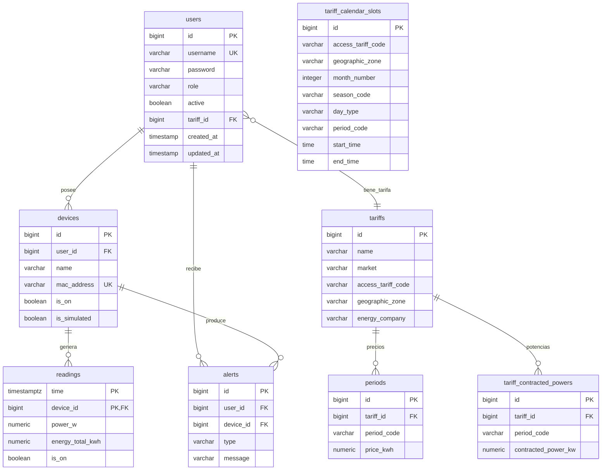

# Anexo D - Base de datos, TimescaleDB y consultas analiticas

## 1. Vision general

La base de datos de Wattimizer combina un modelo relacional clasico con una tabla de series temporales. Las entidades de usuarios, dispositivos, tarifas y alertas se gestionan con JPA/Hibernate. La tabla `readings`, que almacena telemetria, se convierte en hypertable de TimescaleDB porque crece continuamente y se consulta por rangos de tiempo.

En `application.properties` se usa:

```properties
spring.jpa.hibernate.ddl-auto=update
```

Esto permite que Hibernate cree o actualice tablas basicas. Los scripts SQL complementarios anaden lo que Hibernate no expresa bien:

- extension TimescaleDB;
- conversion de `readings` a hypertable;
- constraints regulatorias;
- indices especificos de calendario tarifario.

## 2. Modelo relacional



## 3. Tablas principales

### 3.1. `users`

Entidad: `UserEntity`.

| Columna | Tipo logico | Descripcion |
| --- | --- | --- |
| `id` | PK | Heredada de `BaseEntity`. |
| `tariff_id` | FK nullable | Tarifa activa del usuario. |
| `username` | unico, no nulo | Email usado como identificador. |
| `password` | no nulo | Contrasena cifrada o placeholder si viene de OAuth2. |
| `role` | enum string | `ROLE_USER` o `ROLE_ADMIN`. |
| `active` | boolean | Control de cuenta habilitada. |

`UserEntity` implementa `UserDetails`, por eso Spring Security puede usar la propia entidad para autenticar y leer authorities.

### 3.2. `devices`

Entidad: `Device`.

| Columna | Descripcion |
| --- | --- |
| `id` | Identificador del dispositivo. |
| `user_id` | Usuario propietario. Puede ser nulo o representar un dispositivo aun no reclamado. |
| `name` | Nombre visible. |
| `mac_address` | Identificador unico del enchufe. |
| `is_on` | Estado logico. |
| `is_simulated` | Indica si genera telemetria mediante el job interno. |

La MAC es el campo natural para relacionar mensajes MQTT con dispositivos registrados.

### 3.3. `readings`

Entidad: `Reading`.

| Columna | Descripcion |
| --- | --- |
| `time` | Marca temporal UTC de la lectura. Forma parte de la PK. |
| `device_id` | Dispositivo que genero la lectura. Forma parte de la PK. |
| `power_w` | Potencia instantanea en vatios. |
| `energy_total_kwh` | Odometro energetico acumulado en kWh. |
| `is_on` | Estado del interruptor en esa lectura. |

La clave compuesta `time + device_id` permite varias lecturas en el tiempo por dispositivo. En el repositorio actual, `ReadingRepository` extiende `JpaRepository<Reading, Long>`, aunque la entidad usa `@IdClass(ReadingId.class)`. Funciona para las queries declaradas, pero seria mas correcto tiparlo con la clave compuesta si se evoluciona el repositorio.

### 3.4. `tariffs`

Entidad: `Tariff`.

| Columna | Descripcion |
| --- | --- |
| `name` | Nombre comercial o privado de la tarifa. |
| `market` | Mercado contractual, por ejemplo libre o PVPC. |
| `access_tariff_code` | Peaje: `2.0TD`, `3.0TD`, `6.1TD`, `6.2TD`. |
| `geographic_zone` | Zona: `PENINSULA`, `CANARIAS`, `ISLAS_BALEARES`, `CEUTA`, `MELILLA`. |
| `energy_company` | Comercializadora. |

La tarifa no almacena horarios. Solo almacena precios y potencias. Los horarios viven en `tariff_calendar_slots`.

### 3.5. `periods`

Entidad: `Period`.

| Columna | Descripcion |
| --- | --- |
| `tariff_id` | Tarifa propietaria. |
| `period_code` | `P1` a `P6`. |
| `price_kwh` | Precio contractual en euros/kWh. |

Tiene indice unico por `tariff_id + period_code` para que una tarifa no tenga dos precios para el mismo periodo.

### 3.6. `tariff_contracted_powers`

Entidad: `TariffContractedPower`.

| Columna | Descripcion |
| --- | --- |
| `tariff_id` | Tarifa propietaria. |
| `period_code` | `P1` a `P6`. |
| `contracted_power_kw` | Potencia contratada en kW. |

La validacion de potencia ascendente para `3.0TD`, `6.1TD` y `6.2TD` se hace en `TariffService`, no con un `CHECK` SQL, porque depende de comparar varias filas de la misma tarifa.

### 3.7. `tariff_calendar_slots`

Entidad: `TariffCalendarSlot`.

Tabla de dimension regulatoria. Traduce:

```text
peaje + zona + mes + tipo de dia + hora local -> periodo P1-P6
```

Campos importantes:

- `access_tariff_code`
- `geographic_zone`
- `month_number`
- `season_code`
- `day_type`
- `period_code`
- `start_time`
- `end_time`

El script `tariffs-td-schema.sql` anade:

- checks para peajes, zonas, meses, temporadas, tipos de dia y periodos;
- indice unico `ux_tariff_calendar_slots_lookup`;
- indice `ix_tariff_calendar_slots_period_code`.

### 3.8. `alerts`

Entidad: `Alert`.

| Columna | Descripcion |
| --- | --- |
| `user_id` | Usuario destinatario. |
| `device_id` | Dispositivo que produjo la alerta. |
| `type` | Tipo, actualmente `OVERPOWER`. |
| `message` | Texto explicativo. |

Las alertas se generan desde `AlertService.checkPowerThreshold(reading)` despues de persistir una lectura.

## 4. Hypertable de TimescaleDB

Script: `backend/src/main/resources/db/dev-seed/01-hypertable.sql`.

```sql
SELECT create_hypertable('readings', 'time');
```

### 4.1. Motivo de la decision

`readings` es la unica tabla que crece de forma continua. Cada mensaje MQTT o lectura simulada anade una fila nueva. Particionar por tiempo permite que TimescaleDB gestione chunks y mantenga buen rendimiento en consultas por intervalo.

### 4.2. Orden de ejecucion

El propio script indica el orden correcto:

1. Ejecutar `00-extensions.sql`.
2. Dejar que Hibernate cree la tabla `readings`.
3. Ejecutar `01-hypertable.sql` antes de recibir datos MQTT.

Si la tabla ya tuviera datos, habria que usar:

```sql
SELECT create_hypertable('readings', 'time', migrate_data => true);
```

### 4.3. Verificacion

```sql
SELECT hypertable_name, num_chunks
FROM timescaledb_information.hypertables;
```

Debe aparecer `readings`.

## 5. Consultas reales sobre lecturas

Repositorio: `ReadingRepository`.

### 5.1. Ultima lectura de un dispositivo

```java
Optional<Reading> findFirstByDeviceMacAddressOrderByTimeDesc(String macAddress);
```

Uso:

- Estado mas reciente para una MAC.
- Simulador IoT, que lee el ultimo odometro para incrementarlo.

### 5.2. Lectura por instante y MAC

```java
Optional<Reading> findByTimeAndDeviceMacAddress(Instant time, String macAddress);
```

Uso:

- Endpoint `GET /api/v1/readings/search`.
- Busqueda exacta por clave temporal y dispositivo.

### 5.3. Lecturas en intervalo

```java
@Query("""
SELECT r FROM Reading r
WHERE r.device.macAddress = :macAddress
AND r.time >= :start
AND r.time <= :end
ORDER BY r.time ASC
""")
List<Reading> findReadingsInInterval(...)
```

Esta es la consulta base para las analiticas de coste. Se ordena ascendente porque el servicio calcula diferencias entre una lectura y la anterior.

### 5.4. Borrado por instante y MAC

```java
@Query("""
DELETE FROM Reading r
WHERE r.time = :time
AND r.device.macAddress = :macAddress
""")
Long deleteByTimeAndDeviceMacAddress(...)
```

Uso:

- Endpoint `DELETE /api/v1/readings/search`.

## 6. Resolucion de periodo tarifario

Servicio: `CalendarResolverService`.

El coste no se calcula solo con kWh. Hace falta saber que periodo tarifario aplica en el instante de la lectura.

### 6.1. Algoritmo

1. Recibe una `Tariff` y un `Instant`.
2. Convierte el instante a hora local:
   - `CANARIAS` -> `Atlantic/Canary`
   - resto -> `Europe/Madrid`
3. Obtiene mes, hora local y dia de la semana.
4. Si es sabado o domingo, usa `dayType = D`.
5. Si es laborable, consulta el tipo de dia en `tariff_calendar_slots`.
6. Consulta el `periodCode`.
7. Busca el `Period` contractual de la tarifa por `tariff_id + period_code`.

### 6.2. Query de calendario

Repositorio: `TariffCalendarSlotRepository`.

```java
SELECT cs.periodCode FROM TariffCalendarSlot cs
WHERE cs.accessTariffCode = :accessTariffCode
  AND cs.geographicZone   = :zone
  AND cs.monthNumber      = :month
  AND cs.dayType          = :dayType
  AND (
        (cs.startTime <> cs.endTime AND cs.startTime <= :localTime AND cs.endTime > :localTime)
        OR
        (cs.startTime = cs.endTime AND cs.dayType = 'D')
        OR (cs.endTime = :endOfDay AND :localTime >= cs.startTime)
      )
```

El caso `endOfDay = 23:59` existe porque PostgreSQL `TIME` no representa `24:00` como cierre del dia.

## 7. Analitica de coste total

Endpoint:

```http
GET /api/v1/analytics/cost?macAddress=...&start=...&end=...
```

Servicio: `ConsumptionService.calculateCostInPeriod`.

### 7.1. Pasos

1. Carga lecturas del intervalo con `findReadingsInInterval`.
2. Si hay menos de dos lecturas, devuelve `0`.
3. Busca el dispositivo por MAC.
4. Comprueba que el dispositivo tenga usuario y tarifa.
5. Recorre lecturas desde la segunda.
6. Calcula delta positivo:

```text
deltaKwh = current.energyTotalKwh - previous.energyTotalKwh
```

7. Si el delta es negativo o nulo, lo ignora. Esto cubre reinicios de hardware o lecturas repetidas.
8. Resuelve el periodo tarifario del instante actual.
9. Multiplica:

```text
costePaso = deltaKwh * priceKwh
```

10. Suma y redondea a 2 decimales.

### 7.2. Motivo del uso de deltas

El Shelly entrega un odometro de energia acumulada. No se debe multiplicar cada lectura completa por el precio, porque eso contaria muchas veces el consumo historico. La forma correcta es restar lecturas consecutivas y valorar solo el incremento.

## 8. Analitica de consumo fantasma

Endpoint:

```http
GET /api/v1/analytics/ghost-consumption?macAddress=...&start=...&end=...
```

Servicio: `ConsumptionService.calculateGhostCost`.

### 8.1. Criterio real del proyecto

El consumo fantasma se define como energia consumida entre:

```text
00:00 y 05:59 hora local del contrato
```

No equivale automaticamente a un periodo regulatorio concreto. Por ejemplo, el periodo valle puede no coincidir exactamente con la definicion funcional de "consumo fantasma" usada en la aplicacion.

### 8.2. Pasos

1. Carga lecturas ordenadas por tiempo.
2. Comprueba dispositivo, usuario y tarifa.
3. Para cada par de lecturas:
   - convierte el `Instant` a la zona local del contrato;
   - si la hora no esta entre `0` y `5`, ignora el tramo;
   - calcula delta positivo;
   - resuelve periodo tarifario;
   - multiplica por precio.
4. Redondea a 2 decimales.

### 8.3. Caso Canarias

Los tests unitarios validan un caso importante: un instante que en Madrid cae a las `00:30` puede ser `23:30` en Canarias. Si se hardcodea `Europe/Madrid`, se contaria consumo fantasma de forma incorrecta para contratos canarios. Por eso `CalendarResolverService` expone `resolveZoneIdForTariff`.

## 9. Alertas de sobrepotencia

Servicio: `AlertService.checkPowerThreshold`.

Flujo:

1. Recibe una `Reading`.
2. Obtiene dispositivo, usuario y tarifa.
3. Resuelve periodo aplicable.
4. Busca potencia contratada para ese periodo.
5. Convierte potencia medida:

```text
powerKw = powerW / 1000
```

6. Si `powerKw > contractedPowerKw`, crea alerta `OVERPOWER`.
7. Persiste en `alerts`.
8. Publica por STOMP en `/topic/alerts/{username}`.

Esta logica conecta directamente la telemetria fisica con una consecuencia funcional para el usuario.

## 10. Consultas que todavia no se usan

TimescaleDB esta preparado para mas analitica, pero el codigo actual **no** usa:

- `time_bucket`;
- continuous aggregates;
- politicas de compresion;
- politicas de retencion;
- consultas SQL nativas agregadas sobre hypertables.

Actualmente las analiticas se calculan en Java a partir de lecturas ordenadas. Esta decision es razonable para el MVP porque mantiene la logica de negocio en servicios testeables. Si el volumen de datos crece, el siguiente paso natural seria mover agregaciones temporales a TimescaleDB.

## 11. Scripts SQL relevantes

| Script | Funcion |
| --- | --- |
| `db/dev-seed/00-extensions.sql` | Crea `timescaledb` y `pgcrypto`. |
| `db/dev-seed/01-hypertable.sql` | Convierte `readings` en hypertable por `time`. |
| `db/dev-seed/03-seed-users-dev.sql` | Carga usuarios de desarrollo. |
| `db/dev-seed/04-seed-device-shelly.sql` | Carga dispositivo Shelly de ejemplo. |
| `db/dev-seed/05-seed-device-simulation.sql` | Carga dispositivo simulado. |
| `db/tariffs-td-schema.sql` | Ajusta modelo TD, constraints e indices. |
| `db/seed-tariff-calendar-slots.sql` | Carga calendario regulatorio por peaje, zona, mes y hora. |

## 12. Mejoras tecnicas recomendadas

- Cambiar `ReadingRepository extends JpaRepository<Reading, Long>` a la clave compuesta real.
- Anadir indices explicitos para `readings(device_id, time DESC)` si el plan de ejecucion lo requiere.
- Usar `time_bucket` para informes por hora/dia.
- Crear continuous aggregates para coste diario cuando haya mas volumen.
- Aplicar compresion de chunks antiguos.
- Definir politica de retencion si no se necesita conservar telemetria cruda indefinidamente.
