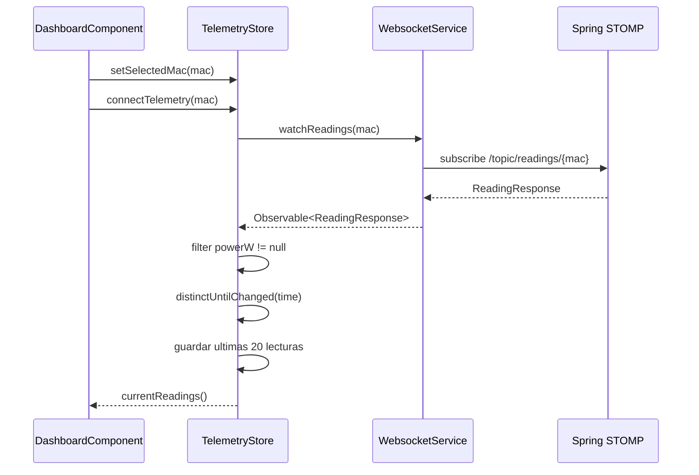
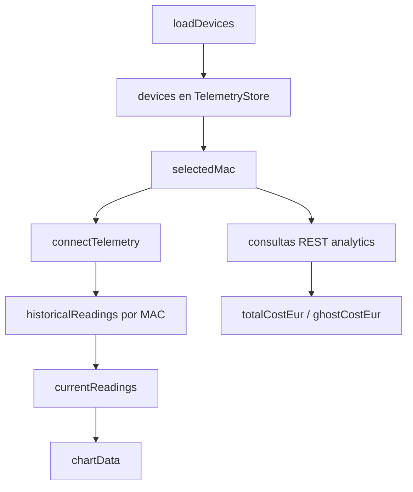

# Anexo B - Frontend Angular, RxJS y NgRx Signals

## 1. Alcance

Este anexo documenta la parte frontend real de Wattimizer, ubicada en `frontend/`. La aplicacion esta construida con Angular standalone, PrimeNG, Chart.js, RxJS y `@ngrx/signals`.

Es importante aclarar que **no existe NgRx Store clasico** en el proyecto: no hay actions, reducers, selectors ni effects. La gestion de estado compartido se hace con `signalStore`, `withState`, `withComputed`, `withMethods` y `rxMethod`.

## 2. Estructura general

Archivos base:

- `frontend/src/main.ts`: arranque de Angular.
- `frontend/src/app/app.config.ts`: providers globales.
- `frontend/src/app/app.routes.ts`: rutas de la SPA.
- `frontend/src/app/interceptors/http.interceptor.ts`: interceptor JWT.
- `frontend/src/app/guards/auth.guard.ts`: proteccion de rutas privadas.

El proxy de desarrollo esta en `frontend/proxy.conf.json`:

| Ruta | Destino |
| --- | --- |
| `/api` | `http://localhost:8080` |
| `/oauth2` | `http://localhost:8080` |
| `/ws-iot` | `http://localhost:8080` con WebSocket activo |

## 3. Rutas de la aplicacion

| Ruta | Componente | Acceso |
| --- | --- | --- |
| `/login` | `LoginComponent` | Publico |
| `/register` | `RegisterComponent` | Publico |
| `/auth/oauth/callback` | `OAuthCallbackComponent` | Publico |
| `/dashboard` | `DashboardComponent` dentro de `MainLayoutComponent` | Privado |
| `/devices` | `DevicesComponent` dentro de `MainLayoutComponent` | Privado |
| `/tariffs` | `TariffComponent` dentro de `MainLayoutComponent` | Privado |
| `/alerts` | `AlertsComponent` dentro de `MainLayoutComponent` | Privado |

El `authGuard` consulta `SessionStorageService.isLoggedIn()`. Si no hay token valido, redirige a `/login`.

## 4. Autenticacion en cliente

### 4.1. `AuthService`

Archivo: `frontend/src/app/services/auth.service.ts`.

| Metodo | Endpoint | Salida |
| --- | --- | --- |
| `authentication(user)` | `POST /api/v1/auth/login` | `Observable<LoginUserJwt>` |
| `register(user)` | `POST /api/v1/auth/register` | `Observable<void>` |
| `exchangeOAuthTicket(ticket)` | `POST /api/v1/auth/oauth/exchange` | `Observable<LoginUserJwt>` |

El servicio no guarda el token directamente. Esa responsabilidad se deja a los componentes, porque son los que deciden si tras la respuesta hay que navegar, mostrar error o limpiar estado.

### 4.2. `SessionStorageService`

Archivo: `frontend/src/app/services/session-storage.service.ts`.

Responsabilidades:

- Guardar el JWT en `sessionStorage` con la clave `auth_token`.
- Leer el token para el interceptor.
- Borrar el token al cerrar sesion.
- Decodificar el JWT con `jwt-decode`.
- Comprobar expiracion.
- Extraer `username`.
- Extraer roles desde el claim `authorities`.

La decision de usar `sessionStorage` implica que la sesion se mantiene solo en la pestana actual del navegador. Para un proyecto de DAW es suficiente y reduce persistencia innecesaria frente a `localStorage`.

### 4.3. Interceptor HTTP

Archivo: `frontend/src/app/interceptors/http.interceptor.ts`.

El interceptor:

1. Anade `X-Requested-With: XMLHttpRequest`.
2. Anade `Authorization: Bearer <jwt>` a rutas `/api/v1`, excepto login, registro e intercambio OAuth2.
3. Si recibe `401`, ejecuta logout y navega a `/login`.

Esto centraliza la seguridad del cliente. Los componentes no tienen que repetir la cabecera JWT en cada llamada.

## 5. Servicios de dominio

### 5.1. `TariffService`

Archivo: `frontend/src/app/services/tariff.service.ts`.

| Metodo | Endpoint | Observacion |
| --- | --- | --- |
| `getCatalog()` | `GET /api/v1/tariffs` | Catalogo maestro. |
| `getById(id)` | `GET /api/v1/tariffs/{id}` | Consulta por identificador. |
| `createCatalogTariff(payload)` | `POST /api/v1/tariffs` | Solo admin. |
| `updateCatalogTariff(id, payload)` | `POST /api/v1/tariffs/{id}` | Respeta el backend, que no usa `PUT`. |
| `deleteCatalogTariff(id)` | `DELETE /api/v1/tariffs/{id}` | Solo admin. |
| `getMyTariff()` | `GET /api/v1/users/me/tariff` | Convierte `204` o body nulo en `null`. |
| `saveMyTariff(payload)` | `POST /api/v1/users/me/tariff` | Guarda tarifa privada. |
| `unlinkMyTariff()` | `DELETE /api/v1/users/me/tariff` | Desvincula tarifa activa. |

`getMyTariff()` usa `{ observe: "response" }` porque necesita distinguir una respuesta `204 No Content` de una tarifa real.

### 5.2. `WebsocketService`

Archivo: `frontend/src/app/services/websocket.service.ts`.

Responsabilidades:

- Crear una instancia `RxStomp`.
- Construir URL `ws://host/ws-iot` o `wss://host/ws-iot`.
- Configurar `heartbeatOutgoing = 20000`.
- Configurar `reconnectDelay = 5000`.
- Suscribirse a `/topic/readings/{macAddress}`.
- Parsear cada mensaje STOMP a `ReadingResponse`.

El servicio aisla la conexion STOMP para que el store solo trabaje con `Observable<ReadingResponse>`.

### 5.3. `DeviceService`

Archivo: `frontend/src/app/services/device.service.ts`.

Define un `httpResource<Device[]>` para `/api/v1/devices`. En el estado actual del codigo, las operaciones principales de dispositivos se hacen desde `TelemetryStore` y `DevicesComponent`, por lo que este servicio queda como base para una posible refactorizacion.

## 6. Estado compartido con `@ngrx/signals`

### 6.1. `TelemetryStore`

Archivo: `frontend/src/app/store/telemetry.store.ts`.

Estado inicial:

```ts
{
  devices: [],
  selectedMac: null,
  historicalReadings: {},
  isLoadingDevices: false
}
```

Computed principal:

```ts
currentReadings
```

Devuelve las lecturas historicas de la MAC seleccionada. Si no hay seleccion, devuelve arrays vacios para que la grafica no falle.

#### Metodos de negocio

| Metodo | Tipo | Funcion |
| --- | --- | --- |
| `setSelectedMac(mac)` | Sincrono | Cambia la MAC activa. |
| `loadDevices()` | `rxMethod` | Carga `GET /api/v1/devices` y selecciona la primera MAC si no habia una. |
| `claimDevice(payload)` | `rxMethod` | Llama a `POST /api/v1/devices/claim`. |
| `addDevice(newDevice)` | `rxMethod` | Crea dispositivo con `POST /api/v1/devices`. |
| `updateDevice(updatedDevice)` | `rxMethod` | Actualiza con `PUT /api/v1/devices/{id}`. |
| `deleteDevice(deviceId)` | `rxMethod` | Borra con `DELETE /api/v1/devices/{id}`. |
| `reset()` | Sincrono | Limpia estado al cerrar sesion. |
| `connectTelemetry(mac)` | `rxMethod` | Abre o corta la suscripcion STOMP segun la MAC. |

#### Flujo reactivo de telemetria



Decisiones reales del codigo:

- `filter` descarta lecturas sin `powerW` para evitar huecos en la grafica.
- `distinctUntilChanged` deduplica por `time` si llegan eventos repetidos.
- Solo se conservan las ultimas 20 lecturas por MAC para que el dashboard sea ligero.
- `of(null)` se usa al pasar `mac = null`, que sirve para cortar logicamente la conexion al cerrar sesion.

### 6.2. `TariffStore`

Archivo: `frontend/src/app/store/tariff.store.ts`.

Estado inicial:

```ts
{
  catalog: [],
  myTariff: null,
  isLoadingCatalog: false,
  isLoadingMyTariff: false,
  errorMessage: null
}
```

Computed:

- `hasMyTariff`: indica si el usuario tiene tarifa activa.
- `isCatalogEmpty`: permite mostrar estados vacios.

Metodos HTTP:

| Metodo | Servicio llamado | Funcion |
| --- | --- | --- |
| `loadCatalog()` | `TariffService.getCatalog()` | Carga plantillas del catalogo. |
| `loadMyTariff()` | `TariffService.getMyTariff()` | Carga tarifa privada o `null`. |
| `saveMyTariff(payload)` | `TariffService.saveMyTariff()` | Guarda contrato del usuario. |
| `unlinkMyTariff()` | `TariffService.unlinkMyTariff()` | Desvincula tarifa activa. |
| `refreshAfterCatalogMutation()` | `TariffService.getCatalog()` | Recarga catalogo tras cambios admin. |

Patron de errores:

```ts
catchError(() => EMPTY)
```

Se usa para cortar el flujo despues de guardar el mensaje de error en el estado. Asi el componente no necesita controlar todos los errores HTTP.

## 7. Componentes principales

### 7.1. `MainLayoutComponent`

Responsabilidades:

- Renderizar cabecera, menu lateral y `<router-outlet>`.
- Mostrar el usuario autenticado leyendo el JWT.
- Ejecutar logout.

Flujo de logout:

1. `telemetryStore.connectTelemetry(null)`.
2. `telemetryStore.reset()`.
3. `tariffStore.reset()`.
4. `sessionStorageService.logout()`.
5. Navegacion a `/login` con `replaceUrl`.

La limpieza de stores es importante para que un segundo usuario no vea datos cacheados del anterior.

### 7.2. `LoginComponent`

Usa formulario reactivo:

- `username`: requerido y email.
- `password`: requerido y longitud minima.

Flujos:

- Login clasico: `AuthService.authentication()`, guardado de JWT y navegacion a `/dashboard`.
- OAuth2: redireccion a `/oauth2/authorization/google` o `/oauth2/authorization/github`.
- Mensajes de error con signals y `effect` para ocultarlos despues de un tiempo.

### 7.3. `RegisterComponent`

Formulario reactivo:

- `username`
- `password`
- `confirmPassword`

Incluye validador propio para comprobar que las contrasenas coinciden. Si el registro termina bien, navega a `/login`.

### 7.4. `OAuthCallbackComponent`

Lee `ticket` desde query params. Si existe:

1. Llama a `AuthService.exchangeOAuthTicket(ticket)`.
2. Guarda JWT.
3. Navega a `/dashboard`.

Si falta el ticket, muestra error. Esta pantalla es breve porque su objetivo es cerrar el flujo OAuth2, no ser una pantalla de uso diario.

### 7.5. `DashboardComponent`

Responsabilidades principales:

- Cargar dispositivos (`TelemetryStore.loadDevices()`).
- Cargar tarifa activa (`TariffStore.loadMyTariff()`).
- Conectar telemetria al cambiar la MAC seleccionada.
- Preparar datos para grafica de PrimeNG/Chart.js.
- Consultar analiticas REST si el usuario tiene tarifa.

Endpoints usados:

- `GET /api/v1/analytics/cost`
- `GET /api/v1/analytics/ghost-consumption`

Flujo de datos:



### 7.6. `DevicesComponent`

Responsabilidades:

- Listar dispositivos desde `TelemetryStore.devices`.
- Cargar dispositivos en el constructor.
- Reclamar dispositivo por MAC.
- Borrar dispositivo.
- Cambiar estado logico.
- Editar nombre.

Aunque `TelemetryStore` ya ofrece metodos para reclamar, actualizar y borrar, este componente realiza algunas llamadas con `HttpClient` directamente y luego refresca `store.loadDevices()`. Es una decision funcionalmente valida, pero para evolucionar el proyecto convendria centralizar esas mutaciones en el store.

Validacion destacada:

- La MAC se valida con la expresion `^[0-9A-Fa-f]{12}$`.

### 7.7. `TariffComponent`

Es uno de los componentes con mas logica de negocio en frontend.

Responsabilidades:

- Cargar catalogo y tarifa del usuario.
- Detectar si el usuario es admin con `SessionStorageService.hasRole("ROLE_ADMIN")`.
- Crear, editar y borrar plantillas de tarifa si el usuario es admin.
- Asignar una plantilla al usuario.
- Editar precios y potencias de la tarifa privada.
- Validar potencia ascendente en tarifas `3.0TD`, `6.1TD` y `6.2TD`.

Reglas de periodos:

| Peaje | Energia | Potencia |
| --- | --- | --- |
| `2.0TD` | `P1-P3` | `P1-P2` |
| `3.0TD`, `6.1TD`, `6.2TD` | `P1-P6` | `P1-P6` |

### 7.8. `AlertsComponent`

Pantalla sencilla basada en signals locales:

- `alertsList`
- `isLoading`
- `errorMessage`
- `successMessage`

Endpoints:

- `GET /api/v1/alerts`
- `DELETE /api/v1/alerts/{id}`

Permite revisar las alertas de sobrepotencia y descartarlas.

## 8. Interfaces principales

| Interface | Archivo | Funcion |
| --- | --- | --- |
| `Device` | `interfaces/device.interface.ts` | Dispositivo IoT del usuario. |
| `TelemetryState` | `interfaces/telemetry-state.interface.ts` | Estado de telemetria. |
| `ReadingResponse` | `interfaces/reading-response.interface.ts` | Lectura recibida por REST o STOMP. |
| `TariffRequest`, `TariffResponse`, `UserTariffRequest` | `interfaces/tariff-request.interface.ts` | Contrato de tarifas. |
| `Alert` | `interfaces/alert.interface.ts` | Alerta mostrada en pantalla. |
| `EnergyCostResponse` | `interfaces/energy-cost-response.interface.ts` | Respuesta de coste total. |
| `GhostCostResponse` | `interfaces/ghost-cost-response.interface.ts` | Respuesta de consumo fantasma. |
| `LoginUser`, `LoginUserJwt`, `RegisterRequest`, `JwtPayload` | `interfaces/*auth*` | Contratos de autenticacion. |

## 9. Resumen de decisiones frontend

- Angular standalone reduce modulos innecesarios y encaja con la version moderna de Angular.
- `@ngrx/signals` es suficiente para el estado actual porque hay pocos dominios compartidos y no hace falta montar NgRx Store completo.
- RxJS se reserva para flujos asincronos reales: HTTP, WebSocket y transformaciones.
- El interceptor concentra JWT y gestion de `401`.
- El dashboard limita el historico en memoria para evitar crecimiento indefinido.
- La tarifa del usuario se carga como `null` si el backend responde `204`, lo que permite mostrar un CTA claro para configurar contrato.
