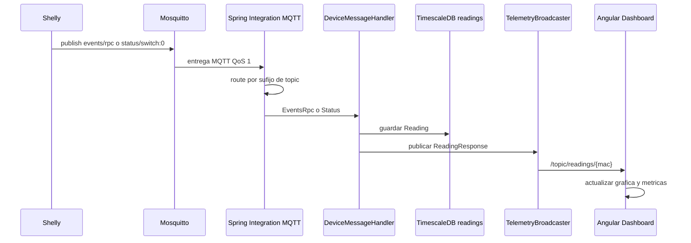

# Anexo C - Ingesta MQTT, WebSocket y telemetria

## 1. Vision general

La telemetria de Wattimizer entra al sistema por MQTT, se transforma en DTOs Java, se persiste como lecturas electricas y se reenvia al frontend por WebSocket STOMP.

```mermaid
flowchart LR
    Device[Shelly Plug S Gen3] -->|MQTT QoS 1| Broker[Mosquitto]
    Broker -->|MqttPahoMessageDrivenChannelAdapter| Integration[Spring Integration Flow]
    Integration -->|events/rpc| Events[eventsRpcChannel]
    Integration -->|status/switch:0| Status[statusChannel]
    Events --> Handler[DeviceMessageHandler]
    Status --> Handler
    Handler --> ReadingService[ReadingService]
    ReadingService --> DB[(readings hypertable)]
    Handler --> Broadcaster[TelemetryBroadcaster]
    Broadcaster -->|/topic/readings/{mac}| Angular[Angular Dashboard]
    Handler --> AlertService[AlertService]
    AlertService -->|/topic/alerts/{username}| Angular
```

La entrada MQTT es asincrona porque depende del adaptador Paho de Spring Integration. Una vez el mensaje entra en la aplicacion, los canales configurados son `DirectChannel`, por lo que el handler se ejecuta en el mismo flujo de entrega de Spring Integration.

## 2. Configuracion MQTT

Archivo principal: `backend/src/main/java/com/joselumartos/jwtauthbackenddemo/config/MqttConfig.java`.

### 2.1. Cliente MQTT

El bean `mqttClientFactory()` crea un `DefaultMqttPahoClientFactory` con:

- `mqtt.url`
- `mqtt.username`
- `mqtt.password`
- `automaticReconnect = true`
- `cleanSession = true`

Estos valores salen de `application.properties`, pero en Docker se sobreescriben con variables de entorno:

```yaml
MQTT_URL: tcp://mosquitto:1883
MQTT_USER: ${PROD_MQTT_USER}
MQTT_PASSWORD: ${PROD_MQTT_PASSWORD}
```

La decision de usar el nombre de servicio `mosquitto` en Docker evita usar `localhost`, que dentro del contenedor apuntaria al propio backend y no al broker.

### 2.2. Broker Mosquitto

El broker esta definido en `docker-compose.yml` y usa la imagen:

```yaml
eclipse-mosquitto:2.1.2-alpine
```

El puerto `1883` se expone para que el Shelly fisico pueda publicar. En el propio `docker-compose.yml` queda marcada una deuda de seguridad: MQTT viaja en texto plano y deberia migrarse a TLS/8883 o a una VPN cuando el entorno de hardware lo permita.

### 2.3. Suscripcion actual

El adaptador entrante se suscribe a:

```text
shellyplugsg3-9070694d3590/#
```

Esto significa que el proyecto esta preparado para un Shelly concreto. Es valido para el prototipo y para la defensa del proyecto, pero la mejora natural seria parametrizar el patron de topics o suscribir por varios dispositivos registrados.

## 3. Enrutado con Spring Integration

El `IntegrationFlow` lee el topic recibido desde la cabecera MQTT:

```java
String topic = message.getHeaders().get(MqttHeaders.RECEIVED_TOPIC, String.class);
```

Despues aplica tres rutas:

| Topic | Accion |
| --- | --- |
| Termina en `/events/rpc` | Transforma JSON a `EventsRpc` y envia a `eventsRpcChannel`. |
| Termina en `/status/switch:0` | Transforma JSON a `Status` y envia a `statusChannel`. |
| Cualquier otro | Lo manda a `nullChannel` y se ignora. |

La transformacion se hace con:

```java
Transformers.fromJson(EventsRpc.class)
Transformers.fromJson(Status.class)
```

El motivo de separar ambos canales es que Shelly emite estructuras JSON distintas segun el tipo de mensaje. Mantener DTOs separados evita parseos manuales y deja mas claro que campos se esperan en cada caso.

## 4. DTOs MQTT

### 4.1. `EventsRpc`

Representa mensajes de evento/RPC. Los campos relevantes son:

- `src`: contiene el origen del dispositivo.
- `params.ts`: timestamp enviado por el dispositivo.
- `params.switch:0.apower`: potencia activa.
- `params.switch:0.aenergy.total`: energia acumulada.

### 4.2. `Status`

Representa el estado directo del switch:

- `output`: indica si la salida esta encendida.
- `apower`: potencia activa.
- `aenergy.total`: energia acumulada.

### 4.3. Conversion de energia

Los datos del Shelly llegan como energia acumulada en Wh. El sistema persiste `energyTotalKwh`, por lo que los mappers dividen entre 1000:

```text
kWh = Wh / 1000
```

Esta conversion es importante porque las tarifas se expresan en euros por kWh.

## 5. Procesamiento en `DeviceMessageHandler`

Archivo: `backend/src/main/java/com/joselumartos/jwtauthbackenddemo/services/DeviceMessageHandler.java`.

### 5.1. `handleEventsRpc`

Entrada:

```java
@ServiceActivator(inputChannel = "eventsRpcChannel")
public void handleEventsRpc(Message<EventsRpc> mqttMessage)
```

Flujo:

1. Extrae el DTO `EventsRpc`.
2. Llama a `readingService.saveEntity(payload)`.
3. Mapea la entidad a `ReadingResponse`.
4. Publica la lectura por STOMP.
5. Comprueba alertas de potencia.

### 5.2. `handleStatus`

Entrada:

```java
@ServiceActivator(inputChannel = "statusChannel")
public void handleStatus(Message<Status> mqttMessage)
```

Flujo:

1. Lee el topic desde la cabecera MQTT.
2. Extrae la MAC con la forma `shellyplugsg3-{mac}/...`.
3. Busca el dispositivo por MAC.
4. Persiste una lectura con `Instant.now()`.
5. Publica por STOMP.
6. Comprueba alertas.

La extraccion de MAC depende de que el topic mantenga el formato esperado. Si se anaden otros modelos Shelly, esta parte conviene aislarla en un parser dedicado y probado.

## 6. Persistencia de lecturas

Archivo: `backend/src/main/java/com/joselumartos/jwtauthbackenddemo/services/ReadingService.java`.

La entidad `Reading` se guarda en la tabla `readings` con clave compuesta:

- `time`
- `device_id`

Campos medidos:

- `power_w`
- `energy_total_kwh`
- `is_on`

### 6.1. Lecturas desde `EventsRpc`

`ReadingService.saveEntity(EventsRpc)`:

1. Convierte el DTO a entidad.
2. Extrae la MAC del dispositivo mapeado.
3. Busca el dispositivo.
4. Si no existe, lo crea como `Nuevo Enchufe {mac}` con `isOn = true`.
5. Guarda la lectura.

Este autoprovisionamiento ayuda durante pruebas con hardware fisico: si llega telemetria antes de vincular el dispositivo, el sistema no pierde la lectura.

### 6.2. Lecturas desde `Status`

`ReadingService.saveEntity(DeviceDto, Status)`:

1. Usa el dispositivo ya localizado por MAC.
2. Toma la potencia y energia del DTO `Status`.
3. Usa `Instant.now()` como marca temporal.
4. Guarda la lectura.

## 7. Simulacion IoT

Archivo: `backend/src/main/java/com/joselumartos/jwtauthbackenddemo/services/IotTelemetrySimulationJob.java`.

El job se ejecuta cada 5 segundos:

```java
@Scheduled(fixedRate = 5000)
```

Flujo:

1. Busca dispositivos con `is_simulated = true`.
2. Genera una potencia sintetica con forma senoidal.
3. Lee el ultimo `energyTotalKwh`.
4. Incrementa el odometro con la formula:

```text
kWh_incremental = potenciaW * 5s / 1000 / 3600
```

5. Persiste una lectura simulada.
6. Publica la lectura por STOMP.
7. Evalua alertas.

El simulador permite demostrar el dashboard y las analiticas aunque no haya un Shelly fisico conectado.

## 8. Difusion por WebSocket STOMP

### 8.1. Backend

Archivos:

- `StompWebSocketConfig.java`
- `TelemetryBroadcaster.java`

Configuracion:

| Elemento | Valor |
| --- | --- |
| Endpoint WebSocket | `/ws-iot` |
| Broker simple | `/topic` |
| Prefijo de mensajes de aplicacion | `/app` |

`TelemetryBroadcaster` publica:

- Lecturas en `/topic/readings/{macAddress}`.
- Alertas en `/topic/alerts/{username}`.

La ruta `/ws-iot/**` esta permitida en seguridad para que el handshake WebSocket no dependa del mismo flujo JWT de REST.

### 8.2. Frontend

Archivo: `frontend/src/app/services/websocket.service.ts`.

El frontend conecta a:

```text
/ws-iot
```

y escucha:

```text
/topic/readings/{macAddress}
```

Cada mensaje se parsea como `ReadingResponse` y pasa al `TelemetryStore`.

## 9. Relacion con TimescaleDB

La tabla `readings` se crea primero como tabla PostgreSQL normal mediante Hibernate. Despues el script `backend/src/main/resources/db/dev-seed/01-hypertable.sql` ejecuta:

```sql
SELECT create_hypertable('readings', 'time');
```

La razon de convertir solo esta tabla es clara: `readings` crece con el tiempo y se consulta por intervalos temporales. En cambio, usuarios, tarifas, dispositivos y alertas son tablas relacionales normales.

## 10. Observaciones tecnicas

- La suscripcion MQTT esta limitada a un unico patron hardcodeado.
- Los canales de Spring Integration son `DirectChannel`, asi que conviene no meter tareas lentas en el handler.
- La emision STOMP ocurre dentro del flujo transaccional; si en el futuro se anaden pasos posteriores que puedan fallar, seria mejor publicar tras confirmar la transaccion.
- `devices.is_on` no se actualiza automaticamente desde cada mensaje de estado; el estado se guarda en la lectura (`Reading.isOn`).
- La simulacion y el Shelly real comparten salida STOMP y evaluacion de alertas, lo que simplifica el frontend.

## 11. Flujo extremo a extremo


